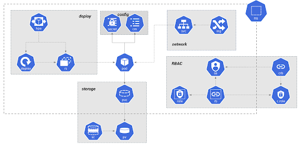

# Just Enough Kubernetes
**Version 1.0.0**

Welcome to Just Enough Kubernetes. Learning the architecture for orchestrating microservices. Follow along with your instructor to complete each section.

# About This Training

Kubernetes is an open-source platform that automates the management of containerized applications. It's also known as "K8s". Kubernetes has fundamentally transformed the software development and operations of the modern enterprise. It is the de facto standard for container orchestration. While it addresses a critical need for deploying and managing containers, it is by necessity a complex system. 

This course provides an explanation of architecture and the basic skills required for understanding Kubernetes. The course is focused on explaining how it works by defining the architecture for clusters, the control plane, and resources. The course requires students to install a small-scale Kubernetes environment and run a basic deployment of containers.

# Who Should Take This Course?

This course is an entry point for learning Kubernetes. This course is intended for a broad audience, to include managers, project managers, developers, and operators. In short, anyone who wants to have a working knowledge and baseline skill of Kubernetes.

# Course Details

- **Get Aboard**
    - Installing Kubernetes minikube
    - Downloading the Github repo
    - The kubectl command

- **Mastering Kubernetes**
    - Design principles
    - Learning paths
    - References

- **Cluster Architecture**
    - Hosts configurations
    - Open Container Initiative
    - ContainerD
    - ContainerD CLI
    - Exercises

- **Control Plane Architecture**
    - API Server
    - Controller Manager
    - Scheduler
    - Persistent storage with etcd
    - Cluster DNS
    - Kube-proxy
    - Exercises

- **Resource Architecture**
    - Resources
    - Namespace
    - Pods
    - Services
    - Deployments
    - Network
    - Access Control
    - Storage
    - Exercises

- **Manifest Files**
    - YAML file basics 
    - Manifest files
    - Imperative vs Declarative
    - System for Imperative
    - System for Declarative
    - Exercises

- **Deployment**
    - Run Pods
    - Expose Services
    - Deploy deployments
    - Labels and Selectors
    - Overview networking
    - Exercises

