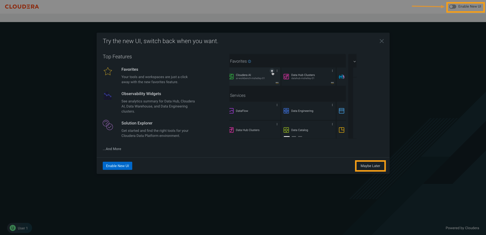

# 01-02 Getting Aboard

### 1. Accessing Cloudera Management Console  

#### 1.1. Login to edu-keycloak  
Get the edu-keycloak URL from the instructor, and log in using the provided username and a password.

#### 1.2. Click 'Maybe Later'  
You might be prompted to try out the new UI; however, the exercises were created based on the old UI. To ensure a consistent hands-on experience, please select the '**Maybe Late**r' button.

You can also switch between the old and new UI using the toggle button in the top right corner.

#### 1.3. Review Console  
You will be presented with all the Cloudera Data Services tiles in the Cloudera Management Console homepage.

### 2. Access the Cloudera Data Services Documentation  

#### 2.1. Cloudera Data Services Docs  
The Cloudera Data Services Documentation is located at [https://docs.cloudera.com/?tab=cdp-public-cloud](https://docs.cloudera.com/?tab=cdp-public-cloud)

### 3. Access the Cloudera Blog Main Page  
In this part of the exercise, you will access the Cloudera Blog

#### 3.1. The Cloudera Blog Main Page  
The Cloudera Blog is located at [https://blog.cloudera.com](https://blog.cloudera.com). Here, you will find relevant and timely articles, videos, a blog search function, and the Cloudera Twitter feed.

#### 3.2. The Category and Blog Filter Function  
First, select a category from Business, Technical, or Culture and then use the Cloudera Blog filter function to narrow the scope of the articles you see. As you'll see in the next two slides, the content varies depending on which category you select.

#### 3.3. Category and Filter Functions  
Note the differences in articles retrieved by selecting the Technical category and Cloudera Data Services in the Filter By section that you saw in the previous slide.

#### 3.4. Blog Category and Filter Results  
This slide shows that selecting the Partners category and filtering articles by different Data Services.

### 4. The Cloudera Community  

#### 4.1. The Cloudera Community  
You can begin your Cloudera Community experience by scrolling the homepage. 

#### 4.2. Asking Questions and Searching for Answers  
You can ask a question of the community or search for an answer that might already exist. Try the Advanced Search if you need to narrow your search.

#### 4.3. Get Started  
 Click the Get Started link on the Cloudera Community main page to view some general information or to register as a new user.

#### 4.4. The Cloudera Support Portal Main Page  
From this Cloudera Support Portal main page, you may access documentation, downloads, training opportunities, and create and manage your support cases (Login required).

### 5. End of Exercise  

