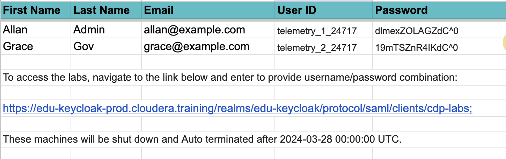
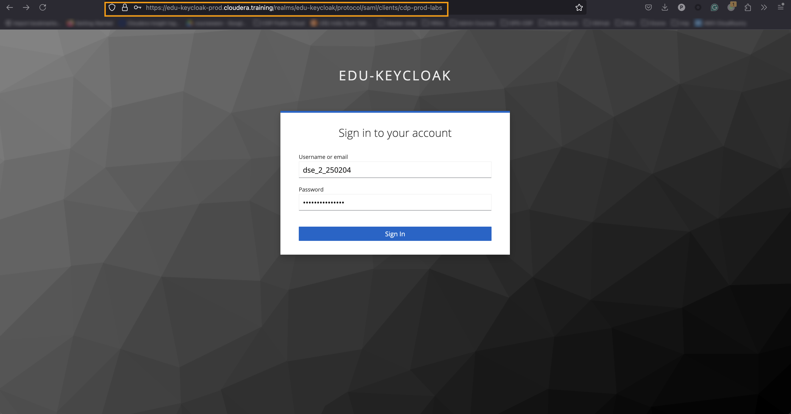
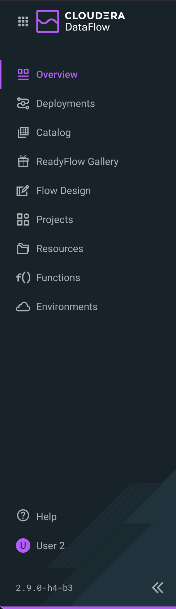
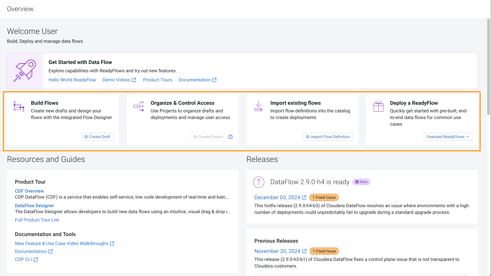

# 02-02 Accessing Environment 

Get aboard the classroom environment for Cloudera DataFlow. This exercise will walk you through how to acquire the login URL and required credentials.

### 1. Student Credentials   

#### 1.1. Review login details  
Review the student email for the log in credentials and the URL to the login page.

Make a note of the workload username and password as you will need it from time to time throughout the exercises. 

#### 1.2. Lab Environment  
This course provides a lab environment which is a Cloudera Public Cloud in which the following environments are pre-created:

(1) Environment should be enabled as part of the CDF Data Service - [devops-570-class-{class-id}]  

(2) Streams Messaging Data Hub Cluster should be created and running - [edu-ds-messaging-{class-id}]

(3) Stream analytics Data Hub cluster should be created and running - [edu-ds-analytics-{class-id}]

### 2. Download Zip files  
This module will need you to have access to a log data file. 

<a href="images/syslog-to-kafka.json" download>Click here to download the Syslog to Kafka json file.</a>

### 3. Accessing Cloudera Data Flow  

#### 3.1. Login to edu-keycloak   
Get the edu-keycloak URL from the instructor, and log in using the provided username and a password. You will be able to copy and paste in both the user ID and the password.

#### 3.2. Review Home Page  
You should be able to get the following home page of Cloudera Public Cloud.

Select the Data Flow **tile** from the Cloudera Public Cloud Enterprise Data web interface.

### 4. Tour the Home Page   

#### 4.1. View the Navigation Panel   
The Main navigation panel enables access to the following Cloudera DataFlow functions:

- Deployments
- Catalog
- ReadyFlow Gallery
- Flow Design
- Projects
- Resources
- Functions
- Environments

#### 4.2. Review Overview page  
The Overview page lists access to various functions, including:

- Build Flows
- Organize & Control Access
- Import existing flows
- Deploy a ReadyFlow

### 5. End of Exercise  

