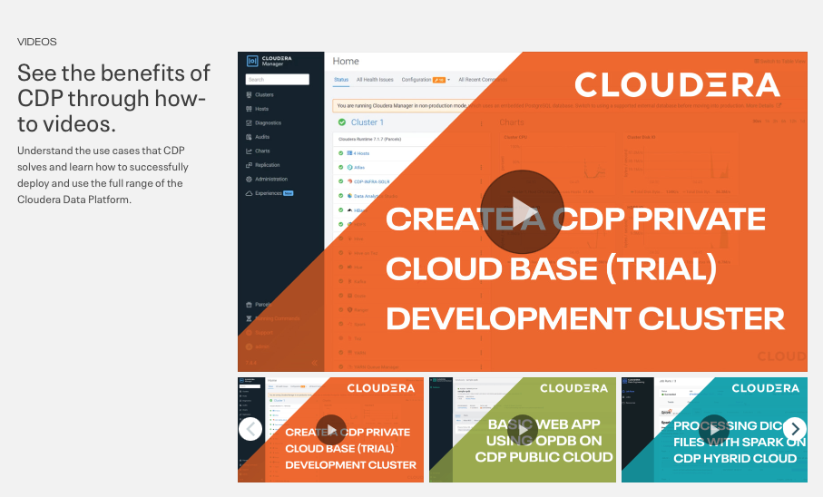

# 02-03 Bookmarking Cloudera Resources

The purpose of this exercise is to bookmark Cloudera resources available to a Cloudera Data Platform Administrator. This exercise is best run on your own browser. You will create a folder and bookmark a number of sites for future reference.

### 1. Open Your Browser

#### 1.1. Open Create Folder
On your local browser's bookmark bar create a folder.


#### 1.2. Create Folder
Create a **Cloudera** folder in the bookmarks.

```
Cloudera

```


### 2. Tour Cloudera Resources

#### 2.1. Bookmark Cloudera Resources
This page is an excellent front end to all of Cloudera web sites of value to the CDP Administrator. Add bookmark:

```
https://www.cloudera.com/users.html

```


#### 2.2. Tour Demo Videos
Click **Videos**. There are a number of excellent demonstrations of Cloudera products. These two to five minute overviews lead a user through the fundamentals of Cloudera products. Scan the list and select one to follow.




### 3. Tour Cloudera Documentation

#### 3.1. Bookmark Cloudera Docs
Cloudera documentation is constantly improving and is a valuable resource. Add bookmark:

```
https://docs.cloudera.com/cdp-private-cloud/latest/index.html

```


#### 3.2. Review Landing Page
Cloudera documentation is divided into CDP Public Cloud and CDP Private Cloud. This is to account for the Data Services in Private Cloud following a delay in rollout behind CDP Public Cloud. Document is presented with a primary menu in black to the left side. There are two submenus. One on each side of the page.


#### 3.3. CDP Private Cloud Base
Click **Private Cloud Base**.

CDP Private Cloud Base is the CDP Runtime built on hosts or virtual machines. It is the "base" for building up Embedded Container Services. Having prior experience and knowledge of CDP Private Cloud Base is a prerequisite for the ADMIN-335 Running Cloudera Private Cloud.


#### 3.4. Open Installation Instructions
Select **Getting Started > Installation > Installing CDP Private Cloud Data Services**.


#### 3.5. Review CDP Private Cloud Data Services
Note at the top of the page the version of Data Services. This is version 1.5.0 (latest). Clicking the up arrowhead will present a menu of previous versions.

The left hand table of contents presents the primary subjects. A recommended reading to start is the Overview.


#### 3.6. Open Installing on the Embedded Container Service
Click** Installing on the Embedded Container Service**.


#### 3.7. Scan through the Requirements and the Installation Pages
Take a few minutes and scan through pages for requirements and installation. Many of these topics will be discussed in lectures and supported with exercises in this course. Being familiar with documentation is always important to a CDP administrator.


### 4. Tour Cloudera Blog

#### 4.1. Open Cloudera Blog
Add bookmark:

```
blog.cloudera.com

```

Click **Technical**.


#### 4.2. Search for Data Services
Click checkbox **CDP Private Cloud. **Search** "data services". **A number of technical articles will be listed. These are curated articles written by technical leadings in Cloudera. Scroll through and select one to read.


### 5. Tour Cloudera Community
Cloudera community is where the industry learns, shares, and collaborates on the use of Cloudera products.

Click **Take a Tour of the Community**

#### 5.1. Open Cloudera Community
Add bookmark:

```
https://community.cloudera.com

```


#### 5.2. Review the Tour
Step through the size screens for touring Cloudera Community.

!!! important    All CDP Administrators should have a single sign on account with Cloudera, in particular to make full use of the community. If you do not have a login please take a moment and subscribe now.


#### 5.3. Hunting Resolutions
Search "**Pods are crashing in namespace**". Select "**Pods are Crashing in Namespace shared-services**"


### 6. Tour Cloudera Educational Services

#### 6.1. Add Bookmark for Education
Cloudera Education offers educational paths for every role in the Cloudera Data Lifecycle. This is intended to guide a students career progression in Big Data and in Big Compute. Add bookmark:

```
https://www.cloudera.com/about/training.html

```


### 7. Tour Cloudera Tutorials

#### 7.1. Add Bookmark
The Cloudera tutorials are interactive short videos to provide an overview of all of Cloudera's products. Add bookmark:

```
https://www.cloudera.com/tutorials.html

```


### 8. Tour Cloudera on YouTube

#### 8.1. Subscribe to Cloudera on YouTube
Search "**Discover Cloudera Data Platform**". This provides a great overview of CDP.

Cloudera recommends for all CDP Administrators to **subscribe** to this youtube channel. Add bookmark:

```
https://www.youtube.com/@ClouderaInc

```


### 9. Review Bookmarks

#### 9.1. Review the Cloudera Bookmarks


### 10. End of Exercise


