# 02-04 Verify permissions in Apache Ranger

!!! NOTE 
    THESE STEPS HAVE ALREADY BEEN DONE FOR YOU. This section will walk you through how Permissions/Policies are managed in Ranger. 
    
### 

!!! CAUTION 
    PLEASE DO NOT EXECUTE THE STEPS IN THIS SECTION OR CHANGE ANYTHING.

!!! important
    Since we could not grant the required privileges to the workload users to implement the steps in the environment, this exercise has been written as a read-only guide for your future reference. Please go through all the steps, screenshots, policies, permissions in detail. You won't be able to view the policies in your environment. You may request your instructor to provide a short demo.  

### 1. Accessing Apache Ranger  

#### 1.1. Click on Environments   
Click on the `Environments` tab on the left pane in Cloudera Management Console Main panel. 

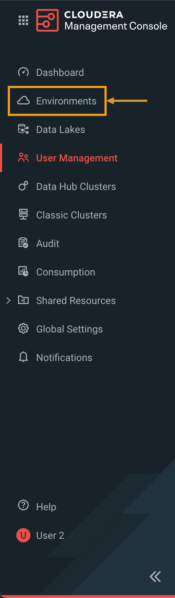

#### 1.2. Navigate to Management Console  
Select the environment that is shared by the instructor (Ex: `devops-570-class-250204`).

The environment assigned to you would be named similar except the class ID. 

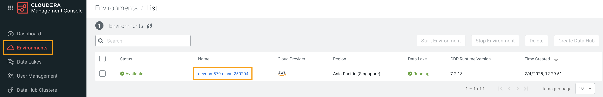

#### 1.3. Access Ranger UI  
Click on the Ranger quick link to access the Ranger UI.

Also, make a note of the 3 Data Hubs pre-created for the exercises. We will need them in later steps.

(1) Environment should be enabled as part of the CDF Data Service - [devops-570-class-250204]

(2) Streams Messaging Data Hub Cluster should be created and running - [edu-ds-messaging-250204]

(3) Stream analytics Data Hub cluster should be created and running - [edu-ds-analytics-250204]

(4) A gateway node to access the services - [training-gateway-250204]

In your case, the class ID would be different:

- [devops-570-class-{class-id}]   
- [edu-ds-messaging-{class-id}]
- [edu-ds-analytics-{class-id}]
- [training-gateway-{class-id}]

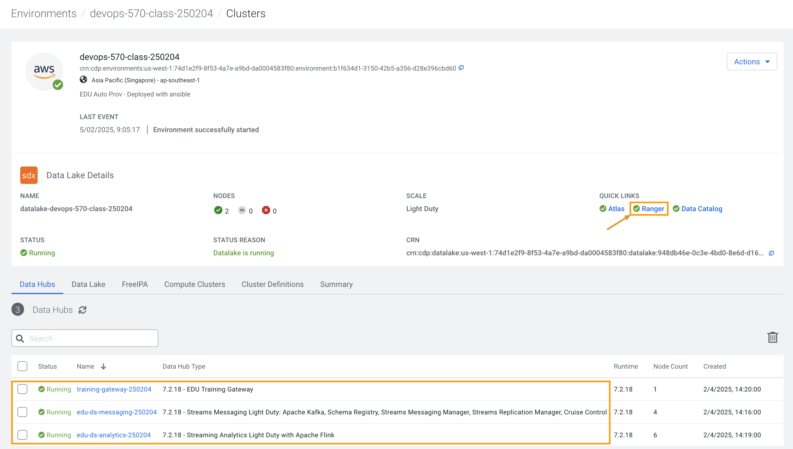

#### 1.4. Review Ranger UI  
Notice the two data hubs are populated under KAFKA and KAFKA-CONNECT. 

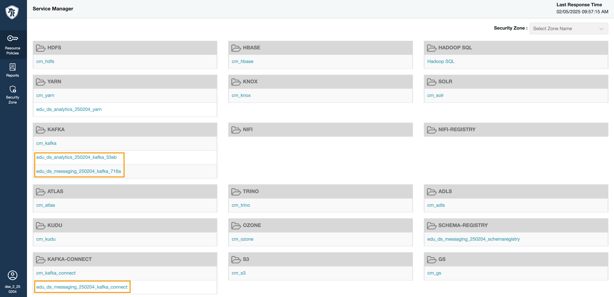

### 2. Kafka Permissions  

#### 2.1. Select the Kafka repository  
In Ranger UI, select the Kafka repository that’s associated with the stream messaging datahub.

In this case, it will be [edu-ds-messaging 250204_kafka_716a]

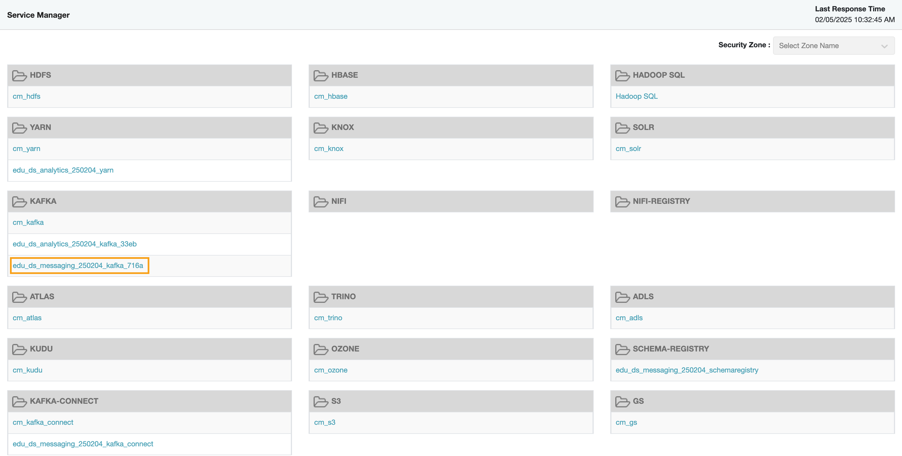

#### 2.2. Verify user  
Verify if the user who will be performing the exercise is present in both `all-consumergroup` and `all-topic`.

A variable {USER} with all the required permissions in Apache Ranger has been added. This variable {USER} is used to represent each student in this environment in a Ranger Policy. 

The below image reflects the variable {USER} being part of `all-consumergroup`.

#### 2.3. Verify user  
The below image reflects the variable {USER} being part of `all-topic`.

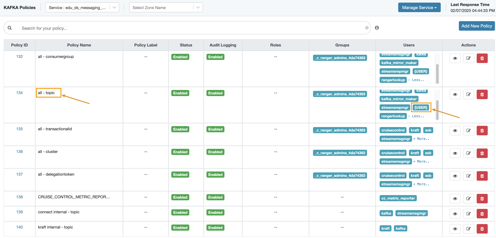

### 3. Schema Registry Permissions  
Schema Registry Permissions

#### 3.1. Navigate to Ranger Home Page  
Click on the Ranger icon in the top left corner to navigate back to the Ranger home page. 

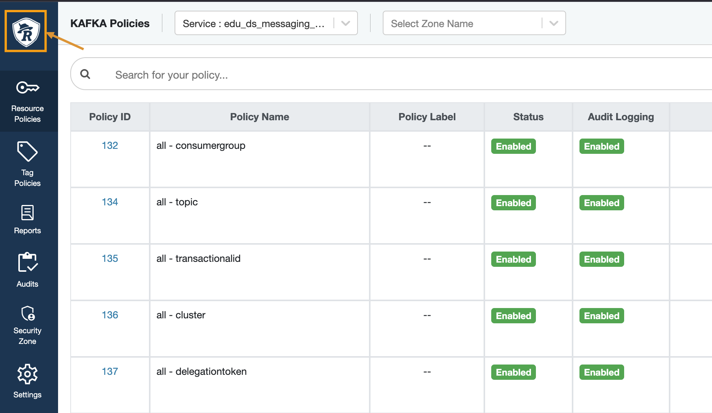

#### 3.2. Select SCHEMA-REGISTRY  
In Ranger, select the `SCHEMA-REGISTRY` repository that’s associated with the stream messaging datahub.

In this case, it will be [edu_ds_messaging_250204_schemaregistry]

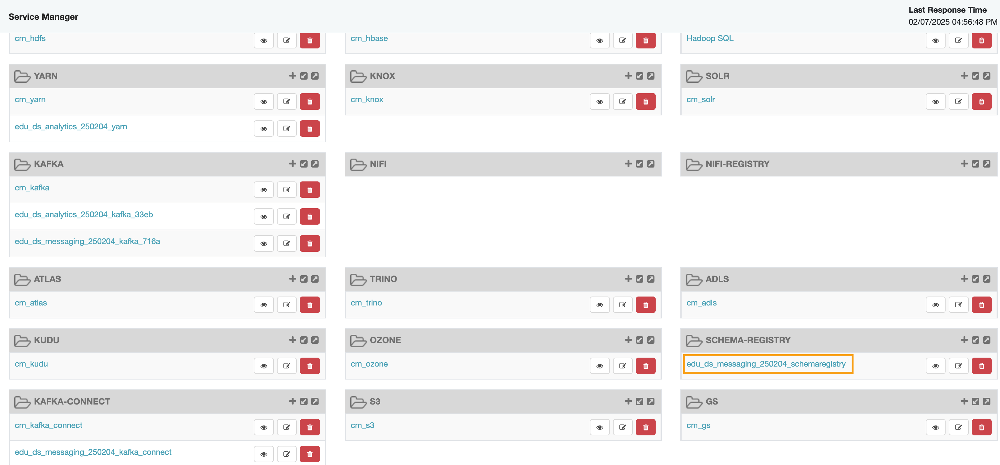

#### 3.3. Verify user  
Verify if the user who will be performing the exercise is present in the Policy: all - `schema-group, schema-metadata, schema-branch, schema-version`.

A variable {USER} with all the required permissions in Apache Ranger has been added. This variable {USER} is used to represent each student in this environment in a Ranger Policy.

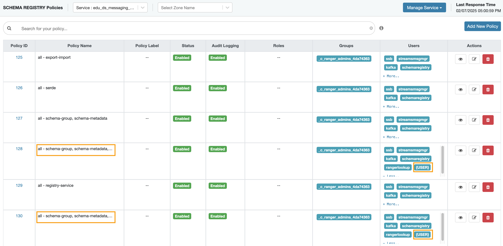

#### 3.4. Click on Edit  
Click on the Edit button under the Actions column to edit the policy. 

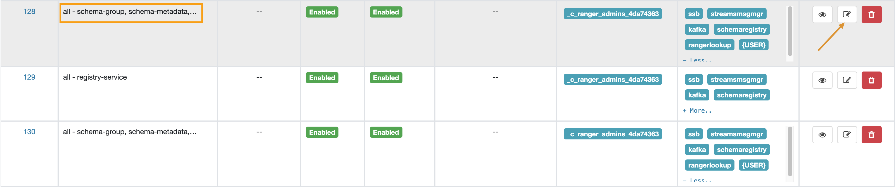

#### 3.5. Review Policy Details  
Review the policy details. 

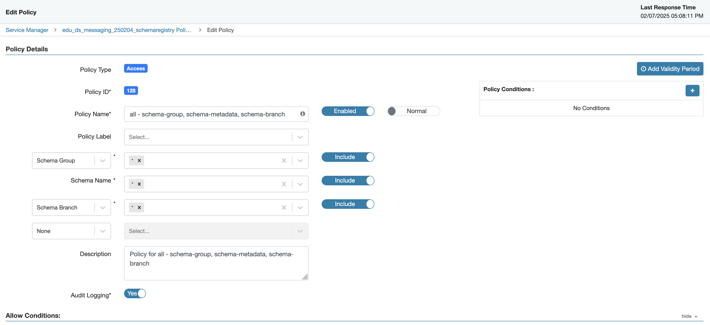

#### 3.6. Review Allow Conditions  
Verify if the user who will be performing the exercise is present in the Selected Users column. 

Review the policy permissions. 

Exit the Ranger UI by closing the tab. 

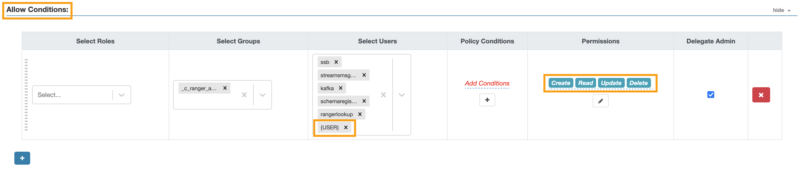

### 4. End of the Exercise   

