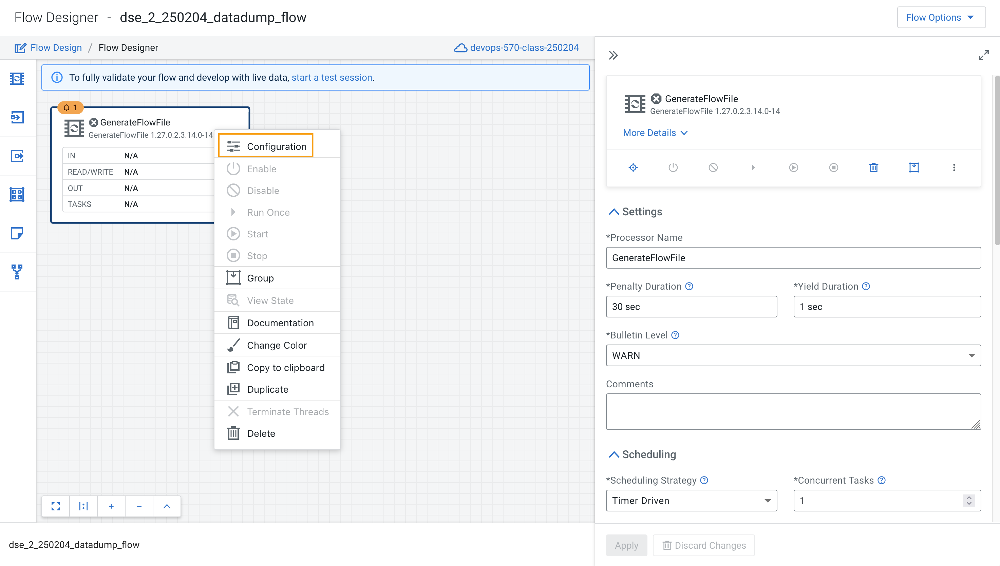

# 02-05 Create a Flow using Flow Designer

Creating a data flow for CDF-PC is the same process as creating any data flow within Nifi with 3 very important steps.

(a) The data flow that would be used for CDF-PC must be self-contained within a process group.

(b) Data flows for CDF-PC must use parameters for any property on a processor that is modifiable, e.g. user names, Kafka topics, etc.

(c) All queues need to have meaningful names (instead of Success, Fail, and Retry). These names will be used to define Key Performance Indicators in CDF-PC.

Let's build a data flow using flow designer.

### 1. Create Canvas  <a name="6eR5hoFtjgoECM363FW4p"></a>
#### We will start by creating the canvas to design the flow

#### 1.1. Select DataFlow   <a name="4np29v-kLa8a4GDDOvfC9"></a>
Access the `DataFlow` data service from the Management Console.


#### 1.2. Click on Flow Design  <a name="q_eKmLP-qLS8PV-1sBsAr"></a>
From the main navigation panel, select the Flow Design option. 


#### 1.3. Click on Create Draft  <a name="qW7v31A2_JGmAptFscTJ0"></a>
Click on `Create Draft.` This will be the main process group for the flow that you’ll create.


#### 1.4. Name the Draft  <a name="xD8ut9sZt8kjq8fzdUinP"></a>
- Select the appropriate environment as part of the Target Workshop name (Ex: `devops-570-class-250204`).

- Let the Target Project be Unassigned.

- Give your flow a name with your username as prefix (Ex: `dse_2_250204_datadump_flow`).

- Click on **Create** button.


#### 1.5. Review Canvas  <a name="Tm7uO6tb7NXJO69QRvFi9"></a>
On successful creation of the Draft, you should now be redirected to the canvas on which you can design your flow.


### 2. Adding new parameters  <a name="Hl2y69tkttUUKML9fI5l9"></a>
Configure Parameters: Parameters are reused within the flow multiple times and will also be configurable at the time of deployment. 

There are 2 options available: `Add Parameter`, which is used for specifying non-sensitive values and `Add Sensitive Parameter`, which is used for specifying sensitive parameters like password.

#### 2.1. Click on the Flow Options  <a name="wSZ5HhZU6-oFned2akszj"></a>
Click on the `Flow Options` on the top right corner of your canvas. and then select `Parameters`.


#### 2.2. Click on Add Parameter  <a name="mqCwUmKE6Eeu-c1zi-oUs"></a>


#### 2.3. Create first parameter   <a name="Xq0mRYYee07tm_oJ06BJG"></a>
Create a variable with the following entries:

- Name: `S3 Directory`.
- Value: `LabData`.

Click **Save**


#### 2.4. Review first parameter   <a name="x7Tx78wZjSjRt1GJgjqQe"></a>


#### 2.5. Click on Add Parameter  <a name="W2JW0Nz1gU4b0qTYhqVq-"></a>


#### 2.6. Create second parameter   <a name="L_s52Q9mDNZcpv5_ImjcC"></a>
Create a variable with the following entries:

- Name: `CDP Workload User`.
- Value: `The username assigned to you Ex: dse_2_250204`.

Click **Save**


#### 2.7. Review second parameter   <a name="6qkbltvB4fOs-eegIxalf"></a>


#### 2.8. Click on Add Sensitive Parameter  <a name="HJdXBu3jZTkV9-EitwKO4"></a>


#### 2.9. Create third parameter   <a name="BQ2Mn47jvIyJoyM8sxDdg"></a>
Create a variable with the following entries:

- Name: `CDP Workload User Password`.
- Value: `Workload User password set by you earlier in exercise 02-03 Define Workload Password`.

Click **Save**


#### 2.10. Review third parameter   <a name="w2D88BuI2cPR4g9QhuZEn"></a>


#### 2.11. Click Apply Changes  <a name="VpleGA3XkhoeN43qLb3IV"></a>


#### 2.12. Click OK  <a name="BmmpvUTOXu6ekUV_WzRaE"></a>


#### 2.13. Review all Parameters  <a name="IplORQ1R_yGWAkDZ8FukO"></a>
All the parameters are applied and listed under the All Parameters tab.

Now that we have created these parameters, we can easily search and reuse them within our dataflow. This is useful for `CDP Workload User` and `CDP Workload User Password`.


### 3. Create the flow  <a name="lcmH1WZ59kmeIJFWC5Lpz"></a>
Let’s go back to the canvas to start designing our flow. This flow will contain 2 Processors:

- `GenerateFlowFile`: Generates random data.
- `PutCDPObjectStore`: Loads data into HDFS(S3).

#### 3.1. Navigate to Flow Designer  <a name="6LZ6rcqvDQA4wZzbywnOj"></a>


#### 3.2. Pull the Processor  <a name="JFCMlnaog2c_xi9kpeThj"></a>
Click on Processor and drag it onto the canvas


#### 3.3. Add GenerateFlowFile processor  <a name="pHcCv43m475Ei3LkogLJp"></a>
Type `GenerateFlowFile` in the text box, and once the processor appears click on **Add**.


#### 3.4. Review processor  <a name="JOJKzgefCkIUSsXzMxeYZ"></a>
The `GenerateFlowFile` Processor will now be on your canvas. 

Reposition the processor appropriately if required by dragging it over the canvas.


#### 3.5. Configure GenerateFlowFile processor  <a name="AQQsUycxhzUO8r0r67JFY"></a>
Right click on the processor and select Configuration. 




#### 3.6. Fill in the values  <a name="FNTarnGSVKybgmKSPYhpM"></a>
Fill in the values in the right window pane to configure the processor in the following way.

`Processor Name`: `DataGenerator`

`Scheduling Strategy`: `Timer Driven`


#### 3.7. Fill in the values  <a name="MBc3ChEm64k9eaKgo4UQ3"></a>
`Run Duration`: `0ms`

`Run Schedule`: `1 min`

`Execution`: `All Nodes`

`Properties`: `Custom Text`


#### 3.8. Fill in the values  <a name="HuMZvQQxX8o5DN4__KR93"></a>
```
<26>1 2021-09-21T21:32:43.967Z host1.example.com application4 3064 ID42 [exampleSDID@873 iut="4" eventSource="application" eventId="58"] application4 has
stopped unexpectedly

```

The above represents a syslog out in RFC5424 format. Subsequent portions of these exercises under this module will leverage this same syslog format.

Click **Apply**


#### 3.9. Review DataGenerator Processor  <a name="Su7Mh3zA0oxk603vYrUl3"></a>
Review DataGenerator Processor on the canvas. 


#### 3.10. Pull second Processor  <a name="8QV5aivnStKzNajSPR7Al"></a>
Pull a new `Processor` onto the canvas 


#### 3.11. Add PutCDPObjectStore processor  <a name="RomU43lS1MswAzW0J9dMf"></a>
Type `PutCDPObjectStore` in the text box, and once the processor appears click on `Add`.


#### 3.12. Review processor   <a name="-ImpSsdNgkDGmr30TEbhn"></a>
The `PutCDPObjectStore` processor will now be on your canvas. 

Reposition the processor appropriately if required by dragging it over the canvas.


#### 3.13. Configure PutCDPObjectStore processor   <a name="SKVd0iXwc6d_6YSG-dX4o"></a>
Right click on the processor and select Configuration. 

Fill in the values in the right window pane to configure the processor in the following way.

`Processor Name` : `Move2S3`

`Scheduling Strategy` : `Timer Driven`

`Run Duration` : `0ms`

`Run Schedule` : `0 sec`

`Execution` : `All Nodes`


#### 3.14. Fill in the values   <a name="YGTSu4FO_rS88UYsvHZoa"></a>
Click on *No Value set* for in front of Directory under Property.


#### 3.15. Fill Directory  <a name="4uTMfBwa8Dl1OyiFczEON"></a>
`Directory` : #{S3 Directory}


#### 3.16. Fill properties  <a name="3vwCFcRMcsrCj63Bvtj4B"></a>
Similarly, fill the below properties

`CDP Username` : #{CDP Workload User}

`CDP Password` : #{CDP Workload User Password}

`Relationships`: Check the `Terminate` box under `success`.

Click on **Apply. **


#### 3.17. Create connection between processors  <a name="Sv9MWHgPpNGI6F4C5CwoS"></a>
Review `Move2S3` processor on the canvas. 

Connect the two processors by dragging the arrow from `DataGenerator` processor to the `Move2S3` processor. 


#### 3.18. Drag the arrow  <a name="EMfYl8Peum-oD26wCKT9D"></a>


#### 3.19. Connect arrow  <a name="YZ3zMUEtq4dI7fCi2eEhF"></a>


#### 3.20. Select Success  <a name="eJuKR8P46i3_EYMQ2sh94"></a>
Select on `success` relationship checkbox. 

 Click **Add**.


#### 3.21. Review Flow  <a name="EIR0X1C5uTR7uL6loeM01"></a>
Your flow should look something like this. 


#### 3.22. Add a queue  <a name="yGOXauyWaPs38ZbhxqtON"></a>
The `Move2S3` processor does not know what to do in case of a failure. Let’s add a retry queue to it. This can be done by dragging the arrow on the `Move2S3` processor outwards then back to itself, as shown below.


#### 3.23. Select Failure  <a name="iXq-cDfU_IVLl5hGzu5Lf"></a>
Select on `failure` relationship checkbox.

 Click **Add**.


#### 3.24. Review flow  <a name="VJwg8aCCkrTBv6SlHaua1"></a>


### 4. Renaming the queues  <a name="OqiQgbxJMQtZBIxOxkNHW"></a>

!!! info
    Naming the queue: Providing unique names to all queues is very important as they are used to define Key Performance Indicators (KPI) upon which CDF-PC will auto scale. To name a queue, double-click the queue and give it a unique name. A best practice here is to start the existing queue name (i.e. success, failure, retry, etc…) and add the source and destination processor information.

#### 4.1. Rename Success Queue  <a name="dVdyeTVxTCl_R5oq7WjGw"></a>
Click on Success Queue. In the Connection Name field, rename the queue as `success_Move2S3.`

Click **Apply. **


#### 4.2. Rename Failure Queue  <a name="e_pfoGCbh_3zeA8qeOZrP"></a>
Click on failure Queue. In the Connection Name field, rename the queue as `failure_Move2S3.`

Click **Apply. **


#### 4.3. Review flow  <a name="4moJBSY8iPV1-wo0T9NNn"></a>


### 5. End of the Exercise   <a name="1QKdigXKa_6ef7cTNelYd"></a>


