# 02-06 Testing the flow

Testing the Data Flow: To test the flow we need to first start the test session.

### 1. Testing the Data Flow  <a name="lblL9ZyDpM7mw24vPkMUv"></a>

#### 1.1. Click on Flow Options  <a name="19uSSYYnvRfweZotDKYLG"></a>
Click on `Flow Options` on the top right corner and then click `Start` under `Test Session` section.

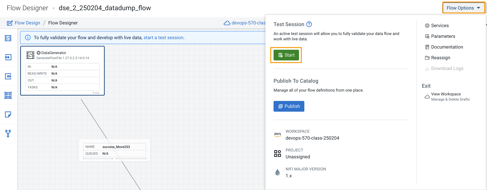


#### 1.2. Click Start Test Session  <a name="V8q3hx9CFcZlUND4mdI4W"></a>
In the next window, click `Start Test Session`.

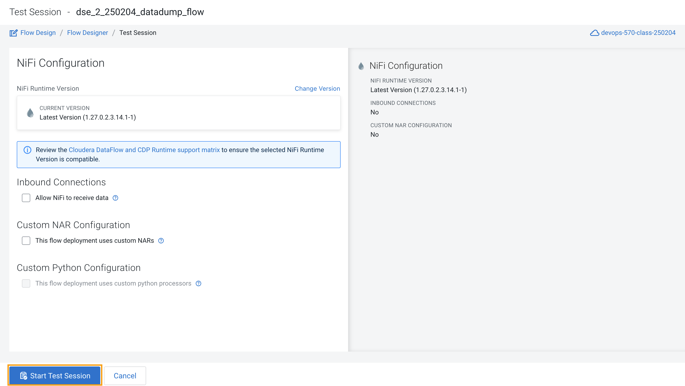


#### 1.3. Wait a couple of mins  <a name="U41kIPBHs1BYf0HyMJ8Hz"></a>

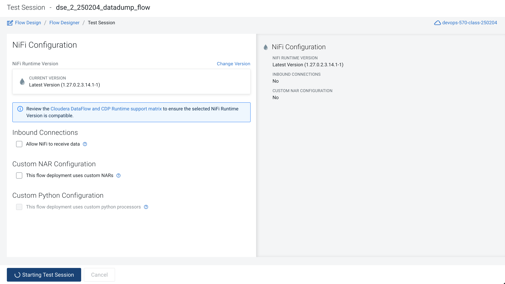


#### 1.4. Initializing Test Session  <a name="Nuz_Oqm7sTQnxQcdcshPM"></a>
The activation should take about a couple of minutes. While this happens, you will see this at the top right corner of your screen.

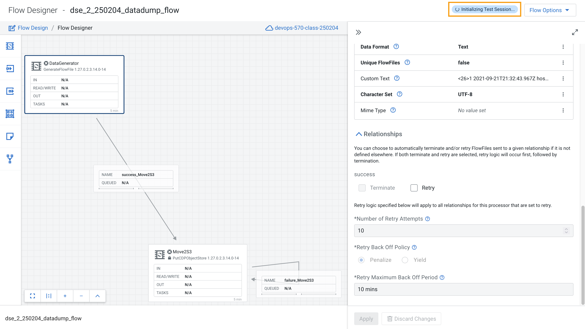


#### 1.5. Active Test Session  <a name="65vUhaqt4YE_gnJciHYGF"></a>
Once the Test Session is ready you will see the Active Test Session in green button. 

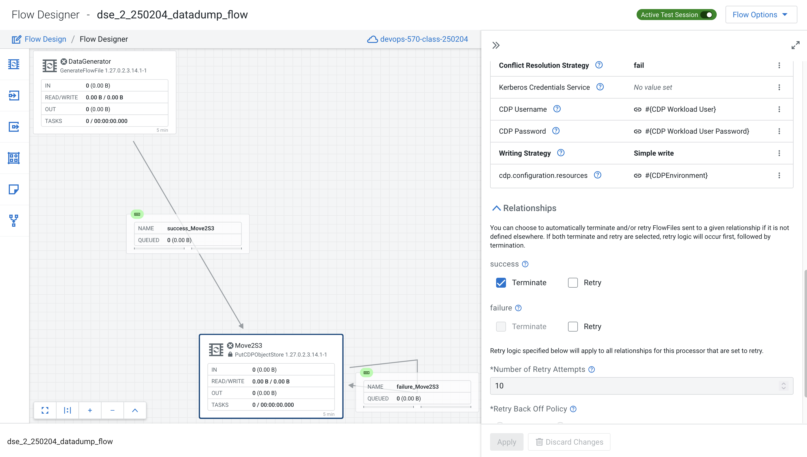


### 2. Setup S3 dir access  <a name="0UbRESD2sAEeHuwOLA3t0"></a>
Setup the command line access for the S3 LadData directory. 

#### 2.1. Click on Menu   <a name="zJwNhQBDI4pUdaw3myBwX"></a>
Select the Menu option by clicking on the 9 dots. 

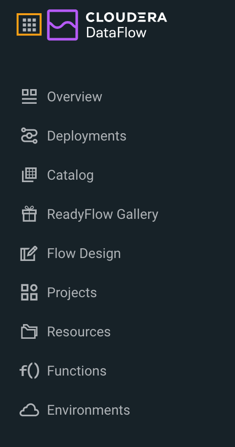


#### 2.2. Select Management Console  <a name="3GRMBUo7ObFuHMPYLhh0O"></a>
Navigate to the Management Console page by clicking the Management Console tile.

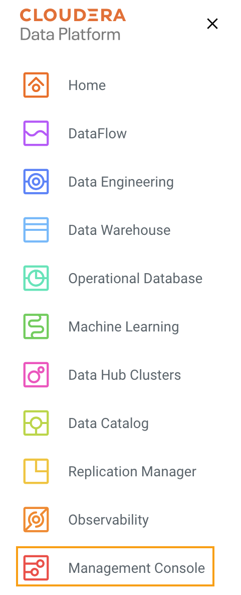


#### 2.3. Select Environment  <a name="irJqWVCpgebOIoJw5Qqs4"></a>
Click on the environment. 

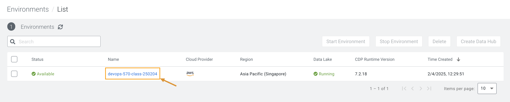


#### 2.4. Select Gateway  <a name="S8XQeI3abwY0cnjAsU312"></a>
Click on training gateway

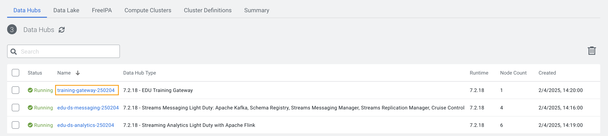


#### 2.5. Review page  <a name="HkDp6aURI8ypUs-MAzhRe"></a>
Review the details for training gateway. 

Scroll down the page. 

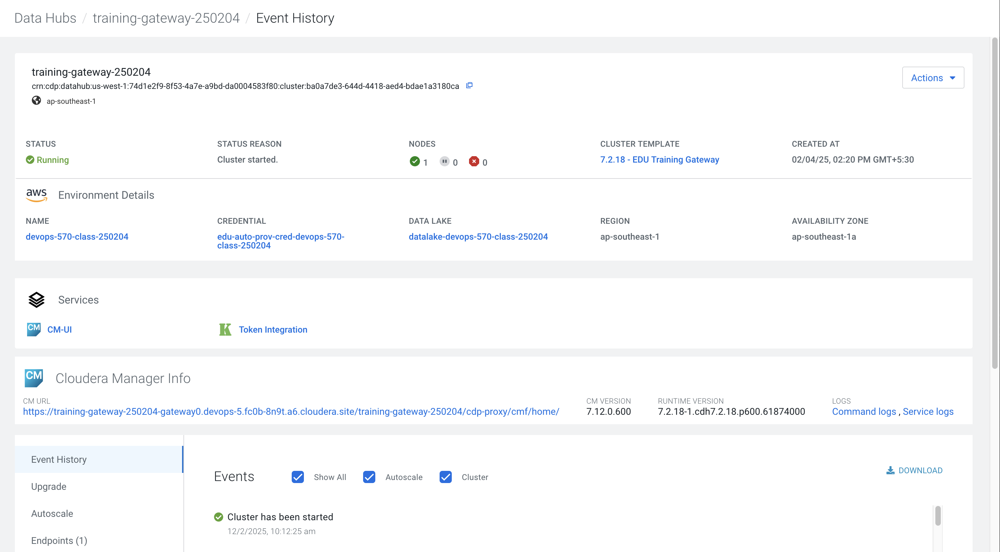


#### 2.6. Click on Nodes  <a name="aqMdqyI-9AHYI4KQ7n6lO"></a>
Click on the Nodes option in the left hand side pane. 

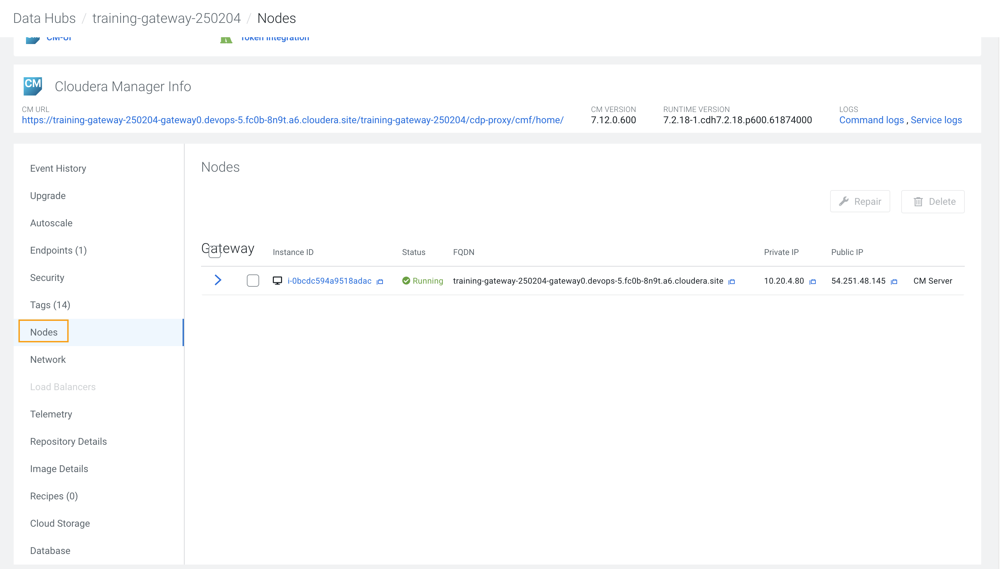


#### 2.7. Copy Public IP  <a name="UBayIH1XzdDehTRis7Dnd"></a>
Click on the Copy to Clipboard button next to Public IP. 

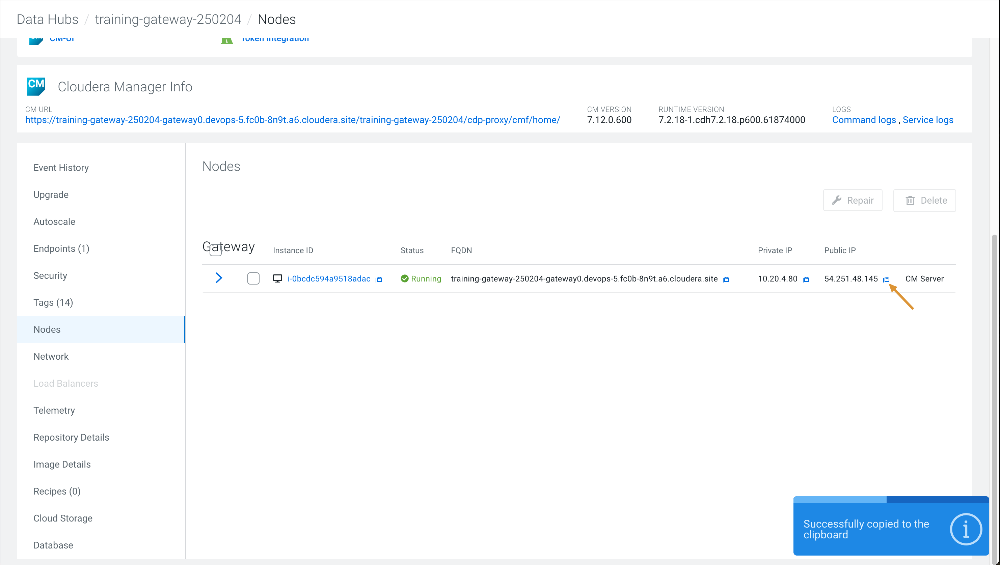


#### 2.8. Access the gateway  <a name="NpIFsa3o5OoVArtn8giVm"></a>
Open a terminal on your device and run the ssh command to access the gateway. 

```
ssh username@<training-gateway-public-up>

```

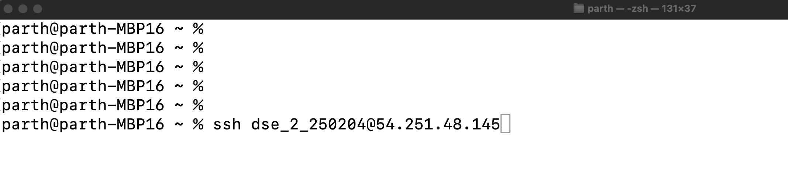


#### 2.9. Enter password  <a name="Zq5xMV9pCoFA_0EXn2yPb"></a>
Enter password for your username. 

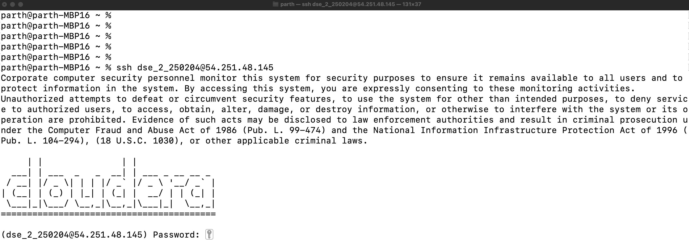


#### 2.10. Login Successful  <a name="5pZ-xNBgXNApPJZKMNGhh"></a>
After the password, you should be able to successfully access the gateway. 

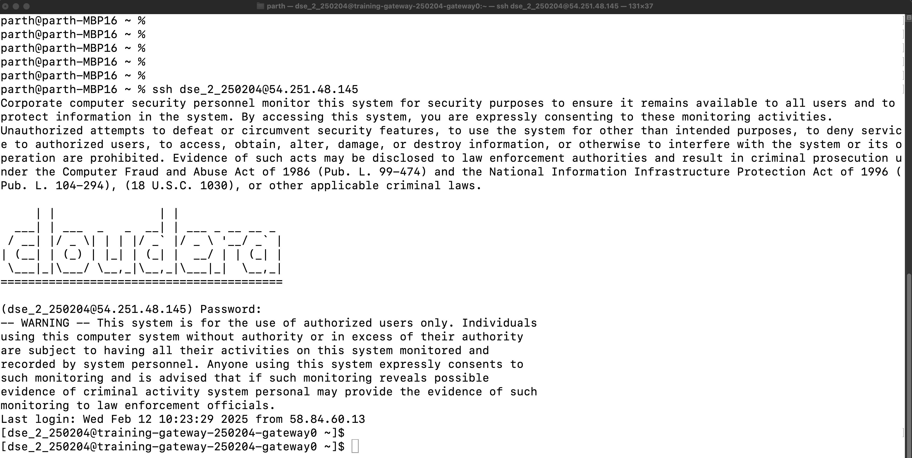


### 3. Fetching location  <a name="cIZZVxhNJIibLcwVZ5-pe"></a>


#### 3.1. Navigate to training gateway  <a name="pnjHch-nARO4oVb-zP1sx"></a>
Navigate back to training gateway page. 

Click on Environment under Environment Details. 

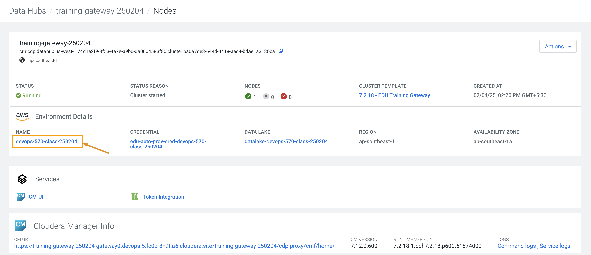


#### 3.2. Click on Summary  <a name="ce_cKBXUwpVeU30T9ajAo"></a>
Scroll down on the Summary Tab

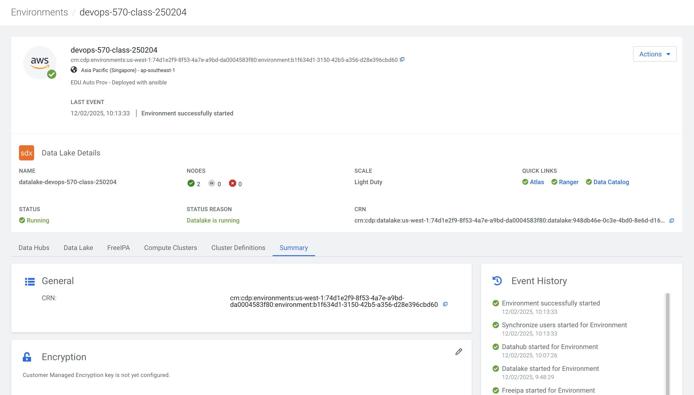


#### 3.3. Copy the location  <a name="v6J5sVTaKwpOzsfC38zBp"></a>
Copy the location until datalake

For example: *s3a://cdp-storage-devops-570-class-250204*

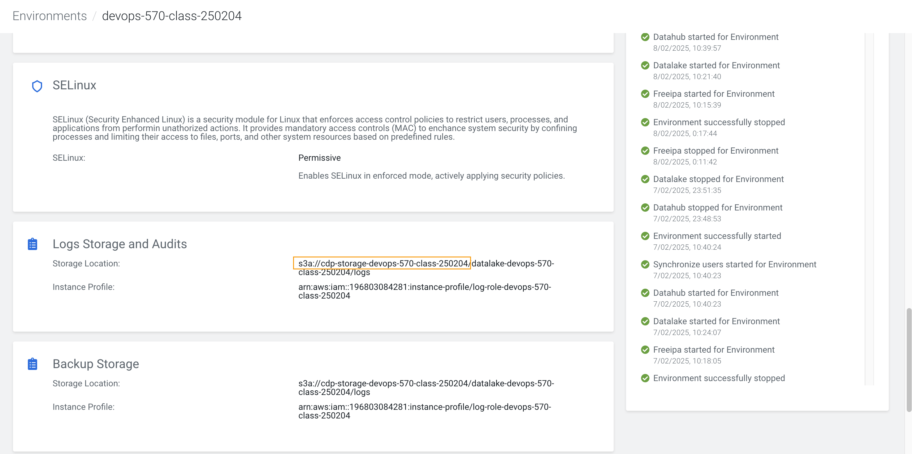


#### 3.4. List files  <a name="cfdFr7ZzTu0oRqrAchvHl"></a>
Run the following command to list the files under your user. You should not see LabData directory just yet.

```
hdfs dfs -ls s3a://cdp-storage-devops-570-class-250204/user/dse_2_250204/

```

```
Syntax: hdfs dfs -ls <storage-location>/user/<username>/

```

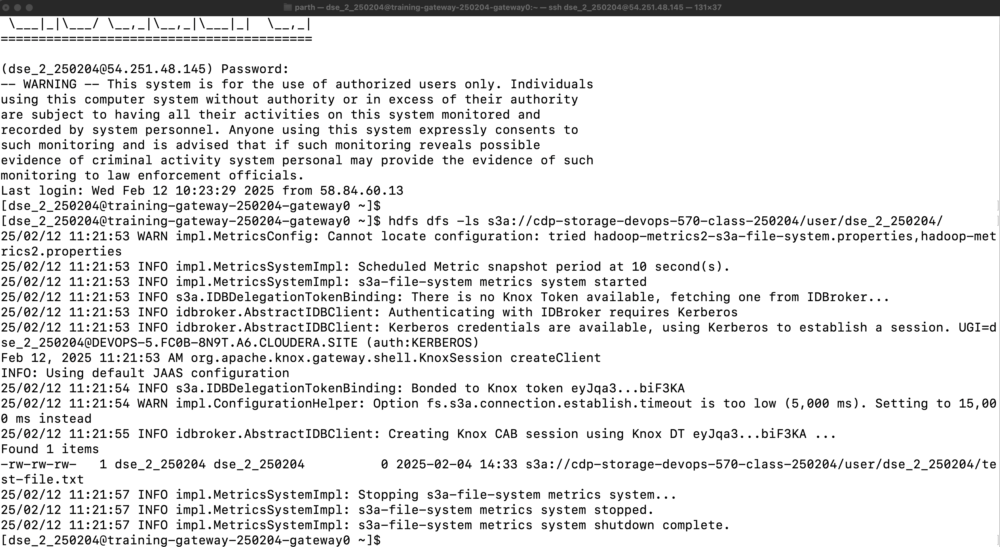


### 4. Run the flow  <a name="HZDIv4cGb3QgyO6hdYdXU"></a>

#### 4.1. Click on Menu   <a name="XVXqt3kv3dhomaGmsH9oi"></a>
Select the Menu option by clicking on the 9 dots. 

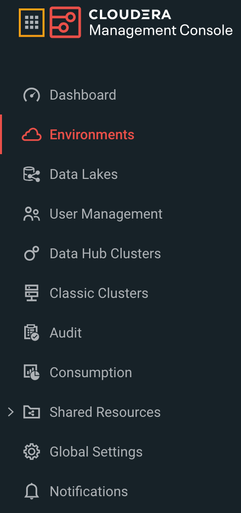


#### 4.2. Select DataFlow   <a name="YnIcq2zA-Vpft70cN1h72"></a>
Navigate to the Cloudera DataFlow page by clicking the DataFlow tile in the Cloudera management console.

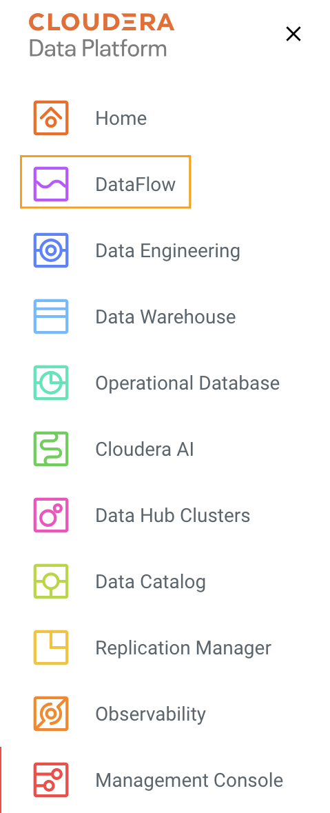


#### 4.3. Select Flow Design   <a name="-WW2ijO67ROrYfZlTItlj"></a>
Select the Flow Design option. 

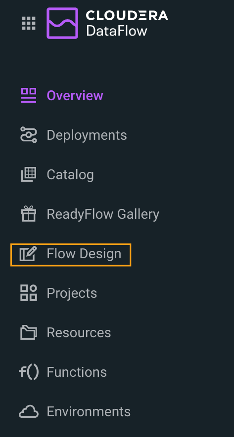


#### 4.4. Select Draft  <a name="jhhsyKf9Lbc6l11WceFMc"></a>
Click on the Draft Name

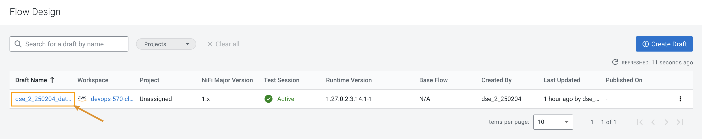


#### 4.5. Run the flow  <a name="5_KZ6EtPnUavp572QoRiH"></a>
Run the flow by right clicking the `empty part` of the canvas and selecting `Start`.

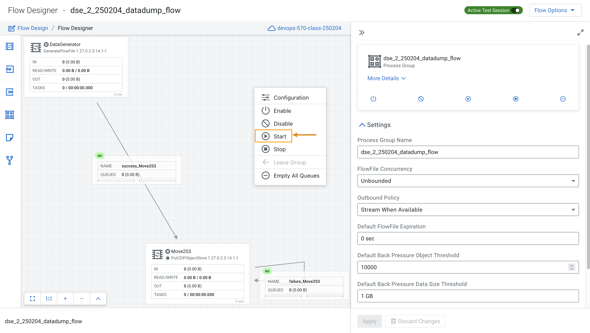


#### 4.6. Review the processor state  <a name="0mdMsHq8Y0EXlxE2GC6Oe"></a>
Both the processors should now be in the `Start` state. This can be confirmed by looking at the green play button against each processor.

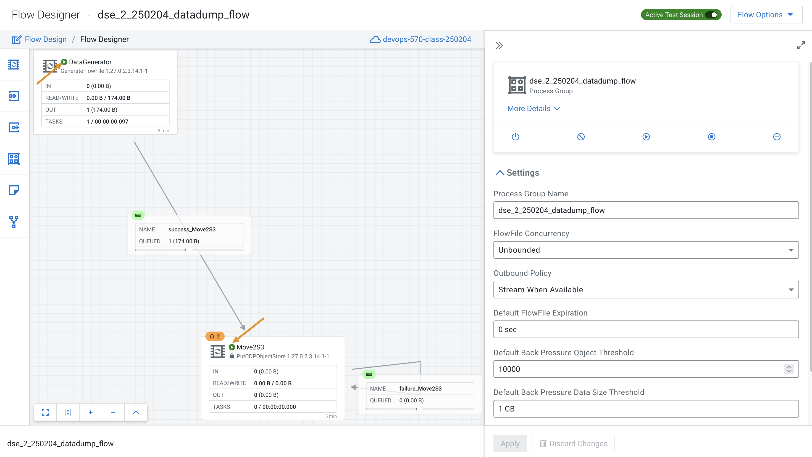


### 5. Verify contents under /LabData  <a name="jGNCZ1qZd7omzR0aeAJFH"></a>

#### 5.1. List the files  <a name="6CFQzOyodkig15SbNftU_"></a>
Run the same command as executed earlier to list the files under your user. You should *now* see LabData directory

```
hdfs dfs -ls s3a://cdp-storage-devops-570-class-250204/user/dse_2_250204/

```

```
Syntax: hdfs dfs -ls <storage-location>/user/<username>/

```

```
hdfs dfs -ls s3a://cdp-storage-devops-570-class-250204/user/dse_2_250204/LabData

```

```
Syntax: hdfs dfs -ls <storage-location>/user/<username>/LabData/

```

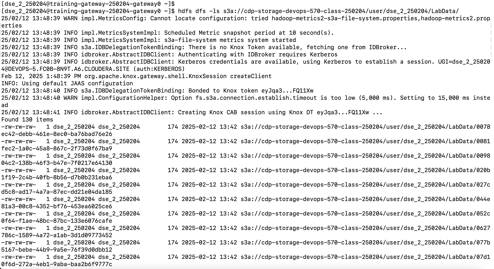


### 6. End of the Exercise   <a name="z9mYlVbSBOBYQgdS2F_aZ"></a>


