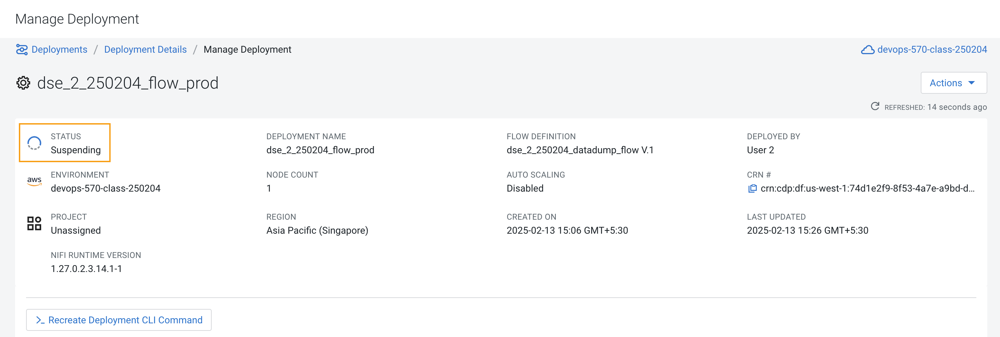

# 02-07 Moving the flow to the flow catalog

After the flow has been created and tested, we can now Publish the flow to the Flow Catalog.

### 1. Publish the Flow  <a name="9DYsSnQW3cRhlB6ENiTx9"></a>

#### 1.1. Stop Test Session  <a name="2QniEdkgvCR3CoeoKFajA"></a>
Stop the current test session by clicking on the green tab on top right corner indicating `Active Test Session`. 


#### 1.2. Click on End.  <a name="31Za6pVouvq3R52RyI4N7"></a>


#### 1.3. Review Session Status  <a name="plWFFPtOX6VI8wiuYr0B1"></a>
Keep a check on the Test Session status as it turns red. 


#### 1.4. Publish Flow  <a name="7azRHdhOb94X43lKlcHFO"></a>
Once the session stops click on `Flow Options` on the top right corner of your screen and click on `Publish`.


#### 1.5. Name the flow  <a name="N6JPVDL_rhypx0DP-L2V8"></a>
Give your flow a unique name and click on `Publish`.

`Flow Name`: `{user_id}_datadump_flow` (Ex: `dse_2_250204_datadump_flow`).


#### 1.6. Review Success Message  <a name="duQi76b8tbXd_J3Z_ALsC"></a>
The flow will now be visible on the Flow `Catalog` and is ready to be deployed.


### 2. Deploying the flow  <a name="cKmfyioEEsa-kx7zPNRrB"></a>

#### 2.1. Click on Menu  <a name="SLf0LlFbc-8KKiZESpA1L"></a>
Select the Catalog option. 


#### 2.2. Search for the Flow Catalog  <a name="AG5DCM76Ie-oZoQbZNNFb"></a>
Search for the `Flow Catalog` by typing the name of the flow that you just now published. 

Click on the flow. 


#### 2.3. Deploy Flow  <a name="qKBtgE0fmFJP1lWmOL6d0"></a>
You should see the option to `Deploy`. Verify 'Version 1' and then click on `Deploy`. 


#### 2.4. Click Continue  <a name="DcWYx5wFEBab_KcKTDpr3"></a>
The target workspace should be pre-selected for you. 

Click **Continue**.


#### 2.5. Name the Deployment  <a name="N0OT76S_txRApqTW4BXFV"></a>
Give a unique name to the deployment.

Deployment Name: `{user_id}_flow_prod`

(Ex: `dse_2_250204_flow_prod`).

Click **Next**


#### 2.6. Set Nifi Configuration  <a name="FV-nyYpvX0RxL2ro9gLKJ"></a>
In this step we let everything be the default and click **Next.**


#### 2.7. Set the Parameters  <a name="kIHa6foLu_oy790xGd3Ru"></a>
Set the parameters are following:

- CDP Workload User: `The username assigned to you`. 
- Ex: `dse_2_250204`.
- CDP Workload User Password: `Workload User password set by you earlier in exercise 02-03 'Define Workload Password'`.
- S3 Directory: `LabData`


#### 2.8. Set the cluster size  <a name="mZanmyfYOVt2lrglk1woy"></a>
Select the `Extra Small` size. In this step you can configure how your flow will auto scale, but keep it disabled for this lab. Select the standard storage selection. 

Click **Next.**


#### 2.9. Add Key Performance indicators  <a name="TXPIQQqBgdnuzAh7vty5D"></a>
Set up KPIs to track specific performance metrics of a deployed flow.

Click on **Add New KPI**.


#### 2.10. Fill in the details   <a name="ufZ3ozKhwnH2KraYDFfQY"></a>
In the `Add New KPI` window, fill in the details as below.

- KPI Scope: `Connection`
- Connection Name: `failure_Move2S3`
- Metric to Track: `Percent Full`
- Check box against `Trigger alert when metric is greater than`: `50Percent`.

`Alert will be triggered when metric is outside the boundary(s) for`: `2Minutes`.

Click **Add.**


#### 2.11. Review KPI  <a name="cXoYc92GPFdxPKh7pC1Gm"></a>
Click **Next**. 


#### 2.12. Click Deploy  <a name="yppv-X0jQvpH3Pcatsq7i"></a>


#### 2.13. Review Deployment Initiated message  <a name="rMjt4HfJqevqq8nJAApBf"></a>
The *Deployment Initiated* message will be displayed. Wait until the flow deployment is completed, which might take a few minutes. 


#### 2.14. Review Deployment  <a name="prT0yHWkBYvVrWknmLa_I"></a>
When deployed, the flow will show up on the Data flow dashboard, as below.


#### 2.15. List the files  <a name="RPd7rEMY-MfHUwBoLaPrS"></a>
The data gets populated in the S3 bucket. 

Run the same command as executed earlier to list the files under your user. 

```
hdfs dfs -ls s3a://cdp-storage-devops-570-class-250204/user/dse_2_250204/LabData

```

```
Syntax: hdfs dfs -ls <storage-location>/user/<username>/LabData/

```


#### 2.16. Click on Flow  <a name="Cibe6xqiu9hLRjK5BU_Vz"></a>
Click in the empty area in the left hand side to take a look at the flow. 


#### 2.17. Review Flow  <a name="0kEgzCw8ZB2WHSV0FONO_"></a>
After a while you will see the flow something like below for the flow you just deployed.


### 3. Verifying flow deployment  <a name="PMo6q43rAKKVxXKryvGky"></a>


#### 3.1. Select Manage Deployment  <a name="G5glPUjLAIYfCXNDL77QA"></a>
Click on the flow in the Dashboard and select `Manage Deployment` under **Actions** button. 


#### 3.2. Review Deployment  <a name="fjr2fyQ7QJ6ssZ6tflF8g"></a>


#### 3.3. Review KPI and Alerts  <a name="g-ZWqQfEtKWbFOzlRJcfZ"></a>
Click on the `KPI and Alerts` tab under `Deployment Settings` to get the list of KPIs that have been set. You also have an option to modify or add more KPIs to your flow here.


#### 3.4. Review Sizing and Scaling  <a name="CEIWvuSuEa6-6p1UZ3QFo"></a>
Click on the `Sizing and Scaling` tab to get detailed information.


#### 3.5. Review Parameters  <a name="EmeDTxQbe0uYPV1bOqbfp"></a>
The parameters that we earlier created can be managed from the Parameters tab. Click on `Parameters`.


#### 3.6. Review NiFi Configurations  <a name="Upi2JB4CV1dc_1Q4qYG8Z"></a>
If you have set any configuration w.r.t to Nifi they will show up on the `NiFi Configuration` tab.


#### 3.7. View in NiFi  <a name="3KwpNiue4On8Re1OOeGd0"></a>
Click on `Actions` and then click on `View in NiFi`. This will open the flow in the Nifi UI.


#### 3.8. Review flow in Nifi UI  <a name="9HufllrWx9KGbYeJTT0w1"></a>


### 4. Suspend flow  <a name="R-RqLrXoNzxuQ6UwDg7qt"></a>
We will now suspend this flow. 

#### 4.1. Click on Suspend Deployment  <a name="WIbijIrUHK6Soe7IKpLgN"></a>
Navigate back to the Manage Deployment page. Click on `Actions` and then `Suspend Deployment`.


#### 4.2. Click on Suspend Flow  <a name="XkQxdXaZ0sYN-ZZiGyJGh"></a>
Click on the verification `Suspend Flow`.


#### 4.3. Observe the status  <a name="q7ezfBoLViThFZv1yfECP"></a>
Observe the change in the status of the flow.




#### 4.4. Review Deployment State  <a name="qHv4c3Lx8l-0GSCs3yXcs"></a>
After a few minutes, the status of the deployment has been changed to Suspended. 


### 5. End of the Exercise   <a name="U5Q3T1_qD2K2y31w8PiCz"></a>


