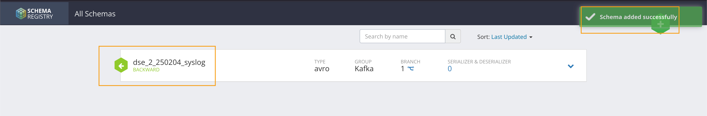
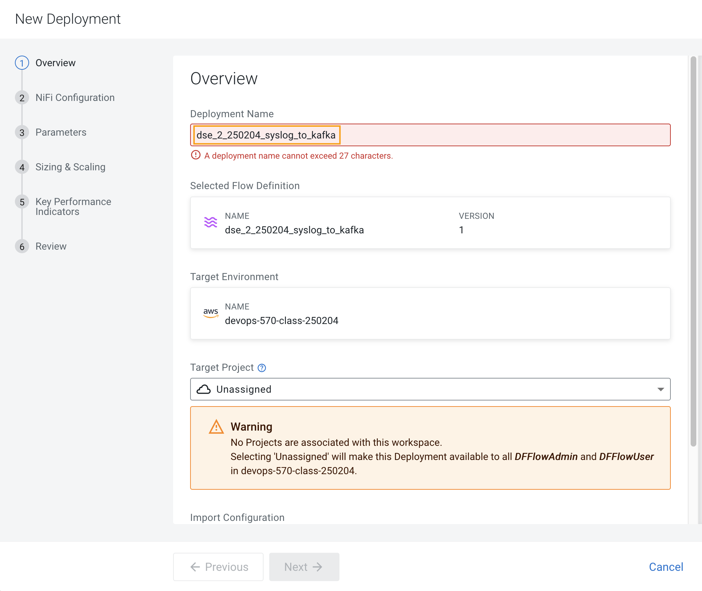

# 02-08 Migrating Existing Data Flows to CDF-PC

!!! info 
    The purpose of this exercise is to demonstrate how existing NiFi flows externally developed (e,g. on local laptops of developers, or pushed from a code repo) can be migrated to the Data Flow. This workshop will leverage an existing NiFi flow template that has been designed with the best practices for CDF-PC flow deployment.

The existing NiFi Flow will perform the following actions. - Generate random syslogs in 5424 Format.

- Convert the incoming data to a JSON using record writers.

- Apply a SQL filter to the JSON records.

- Send the transformed syslog messages to Kafka.

!!! Note
    A parameter context has already been defined in the flow and the queues have been uniquely named.

For this we will be leveraging the DataHubs which have already been created - `edu-ds-messaging-250204`, `edu-ds-analytics-250204.`

Note that the above names might be different depending upon your environment.

### 1. Create a Kafka Topic  <a name="KLCaqf06RjzFkU3Y3PMXb"></a>

#### 1.1. Click on Menu   <a name="az63heAWAst7C24o7Xyvz"></a>
Select the Menu option by clicking on the 9 dots. 


#### 1.2. Select Management Console   <a name="MtzvOyhkeNi6rS_uZbzkD"></a>
Navigate to the Management Console page by clicking the Management Console tile.


#### 1.3. Select Environment   <a name="7tr980Z3M3O1TWSlgQjKn"></a>
Click on the environment. 


#### 1.4. Select Messaging Data Hub   <a name="R7HarELYJZSLCHcJ40OnY"></a>
Click on the Data Hub for Stream Messaging. For ex: edu-ds-messaging-250204


#### 1.5. Note Hostname of master  <a name="B-OS7YpL8o26-DXkVGgQj"></a>
Note the hostname of the master server in the Kafka Datahub. This will be used while created a new deployment later in this exercise. 

```
edu-ds-messaging-250204-master0.devops-5.fc0b-8n9t.a6.cloudera.site

```


#### 1.6. Login to Streams Messaging Manager  <a name="6eHfzu8xphxxL5JIYsOh1"></a>
Login to `Streams Messaging Manager` by clicking the appropriate hyperlink in the Streams Messaging Datahub


#### 1.7. Click on Topics  <a name="xK_UFm-IySiZbpTO7rYcW"></a>
Click on `Topics` in the left tab.


#### 1.8. Click on Add New.  <a name="BlUjBO2NzQGBNDVzFqErp"></a>


#### 1.9. Create a Topic  <a name="Uajt0vdshs4CQUtnr5dOE"></a>
Create a Topic with the following parameters. 

- Name:	`<username>_syslog`. 
- Ex: `wuser00_syslog`.
- Partitions: `1`
- Availability: `MODERATE`
- Cleanup Policy: `delete`

!!! Note 
    The Flow will not work if you set the Cleanup Policy to anything other than `Delete`. This is because we are not specifying keys when writing to Kafka

Click **Save**.


#### 1.10. Review Message  <a name="Orvf2uGp2eOiOZEKNU3ys"></a>
A pop-up message will appear confirming topic has been added.


#### 1.11. Search for the topic  <a name="gM-ZGV3jakRfT4k5OkosZ"></a>
You can search for the topic that you created now and look for it as shown here.


### 2. Obtain the Kafka Broker List  <a name="W0JwuSj4UzGxpfuZxeaFQ"></a>
We will require the broker list to configure our processors to connect to our Kafka brokers which allows consumers to connect and fetch messages by partition, topic or offset. This information can be found in the Datahub cluster associated to the Streams Messaging Manager. Later in the lab, we will need to have at hand the list of kafka brokers - already configured in this environment- so to be able to our dataflow to publish to our Kafka topics.

#### 2.1. Select Brokers   <a name="WhPHRuOYxzft16sxJDr66"></a>
Select `Brokers` from the left tab.


#### 2.2. Save Broker List  <a name="6EPuuiFm5WLdsm3Z7OqZZ"></a>
Save the name of the broker list in a notepad.

Example: 

- edu-ds-messaging-250204-corebroker2.devops-5.fc0b-8n9t.a6.cloudera.site:9093
- edu-ds-messaging-250204-corebroker0.devops-5.fc0b-8n9t.a6.cloudera.site:9093
- edu-ds-messaging-250204-corebroker1.devops-5.fc0b-8n9t.a6.cloudera.site:9093


### 3. Create a Schema in Schema Registry  <a name="V77myYu_1itf2MmgqSAMb"></a>
You need to now work on `Schema Registry`. 

#### 3.1. Login to Schema Registry  <a name="712mLCJFhKNCDS3YN-1w3"></a>
Navigate back to Data Hub for Stream Messaging. Login to `Schema Registry` by clicking the appropriate hyperlink in the Streams Messaging Datahub


#### 3.2. Create a new schema  <a name="1CIjrvLhOwQywdAKPp6rX"></a>
Click on the `+` button on the top right to create a new schema.


#### 3.3. Fill in the details  <a name="ive5kHt6SYLNsh5NNkLrf"></a>
Create a new schema with the following information.

- Name: `<username>_syslog`
- Ex: `dse_2_250204_syslog`
- Description: `syslog schema for dataflow workshop`
- Type: `Avro schema provider`
- Schema Group: `Kafka`
- Compatibility: `Backward`
- Evolve: `True`
- Schema Text: Copy and paste the below schema text below into the `Schema Text` field.

```
{
 "name": "syslog",
 "type": "record",
 "namespace": "com.cloudera",
 "fields": [
  {
   "name": "priority",
   "type": "int"
  },
  {
   "name": "severity",
   "type": "int"
  },
  {
   "name": "facility",
   "type": "int"
  },
  {
   "name": "version",
   "type": "int"
  },
  {
   "name": "timestamp",
   "type": "long"
  },
  {
   "name": "hostname",
   "type": "string"
  },
  {
   "name": "body",
   "type": "string"
  },
  {
   "name": "appName",
   "type": "string"
  },
  {
   "name": "procid",
   "type": "string"
  },
  {
   "name": "messageid",
   "type": "string"
  },
  {
   "name": "structuredData",
   "type": {
    "name": "structuredData",
    "type": "record",
    "fields": [
     {
      "name": "SDID",
      "type": {
       "name": "SDID",
       "type": "record",
       "fields": [
        {
         "name": "eventId",
         "type": "string"
        },
        {
         "name": "eventSource",
         "type": "string"
        },
        {
         "name": "iut",
         "type": "string"
        }
       ]
      }
     }
    ]
   }
  }
 ]
}

```

N**ote:**

 The name of the Kafka Topic (Ex: `dse_2_250204_syslog`) you previously created and the Schema Name must be the same.

Click **Save.**


#### 3.4. Review Message   <a name="SLhskOH6aTtVukfzoD8Hp"></a>
A pop-up message will appear confirming Schema has been added. 




### 4. Operationalizing Externally Developed Data Flows with CDF-PC  <a name="KPsoz6WDHUpi9okFh-Frd"></a>
Import the Flow into the CDF-PC Catalog

#### 4.1. Click on Menu   <a name="ZmpoDv73ruDS7h2BSKzQT"></a>
Select the Menu option by clicking on the 9 dots. 


#### 4.2. Select DataFlow   <a name="j-1L6POE2EhuJmDnL0_by"></a>
Navigate to the Cloudera DataFlow page by clicking the DataFlow tile in the Cloudera management console.


#### 4.3. Select Catalog  <a name="qnh6y9AdNzT_ZQbn49B7c"></a>
Select the Catalog option. 


#### 4.4. Select Import Flow Definition  <a name="3pSViJd90GluBhLF2TeLO"></a>
Select `Import Flow Definition` on the Top Right.


#### 4.5. Fill in the details   <a name="sIMMHXQEe1qOFh2zBwMhT"></a>
Add the following information.

- `Flow Name`: <username>_syslog_to_kafka. (Ex: `wuser00_syslog_to_kafka`)
- `Flow Description`: `Reads Syslog in RFC 5424 format, applies a SQL filter, transforms the data into JSON records, and publishes to Kafka.`
- `NiFi Flow Configuration`: syslog-to-kafka.json (From the resources downloaded earlier).
- `Version Comments`: Initial Version.


#### 4.6. Upload File  <a name="p2UfDeTuFACjLzORE9Egj"></a>
Upload the syslog-to-kafka.json script downloaded earlier in step 2 of exercise 02-02 Accessing Environment. 

Click **Import**.


#### 4.7. Review Message   <a name="PQQKzGFycTekJragnpv7g"></a>
A pop-up message will appear confirming flow definition has been imported successfully. 


### 5. Deploy the Flow in CDF-PC  <a name="y3VH6ZGgbIF_jwQDLO8jX"></a>

#### 5.1. Search for the flow  <a name="rWzDKcofldzgpH3PlHvOh"></a>
Search for the flow in the Flow Catalog by typing the flow name that you created in the previous step.


#### 5.2. Deploy the Flow  <a name="PjIEmgdUAsXD5y1QrK5bM"></a>
Click on the Flow, you should see the following. You should see a `Deploy` Option appear shortly. Then click on `Deploy`.


#### 5.3. Select Target Environment  <a name="Xc6BCRTlF_TnBGGHTMu0Y"></a>
Select the CDP `Target Environment` (Ex: `emeaworkshop-environ`) where this flow will be deployed. 

Click **Continue.**


#### 5.4. Name the Deployment  <a name="yGPr5oVri9PD-7jmjOwqH"></a>
Give the deployment a unique name (Ex: `{user_id}_syslog_to_kafka`). 

In case the character limit exceeds, you may shorten the name as shown in the next step. 




#### 5.5. Name the Deployment  <a name="w368gGAI0vyArHCAhpXUb"></a>
Removed extra '_' from the name so as to meet the character limit for the deployment name.

Click **Next.**


#### 5.6. Click Next  <a name="P81fpz74Z7PPu7-9gHUM2"></a>
In the NiFi Configuration screen, click **Next** to take the default parameters.


#### 5.7. Add the Flow Parameters  <a name="57FMrWMsX3X1-WgZd-ctz"></a>
Add the Flow Parameters as below.

Note that you might have to navigate to multiple screens to fill it. Then click `Next`.

- `CDP Workload User`: The workload username for the current user. (Ex: `dse_2_250204`)
- `CDP Workload Password`: The workload password for the current user (This password was set by you earlier).
- `Filter Rule`: `SELECT * FROM FLOWFILE`.


#### 5.8. Add the Flow Parameters  <a name="kaWj0q-WHNZaZZrjpMM_V"></a>
- `Kafka Broker Endpoint`: The list of Kafka Brokers previously noted, which is comma separated as shown below.
- **Example**: edu-ds-messaging-250204-corebroker2.devops-5.fc0b-8n9t.a6.cloudera.site:9093,edu-ds-messaging-250204-corebroker0.devops-5.fc0b-8n9t.a6.cloudera.site:9093,edu-ds-messaging-250204-corebroker1.devops-5.fc0b-8n9t.a6.cloudera.site:9093
- `Kafka Destination Topic`: username_syslog (Ex: `dse_2_250204_syslog`)
- `Kafka Producer ID`: nifi_dfx_p1
- `Schema Name`: username-syslog (Ex: `dse_2_250204_syslog`)
- `Schema Registry Hostname`: The hostname of the master server in the Kafka Datahub (You have noted the hostname earlier in Step 1.6 in this exercise).
- Example: edu-ds-messaging-250204-master0.devops-5.fc0b-8n9t.a6.cloudera.site

Click **Next.**


#### 5.9. Define sizing and scaling  <a name="K1hoeRd4bWncGdCZ0LD1X"></a>
On the next page, define sizing and scaling details. 

- `Size`: `Extra Small`
- `Auto Scaling`: `Enabled`
- `Min Nodes`: `1`
- `Max Nodes`: `3`

Click **Next.**


#### 5.10. Skip the KPI  <a name="DIHNtWYl_YmWj9cGCNP9h"></a>
Skip the KPI page by clicking **Next**


#### 5.11. Review deployment  <a name="dCv_ztWyPrn094LiWoxmL"></a>
Review your deployment. Then Click **Deploy**.


#### 5.12. Proceed to the CDF-PC Dashboard  <a name="faOLWUfq2qD2occTAlQPz"></a>
Proceed to the CDF-PC Dashboard and wait for your flow deployment to complete. A Green Check Mark will appear once complete, which might take a few minutes.


#### 5.13. Review Deployment   <a name="SJUHIOJjzpsZ1sbiKxiTe"></a>
When deployed, the flow will show up on the Data flow dashboard, as below.


#### 5.14. View System Metrics  <a name="BwuTJfCF-aN5KC3xKcL52"></a>
Click on System Metrics tab to view system metrics


### 6. End of the Exercise   <a name="F_hpOKR4fHoXtc3t0kant"></a>


