# 02-09 Managing KeyTabs

To run queries on the `SQL Stream Builder` you need to have your KeyTab `unlocked`. This is mainly for `authentication` purposes. As the credential you are using is sometimes reused as part of other people doing the same lab it is possible that your KeyTab is `already unlocked`. We have shared the steps for both the scenarios.

### 1. Unlock your KeyTab  

#### 1.1. Click on Menu   
Select the Menu option by clicking on the 9 dots. 

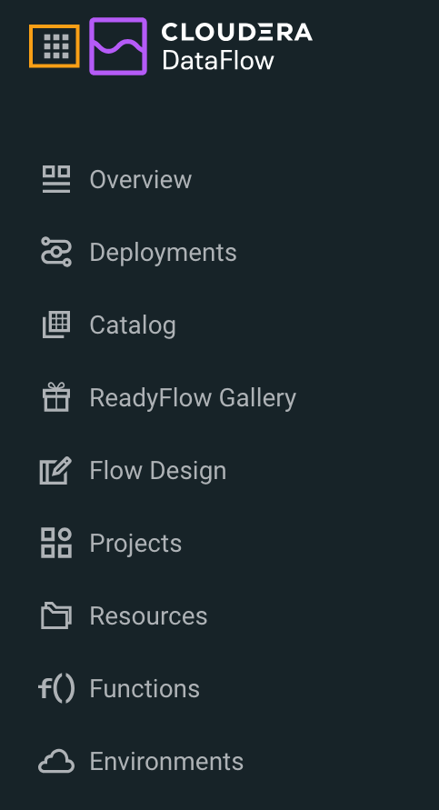

#### 1.2. Select Management Console   
Navigate to the Management Console page by clicking the Management Console tile.

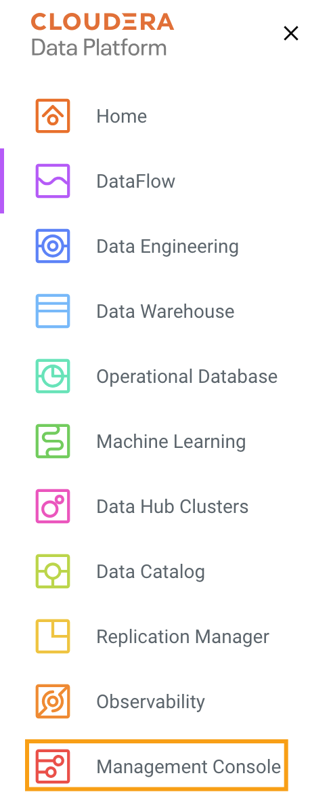

#### 1.3. Select Environment   
Click on the environment. 

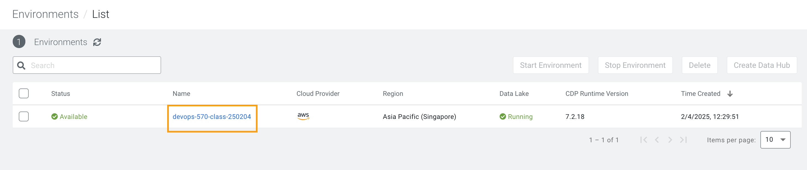

#### 1.4. Select Analytics Data Hub   
Click on the Data Hub cluster for stream analytics. (Ex: edu-ds-analytics-250204) 

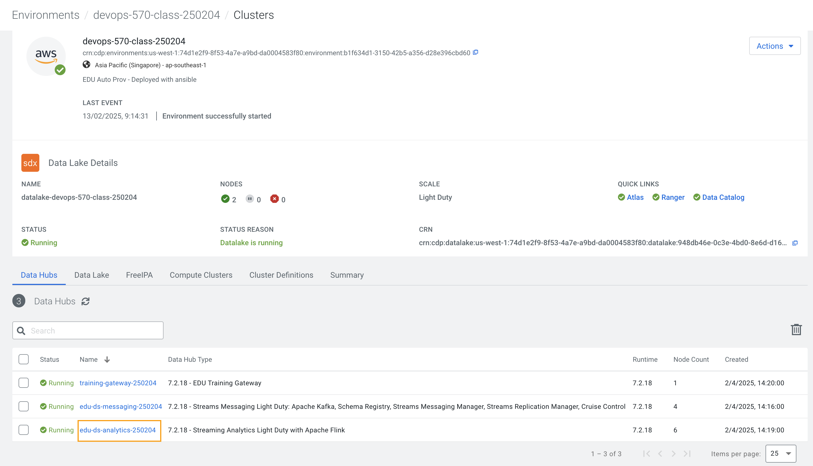

#### 1.5. Click Streaming SQL Console.  
Open the SSB UI by clicking on `Streaming SQL Console`.

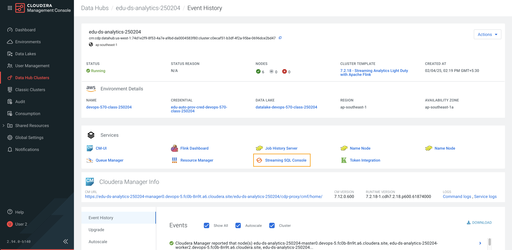

#### 1.6. Click on the User name  
Click on the User name (Ex: `dse_2_250204`) at the bottom left of the screen and select `Manage Keytab`. Make sure you are logged in as the username that was assigned to you.

#### 1.7. Enter Credentials  
Enter your Workload Username under `Principal Name *` and workload password that you had set earlier in the `Password *` field.

Click on **Unlock Keytab.**

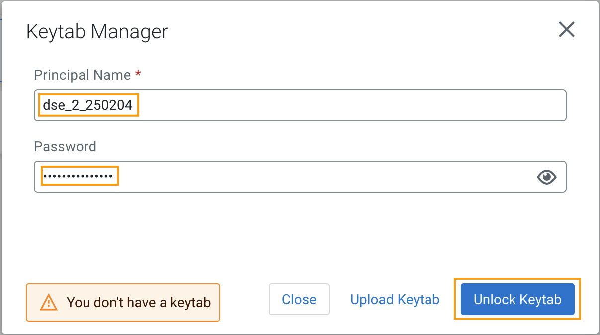

#### 1.8. Close  
A message appears confirming 'Success KeyTab has been unclocked'. 

Click on **X **to close the window. 

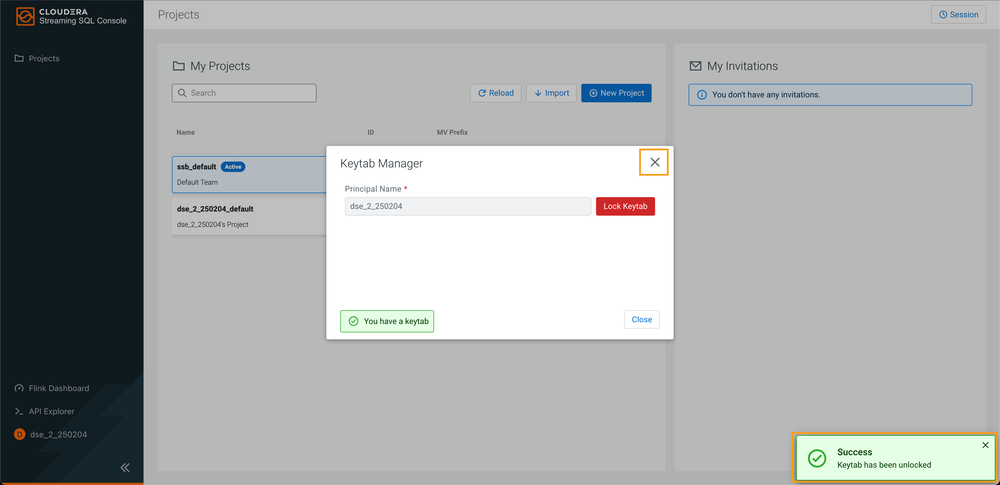

### 2. Reset your KeyTab  

#### 2.1. Click on the User name  
Click on the User name (Ex: `dse_2_250204`) at the bottom left of the screen and select `Manage Keytab`. Make sure you are logged in as the username that was assigned to you.

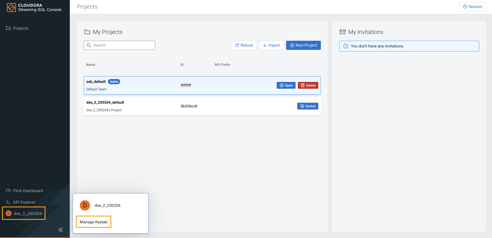

#### 2.2. Verify Keyab  
If you get the following dialog box it means that your Keytab is already `UNLOCKED`. 

Hence, it would be necessary to reset here by locking it and unlocking it again using your newly set workload password.

Click on **Lock Keytab.**

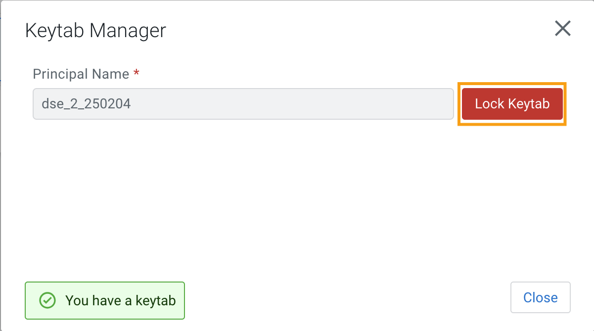

#### 2.3. Review message  
A success message appears confirming Keytab has been locked.

Click on **X **to close the window. 

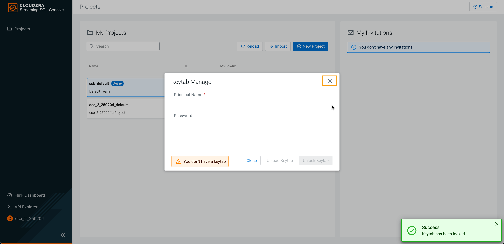

#### 2.4. Click on the User name  
Click on the User name (Ex: `dse_2_250204`) at the bottom left of the screen and select `Manage Keytab`.

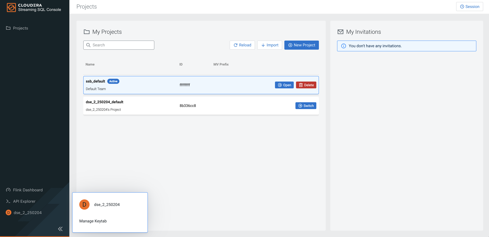

#### 2.5. Enter Credentials   
Enter your Workload Username under `Principal Name *` and workload password that you had set earlier in the `Password *` field.

Click on **Unlock Keytab.**

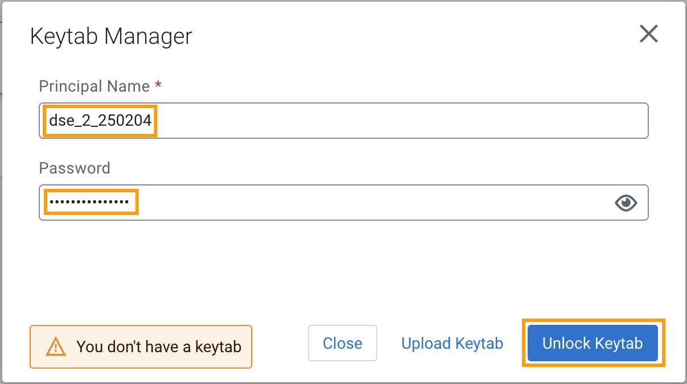

#### 2.6. Close   
A message appears confirming 'Success KeyTab has been unclocked'.

Click on **X **to close the window. 

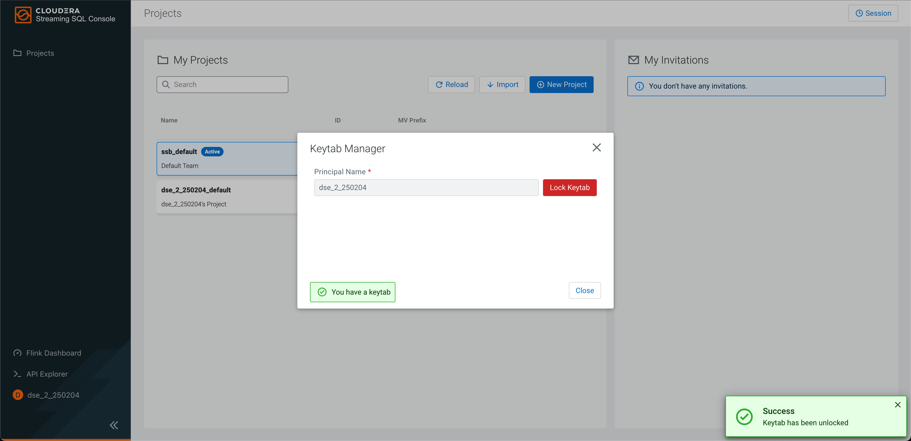

### 3. End of the Exercise   

