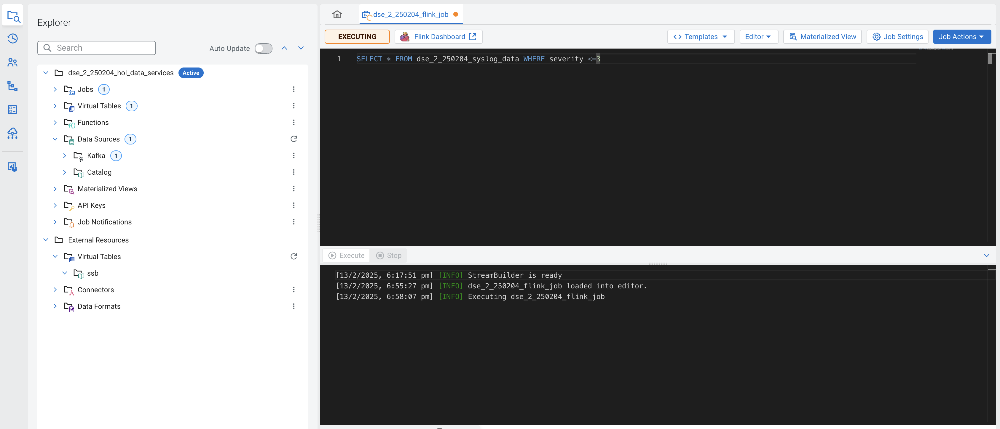

# 02-10 Working on SQL Stream Builder Project

!!! Note 
    The purpose of this workshop is to demonstrate streaming analytic capabilities using SQL Stream Builder. We will leverage the NiFi Flow deployed in CDF-PC from the previous step and demonstrate how to query live data and subsequently sink it to another location. The SQL query will leverage the existing syslog schema in Schema Registry.

### 1. Create a SQL Stream Builder (SSB) Project  <a name="aSIqpnW_Q9TLBZgTL7g4X"></a>

#### 1.1. Click on Menu   <a name="wiO2eJZ1e5oOEgI3s-JHV"></a>
Select the Menu option by clicking on the 9 dots. 


#### 1.2. Select Management Console   <a name="MRhafZVajT8gArFwfO0TS"></a>
Navigate to the Management Console page by clicking the Management Console tile.


#### 1.3. Select Environment   <a name="_SYGbhH3WaR7RcncH8tKu"></a>
Click on the environment. 


#### 1.4. Select Analytics Data Hub   <a name="ZT09fjrwaKiA6rUo1hXUI"></a>
Click on the Data Hub cluster for stream analytics. (Ex: edu-ds-analytics-250204) 


#### 1.5. Click Streaming SQL Console.   <a name="HLBaiwU46HN8vLDyofx2w"></a>
Open the SSB UI by clicking on `Streaming SQL Console`.


#### 1.6. Create a new project  <a name="r6qWiYHhY4-q8jP0_QSFK"></a>
Create a SQL Stream Builder (SSB) Project by clicking **New Project.**


#### 1.7. Fill in the details  <a name="DE_yPuxyV_vHSVA_sjTD5"></a>
Use the following details.

- `Name`: `{user_id}_hol_data_services`.
- (Ex: `dse_2_250204_data_services`).
- `Description`: SSB Project to analyze streaming data. 

Click **Create.**


#### 1.8. Review project  <a name="ylbrZwosQSyE8zudxgSif"></a>
A success message appears confirming 'Project has been successfully created'. 


#### 1.9. Switch project  <a name="fZnjFdLWnCgVksaHXpHl_"></a>
Switch to the created project (Ex: `dse_2_250204_hol_data_services`). 

Click on **Switch**.


#### 1.10. Select Switch Project  <a name="MSJWnfJdpIvFejbuGMV0a"></a>
If pop up comes select `Switch Project`.


#### 1.11. Review Project  <a name="3v9xdRLM_US06yCKDF3-F"></a>
The project page appears. 


### 2. Create Kafka Data Store  <a name="2u2twZnnJGfnQ33PzyMUV"></a>

#### 2.1. Select Data Sources  <a name="I_uWJMoqLnOpCb1lYmUBr"></a>
 Create Kafka Data Store by selecting `Data Sources` in the left pane.


#### 2.2. Click on ellipsis  <a name="ttb2e_cql9FHo8Ayns8Zs"></a>
Click on the three-dotted icon next to `Kafka`


#### 2.3. Select New Kafka Data Source.  <a name="KVEoXhX06j8DY9eL5GUwf"></a>


#### 2.4. Fill in the details  <a name="Hj9XjooHYEHEjLTQNp_sp"></a>
Add the Flow Parameters as below.

- `Name`: `{user-id}_cdp_kafka`.
- (Ex: `dse_2_250204_cdp_kafka`)
- `Kafka Broker Endpoint`: The list of Kafka Brokers previously noted, which is comma separated as shown below.
- **Example**: edu-ds-messaging-250204-corebroker2.devops-5.fc0b-8n9t.a6.cloudera.site:9093,edu-ds-messaging-250204-corebroker0.devops-5.fc0b-8n9t.a6.cloudera.site:9093,edu-ds-messaging-250204-corebroker1.devops-5.fc0b-8n9t.a6.cloudera.site:9093
- `Protocol`: `SASL/SSL`


#### 2.5. Fill in the details  <a name="_2gXfj145LVOK4rXKo9S7"></a>
- `SASL Username`: `workload-username`.
- (Ex: dse_2_250204).
- `SASL Mechanism`: `PLAIN`.
- `SASL Password`: Workload User password set by you earlier in exercise 02-03 Define Workload Password.

Click on **Validate** to test the connections.


#### 2.6. Click Create  <a name="m6s9JmSRsnxExQdsgOCyS"></a>
A message appears confirming Data Source is Valid. 

Click **Create.**


#### 2.7. Review message  <a name="tLCTFm9QmUkHCtauJAlCS"></a>
A success message appears confirming the data source has been saved. 


### 3. Create Kafka Table  <a name="Nz8uiDm5tgQlGOyuLM67d"></a>

#### 3.1. Click on New Kafka Table  <a name="7cbPuCMGleoTkZa8fVYm5"></a>
Create Kafka Table, by selecting `Virtual Tables` in the left pane by clicking on the three-dotted icon (ellipsis) next to it.

#### 

Then click on **New Kafka Table.**


#### 3.2. Configure Kafka Table  <a name="oebKZ4Kn1y9tWzRYvaC4X"></a>
Configure the Kafka Table using the details below.

- `Table Name`: {user-id}_syslog_data.
- (Ex: `dse_2_250204_syslog_data`)
- `Kafka Cluster`: `select the Kafka data source you created previously`.
- (Ex: `dse_2_250204_cdp_kafka`)
- `Data Format`: `JSON`.
- `Topic Name`: `select the topic created in Schema Registry`.

When you select Data Format as AVRO, you must provide the correct Schema Definition when creating the table for SSB to be able to successfully process the topic data. For JSON tables, though, SSB can look at the data flowing through the topic and try to infer the schema automatically, which is quite handy at times. Obviously, there must be data in the topic already for this feature to work correctly.

!!! Note
     SSB tries its best to infer the schema correctly, but this is not always possible and sometimes data types are inferred incorrectly. You should always review the inferred schemas to check if it’s correctly inferred and make the necessary adjustments.

Since you are reading data from a JSON topic, go ahead and click on `Detect Schema` to get the schema inferred. You should see the schema be updated in the `Schema Definition` tab.

Click on **Detect Schema. **


#### 3.3. Review message  <a name="D5VKVgBdqdHxMdEUh1A9Y"></a>
Click OK to close the window.


#### 3.4. Schema is invalid  <a name="4lp-xwS0MkchbHIeJGP8M"></a>
You will also notice that a "Schema is invalid" message appears upon the schema detection.


#### 3.5. Review info  <a name="Emc__gC5qX8xP8pwFweF_"></a>
 If you hover the mouse over the message, it shows the reason.

We will fix this in the next step.


#### 3.6. Enter Properties  <a name="Af9C1X6cdoY2nHfkziEv9"></a>
!!! info 
    Each record read from Kafka by SSB has an associated timestamp column of data type TIMESTAMP ROWTIME. By default, this timestamp is sourced from the internal timestamp of the Kafka message and is exposed through a column called eventTimestamp. However, if your message payload already contains a timestamp associated with the event (event time), you may want to use that instead of the Kafka internal timestamp.

In this case, the syslog message has a field called `timestamp` that contains the timestamp you should use. You want to expose this field as the table’s `event_time` column. To do this, click on the **Event Time tab** and enter the following properties.

- `Use Kafka Timestamps`: `Disable`.
- `Input Timestamp Column`: `timestamp`.
- `Event Time Column`: `event_time`.
- `Watermark Seconds`: `3`.

Now that you have configured the event time column, click on **Detect Schema** again. 


#### 3.7. Review message  <a name="Pj1aVTp_gc6cvdTdisTeZ"></a>
Click OK to close the window.


#### 3.8. Schema is valid  <a name="0wpK52xp-e3tjyZy5AGFL"></a>
You should see the schema turn valid.


#### 3.9. Create Table  <a name="WcAB0VolsF7FqmXlusw7r"></a>
Click the **Create and Review** button to create the table.


#### 3.10. Review the table’s DDL   <a name="E6okkzptOFu2nAf_Zg4_b"></a>
A success message appears confirming table has been created. 

Review the table’s DDL and click **Close**. 


### 4. Create a Flink Job  <a name="8bC2poi4v5mldzn1XhBij"></a>

#### 4.1. Click on New Job  <a name="LfLP4cetgnkjUlAEDYSMg"></a>
Create a Flink Job, by selecting

`Jobs` in the left pane, clicking on the three-dotted icon (ellipsis) next to it. 

Then click on **New Job.**


#### 4.2. Name the Job  <a name="hYrvivBF8wJtn9ckbsgm-"></a>
Give a unique job name (Ex: `dse_2_250204_flink_job`) 

Click **Create**.


#### 4.3. Review job   <a name="_tD4ZDVUdWDfXYf6lhmVy"></a>
A success message appears confirming 'Job has been created'. 


#### 4.4. Execute SELECT query  <a name="QHdVM6yP3K3RSWJv9B23N"></a>
Add the following SQL Statement in the Editor.

```
SELECT * FROM {user-id}_syslog_data WHERE severity <=3

```

Replace user-id with your username.

For ex: SELECT * FROM dse_2_250204_syslog_data WHERE severity <=3

Run the Streaming SQL Job by clicking **Execute.**


#### 4.5. View output  <a name="5FL1AfoMZIRxIdlfCjtnx"></a>
Give. it a couple of minutes for the query to run. 




#### 4.6. Review message  <a name="1C9xrM3HH48UxSLgb76dl"></a>
A success message appears confirming 'Job has been started'. 


#### 4.7. Review Output  <a name="8FzfePB1Nx1yyh753uzng"></a>
In the `Results` tab, you should see syslog messages with severity levels ⇐3.


### 5. End of the Exercise   <a name="ihuSZbXj7IQkvP6V1RzAQ"></a>


