# 03-01 Design Principles for Kubernetes Clusters
### 1. Introduction
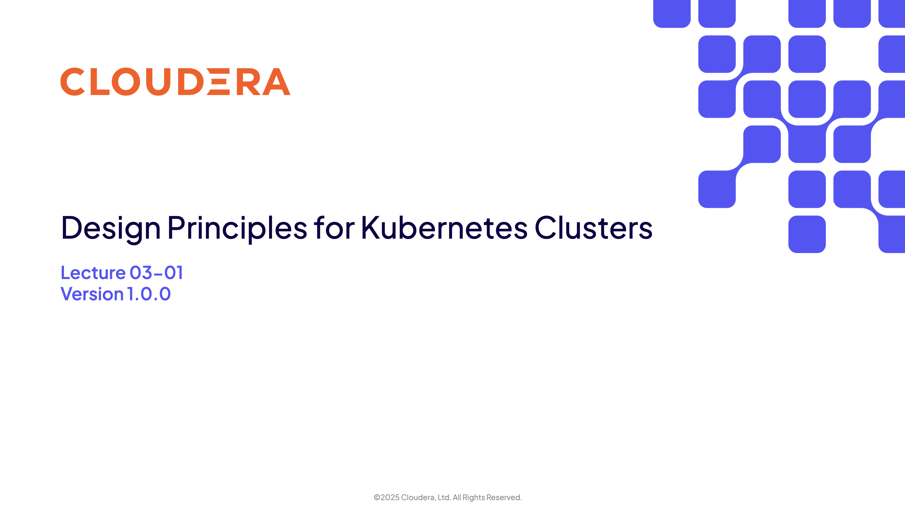
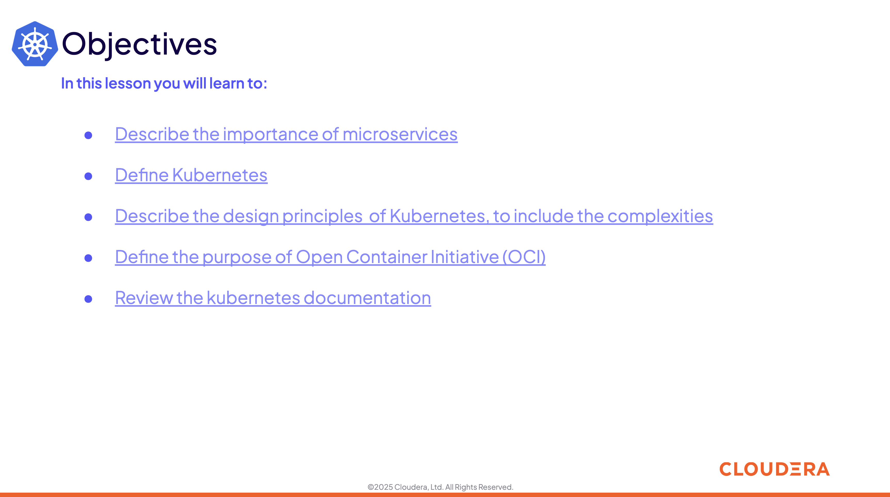
### 2. The Importance of Microservices
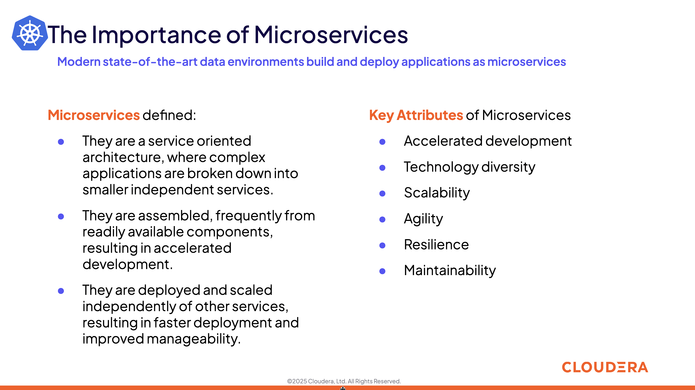

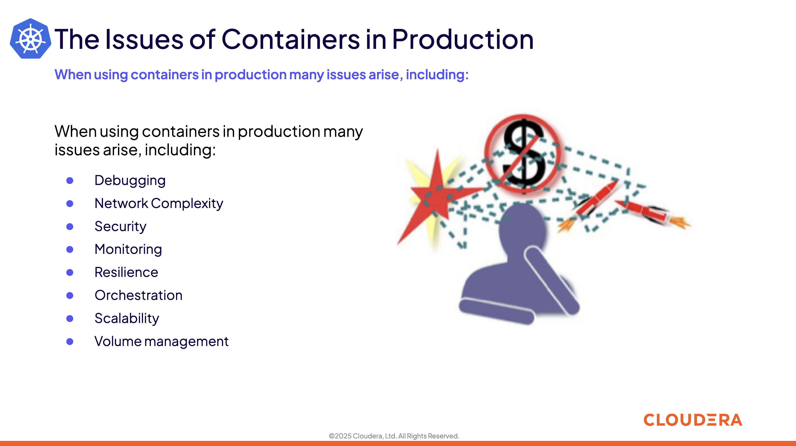
### 3. Orchestration for Containerized Services
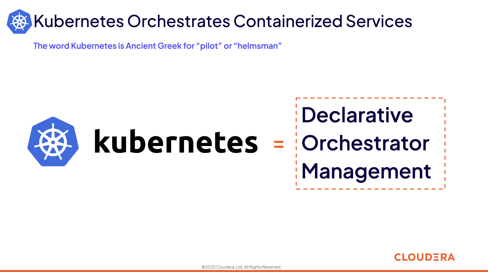
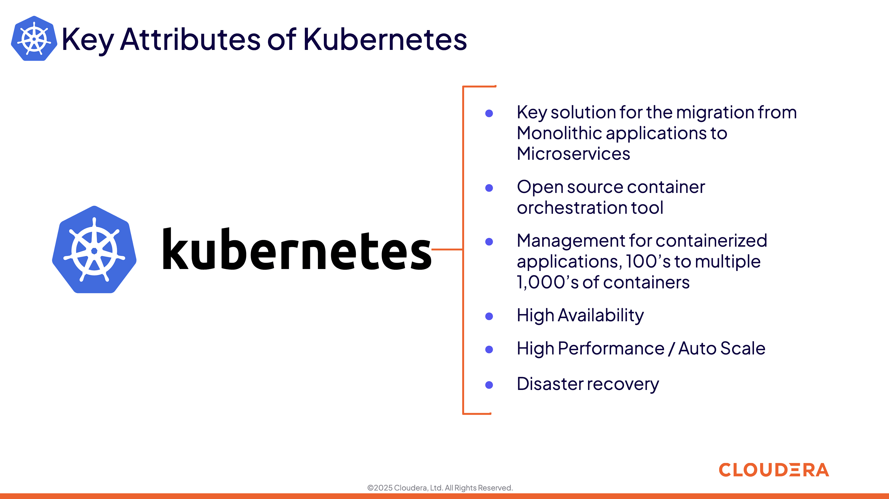
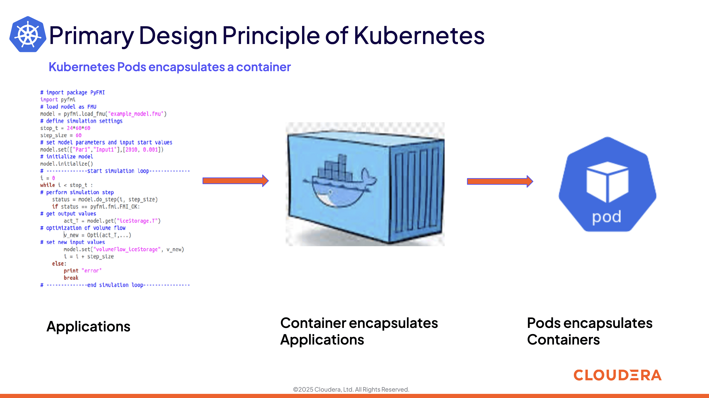
### 4. Design Principles of Kubernetes
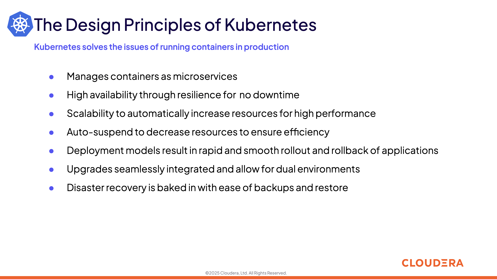
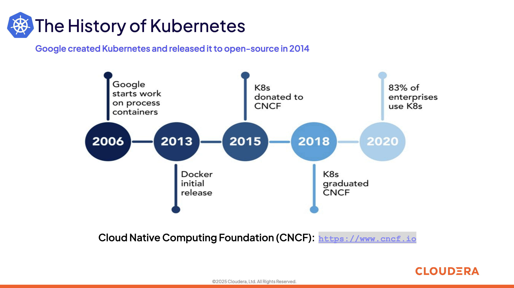
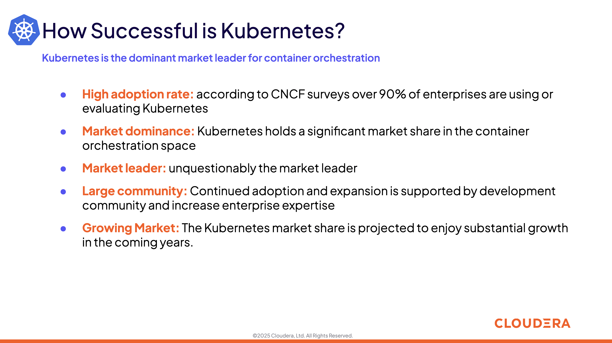
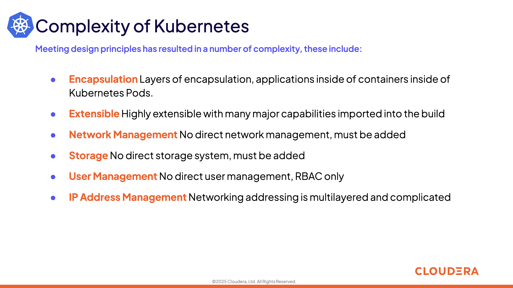
### 5. Open Container Initiave
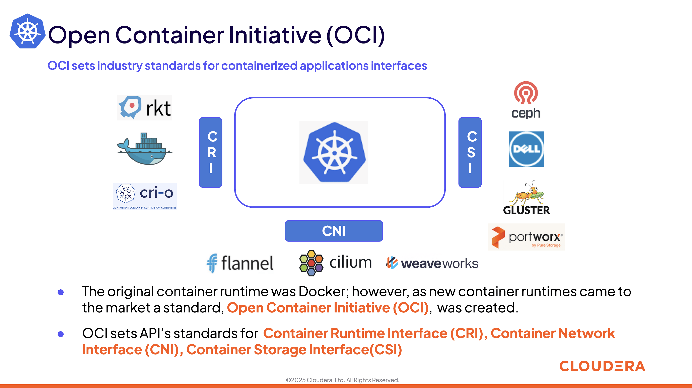
### 6. Kubernetes Documentation
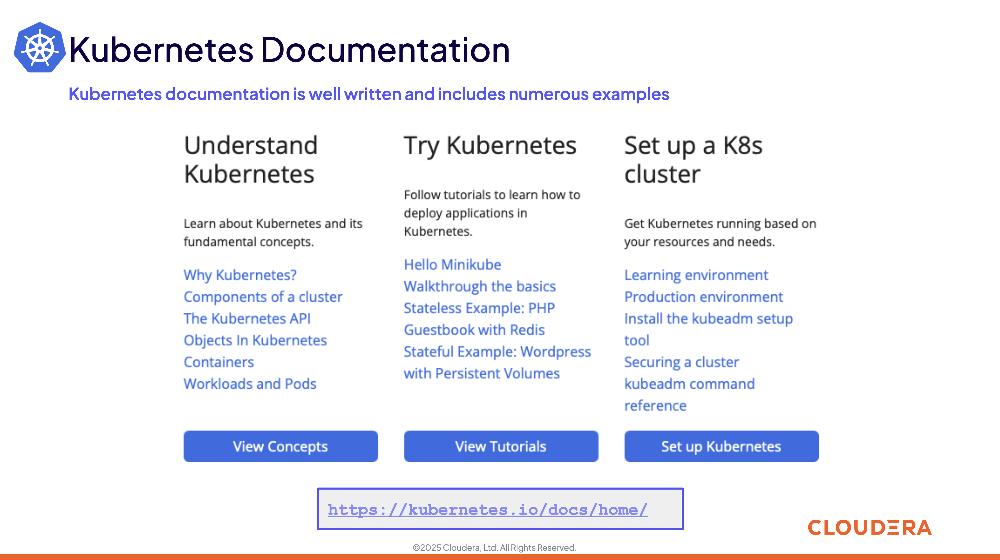
### 7. Summary and Exercise Assignments
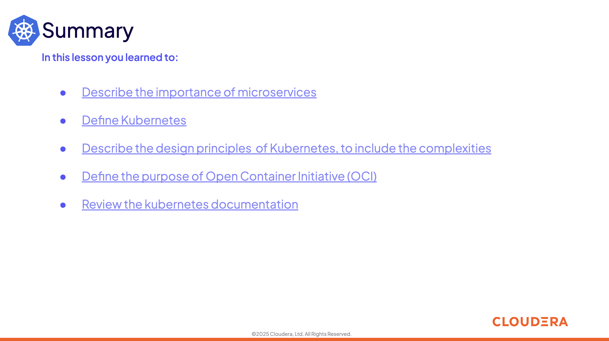
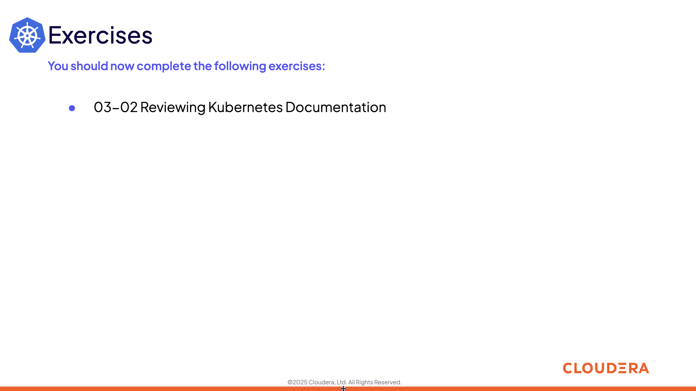
