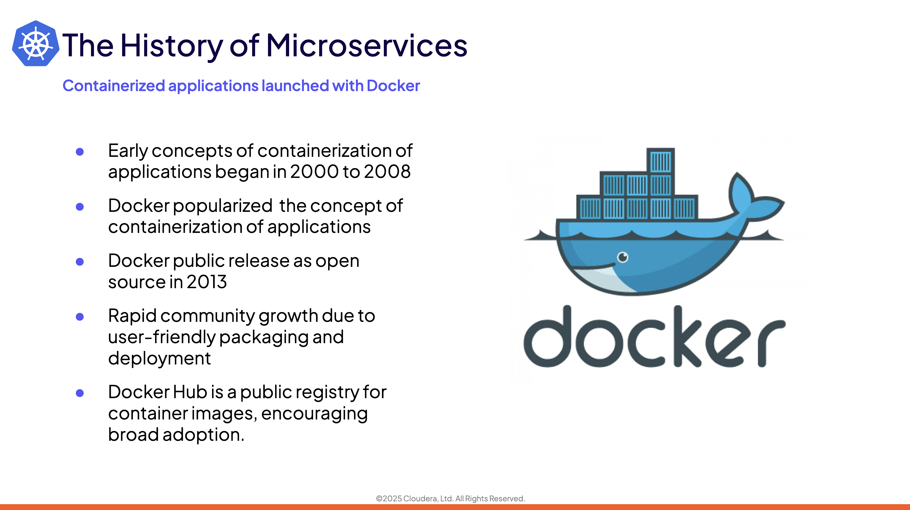

# 03-01 Design Principles for Kubernetes Clusters
### 1. Introduction

### 2. The Importance of Microservices

### 3. Orchestration for Containerized Services

### 4. Design Principles of Kubernetes

### 5. Open Container Initiave

### 6. Kubernetes Documentation

### 7. Summary and Exercise Assignments

