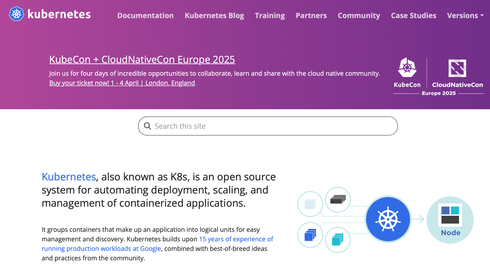
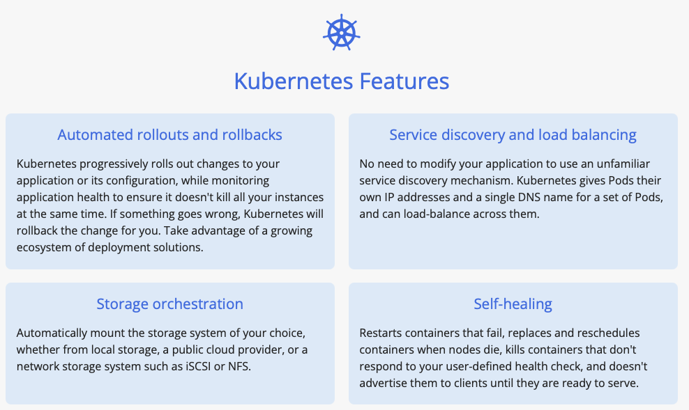
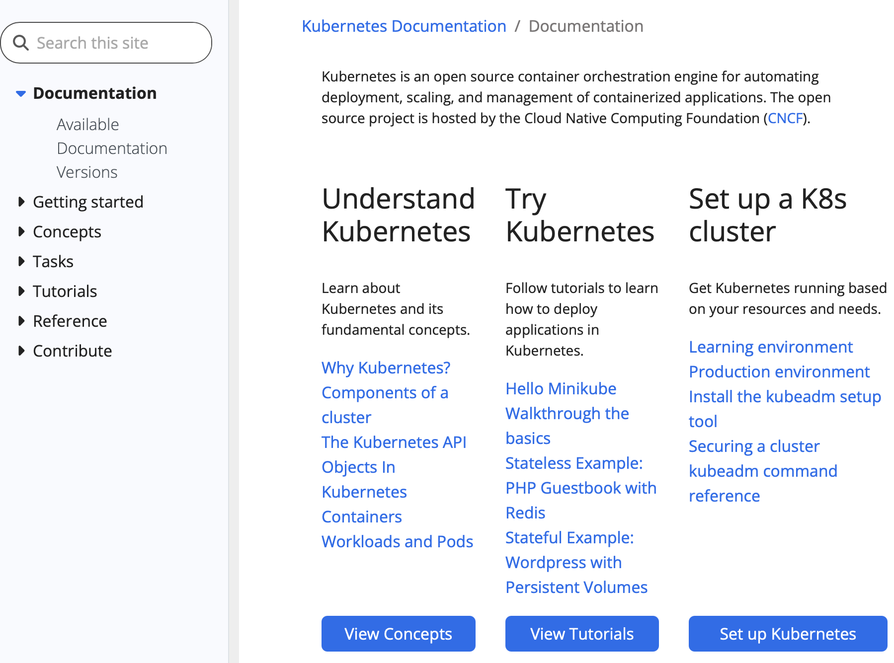
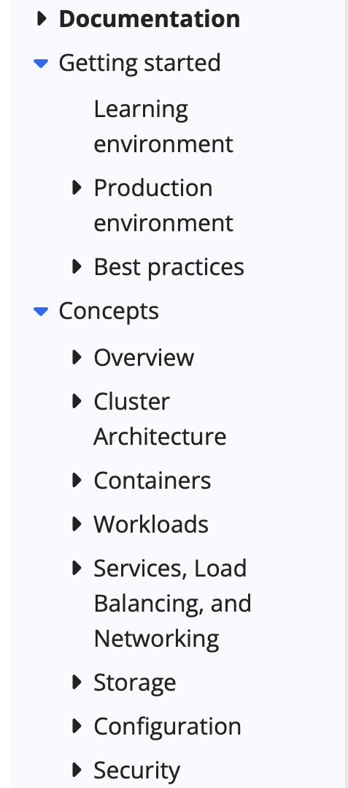
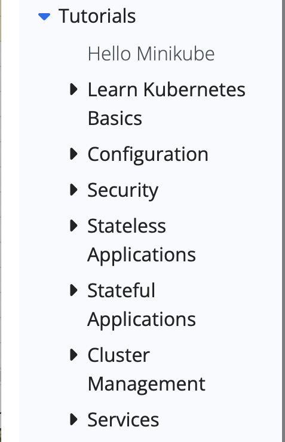
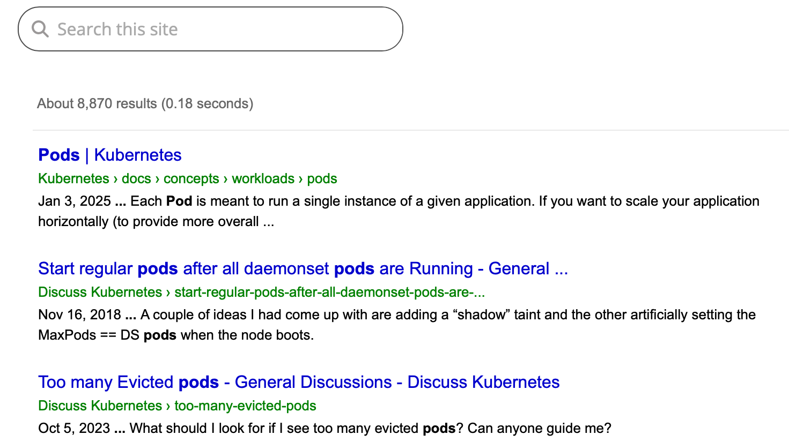
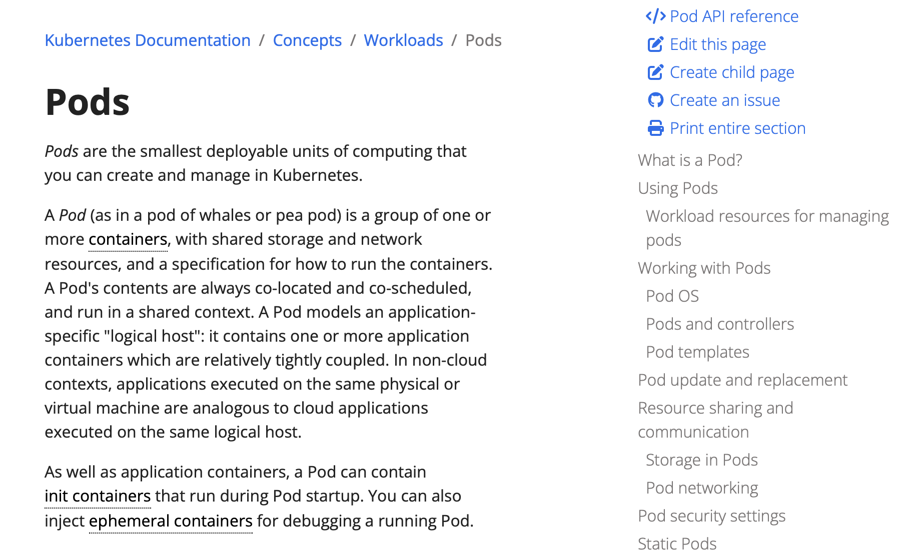
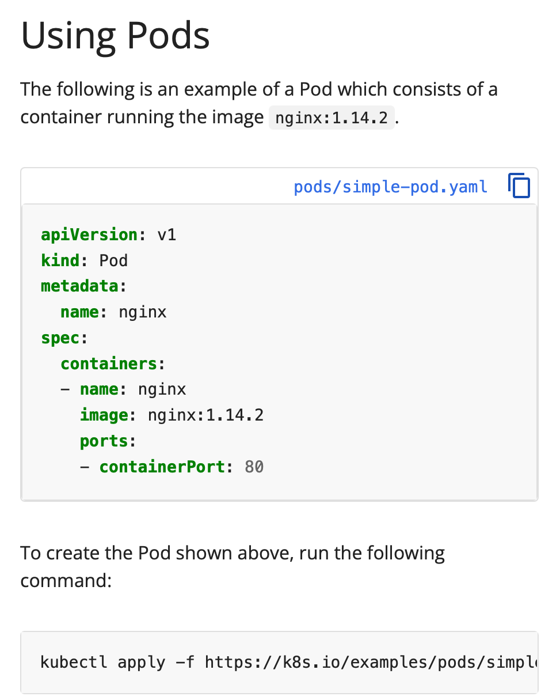
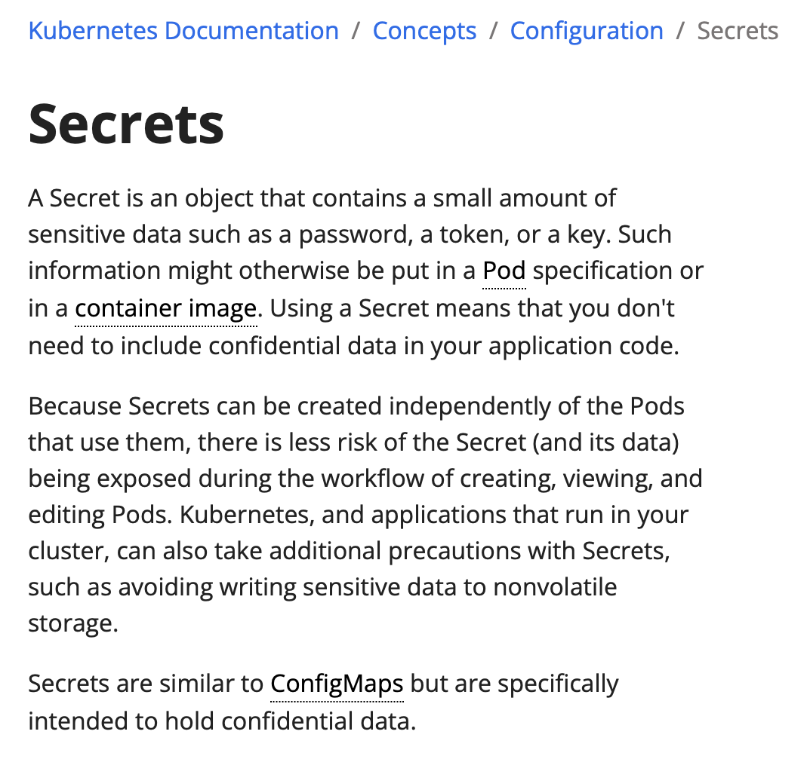

# 03-02 Reviewing Kubernetes Documentation

The purpose of this exercise is to introduce Kubernetes documentation. 

### 1. Click "Planet Scale"
Open your browser and enter this URL.

```
https://kubernetes.io

```




### 2. Click "Kubernetes"
Scroll down and review Kubernetes Features. This is a helpful overview of the primary capabilities of Kubernetes.




### 3. Open Kubernetes Documentation 
Click on Documentation or enter this URL.

```
https://kubernetes.io/docs/home/

```

---

**ℹ️ Bookmark**

This would be a good URL to bookmark

---





### 4. Click "Kubernetes Documentation | Kubernetes"
Kubernetes documentation is of high quality. The documentation is divided into:

- Documentation by version
- Getting Started
- Concepts
- Tasks
- tutorials
- Reference

Open each of the arrow heads and review the subjects.




### 5. Click "Kubernetes Documentation | Kubernetes"
Click open the arrowhead for **Tutorials.** This class covers all of these subjects. Explore the tutorials subjects.




### 6. Click "Search Results | Kubernetes"
The Kubernetes is well indexed. Every page can be quickly found with a search.

Enter **Pods** in the search.




### 7. Click "Pods | Kubernetes"
Click on Pods | Kubernetes

```
https://kubernetes.io/docs/concepts/workloads/pods/

```

Kubernetes documentation is extensive. The Table of Contents in the right hand column is helpful in understanding each subject. The Table of Contents are logical and generally present a subject beginning with an explaination.




### 8. Click "desktop"
Scroll down the page to find Using Pods. Kubernetes presents many example command lines. Kubernetes also includes model code blocks in YAML format. There is a copy and paste icon in the upper right corner of the code block. It is common practice to copy in a code block into your IDE and to then edit it in your IDE.




### 9. Subjects to Review
A list of recommended subjects for those who are new to Kubernetes includes:

- Pods
- Service
- ConfigMaps
- Secrets

Take a few minutes and look these subjects up. Scan through them. Watch for the code blocks as these will be helpful in writing manifest files.




### 10. End of the Exercise


