# 03-03 Building Your First CDE Airflow DAG

We will start with a simple Airflow DAG that executes a Spark CDE Job and a shell command.

We will work with the following artifacts:

- A python file containing Airflow DAG. This is provided under cde_jobs/firstdag.py.
- A pythong file containing a PySpark job. This is provided under cde_jobs/sql.py.

### 1. Create a Spark CDE Job  <a name="tNmbb1VpoTocESgPYL-PS"></a>
Let's create the first CDE Job. 

#### 1.1. Click on Administration  <a name="PqCdSdGy5Su3Bk7jnA0x_"></a>
Navigate to the main menu and select Administration option from the panel. 

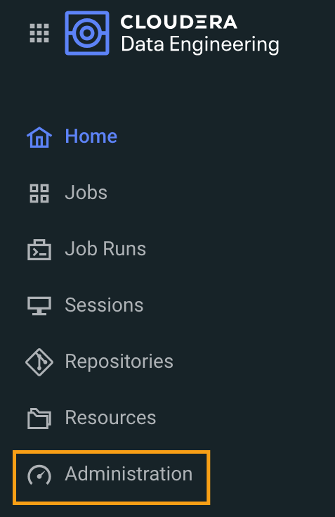


#### 1.2. Review the environment  <a name="u7gwatMosooP7ABKy6UzP"></a>
A CDE service **[CDE-251701] **and a virtual cluster **[VC-251701]**has been created for you. 

In your case, the name would reflect your class ID [CDE-(class ID), VC-(class ID)]. Please make a note of the environment names. 

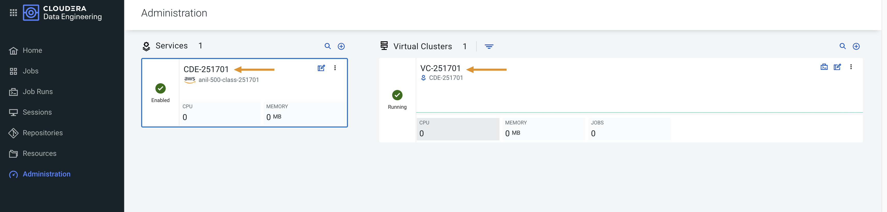


#### 1.3. Click on View Jobs  <a name="jxtn834imAaEVdX827XXR"></a>
Click on the View Jobs button in the Virtual Cluster assigned to you. 

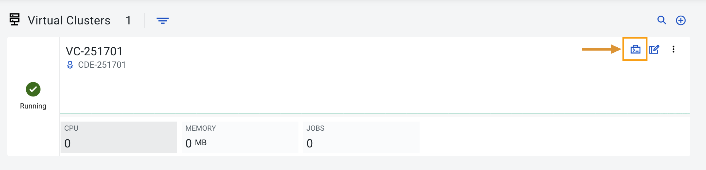


#### 1.4. Click on Create Jobs  <a name="j1FT2VwKWolOnTuz1P0_f"></a>
Let's create our first job. Click on Create Job button. 

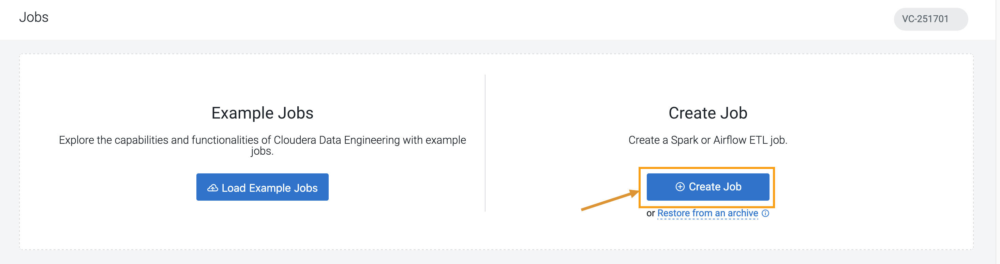


#### 1.5. Fill in the details  <a name="7ujAnKPcC8sEZav79c0MM"></a>
A Create job page opens. In the Create Job page, select the Job Type as Spark 3.2.3.

Name the job as ***sparksql_******YourCDPUsername****.*

!!! Attention
    Replace username with your actual username.

For example: ***sparksql_dse_1_250204***

Select **File** option under Application File.

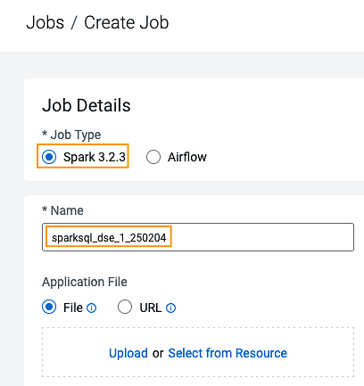


#### 1.6. Click on Upload  <a name="SisWD05ZDp1bW6MWYZhEj"></a>
Click on the Upload button to furnish the script

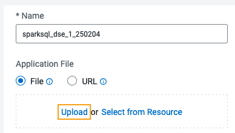


#### 1.7. Browse sql.py  <a name="KiqOpVQGHAl-hrirQdBwD"></a>
From the ***cde_job ***zip file downloaded in the previous exercise, browse and upload ***sql.py***script as your Spark job file.

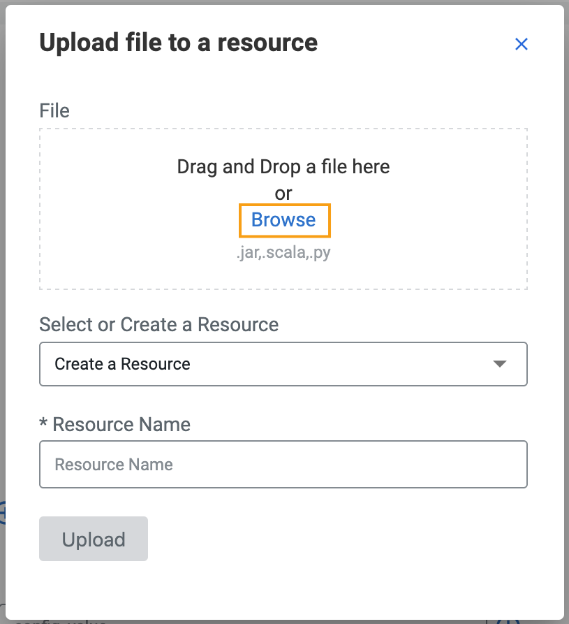


#### 1.8. Create a Resource  <a name="B3cA85iCfFz6GI81LQqSu"></a>
You will be prompted to select a resource. Create a new resource with name ***firstdag_YourCDPUsername***.

!!! Attention
    Replace username with your actual username.

For example: ***firstdag_dse_1_250204***

Resources are repositories inside the Virtual Cluster where you can store files, dependencies, and manage python environments.

> For more info on resources, please visit the [CDE Documentation](https://docs.cloudera.com/data-engineering/cloud/overview/topics/cde-resources.html).

Click on **Upload**

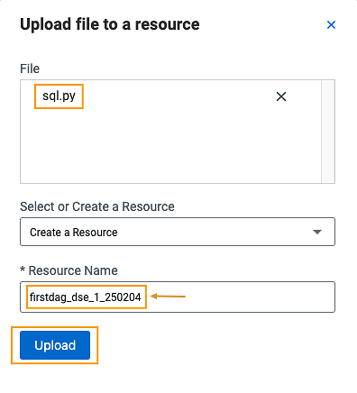


#### 1.9. Select Create  <a name="4fz7S09wmqpe6fD1YUaQk"></a>
At the bottom of the form, make sure to select "**Create**" rather than "Create and Run" by clicking on the down arrow first.

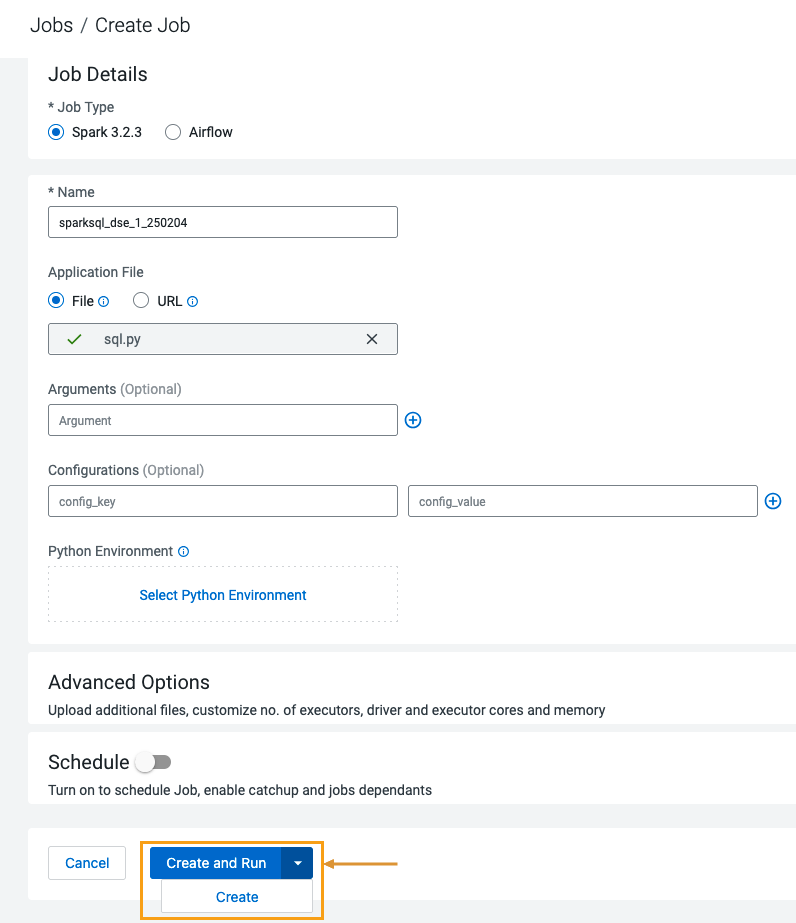


#### 1.10. Review message  <a name="BpJu68wOrk_9yMlINrPpE"></a>
A success message appears confirming job has been created. 

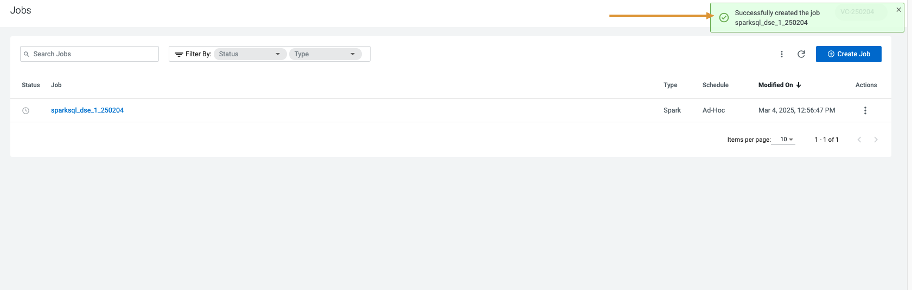


#### 1.11. Review Job  <a name="CbqglehKP1ZpB5k5Twt9P"></a>
The Spark CDE Job is now available in the Jobs UI.

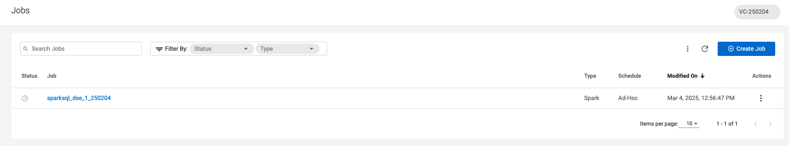


### 2. Review & Edit the Airflow DAG  <a name="z1qvAsRSZLp5skbgapKrQ"></a>
Let's go over the code.

#### 2.1. Open firstdag.py file   <a name="gGkZZp89LeCNwxYeHxRsb"></a>
Open the ***firstdag.py*** file located in the cde_jobs folder downloaded in the previous exercises.

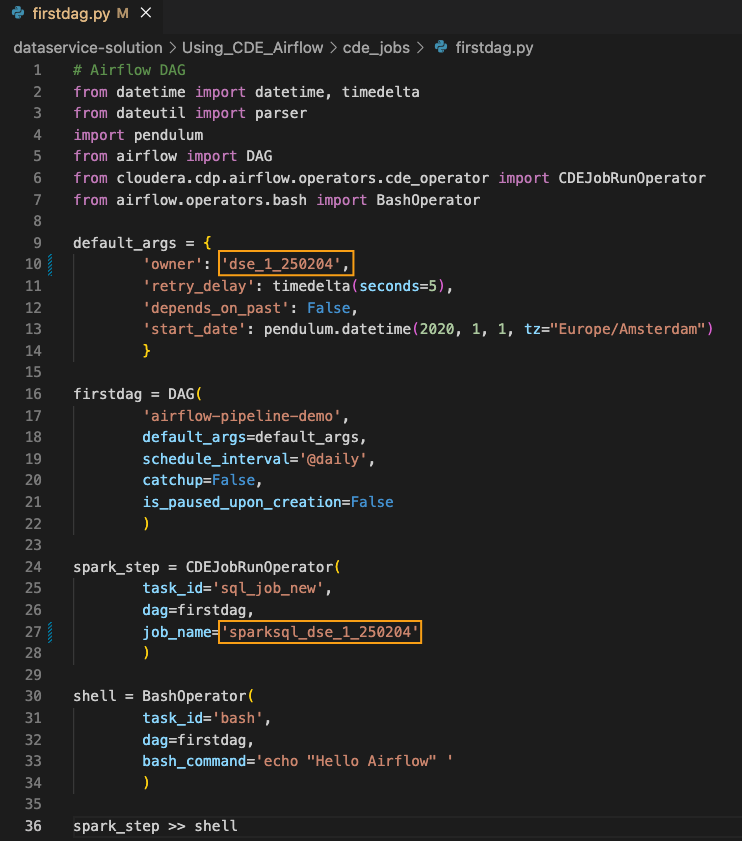


#### 2.2. Import Python modules  <a name="3SIqxWD1xANEbsk_tcyfJ"></a>
Between lines 2 and 7 we import the Python modules needed for the DAG. 

Notice that at line 6 and 7 we import the *CDEJobRunOperator* and *BashOperator*. The *CDEJobRunOperator* was created by Cloudera to support Spark CDE Job. The *BashOperator* is used to perform shell actions inside an Airflow DAG.

```
from datetime import datetime, timedelta
from dateutil import parser
import pendulum
from airflow import DAG
from cloudera.cdp.airflow.operators.cde_operator import CDEJobRunOperator
from airflow.operators.bash import BashOperator

```

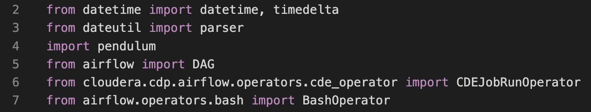


#### 2.3. Declare DAG and arguments  <a name="OC1yPP8gbw0BBkD09FWtE"></a>
Between lines 8 and 22 we declare the DAG and its arguments.

The arguments dictionary includes options for scheduling, setting dependencies, and general execution. For a comprehensive list of DAG arguments please consult [this page](https://airflow.apache.org/docs/apache-airflow/stable/tutorial.html#default-arguments) in the documentation.

Once the arguments dictionary is complete it is passed as an argument to the DAG object instance.

```
default_args = {
        'owner': 'YourCDPUsername',
        'retry_delay': timedelta(seconds=5),
        'depends_on_past': False,
        'start_date': pendulum.datetime(2020, 1, 1, tz="Europe/Amsterdam")
        }

firstdag = DAG(
        'airflow-pipeline-demo',
        default_args=default_args,
        schedule_interval='@daily',
        catchup=False,
        is_paused_upon_creation=False
        )

spark_step = CDEJobRunOperator(
        task_id='sql_job_new',
        dag=firstdag,
    job_name='sparksql_YourCDPUsername'
        )

```


---

**⚠️ Replace Owner and Job Name**

Before moving on, make sure to open the DAG python file in your editor and replace the current value of the 'Owner' with your CDP Username in the default arguments dictionary. 

Also, replace the current value of the 'job_name' with sparksql_YourCDPUsername, set earlier in this exercise, in the spark_step object. 

No other changes are required at this time.

---

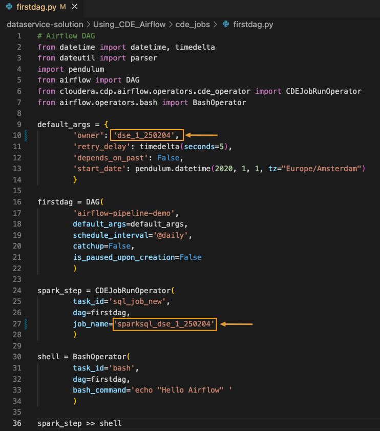


#### 2.4. Declare object  <a name="ayKN4mF4e4PYjaeFsG4xv"></a>
Between lines 24 and 28 an instance of the *CDEJobRunOperator* obect is declared with the following arguments:

- **Task ID**: This is the name used by the Airflow UI to recognize the node in the DAG.
- **DAG**: This has to be the name of the DAG object instance declared at line 16.
- **Job Name**: This has to be the name of the Spark CDE Job created in step 1 above.

```
spark_step = CDEJobRunOperator(
    task_id='sql_job_new',
    dag=firstdag,
    job_name='sparksql_dse_1_250204'
    )

```

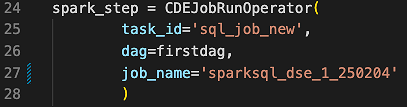


#### 2.5. Declare object  <a name="HsDyODJe3YuN_6WgnhQW6"></a>
Between lines 30 and 34 we declare an instance of the *BashOperator* object with the following arguments:

- **Task ID**: as above, you can pick an arbitrary string value
- **DAG**: This has to be the name of the DAG object instance declared at line 16.
- **Bash Command**: the actual shell commands you want to execute.

Notice that this is just a simple example. You can optionally add more complex syntax with Jinja templating, use DAG variables, or even trigger shell scripts. For more please visit the [Airflow Bash Operator documentation](https://airflow.apache.org/docs/apache-airflow/stable/howto/operator/bash.html).

```
shell = BashOperator(
    task_id='bash',
    dag=firstdag,
    bash_command='echo "Hello Airflow" '
    )

```


#### 2.6. Declare Task Dependencies  <a name="J8uKT93ewiYkVOhxHMSH5"></a>
Finally, at line 36 we declare Task Dependencies. With this statement you can specify the execution sequence of DAG tasks.

```
spark_step >> shell 

```

!!! Important
    Before moving on, make sure to open the DAG python file in your editor and replace the current value of the 'Owner' with your CDP Username in the default arguments dictionary. Also, replace the current value of the 'job_name' with sparksql_YourCDPUsername, set earlier in this exercise, in the spark_step object. No other changes are required at this time.

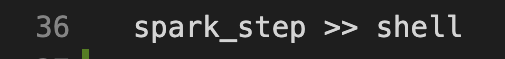


### 3. Running Your First CDE Airflow DAG  <a name="ss6cdR0mFhsGLjf6O5COu"></a>

#### 3.1. Click on Create Job  <a name="uwiX0_uvr0G29xwXWl4PI"></a>
Click on **Create Job** to create a new CDE Job.

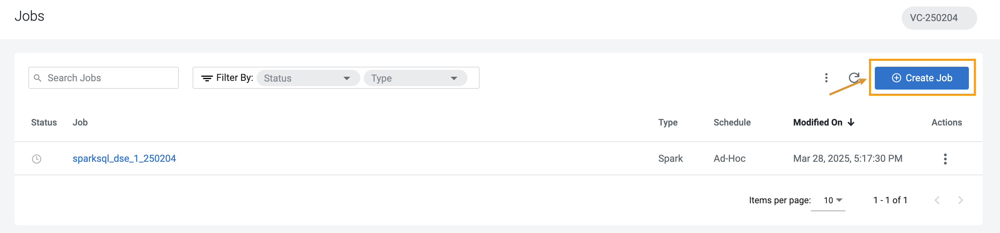


#### 3.2. Fill in the details  <a name="2B5L0rt9pg-SJWiG2en24"></a>
- **Job Type**: Airflow
- **Name**: FirstDag_***YourCDPUsername***
- **Dag File**: File

Click on **Upload**

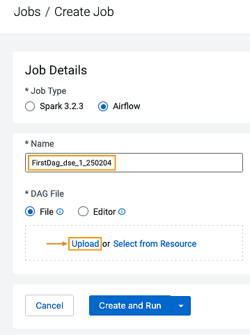


#### 3.3. Upload file to a resource  <a name="WPtcFjS-ZInF8fq3BLrFw"></a>
Upload ***firstdag.py*** to the **firstdag** CDE Resource you created earlier.

> Ensure that you have replaced the current value of the 'Owner' with your CDP Username in the default arguments dictionary. Please refer to Step 2.3 above in this exercise for details. 

Click on **Upload**.

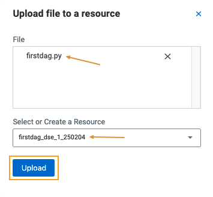


#### 3.4. Select 'Create and Run'  <a name="QXTXiiq2GqnEKOu21KY5f"></a>
Select **Create and Run** button to trigger the job immediately.

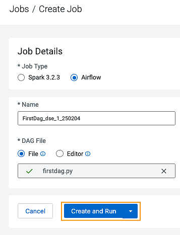


#### 3.5. Job run in progress  <a name="2Px-Q9uc3dzSaRSeTwADk"></a>
Please wait for a min for job to run

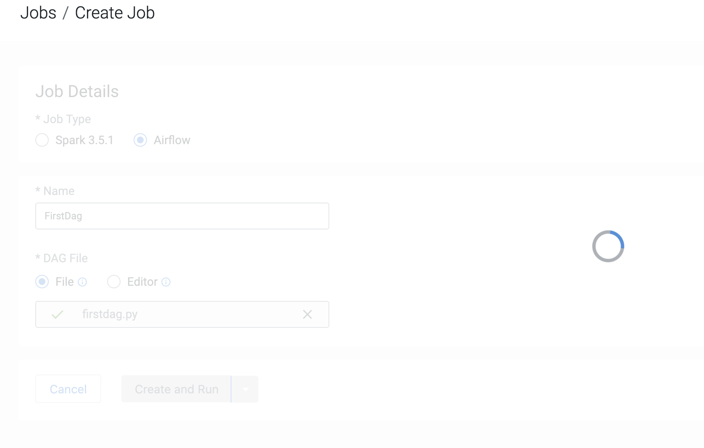


#### 3.6. New run is initiated  <a name="Dc68NtUQ9vbTYwmo3rgAI"></a>
A success message appears confirming that a new run with ID has been initiated. 

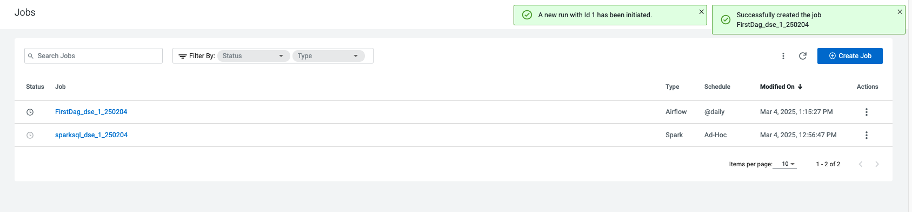


#### 3.7. Review the Jobs in progress  <a name="VEUQJeRa9hVTovmSqeL5n"></a>
Navigate to the CDE Jobs Run page and notice that two CDE Jobs are now in progress. One of them is "*sparksql_dse_1_250204*" (Spark CDE Job) and the other is "*FirstDag_dse_1_250204*" (Airflow CDE Job). The former has been triggered by the execution of the latter. Wait a few moments and allow for the DAG to complete.

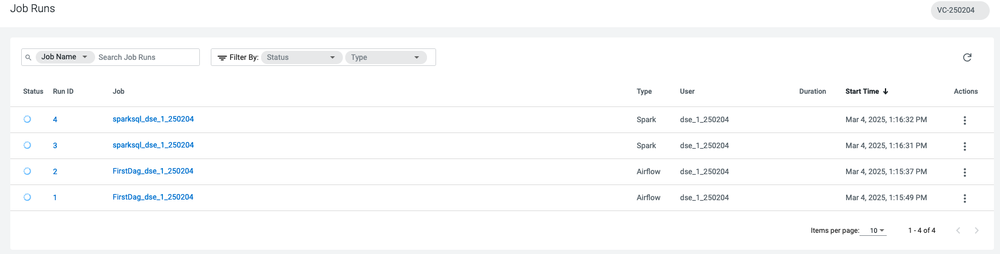


#### 3.8. Click on the FirstDag link  <a name="FmM5vAaVJjcnWCfwv7MHV"></a>
Once the Status column shows the Jobs run as succeeded, click on the "**FirstDag_dse_1_250204**" link to access the Job Run page.

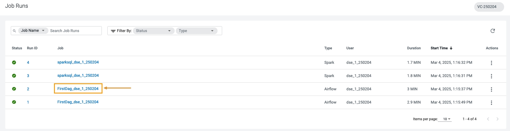


#### 3.9. Select the most recent Run  <a name="p-w_6wXUpNk7RSc_C1v2g"></a>
This page shows each run along with associated logs, execution statistics, and the Airflow UI.

Ensure to select the most recent Run (in the screenshot, the most recent Run ID number is 2)

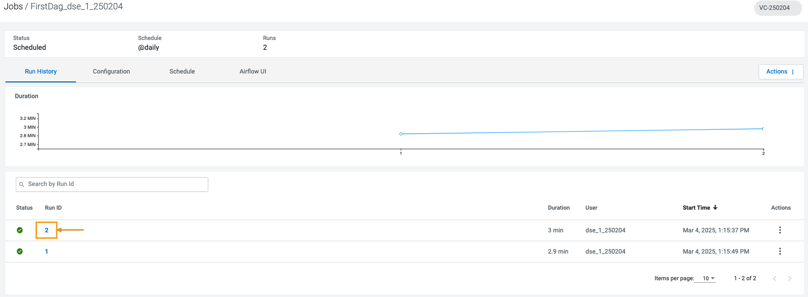


#### 3.10. Review Job Run  <a name="z8ozPuOo1wyCktqu20CSi"></a>
Review the Job Run. Notice the run id in the top section of the page. 

Click on the Airflow UI tab.

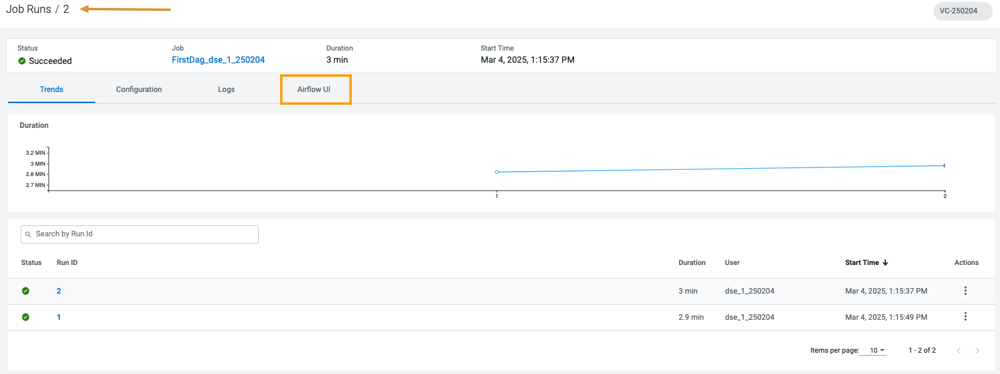


#### 3.11. Review Airflow UI tab  <a name="dIlN5cSwkCV2leD_5VIhc"></a>
The first landing page lists all tasks along with their status. Notice that the DAG ID, Task ID and Operator columns are populated with the values set in the DAG python files. 

Next, click on the back arrow on the left side of the screen to navigate to the Airflow UI DAGs view.

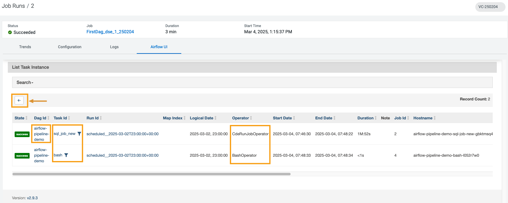


#### 3.12. Explore DAGs view.  <a name="Ytgottr1wi5W7b6ShZ9DH"></a>
From the DAGs view you can:

- Pause/unpause a DAG
- Filter the list of DAGs to show active, paused, or all DAGs
- Trigger, refresh, or delete a DAG
- Navigate quickly to other DAG-specific pages

The DAG name specified in the python file during DAG declaration is **airflow-pipeline-demo**. 

Click on it to open the Airflow UI DAG view to drill down with DAG-specific pages.

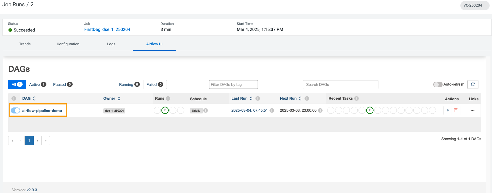


#### 3.13. Review DAG   <a name="BL8ntknLAW48orqNDgjWa"></a>
Here, Airflow provides a number of tabs to increase job observability. Below is a brief explanation of the most important ones.

#### The Tree View

The Tree View tracks DAG tasks across time. Each column represents a DAG Run and each square is a task instance in that DAG Run. Task instances are color-coded depending on success of failure. DAG Runs with a black border represent scheduled runs while DAG Runs with no border are manually triggered.

#### The Graph View

The Graph View shows a simpler diagram of DAG tasks and their dependencies for the selected run. You can enable auto-refresh the view to see the status of the tasks update in real time.

#### The Calendar View

The Calendar View shows the state of DAG Runs overlaid on a calendar.

#### The Code View

The Code View shows the code that is used to generate the DAG. This is the DAG python file we used earlier.

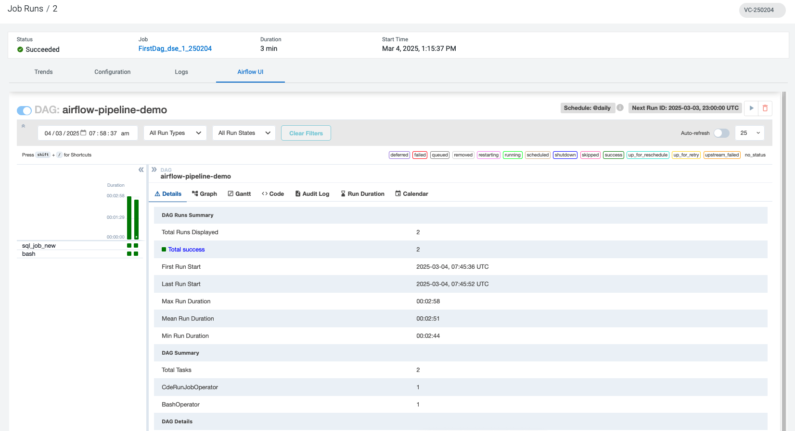


### 4. End of the Exercise  <a name="_1hyIAIfv2ePiCXPQhljv"></a>


