# 03-04 Beyond Airflow for Spark Jobs

### Using the CDWRunOperator

!!! info
    The *CDWRunOperator* was contributed by Cloudera in order to orchestrate CDW queries with Airflow.

### 1. Setup CDW  <a name="BAK6UClQddSRZPx-zbH7j"></a>
Before we can use it in the DAG we need to connect Airflow to CDW. To complete these steps, you must have access to a CDW virtual warehouse. CDE currently supports CDW operations for ETL workloads in Apache Hive virtual warehouses. To determine the CDW hostname to use for the connection:

#### 1.1. Click on Menu  <a name="OlJQdjH32Ob7u9SdUBjFZ"></a>
Select the Menu option by clicking on the 9 dots. 

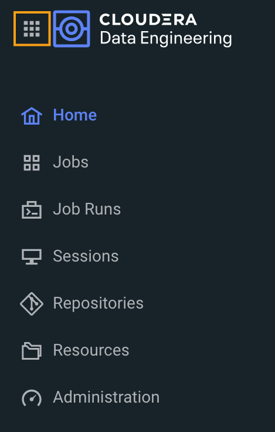


#### 1.2. Select Data Warehouse  <a name="cTKRMc3hRsIZICObI5DAb"></a>
Navigate to the Cloudera Data Warehouse Overview page by clicking the Data Warehouse tile in the Cloudera management console.


#### 1.3. View the environment  <a name="WRDvjTErouo8jsLDTA_Ka"></a>
In the Virtual Warehouses column, find the warehouse you want to connect to. In our case, it would be ***[vw-hive-{class-ID}].***

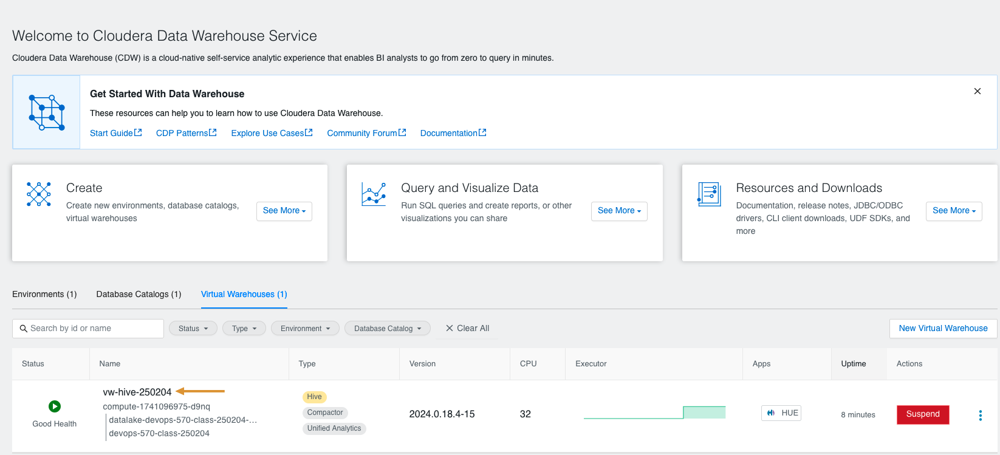


#### 1.4. Notice the status  <a name="h0YfKitzF_M-xCPX4oU3e"></a>
Virtual Warehouse has been configured to auto-suspend every 300 seconds and it will probably go in the stopped state. The stopped status of virtual warehouse will not affect the exercise. 

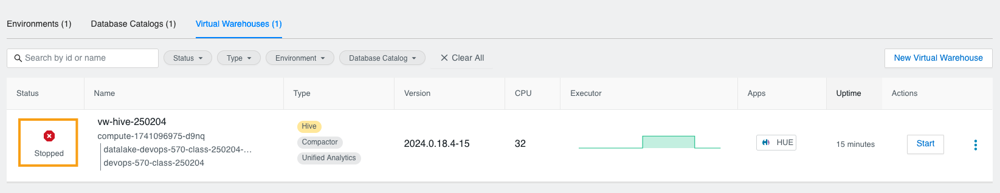


#### 1.5. Copy JDBC URL  <a name="h1fljPfBxtOaFalLaNOSm"></a>
Click the three-dot menu for the selected warehouse, and then click Copy JDBC URL.

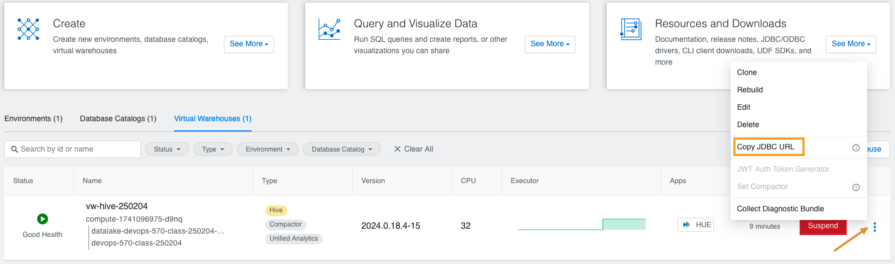


#### 1.6. Note the hostname  <a name="8DZzLORVPKVtlLDD6cNBR"></a>
Paste the URL into a text editor, and make note of the hostname.

For example, starting with the following URL the hostname is shown below:

```
Original URL: jdbc:hive2://hs2-vw-hive-250204.dw-devops-570-class-250204.fc0b-8n9t.cloudera.site/default;transportMode=http;httpPath=cliservice;socketTimeout=60;ssl=true;retries=3;

Hostname: hs2-vw-hive-250204.dw-devops-570-class-250204.fc0b-8n9t.cloudera.site/

```

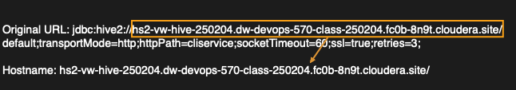


### 2. Setup CDE  <a name="e6OMp8XOa1434Jak6A7aK"></a>

#### 2.1. Click on Menu  <a name="AaJ14znMKfMsY156KdiIs"></a>
Select the Menu option by clicking on the 9 dots.

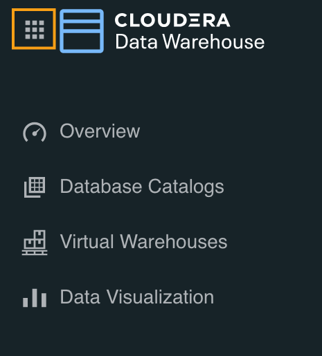


#### 2.2. Select Data Engineering  <a name="0GrcV4pnGC3ImJC2zbALe"></a>
Navigate to the Cloudera Data Engineering Overview page by clicking the Data Engineering tile in the Cloudera management console.

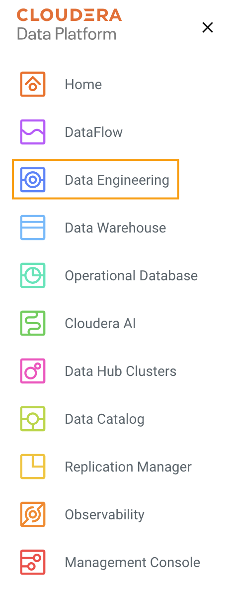


#### 2.3. Select Administration   <a name="SWc1wKBF_0Heh78NxNtHh"></a>
Navigate to the main menu and select Administration option from the panel. 

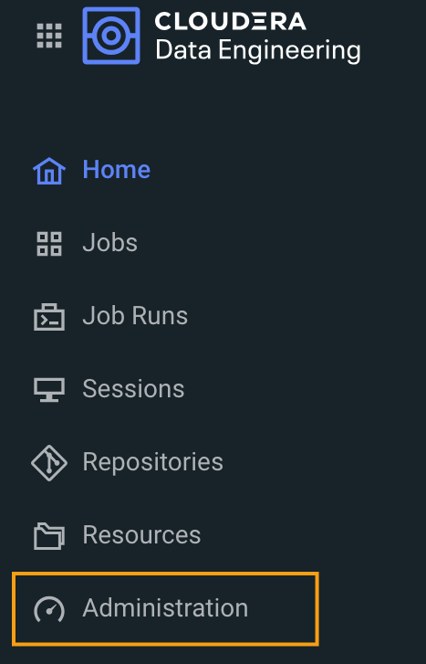


#### 2.4. Click on Cluster Details  <a name="XrY30FlO4innHkzIuFAyK"></a>
In the Virtual Clusters column, click Cluster Details for the virtual cluster.


#### 2.5.  Click AIRFLOW UI  <a name="URBZGGR_8PlzoGXZZb7_4"></a>

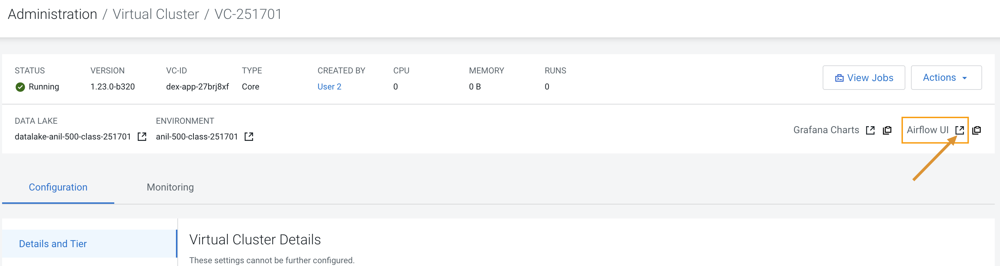


#### 2.6. Click the Connection link   <a name="1Bi3WBJZGK96taJTQm3SL"></a>
From the Airflow UI, click the **Connection link** from the Admin menu.

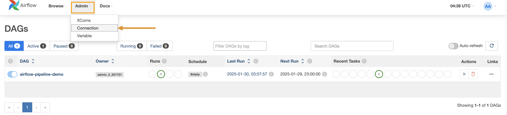


#### 2.7. Add a new record  <a name="3keysaOKLoJO4bZRoe2bH"></a>
Click the plus sign to add a new record.

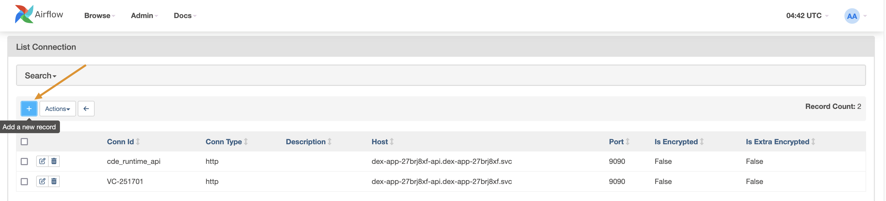


#### 2.8. Fill in the fields  <a name="6Mf4b2tnArL9KIaPxf3ue"></a>
Fill in the following details in the fields

- **Conn Id**: Create a unique connection identifier, such as "***cdw_connection_YourCDPUsername***".
- For ex: ***cdw_connection_dse_1_250204***
- **Conn Type**: Select Hive Client Wrapper.
- **Host**: Enter the hostname from the JDBC connection URL. Do not enter the full JDBC URL.
- **Schema**: default
- **Login**: Enter your workload username
- **Password**: Enter your workload password.

Click **Save**.

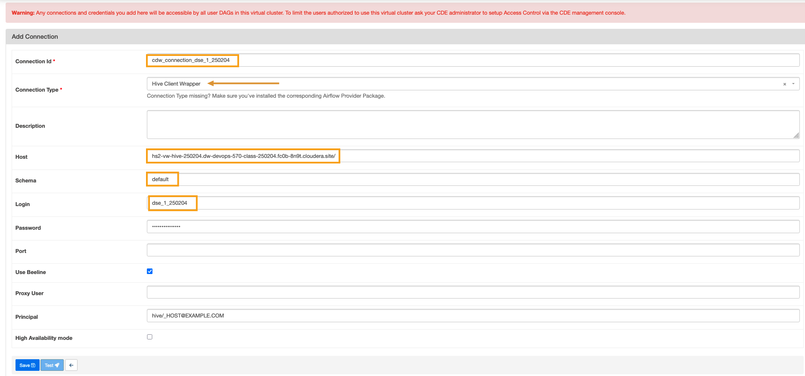


#### 2.9. Review record  <a name="q4JlgEyf8HZ26l5ELqNGB"></a>
!!! success
    A success message appears confirming a new row being added. 

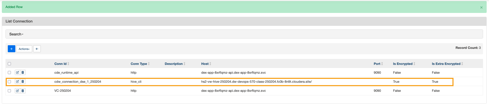


### 3. Review the DAG Python file  <a name="S_IgySF9IVFs2yF-Lj2cs"></a>
Now you are ready to use the *CDWOperator* in your Airflow DAG. In the cde_jobs/ directory, a copy of "firstdag.py" has been made and named "cdw_dag.py" with the following additions. 

#### 3.1. Import Operator  <a name="jZXBhJJI0jE-so66muv75"></a>
At the top, an Operator has been imported along with other import statements.

```
from cloudera.cdp.airflow.operators.cdw_operator import CDWOperator

```

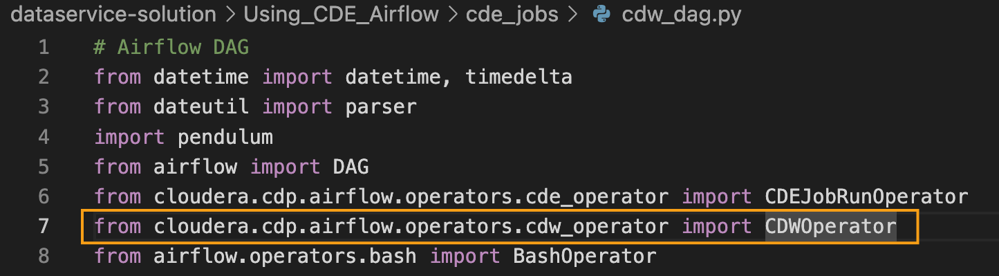


#### 3.2. Add Object  <a name="jzx32dIxU0_F-Yen7AN6T"></a>
At the bottom of the file an instance of the *CDWOperator* object has been added.

```
cdw_query = """
show databases;
"""

dw_step3 = CDWOperator(
  task_id='dataset-etl-cdw',
  dag=example_dag,
  cli_conn_id='cdw_connection_YourCDPUsername',
  hql=cdw_query,
  schema='default',
  use_proxy_user=False,
  query_isolation=True
)

```

Notice that the SQL syntax run in the CDW Virtual Warehouse is declared as a separate variable and then passed to the Operator instance as an argument.


#### 3.3.  Update task dependencies  <a name="0heRdPE7hGmHBip39kDEU"></a>
Task dependencies have been updated to include "dw_step3":

```
spark_step >> shell >> dw_step3

```

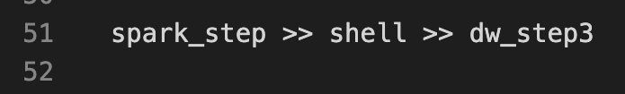


#### 3.4. Update variables  <a name="SkeVzXaO_KCWQFXVPDXjE"></a>
DAG names are stored in Airflow and must be unique. Therefore, the variable name of the DAG object instance has been changed to "airflow_cdw_dag" and the DAG ID to "dw_dag" as shown below.

```
airflow_cdw_dag = DAG(
    'dw_dag',
    default_args=default_args,
    schedule_interval='@daily',
    catchup=False,
    is_paused_upon_creation=False
    )

```

Notice the new DAG variable needs to be updated in each Operator as well. The completed DAG file is included in the cde_jobs folder for your convenience.

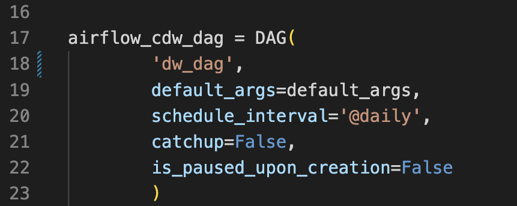


#### 3.5. Replace Owner  <a name="uIe3i6DNRzSPRFuzOeRHv"></a>
Before moving on, make sure to replace the current value of the 'Owner' with your ***Y******ourCDPUsername*** in the default arguments dictionary.

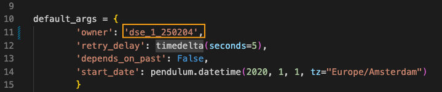


#### 3.6. Replace Spark job name  <a name="ggYl8bC1Q9UtN9f9G7ISZ"></a>
Before moving on, make sure to replace the current value of the 'job_name' with ***sparksql_YourCDPUsername*** in spark_step block.


#### 3.7. Replace CLI Connection ID  <a name="dfkuly_swXZqhcSdkw8Qf"></a>
Before moving on, make sure to replace the current value of the 'cli_conn_id' with the value ***cdw_connection_YourCDPUsername ***used while creating the connection. No other changes are required at this time.


### 4. Create a new Airflow CDE Job  <a name="XtDT7Cc9nlcD5XqEL-U98"></a>

#### 4.1. Select Jobs  <a name="U35AKXNySM8FgSezj4_6H"></a>
Navigate to the Jobs page by clicking on the **Jobs** in the main panel.


#### 4.2. Click on Create Job  <a name="sgOn7UGHNrYDzx_OGRt_t"></a>
Click on **Create Job** to create a new CDE Job.

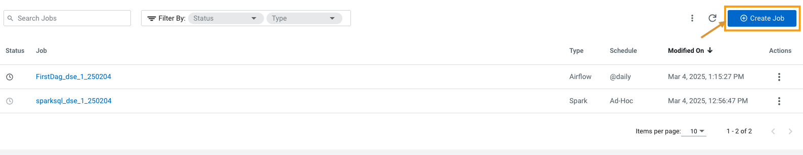


#### 4.3. Fill in the details  <a name="jeWEho-QOGYYYf44s0Rkn"></a>
- **Job Type**: Airflow
- **Name**: CDWDag_***YourCDPUsername***
- **Dag File**: File

Click on **Upload**

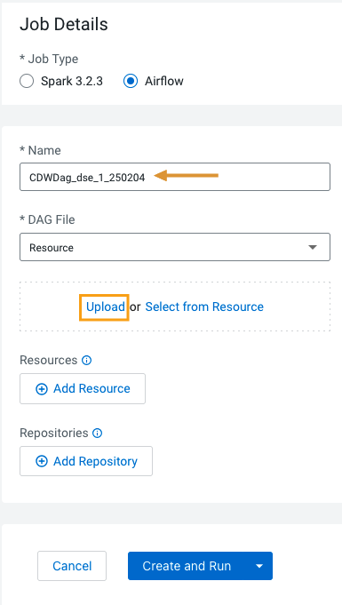


#### 4.4. Upload file to a resource  <a name="hyjGdHihXsnoLc2K_Bshy"></a>
Upload ***cdw_dag.py*** to the **firstdag** CDE Resource you created earlier.

> Ensure that you have replaced the current value of the 'Owner' with your CDP Username in the default arguments dictionary. Please refer to Step 2.3 in the previous exercise for details. 

Click on **Upload**.

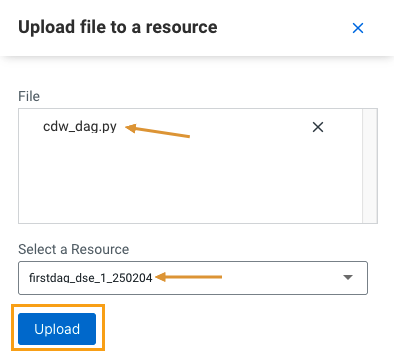


#### 4.5. Select 'Create and Run'  <a name="h73kHlT9qZ_FAIdJBoElc"></a>
Select **Create and Run** button to trigger the job immediately.

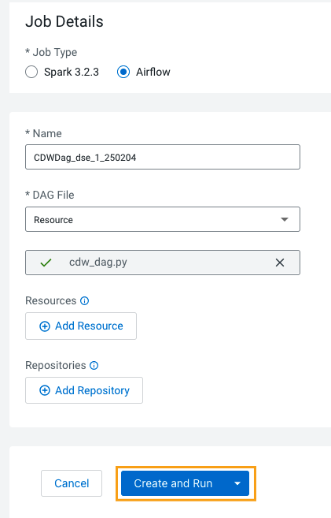


#### 4.6. Job run in progress  <a name="BsMBrCdDE2FwHp0lnFYW3"></a>
Please wait for a min for job to run

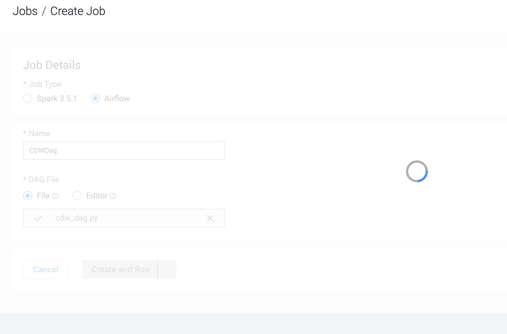


#### 4.7. New run is initiated  <a name="hb3FOZQ3JlTUTmZdrBv4t"></a>
A success message appears confirming that a new run with ID has been initiated. 

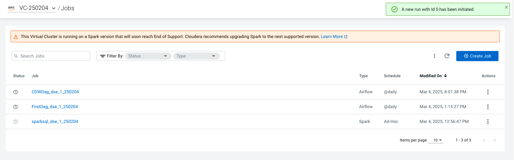


#### 4.8. Review the Jobs in progress  <a name="wETw2hyYbCm3iRTZOU-0P"></a>
Notice that two CDE Jobs are now in progress. One of them is "*sparksql_dse_1_250204*" (Spark CDE Job) and the other is "*CDWDag_dse_1_250204*" (Airflow CDE Job). The former has been triggered by the execution of the latter. Wait a few moments and allow for the DAG to complete.

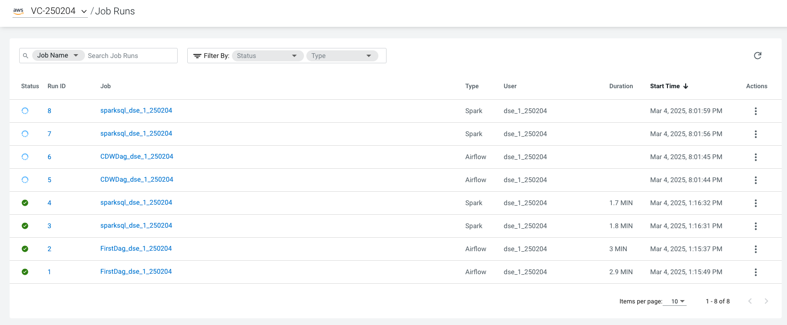


#### 4.9. Click on the Dag link  <a name="1qVzy244Q3j7slwfZwKaC"></a>
Once the Status column shows the Jobs run as succeeded, click on the "**CDWDag_dse_1_250204**" link to access the Job Run page.

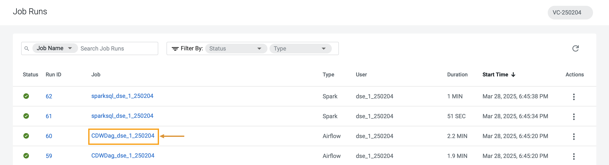


#### 4.10. Select the most recent Run  <a name="UvMAEYDLn-C8l1WU8c9ZM"></a>
This page shows each run along with associated logs, execution statistics, and the Airflow UI.

Ensure to select the most recent Run (in the screenshot, the most recent Run ID number is 60)

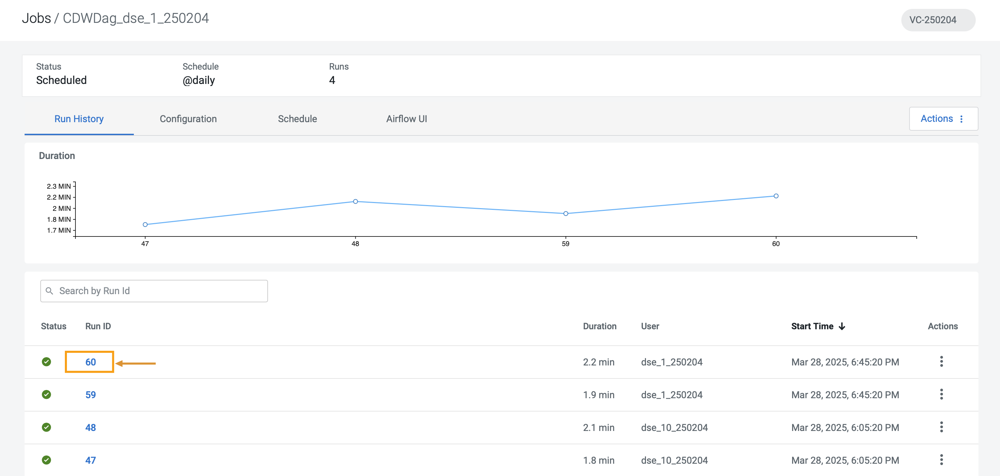


#### 4.11. Review Job Run  <a name="EG15MdiDxFWMOxm7jsjeW"></a>
Review the Job Run. Notice the run id in the top section of the page. 

Click on the Airflow UI tab.

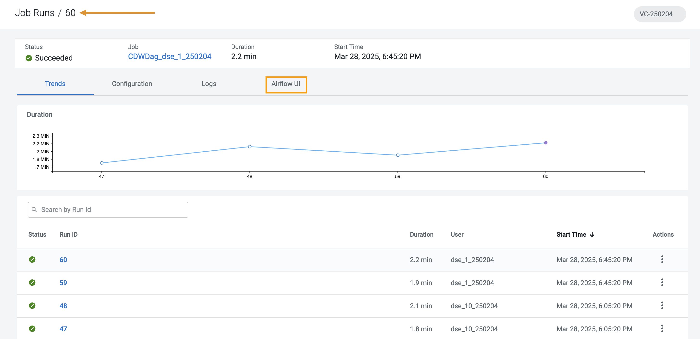


#### 4.12. Review Airflow UI tab  <a name="rFIZRrrRHiMb1bn71TBVO"></a>
The first landing page lists all tasks along with their status. Notice that the DAG ID, Task ID and Operator columns are populated with the values set in the DAG python files. 

Next, click on the back arrow on the left side of the screen to navigate to the Airflow UI DAGs view.

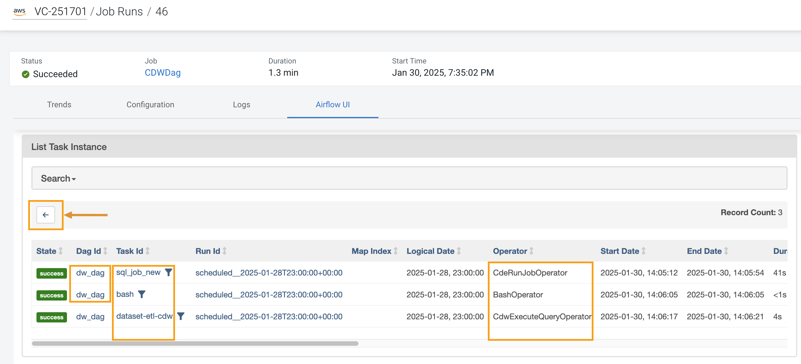


#### 4.13. Explore DAGs view.  <a name="amRG0W8L7-QGdSIDeKF-k"></a>
From the DAGs view you can:

- Pause/unpause a DAG
- Filter the list of DAGs to show active, paused, or all DAGs
- Trigger, refresh, or delete a DAG
- Navigate quickly to other DAG-specific pages

The DAG name specified in the python file during DAG declaration is **dw_dag**.

Click on it to open the Airflow UI DAG view to drill down with DAG-specific pages.

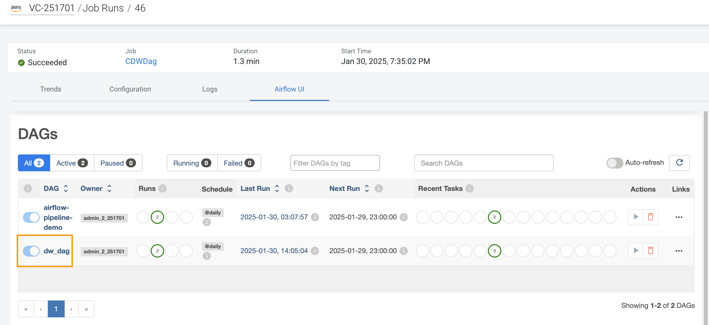


#### 4.14. Review DAG   <a name="JKq1__Q5aYI0SFwhCXE1s"></a>
Here, Airflow provides a number of tabs to increase job observability. Open the Tree View and validate that the job has succeeded.

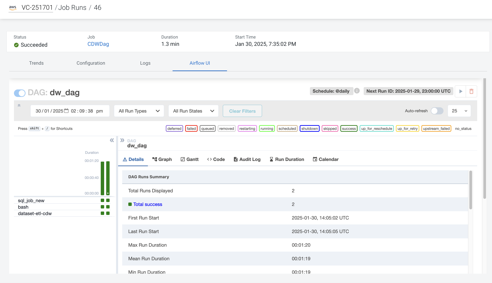


### 5. Printing Context Variables with the BashOperator  <a name="nMiCf2xLR1Pp1rAKusSl2"></a>
!!! info 
    When Airflow runs a task, it collects several variables and passes these to the context argument on the execute() method. These variables hold information about the current task.

Open the "**bash_dag.py**" file and examine the contents. Notice that at lines 52-56 a new instance of the BashOperator has been declared with the following entries:

```
also_run_this = BashOperator(
    task_id='also_run_this',
    dag=bash_airflow_dag,
    bash_command='echo "yesterday={{ yesterday_ds }} | today={{ ds }}| tomorrow={{ tomorrow_ds }}"',
)

```

Above we printed the "yesterday_ds", "ds" and tomorrow_ds" dates. There are many more and you can find the full list [here](https://airflow.apache.org/docs/apache-airflow/stable/macros-ref.html#default-variables).

Variables can also be saved and reused by other operators. We will explore this in the section on XComs.

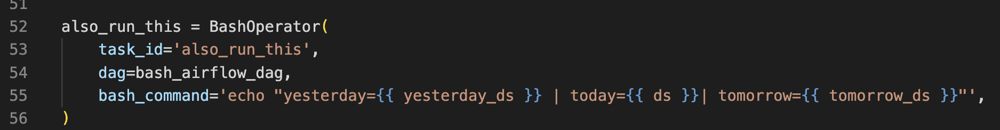


### 6. Review the DAG python file  <a name="7SujSS9ENHgh27rc9E41G"></a>
Now you are ready to use the *CDWOperator* in your Airflow DAG. In the cde_jobs/ directory, a copy of "cdw_dag.py" has been made and named "py_dag.py" with the following additions.

#### 6.1. Python Operator  <a name="e-sO5tsnn_1CcXWLkSVTL"></a>
Lines 60-67 in "py_dag.py" show how to use the operator to print out all Conext Variables in one run.

```

def _print_context(**context):
   print(context)
 
print_context = PythonOperator(
    task_id="print_context",
    python_callable=_print_context,
    dag=dag,
)

```

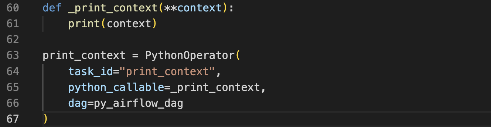


#### 6.2. Replace Owner  <a name="EbVglcF5bdO2DdIXwPFeH"></a>
Before moving on, make sure to replace the current value of the 'Owner' with your ***Y******ourCDPUsername*** in the default arguments dictionary.


#### 6.3. Replace Spark job name  <a name="SqmO0_CM5-OtIcK_TgEzH"></a>
Before moving on, make sure to replace the current value of the 'job_name' with ***sparksql_YourCDPUsername*** in spark_step block.

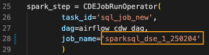


#### 6.4. Replace CLI Connection ID  <a name="pS2tG_fbPxKHZSbLpFbe4"></a>
Before moving on, make sure to replace the current value of the 'cli_conn_id' with the value ***cdw_connection_YourCDPUsername ***used while creating the connection. No other changes are required at this time.


### 7. Using the Python Operator  <a name="L9SJ1JcqPL5iGzOqYWAvQ"></a>
!!! info 
    The *PythonOperator* allows you to run Python code inside the DAG. This is particularly helpful as it allows you to customize your DAG logic in a variety of ways.

The *PythonOperator* requires implementing a callable inside the DAG file. Then, the method is called from the operator.

#### 7.1. Select Jobs   <a name="-sx33gA2EDMSAcFJfNcYl"></a>
Navigate to the Jobs page by clicking on the **Jobs** in the main panel.


#### 7.2. Click on Create Job  <a name="azDqGj-WjpLvMJGS3CI4L"></a>
Click on **Create Job** to create a new CDE Job.

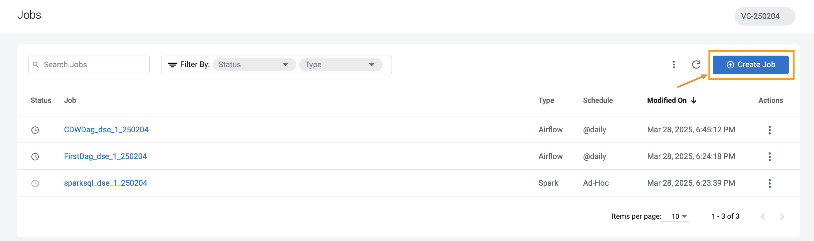


#### 7.3. Fill in the details   <a name="RvXgAMui37F6vKSDjdKvL"></a>
- **Job Type**: Airflow
- **Name**: pydag_***YourCDPUsername***
- **Dag File**: File
- Upload ***py_dag.py*** to the **firstdag** CDE Resource you created earlier.

Select '**Create and Run**' button to trigger the job immediately.

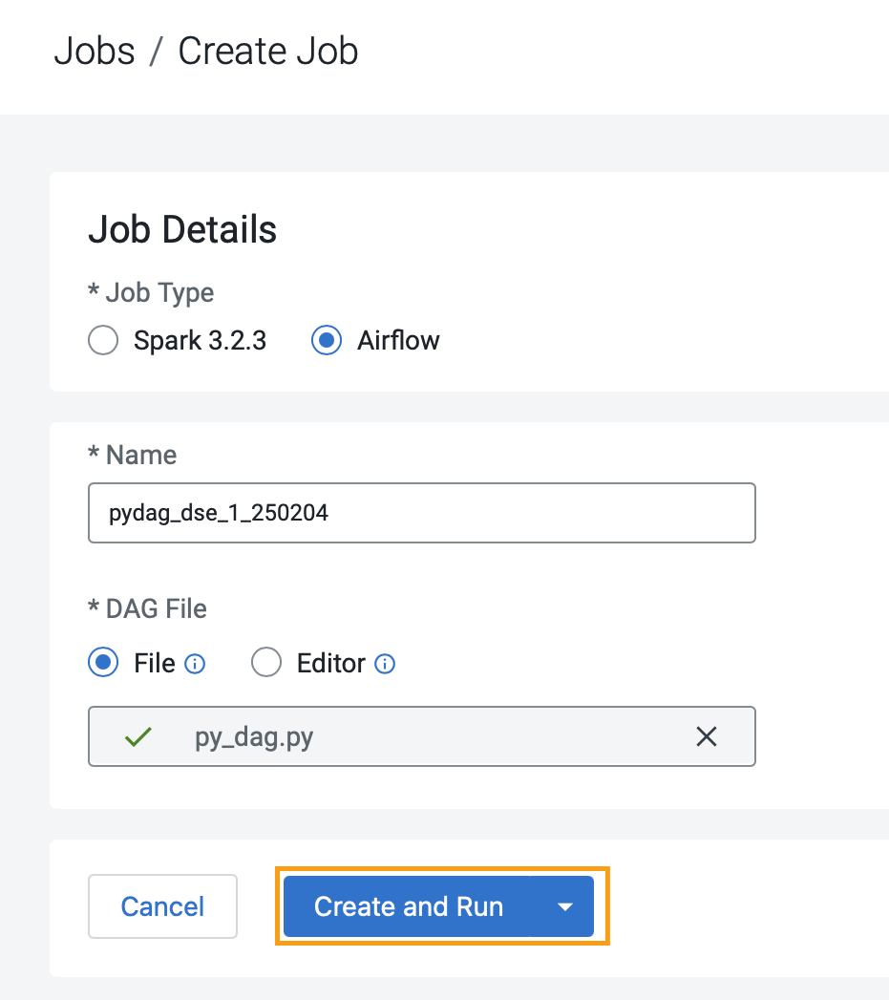


#### 7.4. Job run in progress  <a name="zIZaXOP0KQL71io5tYPY_"></a>
Please wait for a min for job to run

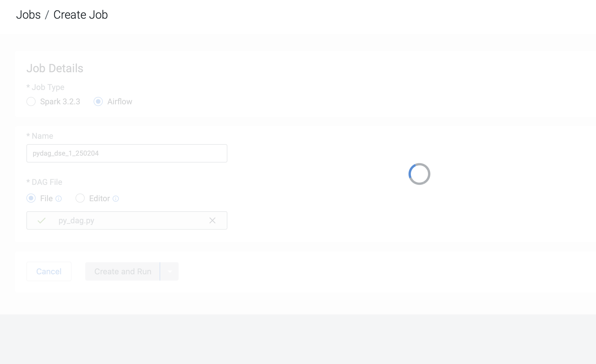


#### 7.5. New run is initiated  <a name="I8lmPC0opVSq20mldj6Vx"></a>
A success message appears confirming that a new run with ID has been initiated. 

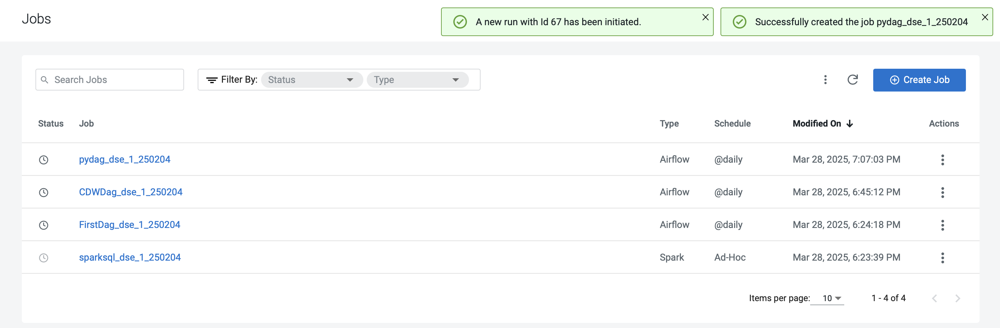


#### 7.6. Review the Jobs in progress  <a name="0K1i92pgxtqr7dZos2fMV"></a>
Notice that two CDE Jobs are now in progress. One of them is "*sparksql**_dse_1_250204*" (Spark CDE Job) and the other is "*pydag**_dse_1_250204*" (Airflow CDE Job). The former has been triggered by the execution of the latter. Wait a few moments and allow for the DAG to complete.

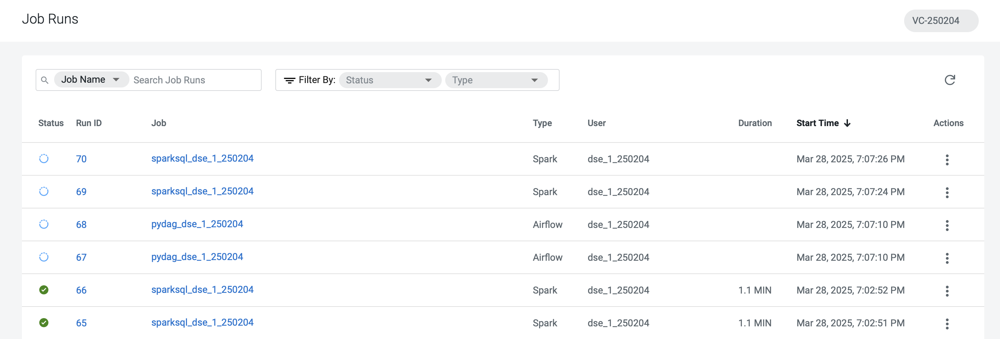


#### 7.7. Click on the Dag link  <a name="1Uv9vPuCvnPwmfejh_ci1"></a>
Once the Status column shows the Jobs run as succeeded, click on the "**pydag****_dse_1_250204**" link to access the Job Run page.

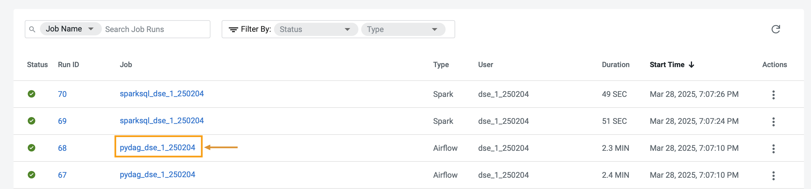


#### 7.8. Select the most recent Run  <a name="-zzvpZQC7CKpTj1pxQ-Hr"></a>
This page shows each run along with associated logs, execution statistics, and the Airflow UI.

Ensure to select the most recent Run (in the screenshot, the most recent Run ID number is 68)

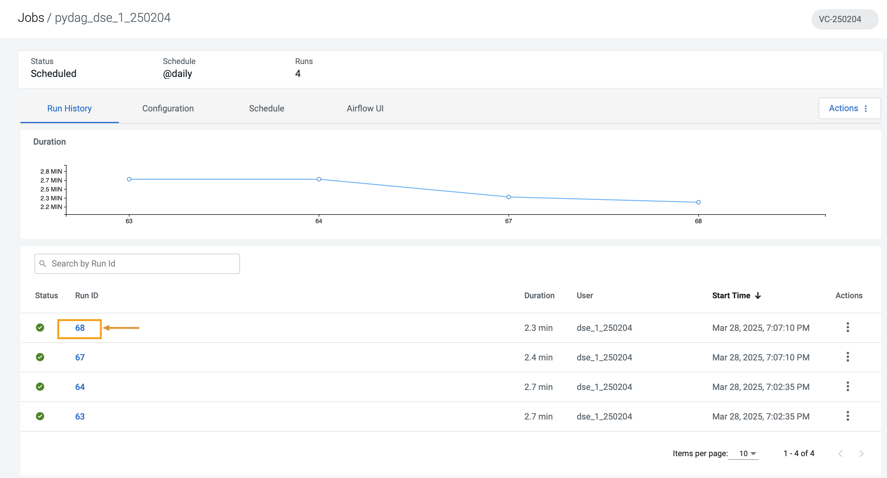


#### 7.9. Review Job Run  <a name="WtdyPvLg-682R6r1dIONe"></a>
Review the Job Run. Notice the run id in the top section of the page. 

Click on the Logs tab.

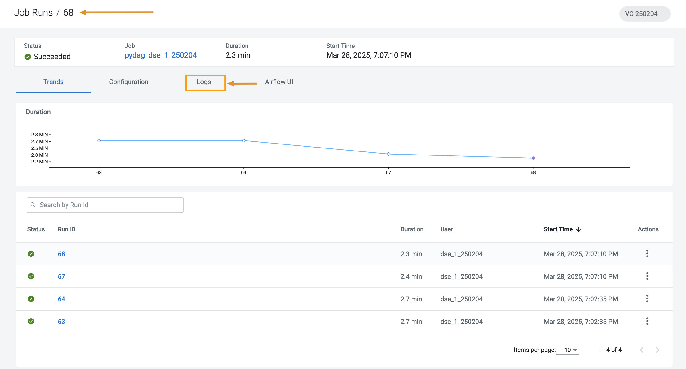


#### 7.10. Select DAG Task  <a name="NQAwSOEXwiQBU9yrZ03ta"></a>
Ensure to select the correct Airflow task which in this case is "**print_context**":

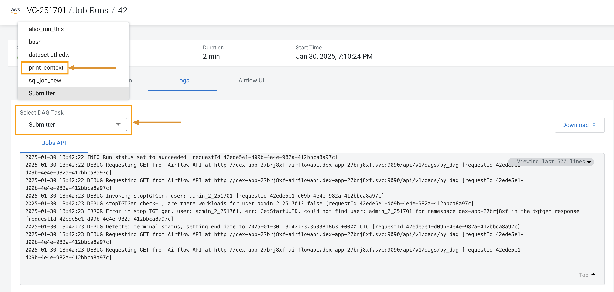


#### 7.11. Review DAG Task  <a name="oFvylIjIMfYD8l8DZVWJQ"></a>
Review the ***print_context*** task

Scroll to the bottom and validate the output.

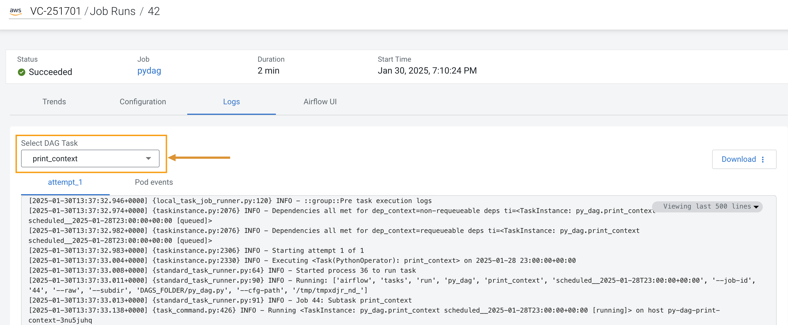


### 8. End of the Exercise  <a name="nUBI-WGTFsYtWZ-vICbPs"></a>


