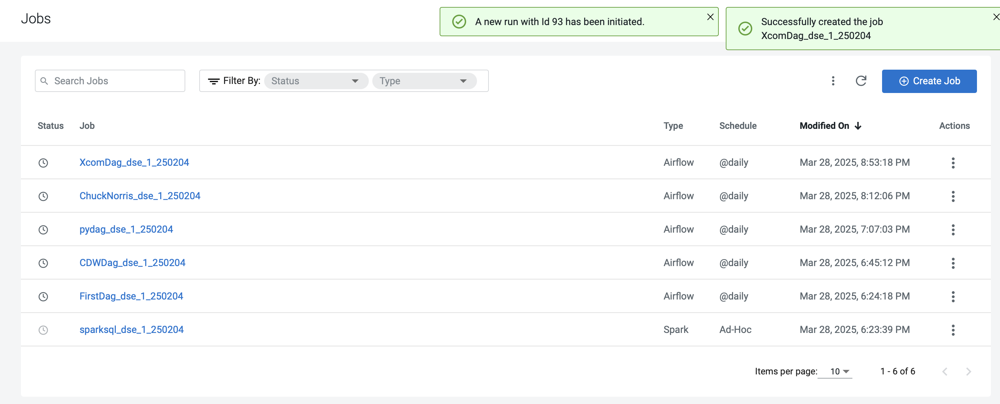

# 03-05 More Airflow DAG Features

#### Using the ***SimpleHttpOperator***

!!! info 
    You can use the *SimpleHttpOperator* to call HTTP requests and get the response text back. The Operator can help when you need to interact with 3rd party systems, APIs, and perform actions based on complex control flow logic.

In the following example we will send a request to the Chuck Norris API from the Airflow DAG. Before updating the DAG file, we need to set up a new Airflow Connection and Airflow Variables.

### 1. Creating an HTTP Airflow Connection  <a name="VKMOR-taFpCTJsmjCJ-2L"></a>

#### 1.1. Select Administration   <a name="auMxVE6h7z6uAuI8QocnZ"></a>
Navigate to the main menu and select Administration option from the panel. 


#### 1.2. Click on Cluster Details  <a name="5uAoR529gh6ouZTvjL5nA"></a>
In the Virtual Clusters column, click Cluster Details for the virtual cluster.


#### 1.3.  Click AIRFLOW UI  <a name="DC_ls7H3_GtuVITZkCLHy"></a>


#### 1.4. Click the Connection link   <a name="NGDF1P_H8QcU1OuAWf06o"></a>
From the Airflow UI, click the **Connection link** from the Admin menu.


#### 1.5. Add a new record  <a name="A14xRLRD9fuJ3KBcsYapp"></a>
Click the plus sign to add a new record.


#### 1.6. Fill in the fields   <a name="Q2PwSq5-S1U1kYoQTeTz8"></a>
Configure the connection by entering the following values for the following parameters. Leave the remaining entries blank.

- **Connection ID**: chuck_norris_connection_***YourCDPUsername***
- **Connection Type**: HTTP
- **Host**: https://matchilling-chuck-norris-jokes-v1.p.rapidapi.com

Click **Save**.


#### 1.7. Review record   <a name="7lt2qJ15-AgNzj07oZ3T-"></a>
A success message appears confirming a new row being added. 


### 2. Creating Airflow Variables  <a name="VUy56BvzT3NDEE-lSMs-8"></a>
!!! info 
    Airflow Variables allow you to parameterize your operators. Airflow Variables are used as environment variables for the DAG. Therefore, if you are looking to temporarily store operator results in the DAG and pass values to downstream operators you should use XComs (shown in the next section).

In our example, we will use them to pass an API KEY and HOST value to the *SimpleHttpOperator* below. To set up Airflow Variables, navigate back to the CDE Virtual Cluster Service Details page and open the Airflow UI.

#### 2.1. Click the Connection link   <a name="v20JCtBkAxHSMcPw3EkD8"></a>
From the Airflow UI, click on the "**Variables**" tab under the "Admin" drop down at the top of the page.


#### 2.2. Add a new record  <a name="gkh-bdTncwt1zTyc4MLt2"></a>
Click the plus sign to add a new record.


#### 2.3. Create first variable   <a name="kQ5taoIgfyTiY6Ip2v04r"></a>
Create a variable with the following entries:

- **Key**: rapids_api_host_***YourCDPUsername***
- **Value**: matchilling-chuck-norris-jokes-v1.p.rapidapi.com

Click **Save**


#### 2.4. Review new row  <a name="zNsbVnO2IQe2KE_Mt-rM2"></a>
!!! success
    A success message appears confirming that a row has been added. 

Click the plus sign to add a new record.


#### 2.5. Create second variable   <a name="QyK1r17bQKH-7ny2Zw3s1"></a>
Create a new variable with the following entries:

- **Key**: rapids_api_key_***YourCDPUsername***
- **Value**: f16c49e390msh7e364a479e33b3dp10fff7jsn6bc84b000b75

Click **Save**


#### 2.6. Review second row  <a name="YGk3rvbDboTDqabzcLsT-"></a>
!!! success
    A success message appears confirming that the new row has been added.


### 3. Working with the DAG  <a name="9opnENXWAExzLfIGZo5uk"></a>
Next, open "http_dag.py" and familiarize yourself with the code. The code relevant to the new operator is used between lines 71 and 92.

#### 3.1. Import Variable   <a name="4CaM0ewynj6MLJOVT521i"></a>
Notice that at line 11 we are importing the Variable type from the* airflow.models* module.


#### 3.2. Create Airflow Variables  <a name="Bgm2S_A0ptls-p-sf7CiN"></a>
We are then creating two Airflow Variables at lines 71 and 72.


#### 3.3. Map parameter  <a name="8uX3PQryxJKjxf1uLbf85"></a>
The "*http_conn_id*" parameter is mapped to the Connection ID you configured in the prior step.


#### 3.4. Validate response  <a name="T4pcG6buEZ5-pIr2LHIbN"></a>
The "*response_check*" parameter allows you to specify a python method to validate responses. This is the "*handle_response*" method declared at line 74.

```
api_host = Variable.get("rapids_api_host")
api_key = Variable.get("rapids_api_key")

def handle_response(response):
    if response.status_code == 200:
        print("Received 200 Ok")
        return True
    else:
        print("Error")
        return False

http_task = SimpleHttpOperator(
    task_id="chuck_norris_task",
    method="GET",
    http_conn_id="chuck_norris_connection",
    endpoint="/jokes/random",
    headers={"Content-Type":"application/json",
            "X-RapidAPI-Key": api_key,
            "X-RapidAPI-Host": api_host},
    response_check=lambda response: handle_response(response),
    dag=http_dag
)

```


#### 3.5. Replace Owner  <a name="lHjqs-UOxs_zr8pUvH106"></a>
Make sure to replace the current value of the 'Owner' with your ***YourCDPUsername*** in the default arguments dictionary.


#### 3.6. Replace Spark job name  <a name="cOArJ-A2i7zzWTvBWawQA"></a>
Make sure to replace the current value of the 'job_name' with ***sparksql_YourCDPUsername*** in spark_step block.


#### 3.7. Replace CLI Connection ID  <a name="8Gt-77MBAWClQ-UJKOlCp"></a>
Make sure to replace the current value of the 'cli_conn_id' with the value ***cdw_connection_YourCDPUsername ***used while creating the connection.


#### 3.8. Replace Airflow Variables  <a name="Yd8laONZlpUh1WwcO6da1"></a>
Make sure to replace the current value of the 'api_host' and api_key with the value ***rapids_api_host_YourCDPUsername ***and ***rapids_api_key_YourCDPUsername ***used while creating the variables.


#### 3.9. Replace HTTP CLI Connection ID  <a name="qz2M4CDztoNuib9xNbsya"></a>
Make sure to replace the current value of the 'http_conn_id' with the value ***chuck_norris_connection_YourCDPUsername ***used while creating the connection.


### 4. Create a new Airflow CDE Job   <a name="yM_164r66HlG2UWMOW3xP"></a>

#### 4.1. Select Jobs   <a name="O-UCRC6f6hvtSH_2FnEXq"></a>
Navigate to the Jobs page by clicking on the **Jobs** in the main panel.


#### 4.2. Click on Create Job  <a name="EUgvw5oVrxv4BGyWVs2vH"></a>
Click on **Create Job** to create a new CDE Job.


#### 4.3. Fill in the details   <a name="JAIo4vHyaX0kMLi1EctYT"></a>
- **Job Type**: Airflow
- **Name**: ChuckNorris_***YourCDPUsername***
- **Dag File**: File
- Upload ***http_dag.py*** to the **firstdag** CDE Resource you created earlier.

Select '**Create and Run**' button to trigger the job immediately.


#### 4.4. Job run in progress  <a name="6vLn-EkTTqD1fOPBwLBsE"></a>
Please wait for a min for job to run


#### 4.5. New run is initiated  <a name="xEGUDx0pSbKQiHWIsq4f_"></a>
!!! success
    A success message appears confirming that a new run with ID has been initiated. 


#### 4.6. Review the Jobs in progress  <a name="zCGvrYZcJ6TOv6Jq_ZYie"></a>
Notice that two CDE Jobs are now in progress. One of them is ***"sparksq_dse_1_250204"*** (Spark CDE Job) and the other is ***"ChuckNorris_dse_1_250204"*** (Airflow CDE Job). The former has been triggered by the execution of the latter. Wait a few moments and allow for the DAG to complete.


#### 4.7. Click on the Dag link  <a name="bd9WSCs2wvOutmlASx6GI"></a>
Once the Status column shows the Jobs run as succeeded, click on the "**ChuckNorris_dse_1_250204**" link to access the Job Run page.


#### 4.8. Select the most recent Run  <a name="zBsDEuNZ7uMWWZgnmaT_S"></a>
This page shows each run along with associated logs, execution statistics, and the Airflow UI.

Ensure to select the most recent Run (in the screenshot, the most recent Run ID number is 72)


#### 4.9. Review Job Run  <a name="aXbyoGwfYDgT3vKOIhUPN"></a>
Review the Job Run. Notice the run id in the top section of the page. 

Click on the Logs tab.


#### 4.10. Select DAG Task   <a name="aj5H5yiWXJdiJkA-L3_Sd"></a>
Ensure to select the correct Airflow task which in this case is "**chuck_norris_task**":


#### 4.11.  Review DAG Task   <a name="-9bCqZSVoCYQLPSdlm0hz"></a>
Review the **chuck_norris_task** task

Scroll to the bottom and validate the output.


### 5. Using XComs  <a name="uFwjfoGv3nkqcOZ0cZcaf"></a>
Although the request in the prior step was successful the operator did not actually return the response to the DAG. XComs (short for “cross-communications”) are a mechanism that let Tasks talk to each other, as by default Tasks are entirely isolated and may be running on entirely different machines.

!!! note 
    Practically XComs allow your operators to store results into a governed data structure and then reuse the values within the context of different operators. An XCom is identified by a key (essentially its name), as well as the task_id and dag_id it came from. They are only designed for small amounts of data; do not use them to pass around large values, like dataframes.

Open "xcom_dag.py" and familiarize yourself with the code. Notice the following changes in the code between lines 82 and 103:

#### 5.1. Add an argument  <a name="PwHGXbrUYPOiU-2iNe1HE"></a>
At line 92 we added a "do_xcom_push=True" argument. This allows the response to be temporarily saved in the DAG.


#### 5.2. Add python method  <a name="aSCNumMyWl3hbz-e-VQd3"></a>
At line 95 we introduced a new Python method "*print_chuck_norris_quote*" and at line 96 we use the built-in "*xcom_pull*" method to retrieve the temporary value from the *SimpleHttpOperator* task.


#### 5.3. Declare operator  <a name="pVo3wdV_-TVnmVUd2Zqrg"></a>
At line 62, we declared a new Python Operator running the method above.

```
http_task = SimpleHttpOperator(
    task_id="chuck_norris_task",
    method="GET",
    http_conn_id="chuck_norris_connection",
    endpoint="/jokes/random",
    headers={"Content-Type":"application/json",
            "X-RapidAPI-Key": api_key,
            "X-RapidAPI-Host": api_host},
    response_check=lambda response: handle_response(response),
    dag=xcom_dag,
    do_xcom_push=True
)

def _print_chuck_norris_quote(**context):
    return context['ti'].xcom_pull(task_ids='chuck_norris_task')

return_quote = PythonOperator(
    task_id="print_quote",
    python_callable=_print_chuck_norris_quote,
    dag=xcom_dag
)

```


#### 5.4. Replace Owner  <a name="t94WcMTCqwBfGD1yPSL41"></a>
Make sure to replace the current value of the 'Owner' with your ***YourCDPUsername*** in the default arguments dictionary.


#### 5.5. Replace Spark job name  <a name="VbTI20QtmqJsAAkMsxoww"></a>
Make sure to replace the current value of the 'job_name' with ***sparksql_YourCDPUsername*** in spark_step block.


#### 5.6. Replace CLI Connection ID  <a name="KQ2v85xnKBtvaV8tBPL4E"></a>
Make sure to replace the current value of the 'cli_conn_id' with the value ***cdw_connection_YourCDPUsername ***used while creating the connection.


#### 5.7. Replace Airflow Variables  <a name="_XAAjdT7GOb57Za9aaQQJ"></a>
Make sure to replace the current value of the 'api_host' and api_key with the value ***rapids_api_host_YourCDPUsername ***and ***rapids_api_key_YourCDPUsername ***used while creating the variables.


#### 5.8. Replace HTTP CLI Connection ID  <a name="Vma-hb1LKYKStZLuZZ8ST"></a>
Make sure to replace the current value of the 'http_conn_id' with the value ***chuck_norris_connection_YourCDPUsername ***used while creating the connection.


### 6. Create a new Airflow CDE Job   <a name="hvpl95u0aQ6mal9vAFvAp"></a>

#### 6.1. Select Jobs  <a name="CkY38jEDUyg49XiUKjqGS"></a>
Navigate to the Jobs page by clicking on the **Jobs** in the main panel.


#### 6.2. Click on Create Job  <a name="4DqrAmpBA565IEYKUAFky"></a>
Click on **Create Job** to create a new CDE Job.


#### 6.3. Fill in the details   <a name="h_3m1jPaeRESZlI0ZmAPc"></a>
- **Job Type**: Airflow
- **Name**: XcomDag_***YourCDPUsername***
- **Dag File**: File
- Upload ***xcom_dag.py*** to the **firstdag** CDE Resource you created earlier.

Select '**Create and Run**' button to trigger the job immediately.


#### 6.4. Job run in progress  <a name="qKXrr59ZHXZyJk-obuRH0"></a>
Please wait for a min for job to run


#### 6.5. New run is initiated  <a name="aAoBCAYZvVR8ox__LCEnu"></a>
!!! success
    A success message appears confirming that a new run with ID has been initiated. 




#### 6.6. Review the Jobs in progress  <a name="6rNluqF9DWdEqSNHKjkl0"></a>
Notice that two CDE Jobs are now in progress. One of them is "***sparksql_dse_1_250204***" (Spark CDE Job) and the other is "***XcomDag******s_dse_1_250204***" (Airflow CDE Job). The former has been triggered by the execution of the latter. Wait a few moments and allow for the DAG to complete.


#### 6.7. Click on the FirstDag link  <a name="0fW-O3yZOuYKbBuRNbSfb"></a>
Once the Status column shows the Jobs run as succeeded, click on the "***XcomDag******s_dse_1_250204***" link to access the Job Run page.


#### 6.8. Select the most recent Run  <a name="SDHSqCkmGOaFg4YVUbUFA"></a>
This page shows each run along with associated logs, execution statistics, and the Airflow UI.

Ensure to select the most recent Run (in the screenshot, the most recent Run ID number is 98)


#### 6.9. Review Job Run  <a name="Wiwg8zoHTp6FSwJYWGlwq"></a>
Review the Job Run. Notice the run id in the top section of the page. 

Click on the Logs tab.


#### 6.10. Select DAG Task   <a name="y3g2MDaeju4orwaA7fgGn"></a>
Ensure to select the correct Airflow task which in this case is "**print_quote**":


#### 6.11. Review DAG Task  <a name="qm0eFCmvvJ9OyJz6oTLKq"></a>
Review the ***print_quote*** task

Scroll all the way down and validate that a Chuck Norris quote has been printed out. Which one did you get?


### 7. End of the Exercise   <a name="jjxm0OCYYJ1zBkrqBU2CN"></a>


