# 04-01 Access and Interact

### 1. Introduction

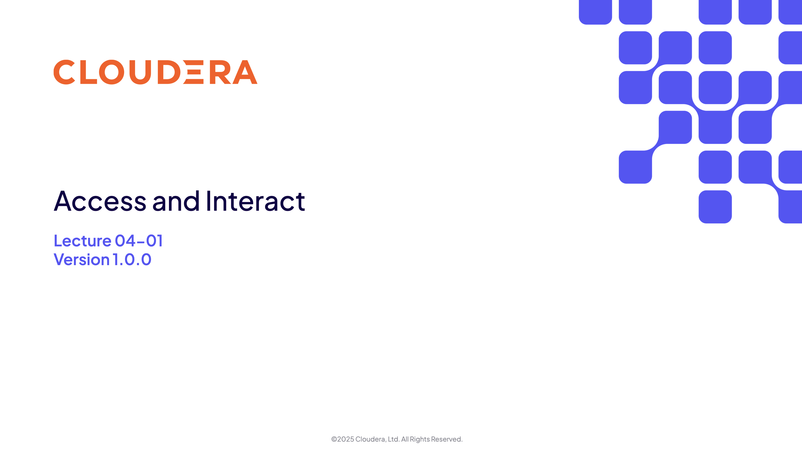

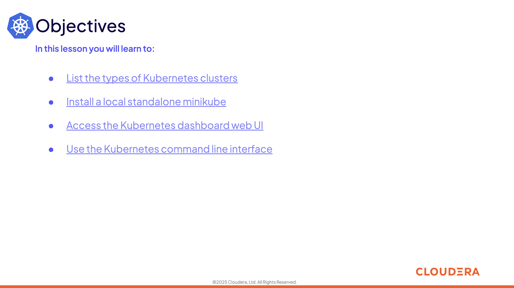

### 2. The Types of Kubernetes Clusters

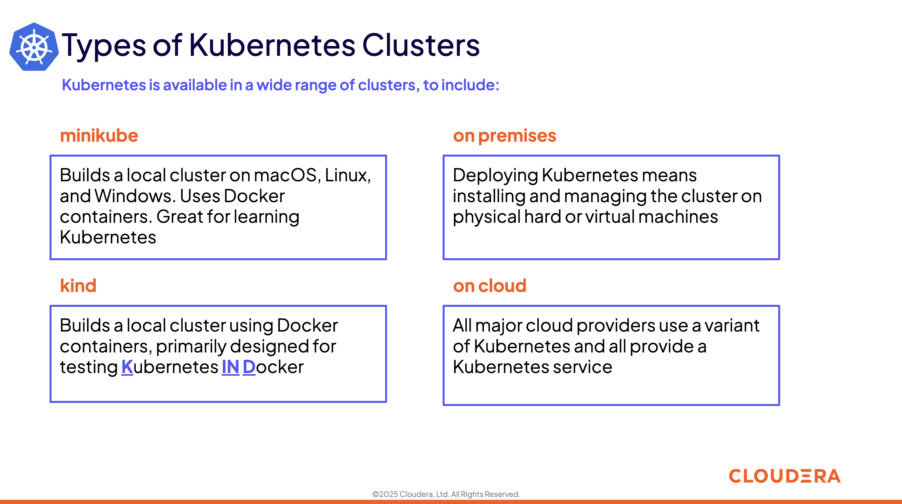

### 3. Install minikube

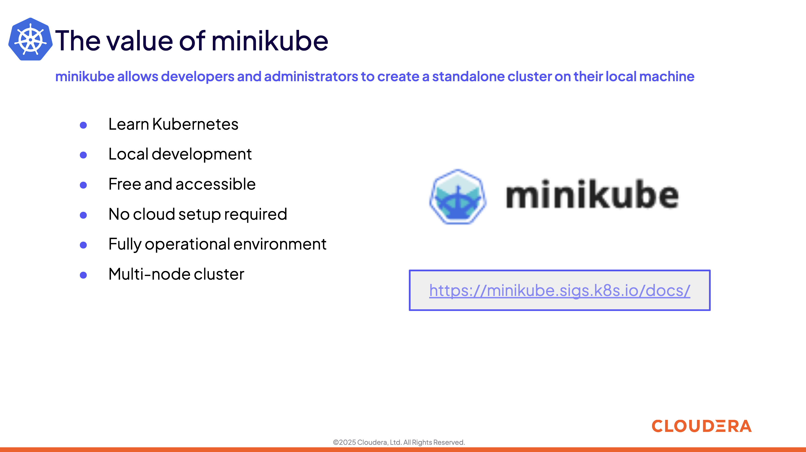

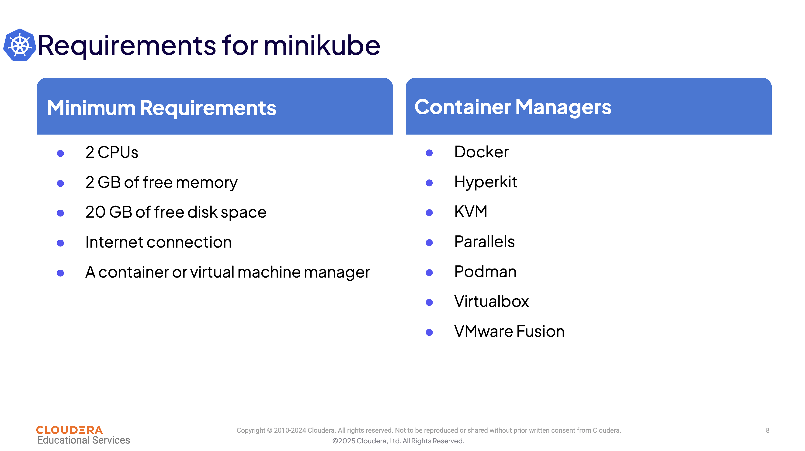

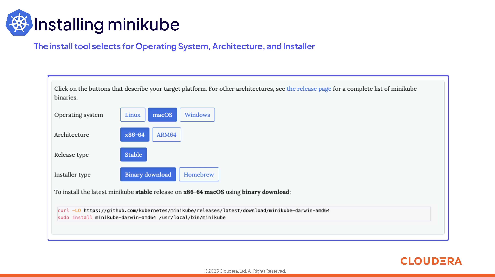

### 4. Kubernetes Dashboard

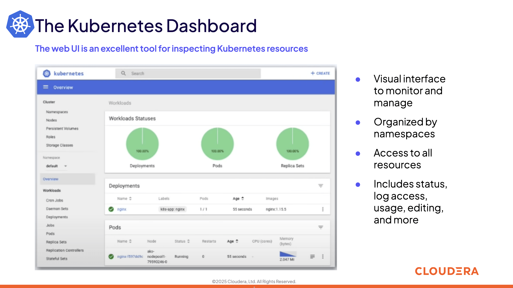

### 5. Kubernetes Command Line Interface

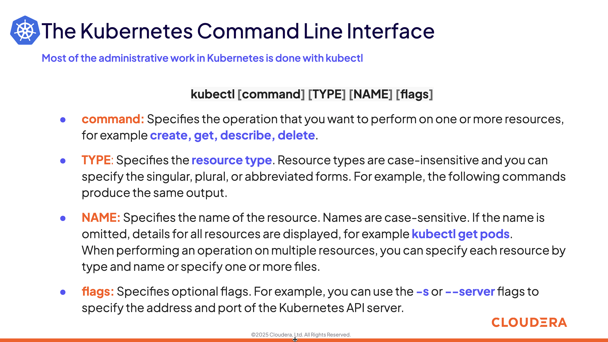

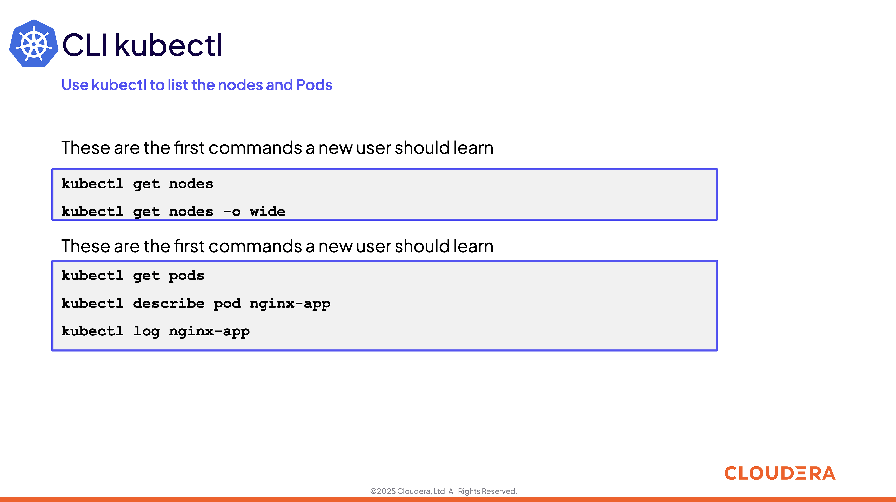

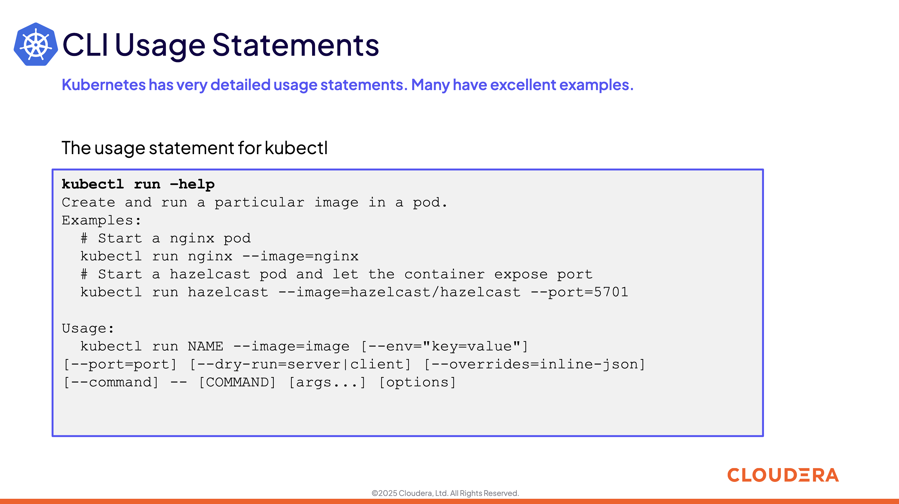

### 6. Summary and Exercise Assignments

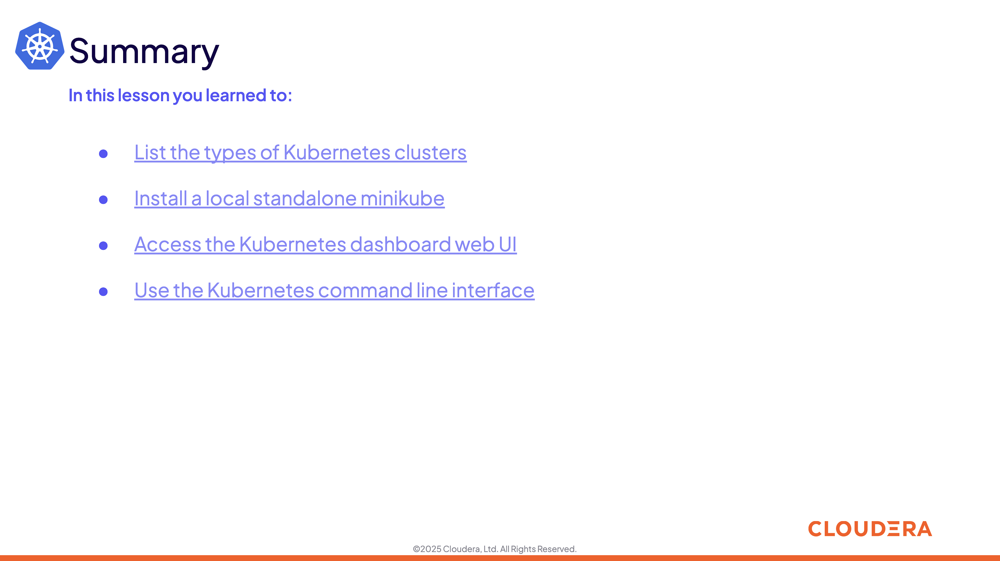

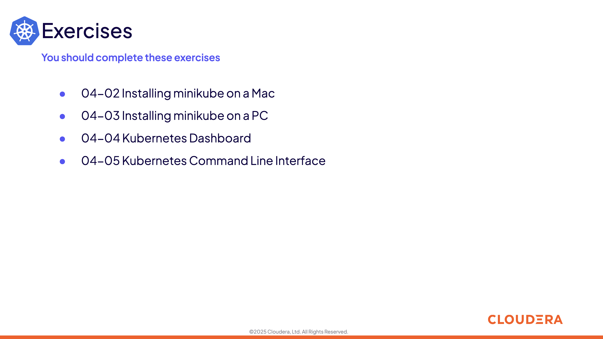

