# 04-02 Installing Kubernetes for macOS

The purpose of this exercise is to install Docker Desktop, minikube, and Kind on macOS.

### 1. Create a Docker Hub Account
While this is optional it really is a good practice. Use your current account for Docker Hub or create one.

#### 1.1. Open Docker Hub
Use this URL:

https://hub.docker.com

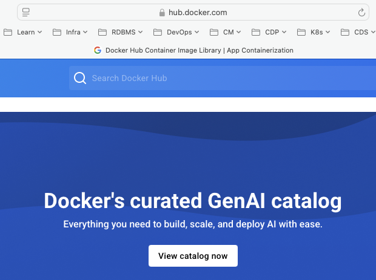


#### 1.2. Create an Account
Click "Sign Up"

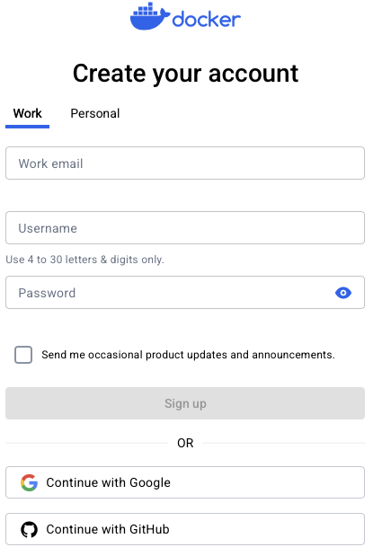


### 2. Install a Docker Desktop
There are a large number of container environments to select from and each technician will have their preferered software. This is an example of installing Docker Desktop for a Mac.

#### 2.1. Click "Mac | Docker Docs"
Open the Install Docker Desktop on Mac web page. This can be found with an Internet search or by opening this URL.

```
https://docs.docker.com/desktop/setup/install/mac-install/

```

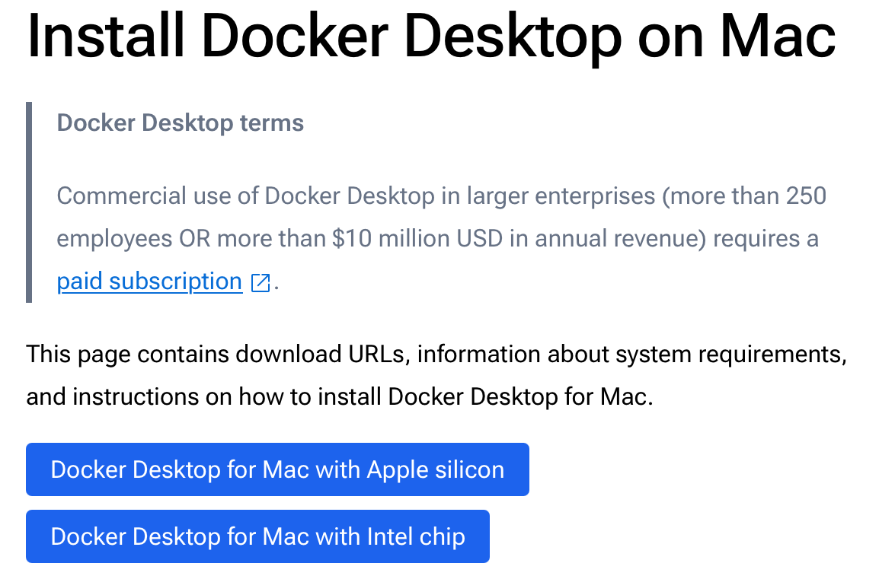


#### 2.2. Click "Mac | Docker Docs"
Review the instructions for Install interactively. This instance will be only used for educational purposes and thus meets the Docker Subscription Service Agreement

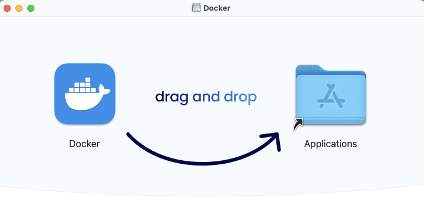


#### 2.3. Click "System requirements"
Click to download the correct CPU architecture.

- Docker Desktop for Mac with Apple silicon
- Docker Desktop for Mac with Intel chip


#### 2.4. Click "Docker"
Open the Download folder. 

Click on the Docker.dmg to open. 

Drag and drop the Docker application into the Applications folder.


#### 2.5. Accept
If challenged, review the license agreement. Click to **Accept** to continue.

#### 2.6. Use recommended setting
Select use recommended settings. This will require your user password to install and to configure.

#### 2.7. Clean Up
Delete the Docker.dmg file. 

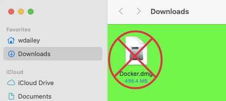


### 3. Start Docker Desktop

#### 3.1. Open Applications
Select Go > Applications

Locate Docker icon. 

For ease of access drag the **Docker** icon onto your toolbar


#### 3.2. Open Docker Desktop
Click "Desktop Desktop"


#### 3.3. Accept the Application for macOS
On the first start up accept the application by clicking "Open".

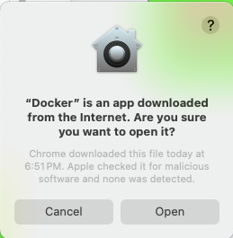


#### 3.4. Accept the Terms
Click "Accept". Optionally View Full Terms.

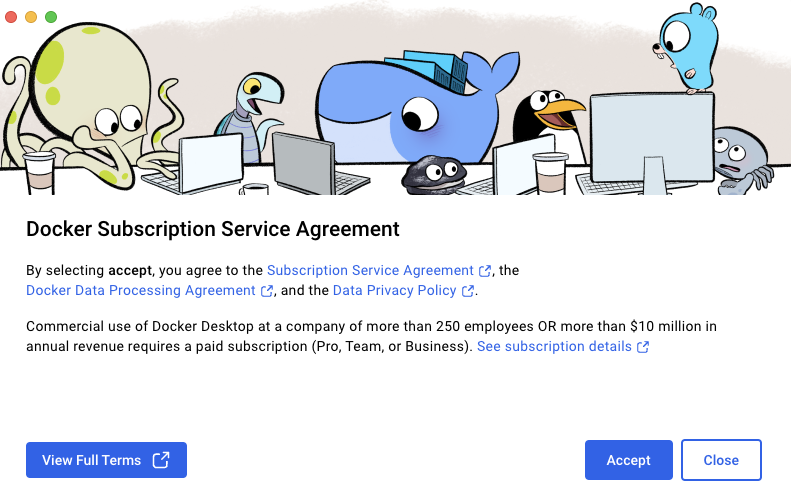


#### 3.5. Finish the Set Up
Use recommended settings. Click "Finish".

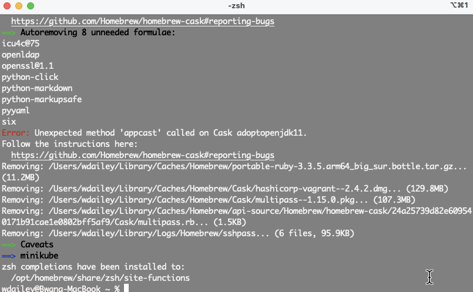


#### 3.6. Enter Laptop Password
Enter your macOS account password. Click "OK".

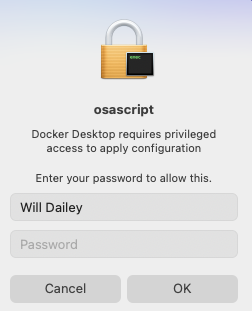


#### 3.7. Optionally Complete Survey
Your prefence to complete the survey or to skip. 

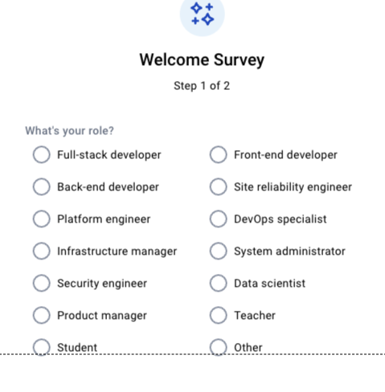


#### 3.8. Docker Desktop Opens
The Docker Desktop Opens.

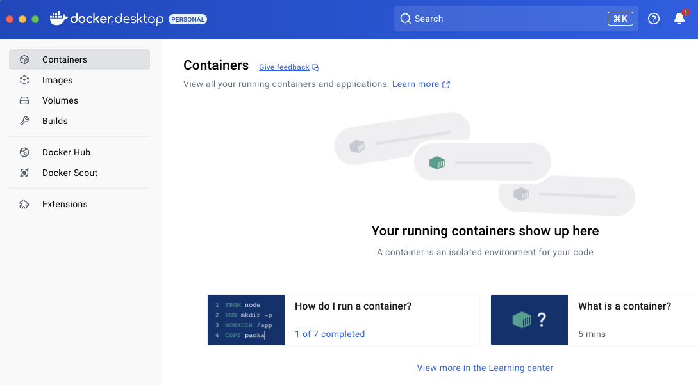


### 4. Sign In to Docker Hub

#### 4.1. Sign In
In the upper right corner of Docker Desktop click "Sign in".

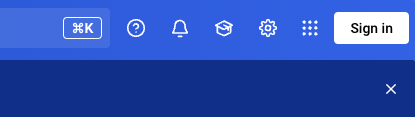


#### 4.2. Complete Sign In
Use your account information to sign in.

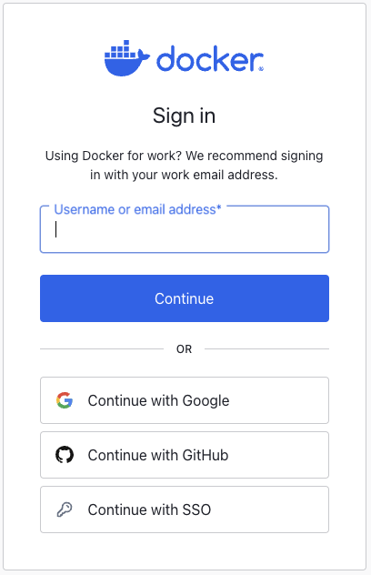


### 5. Install minikube

#### 5.1. Open the minikube documentation
Open the minikube install page. This can be found with an Internet search or using this URL.

```
https://minikube.sigs.k8s.io/docs/start/?arch=%2Fmacos%2Fx86-64%2Fstable%2Fbinary+download

```

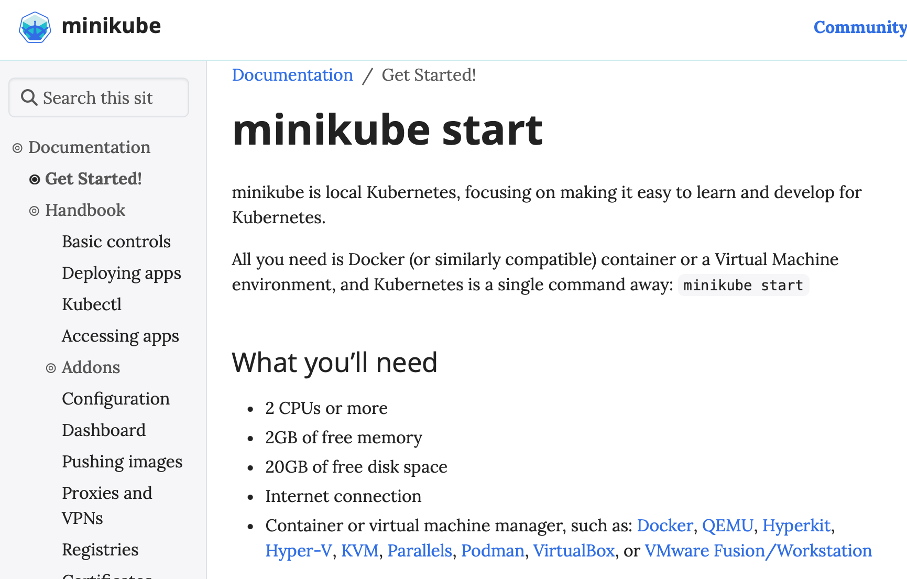


#### 5.2. Review Requirements
minikube is lightweight but full featured. It runs within a Docker container. A container environment is required, which is why you installed Docker Desktop.

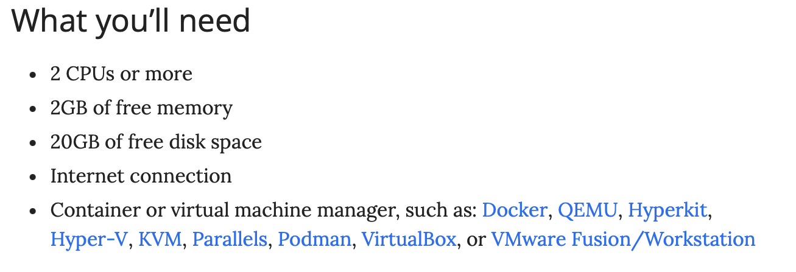


#### 5.3. Configure the Installer as Required
Scroll down to the Installation. Select the functions to set up your installation path. In this example we have set the following:

- Operating system: macOS
- Architecture: ARM64
- Release type: Stable
- Installer type: homebrew

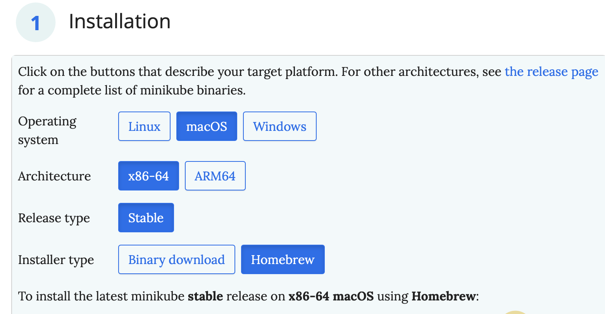


#### 5.4. Review the Install Instructions
Review the install instructions.

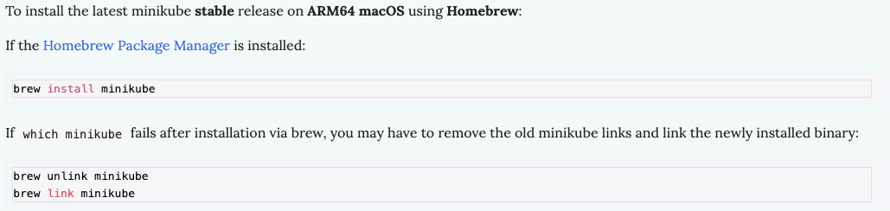


#### 5.5. Install minikube
If you are unfamiliar with brew use the binary method or use this URL for instructions:

```
https://brew.sh

```

Use Homebrew Package Manager to install minikube.

```
brew install minikube

```

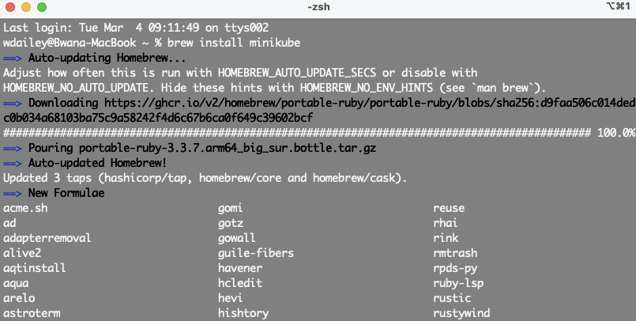


#### 5.6. Review Install
Verify the install of minikube was successful.


#### 5.7. Verify Install
```
minikube version

```

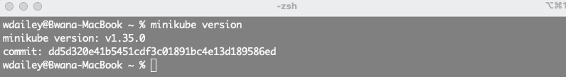


### 6. Install Kind

#### 6.1. Review Kind Install Instructions
Use this URL to review Kind install instructions.

```
https://kind.sigs.k8s.io/docs/user/quick-start/

```

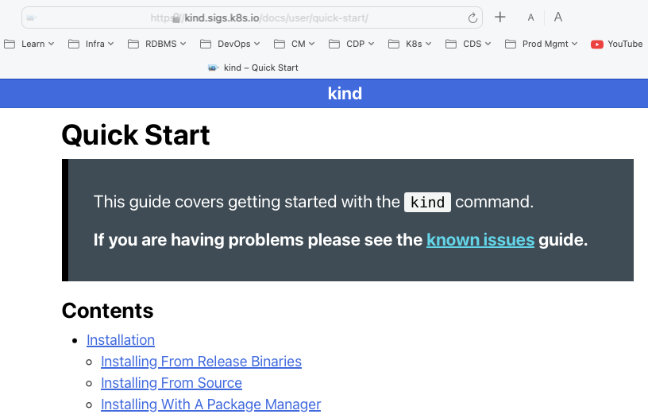


#### 6.2. Select Package Manager
Click on Installing with a Package Manager. Locate the instructions for using brew.

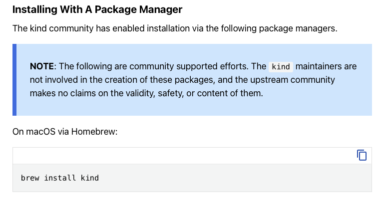


#### 6.3. Run Install Command
```
brew install kind

```

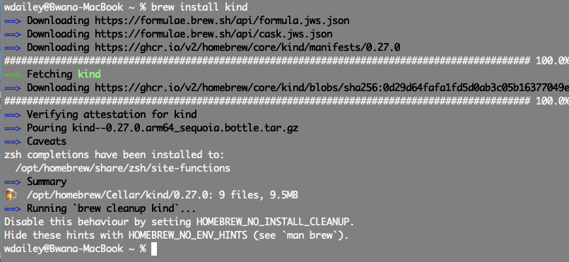


#### 6.4. Verify Install
```
kind version

```

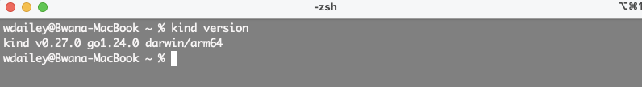


### 7. End of Exercise


