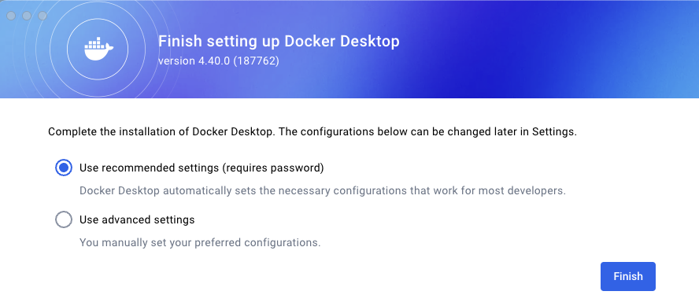

# 04-02 Installing minikube for macOS

The purpose of this exercise is to install minikube on a Mac. Minikube will be used as the classroom environment to teach Kubernetes

### 1. Recommend an IDE
It is recommended to install an IDE. The purpose overtime is to build up examples and working code. These exercises will show images of Visual Studio Code. However, the commands in these exercises can be run from a terminal on a desktop.

### 2. Install a Docker Desktop
There are a large number of container environments to select from and each technician will have their preferered software. This is an example of installing Docker Desktop for a Mac.

#### 2.1. Click "Mac | Docker Docs"
Open the Install Docker Desktop on Mac web page. This can be found with an Internet search or by opening this URL.

```
https://docs.docker.com/desktop/setup/install/mac-install/

```


#### 2.2. Click "Mac | Docker Docs"
Review the instructions for Install interactively. This instance will be only used for educational purposes and thus meets the Docker Subscription Service Agreement


#### 2.3. Click "System requirements"
Click to download the correct process architecture. 

- Docker Desktop for Mac with Apple silicon
- Docker Desktop for Mac with Intel chip


#### 2.4. Click "Docker"
Click on the Docker.dmg to open. Drag and drop the Docker application into the Applications folder.


#### 2.5. Accept
Review the license agreement. Click to **Accept** to continue.

#### 2.6. Use recommended setting
Select use recommended settings. This will require your user password to install and to configure.

### 3. Start Docker Desktop

#### 3.1. Open Applications
Select Go > Applications

Locate Docker icon. 

For ease of access drag the **Docker** icon onto your toolbar


#### 3.2. Click "desktop"
Click on the icon for Docker. Enter your password if required. The Docker Desktop is now running. We will explore it later after we have installed minikube.


### 4. Install minikube

#### 4.1. Click "minikube start | minikube"
Open the minikube install page. This can be found with an Internet search or using this URL.

```
https://minikube.sigs.k8s.io/docs/start/?arch=%2Fmacos%2Fx86-64%2Fstable%2Fbinary+download

```


#### 4.2. Click "minikube start | minikube"
minikube is lightweight but full featured. It runs as a Docker container. A container environment is required. 


#### 4.3. Click "minikube start | minikube"
Scroll down to the Installation.  Select the functions to set up your installation path. In this example we have set the following:

- Operating system: macOS
- Architecture: ARM64
- Release type: Stable
- Installer type: homebrew


#### 4.4. Install minikube
Use Homebrew Package Manager to install minikube

```
brew install minikube

```


#### 4.5. Review Install
Verify the install of minikube was successful.




### 5. End of Exercise


