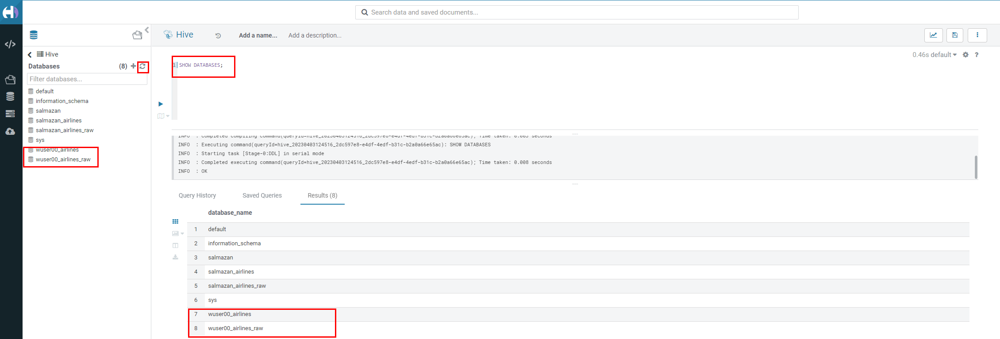
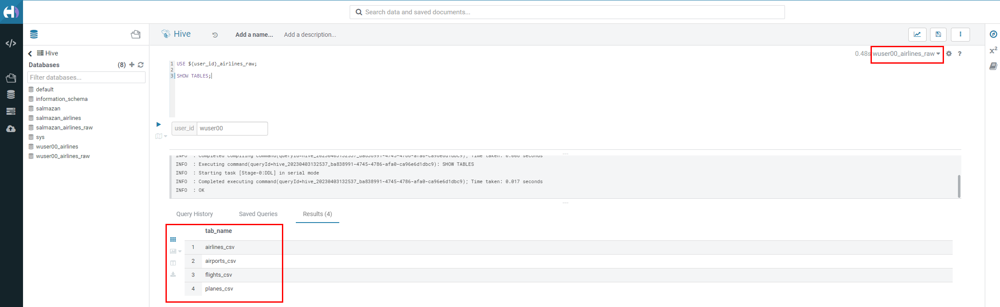
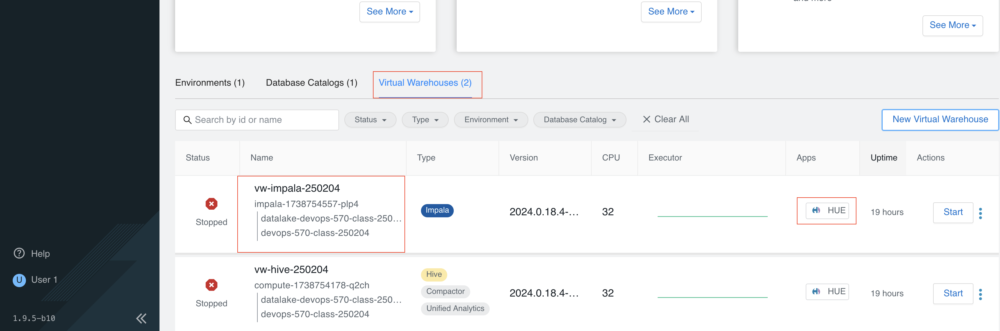
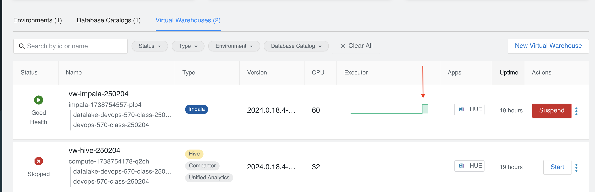
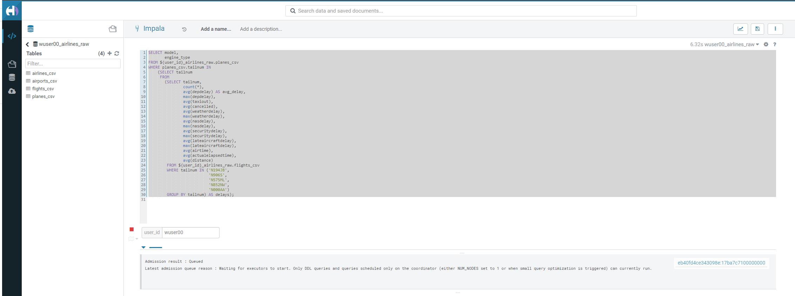
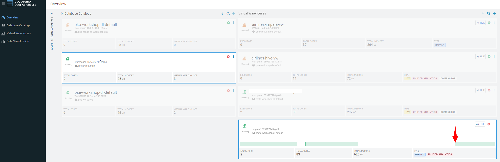

# Step 3: Cloudera Data Warehouse - Raw Layer (Direct Cloud Object Storage Access) 

The objective of this step is to create External tables on top of raw
CSV files sitting in cloud storage (In this case it has been stored in
AWS S3 by the instructor) and then run few queries to access the data
via SQL using HUE.

## 3.1 Open Hue for CDW Virtual Warehouse - `vw-hive`  

-   Click on the  button on the right upper
    corner of `vw-hive` as shown in the screenshot below.
    

-   Create new databases. Enter the following query and then make sure
    that you enter the user assigned to you. In the screenshot the user
    is `wuser00`.

``` sql
CREATE DATABASE ${user_id}_airlines_raw;

CREATE DATABASE ${user_id}_airlines;
```


-   There may be many databases, look for the 2 that start with your
    **`<user_id>`**. Run the following SQL to see the 2 databases that
    you created just now.

``` sql
SHOW DATABASES;
```



## 3.2 Run the following DDL in HUE for the CDW Virtual Warehouse - `vw-hive`  

This will create External Tables on CSV Data Files that have been
uploaded previously by your instructor in AWS S3. This provides a fast
way to allow SQL layer on top of data in cloud storage.

-   Copy paste the following into HUE.

``` sql
drop table if exists ${user_id}_airlines_raw.flights_csv;
CREATE EXTERNAL TABLE ${user_id}_airlines_raw.flights_csv(month int, dayofmonth int, dayofweek int, deptime int, crsdeptime int, arrtime int, crsarrtime int, uniquecarrier string, flightnum int, tailnum string, actualelapsedtime int, crselapsedtime int, airtime int, arrdelay int, depdelay int, origin string, dest string, distance int, taxiin int, taxiout int, cancelled int, cancellationcode string, diverted string, carrierdelay int, weatherdelay int, nasdelay int, securitydelay int, lateaircraftdelay int, year int)
ROW FORMAT DELIMITED FIELDS TERMINATED BY ',' LINES TERMINATED BY '\n'
STORED AS TEXTFILE LOCATION 's3a://${storage}/course-data/meta-cdw-workshop/airlines-raw/airlines-csv/flights' tblproperties("skip.header.line.count"="1");

drop table if exists ${user_id}_airlines_raw.planes_csv;
CREATE EXTERNAL TABLE ${user_id}_airlines_raw.planes_csv(tailnum string, owner_type string, manufacturer string, issue_date string, model string, status string, aircraft_type string, engine_type string, year int)
ROW FORMAT DELIMITED FIELDS TERMINATED BY ',' LINES TERMINATED BY '\n'
STORED AS TEXTFILE LOCATION 's3a://${storage}/course-data/meta-cdw-workshop/airlines-raw/airlines-csv/planes' tblproperties("skip.header.line.count"="1");

drop table if exists ${user_id}_airlines_raw.airlines_csv;
CREATE EXTERNAL TABLE ${user_id}_airlines_raw.airlines_csv(code string, description string) ROW FORMAT DELIMITED FIELDS TERMINATED BY ',' LINES TERMINATED BY '\n'
STORED AS TEXTFILE LOCATION 's3a://${storage}/course-data/meta-cdw-workshop/airlines-raw/airlines-csv/airlines' tblproperties("skip.header.line.count"="1");

drop table if exists ${user_id}_airlines_raw.airports_csv;
CREATE EXTERNAL TABLE ${user_id}_airlines_raw.airports_csv(iata string, airport string, city string, state DOUBLE, country string, lat DOUBLE, lon DOUBLE)
ROW FORMAT DELIMITED FIELDS TERMINATED BY ',' LINES TERMINATED BY '\n'
STORED AS TEXTFILE LOCATION 's3a://${storage}/course-data/meta-cdw-workshop/airlines-raw/airlines-csv/airports' tblproperties("skip.header.line.count"="1");
```

Notice the following screenshot corresponding to the above SQL. 
Makre sure to replace user_id & storage.


-   Check all the 4 tables were created.

``` sql
USE ${user_id}_airlines_raw;

SHOW TABLES;
```

Make sure that 4 tables (`airlines_csv`, `airports_csv`, `flights_csv`,
`planes_csv`) are created as shown below.



## 3.3 Run the following DDL in HUE for the CDW Virtual Warehouse - `vw-impala`.

-   Go to the page where now you will access HUE of an Impala virtual
    warehouse. Click on `HUE` for **`vw-impala`** as shown in the
    screenshot below. 


Now, copy paste the following in the HUE browser and click on Run as
shown below.

``` sql
select count(*) from ${user_id}_airlines_raw.flights_csv;
```


Notice that while the query is executing, continue to the next step.
Once the query returns you will see the following in the Results -
`the flights_csv table has over 86 million records`. 

-   Go back to the CDP Console and observe the Impala Virtual Warehouse
    `vw-impala`.
   

Here, you'll notice that the warehouse is now at a state where it is not
executing any queries and hence, the node count would be low and as the
users will run their queries it will scale up or down depending upon the
need of resources or lack of it when queries are not run.

!!!note 
        Since this workshop has many users logged in and the virtual impala warehouse is always ON at this point, the actual behavior might differ from what you see in the screenshot. The idea is to convey that the virtual warehouse scales up and scales down.`

-   Run the following query to start analyzing the data - "Find the
    needle in the haystack" query.

``` sql
SELECT model,
       engine_type
FROM ${user_id}_airlines_raw.planes_csv
WHERE planes_csv.tailnum IN
    (SELECT tailnum
     FROM
       (SELECT tailnum,
               count(*),
               avg(depdelay) AS avg_delay,
               max(depdelay),
               avg(taxiout),
               avg(cancelled),
               avg(weatherdelay),
               max(weatherdelay),
               avg(nasdelay),
               max(nasdelay),
               avg(securitydelay),
               max(securitydelay),
               avg(lateaircraftdelay),
               max(lateaircraftdelay),
               avg(airtime),
               avg(actualelapsedtime),
               avg(distance)
        FROM ${user_id}_airlines_raw.flights_csv
        WHERE tailnum IN ('N194JB',
                          'N906S',
                          'N575ML',
                          'N852NW',
                          'N000AA')
        GROUP BY tailnum) AS delays);
```



-   Go back to the CDP console to observe the behavior of scaling
    up/down of virtual warehouses.
    

-   Check in the Hue browser and the query shows the result as follows.
    Observe the amount of time taken to run this query.
    

---