# 04-04 Running minikube

The purpose of this exercise is to start up minicube and to learn basic commands for minikube.

### 1. Open minikube

#### 1.1. Open Docker Desktop
minikkube runs in a container. It requires a container environment. Start up your container environment. In this case the image is of Docker Desktop running on macOS.

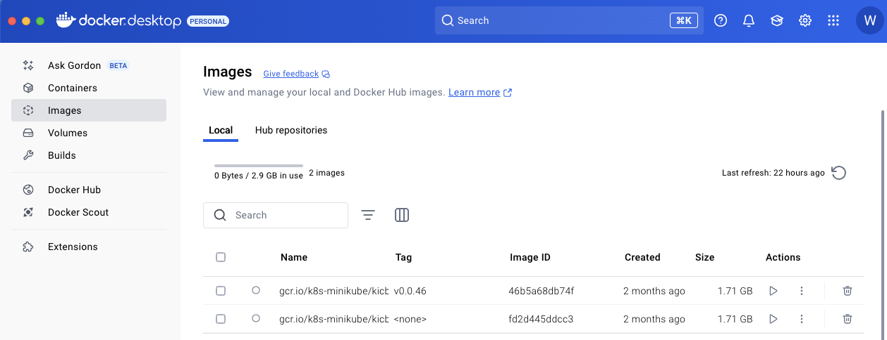


#### 1.2. Open a Terminal or IDE
Open a terminal or an IDE. This exercise will use Visual Studio Code. Note the normal color setting for VSC is white on black. For the purposes of readability on a printed page this has been changed to black on white.

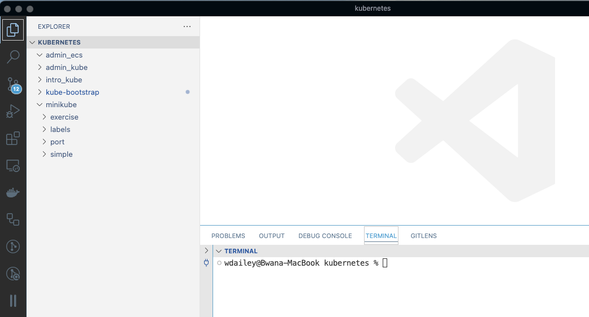


#### 1.3. Start minikube
Start up minikube and track progress.

```
minikube start

```

Clear the screen.

```
clear

```

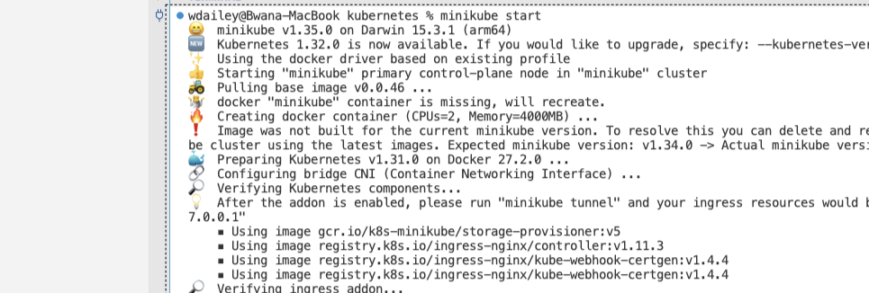


#### 1.4. Allow Access
If required allow VSC to access data from other apps.

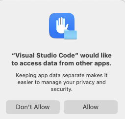


### 2. Basic minikube Commands

#### 2.1. minikube Usage
```
minikube --help

```

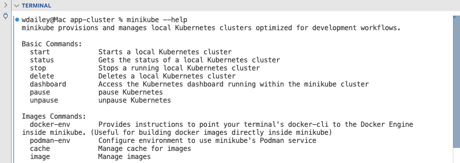


#### 2.2. Pause and Unpause
Pause and unpause minikube.

```
minikube pause

```

```
minikube unpause

```

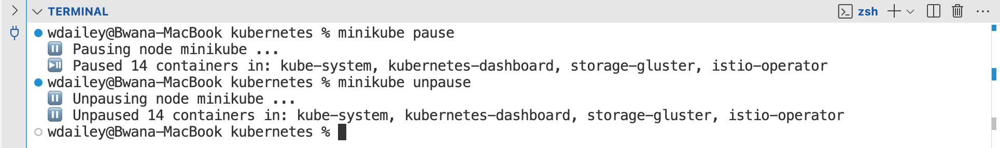


#### 2.3. Start and Stop
```
minikube stop

```

```
minikube start

```

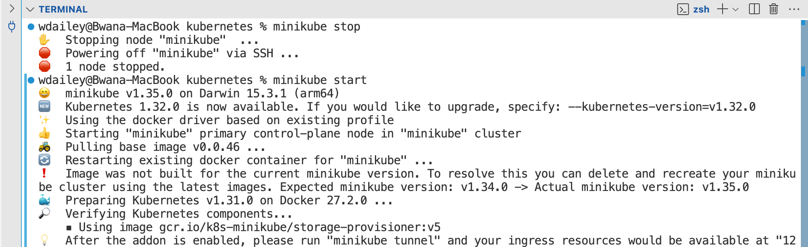


#### 2.4. Logs for minikube
```
minikube logs

```

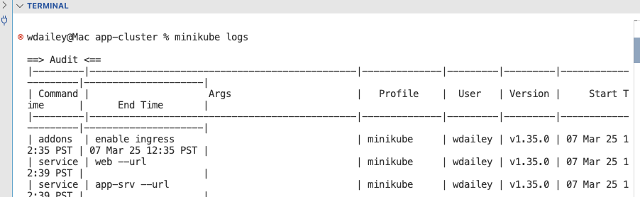


#### 2.5. List Addons
Review the addons list. Addons will be configured as required.

```
minikube addons list

```

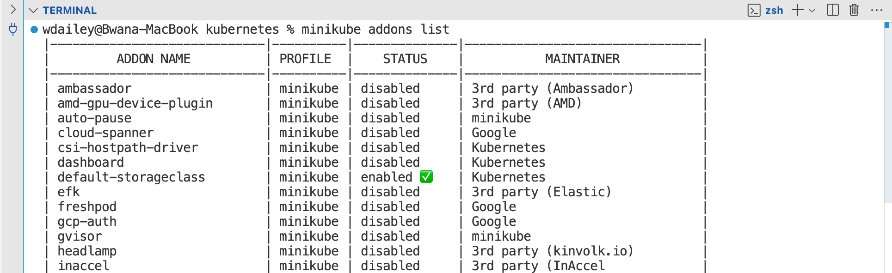


#### 2.6. Enable Dashboard
```
minikube addons enable dashboard

```

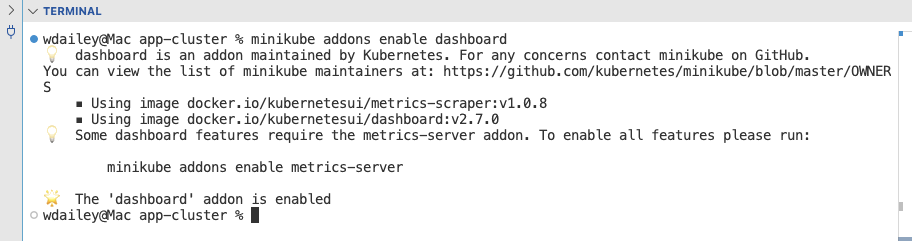


#### 2.7. Open Kubernetes Dashboard
Open the Kubernetes dashboard. A later exercise will review this dashboard.

```
minikube dashboard

```

When you are done close the tab for the Kubernetes dashboard. Use **Ctrl-C** to exit the command.

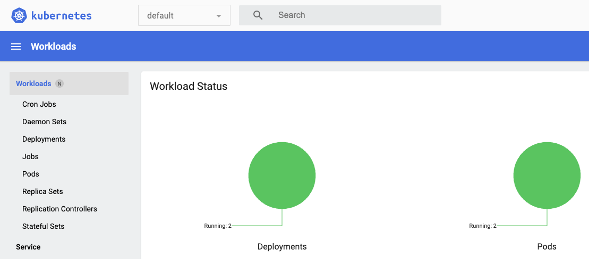


### 3. Deleting minikube

#### 3.1. Delete minikube clusters

---

**❌ DO NOT DELETE**

Do not delete minikube at this time. 

---

To delete all minikube clusters use this command.

```
xx minikube delete --all

```

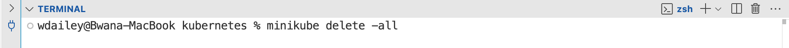


#### 3.2. The Docker Desktop Warning
Do not delete minikube from the Docker Desktop container view. This will result in a start up error for minikube. Always delete from the command line.

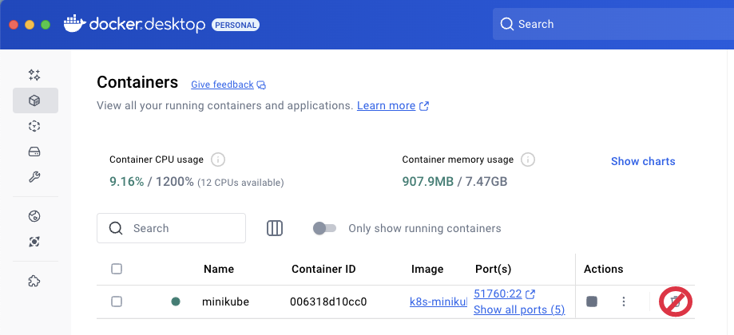


### 4. Verify Kubernetes

#### 4.1. Test for the kubectl Command
The kubectl command should automatically be available. If it does not appear ask your instructor for an assist.

```
kubectl get pods -A

```

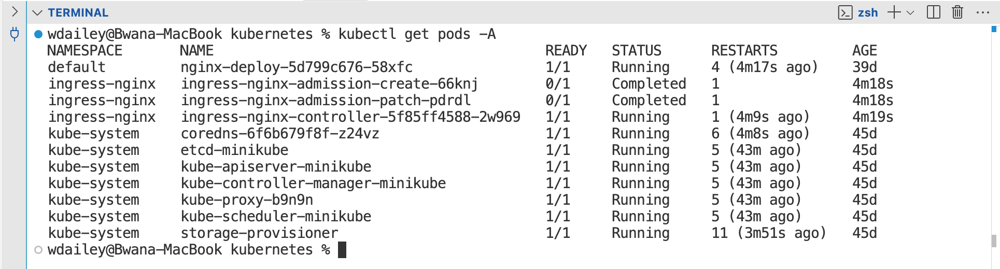


#### 4.2. Run Test Commands to Create a Deployment
Create a Deployment with a simple image.

```
kubectl create deployment hello-minikube --image=kicbase/echo-server:1.0

```

```
kubectl expose deployment hello-minikube --type=NodePort --port=8080

```

These commands are also found in the = Install minikube web page.

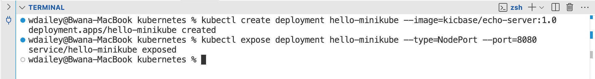


#### 4.3. List Deployment and Service
Inspect the deployment

```
kubectl get deployment hello-minikube

```

```
kubectl get service hello-minikube

```

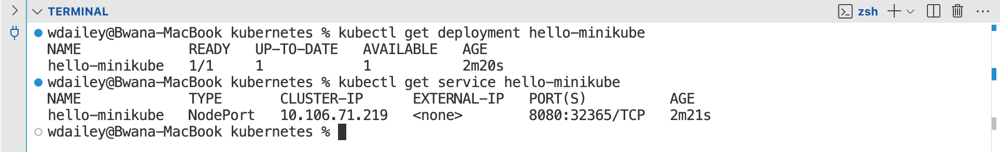


#### 4.4. Open the Application

---

**ℹ️ Terminal Status**

The terminal must be left open to run the web page.

---

Use minkube to open the browser.

```
minikube service hello-minikube

```

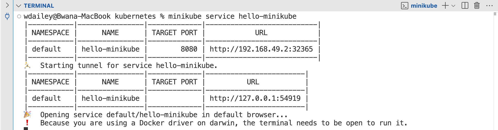


#### 4.5. Review the Web Page
Review the web page. When done close the tab. In the IDE use **Ctrl-C** to escape the minikube service tunnel. 

```
clear

```

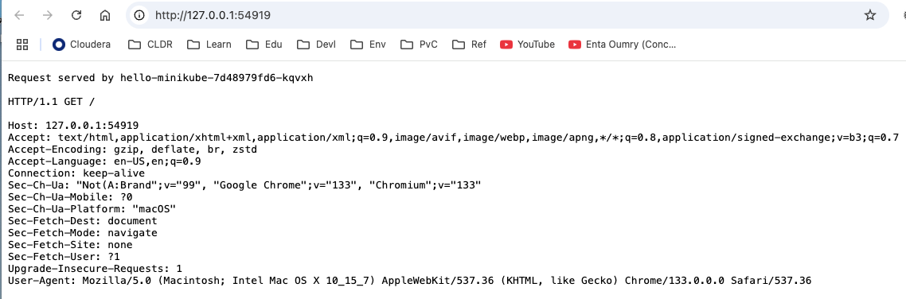


#### 4.6. Delete Deployment and Service
```
kubectl delete deployment hello-minikube

```

```
kubectl delete service hello-minikube

```

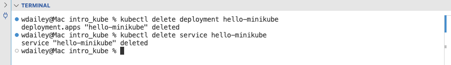


#### 4.7. Verification Complete
The minikube cluster is now tested and ready for further exercises.

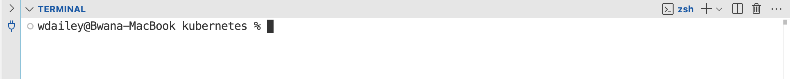


### 5. Review minikube Documentation

#### 5.1. Open minikube Web UI
Open the minikube handbook. Scan through it to see the full range of commands and capabilities. The handbook could be used as a tutorial.

```
https://minikube.sigs.k8s.io/docs/handbook/

```

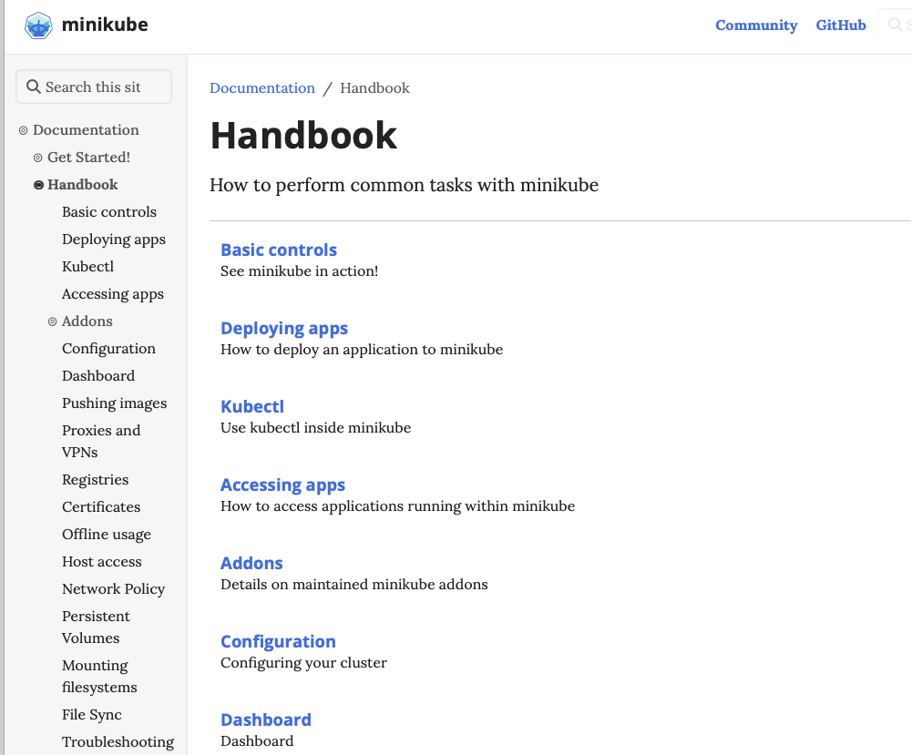


#### 5.2. Review Documentation
Select Addons > Ingress DNS. This is a good example of the value of this documentation. It provides a clear explaination with excellent example commands. The commands are demostrated for Linux, macOS, and Windows.

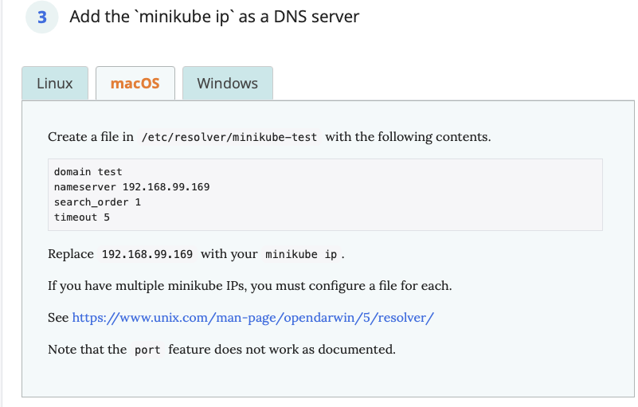


### 6. End of Exercise


