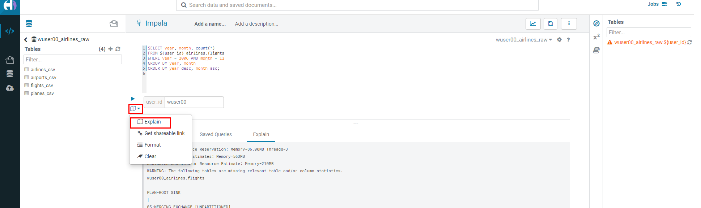
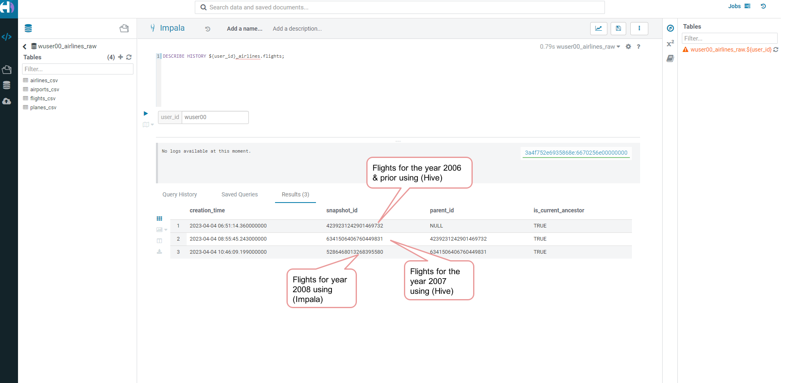
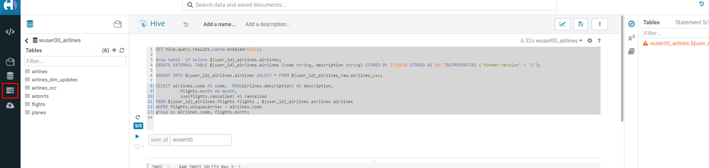
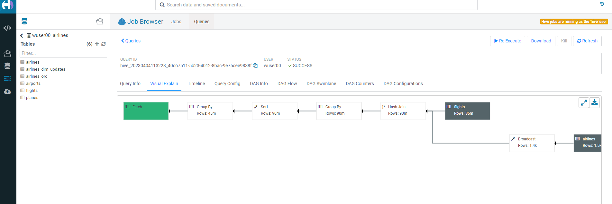

# Step 5: Performance Optimizations & Table maintenance Using Impala VW  

In this Step we will look at some of the performance optimization and
table maintenance tasks that can be performed to ensure the best
possible TCO, while ensuring the best performance.

## 5.1 Iceberg in-place Partition Evolution \[Performance Optimization\]  

-   Open HUE for the CDW `Hive` Virtual Warehouse - `vw-hive` 


-   One of the key features for Iceberg tables is the ability to evolve
    the partition that is being used **over time**.

``` sql
ALTER TABLE ${user_id}_airlines.flights
SET PARTITION spec ( year, month );

SHOW CREATE TABLE ${user_id}_airlines.flights;
```


-   Check for the following where now the partition is by
    `year, month`.
    

-   Load new data into the flights table using the **NEW** partition
    definition. `This query will take a while to run`.

``` sql
INSERT INTO ${user_id}_airlines.flights
SELECT * FROM ${user_id}_airlines_raw.flights_csv
WHERE year = 2007;
```


-   Open HUE for the CDW `Impala` Virtual Warehouse - `impala-vw`.
    


    

-   Copy/paste the following in the HUE Editor, but **`DO NOT`** execute
    the query.

``` sql
SELECT year, month, count(*)
FROM ${user_id}_airlines.flights
WHERE year = 2006 AND month = 12
GROUP BY year, month
ORDER BY year desc, month asc;
```

-   Run `Explain Plans` against some typical analytic queries we might
    run to see what happens with this new Partition.
    

    

-   Copy/paste the following in the HUE Editor, but **`DO NOT`** execute
    the query.

``` sql
SELECT year, month, count(*)
FROM ${user_id}_airlines.flights
WHERE year = 2007 AND month = 12
GROUP BY year, month
ORDER BY year desc, month asc;
```

-   Run `Explain Plans` against some typical analytic queries we might
    run to see what happens with this new Partition.
    

In the output notice the amount of data that needs to be scanned for
this query, about 11 MB, is significantly less than that of the first,
138 MB. This shows an important capability of Iceberg, Partition
Pruning. Meaning that much less data is scanned for this query and only
the selected month of data needs to be processed. This should result in
much faster query execution times.


## 5.2 Iceberg Snapshots \[Table Maintenance\]  

-   In the previous steps we have loaded data into the `flights` iceberg
    table. We will insert more data into it. Each time we add (update or
    delete) data a `snapshot` is captured. The snapshot is important for
    `eventual consistency` & to allow multiple read/writes concurrently
    (from various engines or the same engine).

``` sql
INSERT INTO ${user_id}_airlines.flights
SELECT * FROM ${user_id}_airlines_raw.flights_csv
WHERE year >= 2008;
```


-   To see snapshots, execute the following SQL.

``` sql
DESCRIBE HISTORY ${user_id}_airlines.flights;
```



In the output there should be **3 Snapshots**, described below. Note
that we have been reading/writing data from/to the Iceberg table from
both Hive & Impala. It is an important aspect of Iceberg Tables that
they support **`multi-function analytics`** - ie. many engines can work
with Iceberg tables (`Cloudera Data Warehouse [Hive & Impala]`,
`Cloudera Data Engineering [Spark]`,
`Cloudera Machine Learning [Spark]`, `Cloudera DataFlow [NiFi]`, and
`DataHub Clusters`).

-   Get the details of the `snapshots` and store it in a notepad.
    

    

## 5.3 Iceberg Time Travel \[Table Maintenance\]  

-   Copy/paste the following data into the Impala Editor, but
    **`DO NOT`** execute.

``` sql
-- SELECT DATA USING TIMESTAMP FOR SNAPSHOT
SELECT year, count(*)
FROM ${user_id}_airlines.flights
  FOR SYSTEM_TIME AS OF '${create_ts}'
GROUP BY year
ORDER BY year desc;

-- SELECT DATA USING SNAPSHOT ID FOR SNAPSHOT
SELECT year, count(*)
FROM ${user_id}_airlines.flights
  FOR SYSTEM_VERSION AS OF ${snapshot_id}
GROUP BY year
ORDER BY year desc;
```


-   After copying you will see 2 parameters as below.
    

-   From the notepad just copy the first value of the timestamp. It
    could be the date or the timestamp. Paste it in the `create_ts` box.
    In our case the value was `2025-02-07 11:06:25.905000000`. Then
    execute the highlighted query only (**1st query**). 
    

-   From the notepad just copy the second value of the snapshot id. In
    our case the value was `1796099219985023033`. Paste it in the
    `snapshot_id` box. Then execute the highlighted query only (**2nd
    query**). 
    

## 5.4 (Don't Run, FYI ONLY) - Iceberg Rollback \[Table Maintenance\]  

-   Sometimes data can be loaded incorrectly, due to many common
    issues - missing fields, only part of the data was loaded, bad data,
    etc. In situations like this data would need to be removed,
    corrected, and reloaded. Iceberg can help with the Rollback command
    to remove the "unwanted" data. This leverages Snapshot IDs to
    perform this action by using a simple ALTER TABLE command as
    follows. We will **`NOT RUN`** this command in this lab.

``` sql
-- ALTER TABLE ${user_id}_airlines.flights EXECUTE ROLLBACK(${snapshot_id});
```

## 5.5 (Don't Run, FYI ONLY) - Iceberg Rollback \[Table Maintenance\]  

-   As time passes it might make sense to expire old Snapshots, instead
    of the Snapshot ID you use the Timestamp to expire old Snapshots.
    You can do this manually by running a simple ALTER TABLE command as
    follows. We will **`NOT RUN`** this command in this lab.

``` sql
-- Expire Snapshots up to the specified timestamp
-- BE CAREFUL: Once you run this you will not be able to Time Travel for any Snapshots that you Expire ALTER TABLE ${user_id}_airlines.flights
-- ALTER TABLE ${user_id}_airlines_maint.flights EXECUTE expire_snapshots('${create_ts}');
```

## 5.6 Materialized Views \[Performance Optimization\]  

-   This can be used for both Iceberg tables and Hive Tables to improve
    performance. Go to the Cloudera console and look for `hive-vw`.
    Click on the `Hue` button on the right upper corner of `hive-vw` as
    shown in the screenshot below.


-   Up until this point we had `airlines` table which was (Hive + orc).
    Now, we shall create the airlines table which is (Iceberg + orc).
    Copy/paste the following, make sure to highlight the entire block,
    and execute the following.

``` sql
SET hive.query.results.cache.enabled=false;

drop table  if exists ${user_id}_airlines.airlines;
CREATE EXTERNAL TABLE ${user_id}_airlines.airlines (code string, description string) STORED BY ICEBERG STORED AS ORC TBLPROPERTIES ('format-version' = '2');

INSERT INTO ${user_id}_airlines.airlines SELECT * FROM ${user_id}_airlines_raw.airlines_csv;

SELECT airlines.code AS code,  MIN(airlines.description) AS description,
          flights.month AS month,
          sum(flights.cancelled) AS cancelled
FROM ${user_id}_airlines.flights flights , ${user_id}_airlines.airlines airlines
WHERE flights.uniquecarrier = airlines.code
group by airlines.code, flights.month;
```


**Note**: Hive has built in performance improvements, such as a Query
Cache that stores results of queries run so that similar queries don't
have to retrieve data, they can just get the results from the cache. In
this step we are turning that off using the **SET** statement, this will
ensure when we look at the query plan, we will not retrieve the data
from the cache.
**Note**: With this query you are combining an Iceberg Table Format
(`flight` table) with a Hive Table Format (`airlines ORC` table) in the
same query.

-   Let's look at the Query Plan that was used to execute this query. On
    the left side click on `Jobs`, as shown in the screenshot below.



-   Then click on `Hive Queries`. This is where an Admin will go when he
    wants to investigate the queries. In our case for this lab, we'd
    like to look at the query we just executed to see how it ran and the
    steps taken to execute the query. Administrators would also be able
    to perform other monitoring and maintenance tasks for what is
    running (or has been run). Monitoring and maintenance tasks could
    include cancel (kill) queries, see what is running, analyze whether
    queries that have been executed are optimized, etc.


-   Click on the first query as shown below. Make sure that this is the
    latest query. You can look at the `Start Time` field here to know if
    it's the latest or not.
    

-   This is where you can analyze queries at a deep level. For this lab
    let's take a look at the explain details, by clicking on
    `Visual Explain` tab. It might take a while to appear, please click
    on refresh.
    

-   This plan shows that this query needs to read `flights` (86M rows)
    and `airlines` (1.5K rows) with hash join, group, and sort. This is
    a lot of data processing and if we run this query constantly it
    would be good to reduce the time this query takes to execute.
    

-   Click on the `Editor` option on the left side as shown.
    

-   **Create Materialized View (MV)** - Queries will transparently be
    rewritten, when possible, to use the MV instead of the base tables.
    Copy/paste the following, highlight the entire block, and execute.

``` sql
DROP MATERIALIZED VIEW IF EXISTS ${user_id}_airlines.traffic_cancel_airlines;
CREATE MATERIALIZED VIEW ${user_id}_airlines.traffic_cancel_airlines
as SELECT airlines.code AS code,  MIN(airlines.description) AS description,
          flights.month AS month,
          sum(flights.cancelled) AS cancelled,
          count(flights.diverted) AS diverted
FROM ${user_id}_airlines.flights flights JOIN ${user_id}_airlines.airlines airlines ON (flights.uniquecarrier = airlines.code)
group by airlines.code, flights.month;

-- show MV
SHOW MATERIALIZED VIEWS in ${user_id}_airlines;
```


-   Run Dashboard Query again to see usage of the MV - Copy/paste the
    following, make sure to highlight the entire block, and execute the
    following. This time an `order by` was added to make this query must
    do more work.

``` sql
SET hive.query.results.cache.enabled=false;
SELECT airlines.code AS code,  MIN(airlines.description) AS description,
          flights.month AS month,
          sum(flights.cancelled) AS cancelled
FROM ${user_id}_airlines.flights flights , ${user_id}_airlines.airlines airlines
WHERE flights.uniquecarrier = airlines.code
group by airlines.code, flights.month
order by airlines.code;
```


-   Let's look at the Query Plan that was used to execute this query. On
    the left menu select `Jobs`. On the Jobs Browser - select the
    `Queries` tab to the right of the `Job` browser header. Hover over &
    click on the Query just executed (should be the first row). Click on
    the `Visual Explain` tab. With query rewrite the materialized view
    is used and the new plan just reads the MV and sorts the data vs.
    reading `flights (86M rows)` and `airlines (1.5K rows)` with hash
    join, group and sorts. This results in significant reduction in run
    time for this query.


----
