# Step 6: Cloudera Data Visualization  

In this step you will build a Logistics Dashboard using Cloudera Data
Visualization. The Dashboard will include details about flight delays
and cancellations. But first we will start with Data Modeling.

## Step 6(a): Data Modeling  

-   If you are not on the CDP home page, then go there and click on the
    following CDW icon to go into Cloudera Data Warehouse.
    

- Then click on the Data Visualization option in the left window pane. You’ll see an option Data VIZ next to the data-viz application with the name dataviz. It should open a new window.+

-   There are 4 areas of CDV - `HOME, SQL, VISUALS, DATA` - these are
    the tabs at the top of the screen in the black bar to the right of
    the Cloudera Data Visualization banner. 

-   Build a Dataset (aka. Metadata Layer or Data Model) - click on
    `DATA` in the top banner. A Dataset is a Semantic Layer where you
    can create a business view on top of the data - data is not copied;
    this is just a logical layer.
    

-   Create a connection - click on the NEW CONNECTION button on the left
    menu. Enter the details as shown in the screenshot and click on
    `TEST`.

    Connection type: Select `CDW Impala`.

    Connection name: `<user_id>-airlines-lakehouse`
    (Ex-`wuser00-airlines-lakehouse`).

    CDW Warehouse:
    `Make Sure you select the warehouse that is associated with your <user_id>`.

    Hostname or IP address: Gets automatically selected.

    Port: `Gets automatically filled up`.

    Username: `Gets automatically filled up`.

    Password: `Blank`

-   Click on `CONNECT`.
    

-   You will see your connection in the list of connections on the left
    menu. On the right side of the screen you will see Datasets and the
    Connection Explorer. Click on `NEW DATASET`.
    
    

-   Fill the details as follows and click `CREATE`. `airline_logistics`
    gets created

    Dataset title - `airline_logistics`.

    Dataset Source - Select `From Table` (however, you could choose to
    directly enter a SQL statement instead).

    Select Database - `<user_id>_airlines` (Make Sure you select the
    database that is associated with your \<user_id\>).

    Select Table - `flights`.

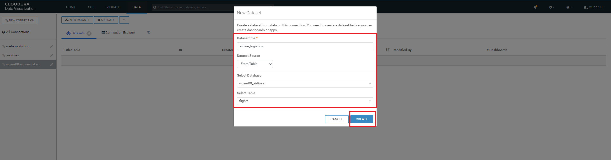

-   Edit the Dataset - click on `airline_logistics` on the right of the
    screen. This will open the details page, showing you information
    about the Dataset, such as connection details, and options that are
    set. Click on `Fields` option in the left window pane.
    
    
    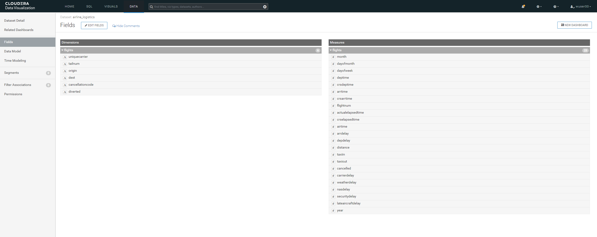

-   Click on `Data Model` - for our Dataset we need to join additional
    data to the flights table including the `planes`, `airlines`, and
    `airports` tables.
    

-   Click on `EDIT DATA MODEL`.
    

-   Click on the `+` icon next to the `flights` table option.
    

-   Select the appropriate `Database Name` based on your user id (Ex:
    `wuser00_airlines`) and table name `planes`.
    

-   Then click on the  `join` icon
    and see that there are 2 join options `tailnum` & `year`. 
    
    Click on `EDIT JOIN` and then remove the `year` join by clicking the little `-` (minus) icon to the right next to the `year` column. 
    
    Click on `APPLY`.

    
    
    
    
    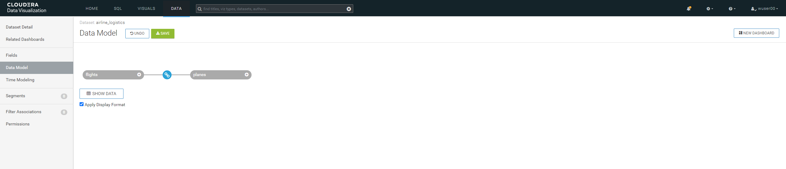

-   Now we will create a join between another table. 

    Click on `+` icon next to `flights` as shown below.

    Select the appropriate `Database Name` based on your <user_id\> (Ex: `wuser00_airlines`) and table name `airlines`.
    
    

-   Make sure you select the column `uniquecarrier` from `flights` and
    column `code` from the `airlines` table. Click `APPLY`.
    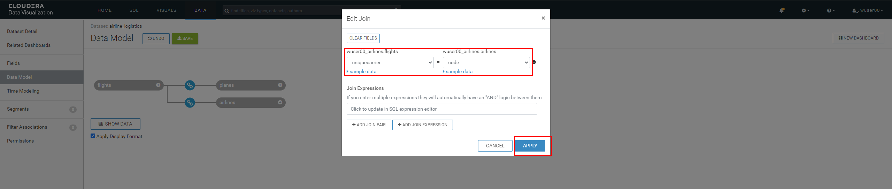
    

-   Click on `+` icon next to `flights` as shown below. Select the
    appropriate `Database Name` based on your <user_id\> (Ex:
    `wuser00_airlines`) and table name `airports`.
    

-   Make sure you select the column `origin` from `flights` and column
    `iata` from the `airports` table. Click `APPLY`.
    

-   Click on `+` icon next to `flights` as shown below. Select the
    appropriate `Database Name` based on your <user_id\> (Ex:
    `wuser00_airlines`) and table name `airports`.
    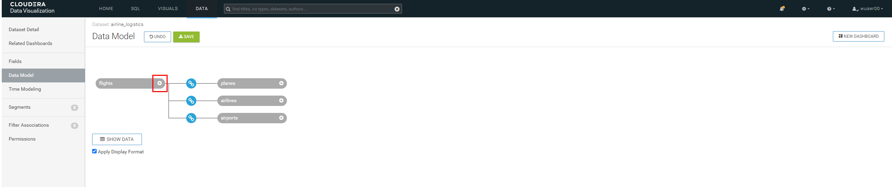

-   Make sure you select the column `dest` from `flights` and column
    `iata` from the `airports` table. Click `APPLY`. Then click on
    `SAVE`.
    
    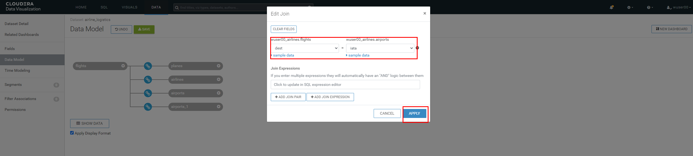

-   Verify that you have the joins which are as following. 

    You can do so by clicking the  `join` icon.

    `flights.tailnum` --- `planes.tailnum`

    `flights.uniquecarrier` --- `airlines.code`

    `flights.origin` --- `airports.iata`

    `flights.dest` --- `airports_1.iata`

-   Click on `SHOW DATA`. And then click on `SAVE`. 
    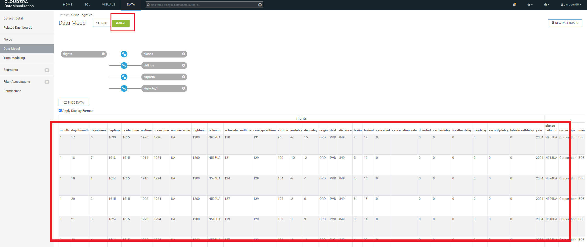

-   Click on the `Fields` column on the left window pane. Then click on
    `EDIT FIELDS`. Make sure that you click on the highlighted area to
    change `#` (measures icon) next to each column to `Dim` (dimension
    icon). The columns are as follows.

    a.  `flights` table: Columns (`month`, `dayofmonth`, `dayofweek`,
        `deptime`, `crsdeptime`, `arrtime`, `crsarrtime`, `flightnum` &
        `year`)

    b.  `planes` table: `All columns`

    c.  `airports` table: `All columns`

    d.  `airports_1` table: `All columns`

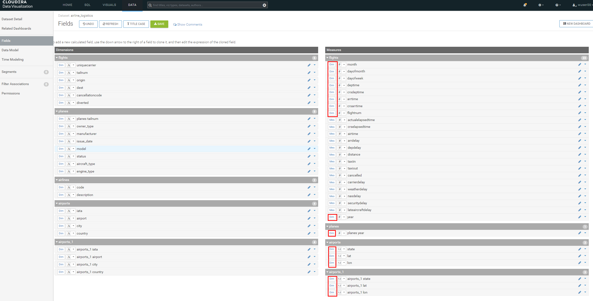

-   Click on `TITLE CASE`. And notice that the column names changes to
    be `Camel case`. Click on the `pencil` icon next to the `Depdelay`
    icon.
    
    

-   Change the `Default Aggregation` to `Average`. Click on the
    `Display Format` and then change `Category` to be `Integer`. Check
    mark the box next to the `Use 1000 separator`. Click on `APPLY`.
    
    

-   Click on the `down arrow` shown against the `Origin` column and then
    click on `Clone`. A column `Copy of Origin` is created. Click on the
    `pencil` icon next to it.
    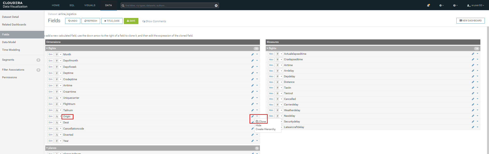
    

-   Change the `Display Name` to `Route`. Then click on `Expression` and
    enter the following in the `Expression` editor. Click on `APPLY`.

<!-- -->

    concat([Origin], '-', [Dest])

-   Click on `SAVE`. We have completed the step of data modeling and now
    we will create data visualization.
    

## Step 6(b): Creating Dashboard  

-   Now we will create a dashboard page based on the data model that we
    just created. Click on `NEW DASHBOARD`.

-   You will see the following. 

-   A quick overview of the screen that you are seeing is as follows.

    On the right side of the screen there will be a VISUALS menu.

    At the top of this menu, there is a series of Visual Types to choose from.

    There will be 30+ various visuals to choose from.

    Below the Visual Types you will see what are called Shelves. The Shelves that are present depend on the Visual Type that is selected. Shelves with a `*` are required, all other Shelves are optional. 

    On the far right of the page there is a DATA menu, which identifies the Connection & Dataset used for this visual. 
    Underneath that is the Fields from theDataset broken down by Dimensions and Measures. With each of these Categories you can see that it is subdivided by each Table in the Dataset. 

-   Let's build the 1st visual - `Top 25 Routes by Avg Departure Delay`.
    CDV will add a Table visual displaying a sample of the data from the
    Dataset as the default visualization when you create a new Dashboard
    or new Visuals on the Dashboard (see New Dashboard screen above).
    The next step is to modify (Edit) the default visualization to suit
    your needs.

-   Pick the Visual Type - Select the `Stacked Bar` chart visual on the
    top right as shown below. Make sure `Build` is selected for it to
    appear on the right side.
    

-   Find `Route` under `Dimensions → flights`. Drag to `X-Axis`.
    Similarly, find `DepDelay` under `Measures → flights`. Drag to
    `Y-Axis`. By default the aggregation selected is average and hence
    you would see `avg(Depdelay)`.
    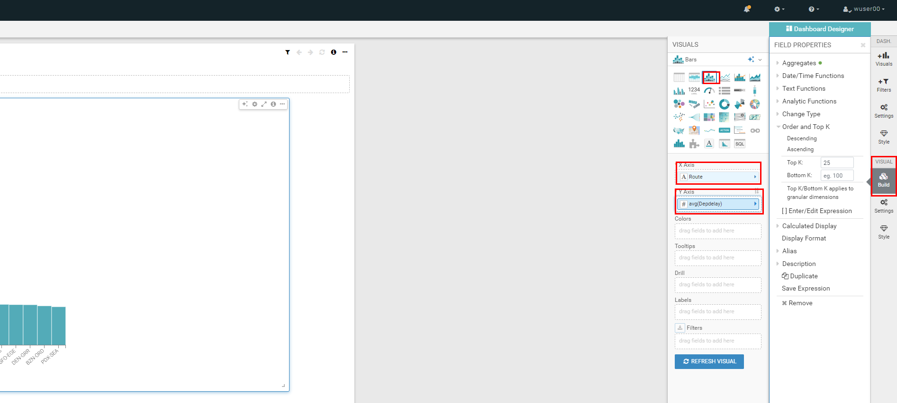

-   Click on the arrow next to `avg(Depdelay)`. Enter `50` against the
    text box labeled `Top K`. Click on `REFRESH VISUAL`.
    
    

-   Click `enter title` and enter the title based on your user id as -
    `<user_id>- Routes with Highest Avg. Departure Delays`. Then click
    on `SAVE`. 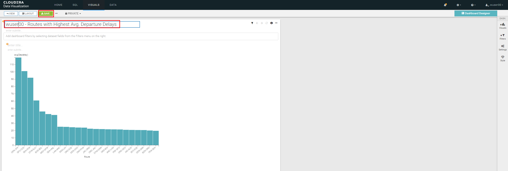

---