# 05-01 Microservices

### 1. Introduction

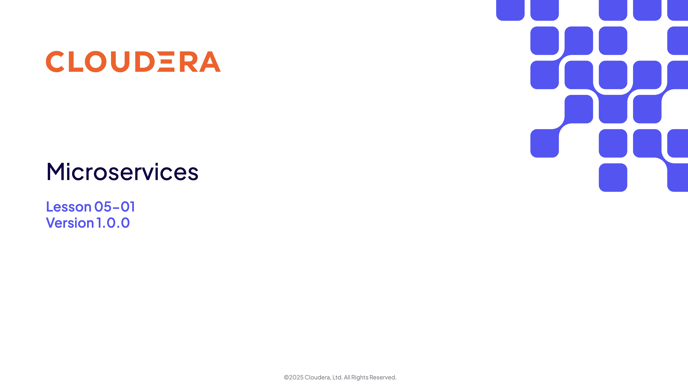

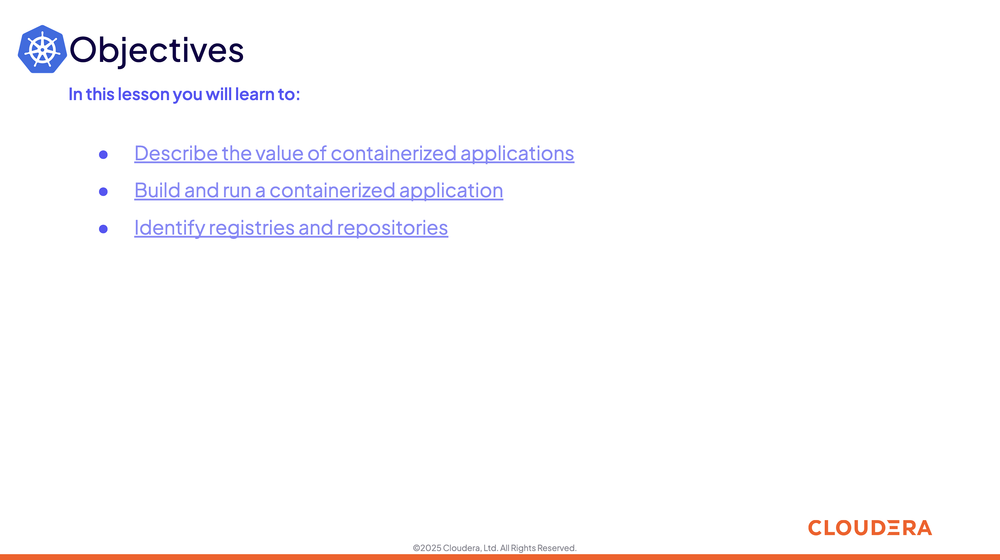

### 2. Containerized Applications

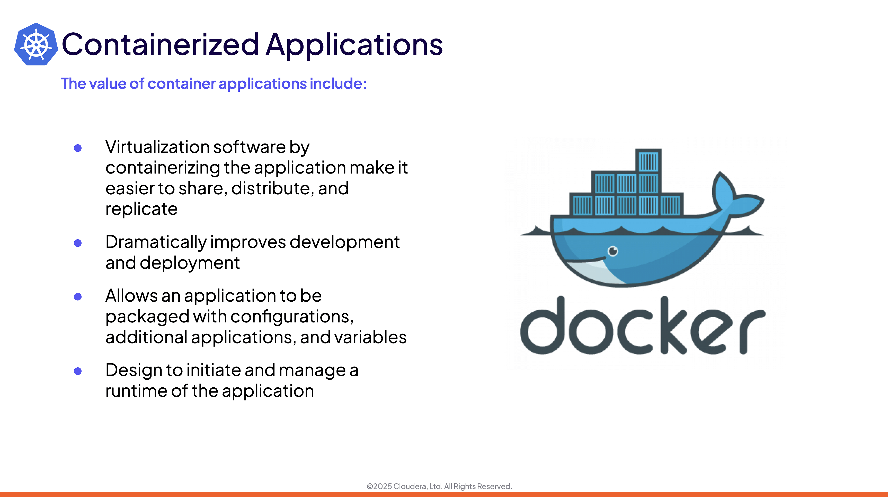

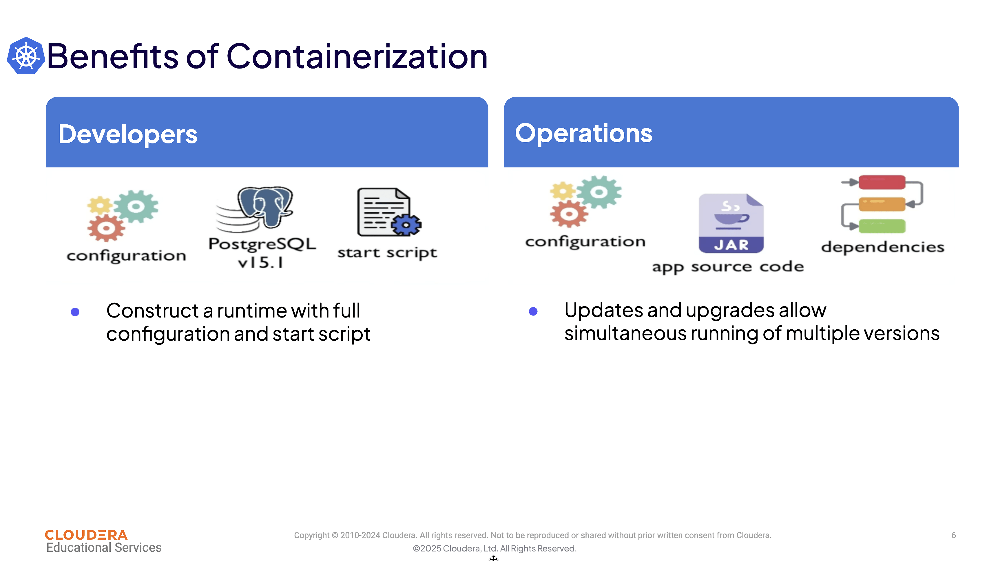

### 3. Build and Run Applications

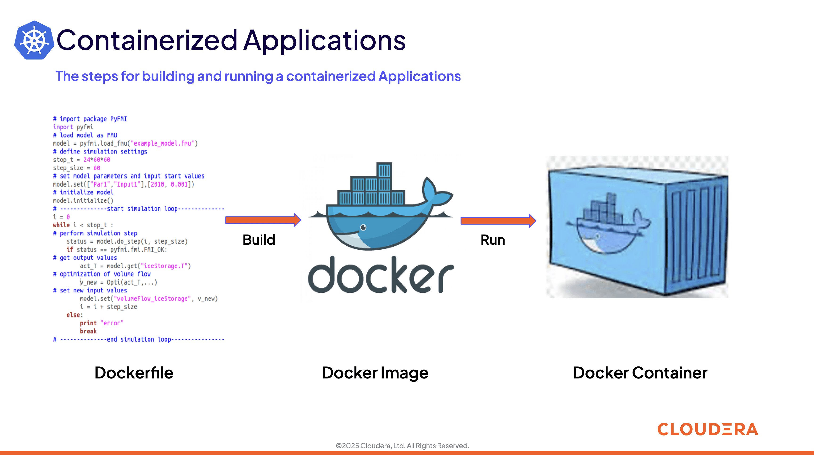

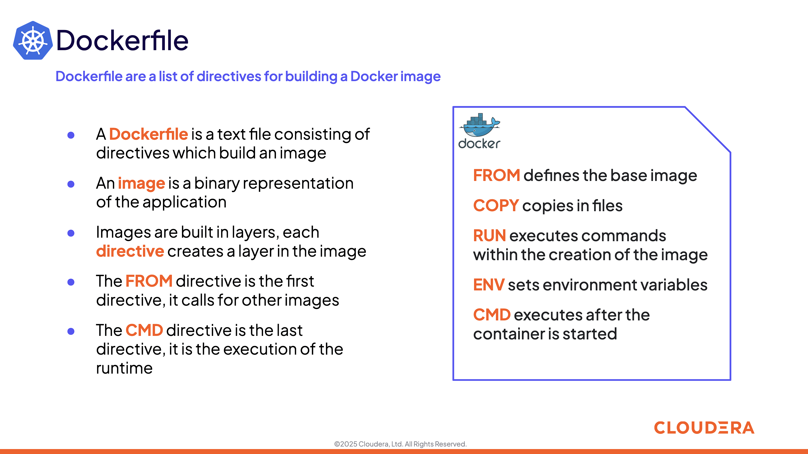

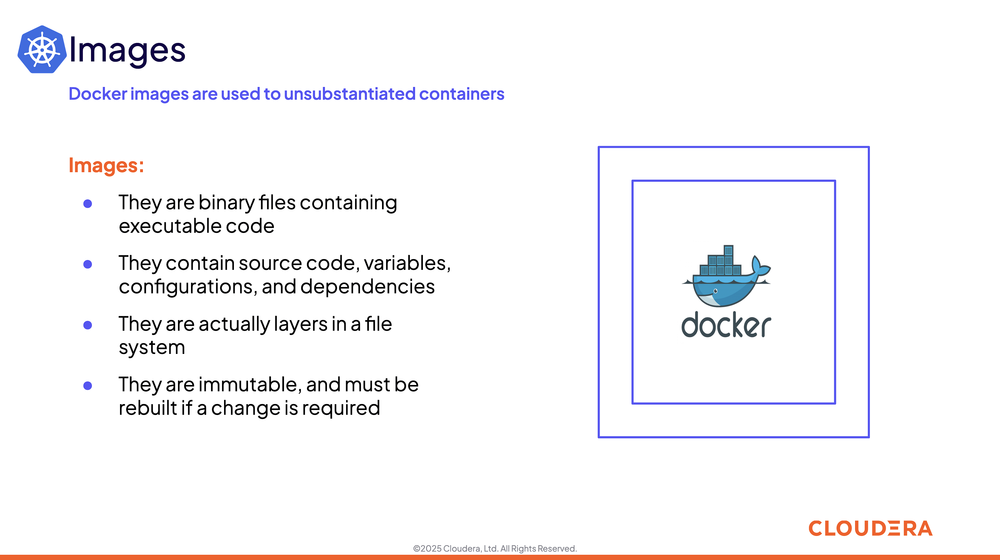

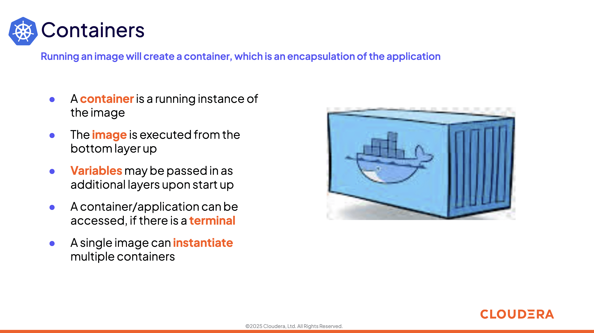

### 4. Repositories and Registries

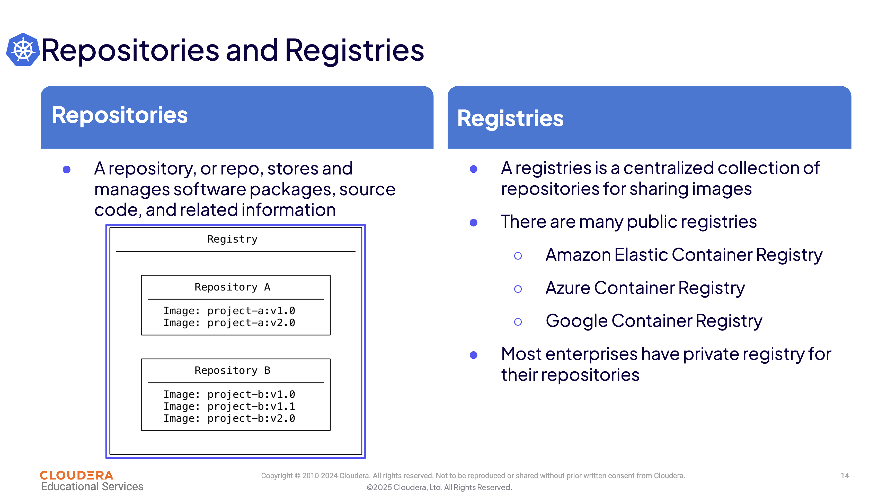

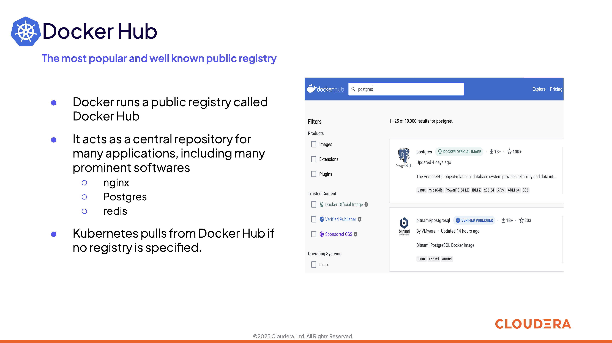

### 5. Docker

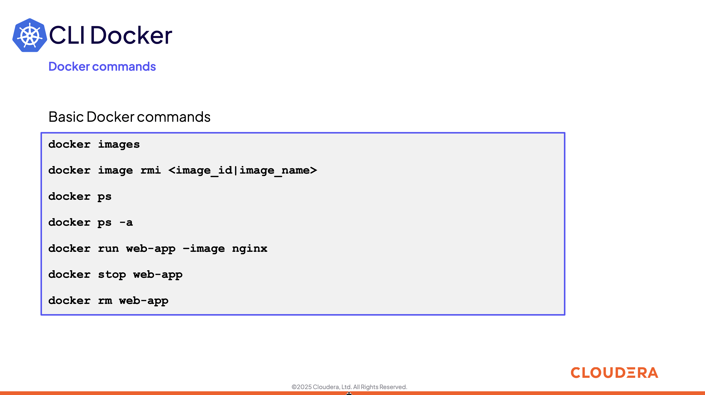

### 6. Summary and Exercise Assignments

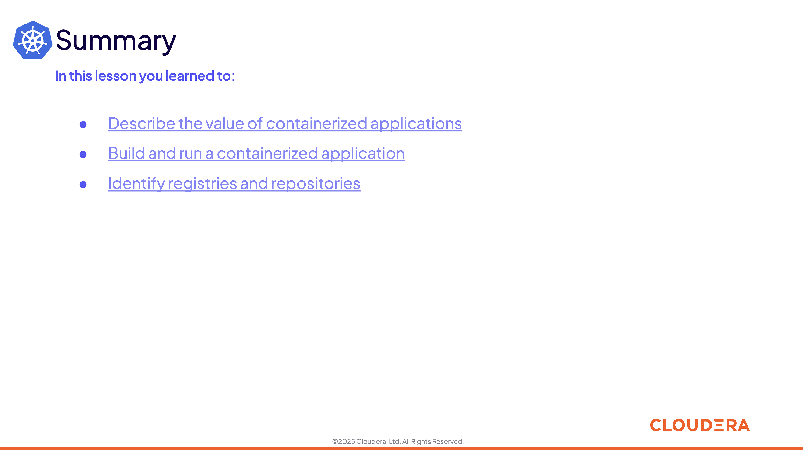

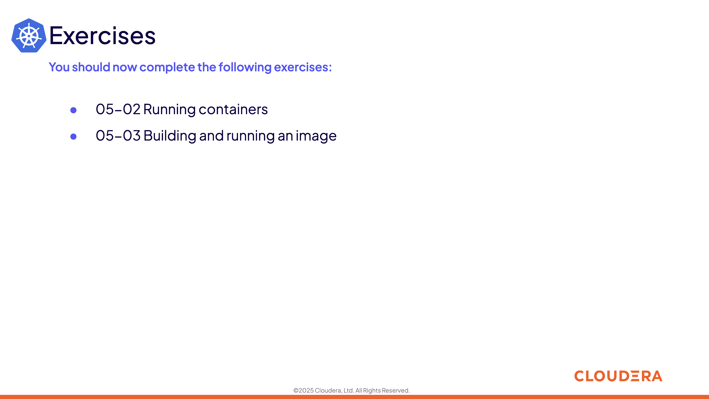

