# 05-02 Running Docker Containers

The purpose of this exercise is to learn the basic Docker commands for managing images and containers.

### 1. Review Docker Hub

#### 1.1. Open Docker Hub
Docker Hub is one of the primary public registries for Docker images. In your browser click + to add a new tab. Insert the

```
https://hub.docker.com

```

Click** return. **

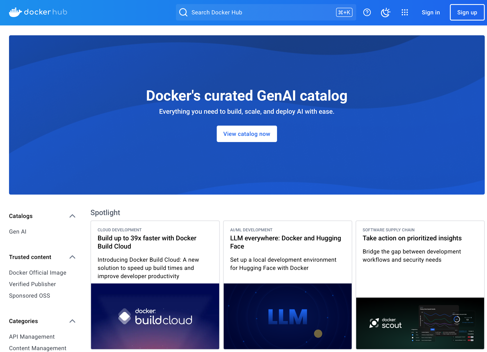


#### 1.2. Search for Software
Search for **nginx**. This page lists the available downloads. The official version is approved by both **Docker** and the **nginx **community.

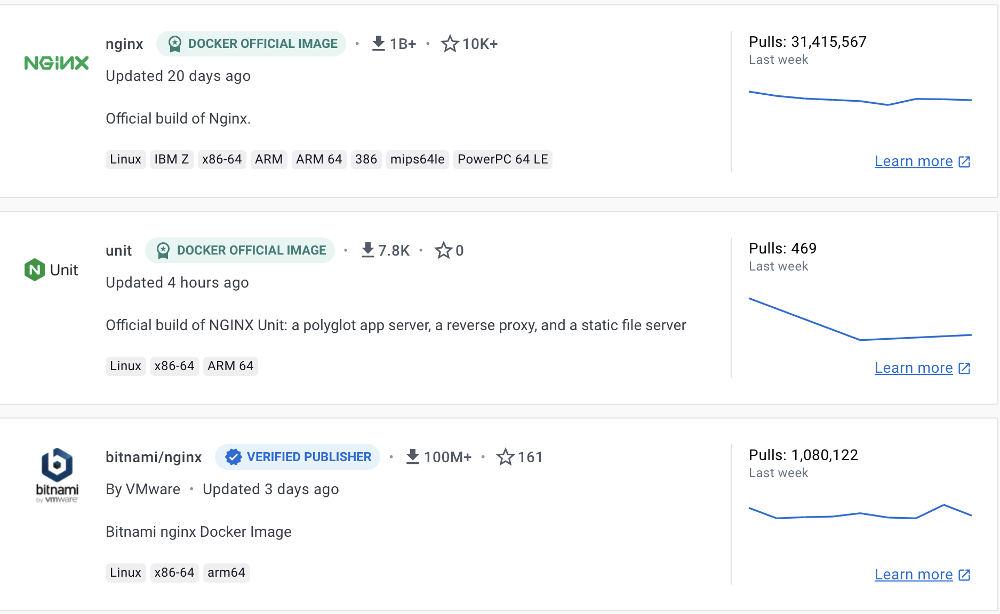


#### 1.3. Open nginx Repo
Click on **nginx Docker Official Image**. Review the list of versions. Identify one, for example **1.27.4**. 

---

**ℹ️ Latest**

The latest version can always be downloaded with nginx:latest

---


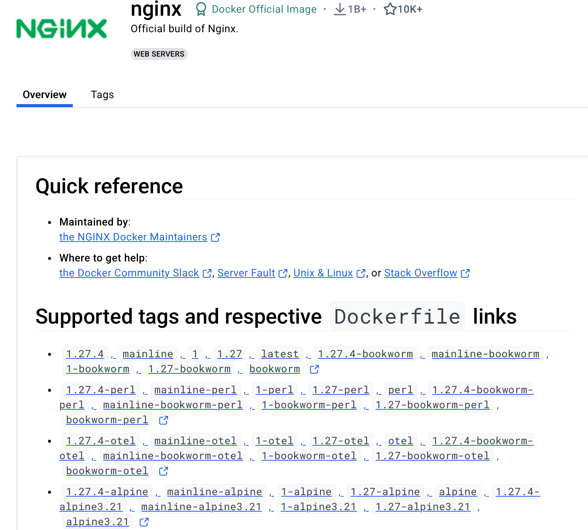


#### 1.4. Open a Version
Open a version. This generally will take you to GitHub. This is where the source code is located. 

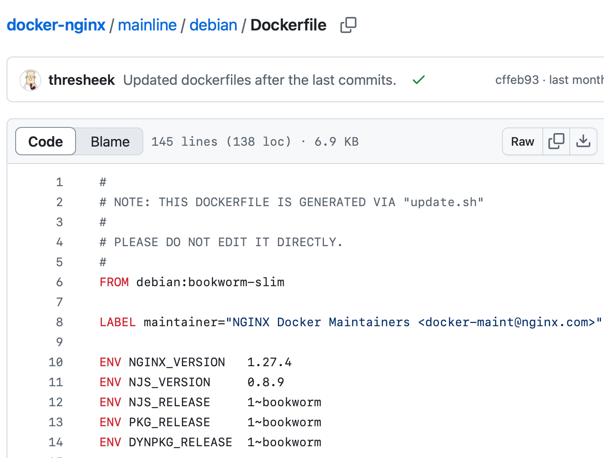


#### 1.5. Clean Up
Close out of the browser tabs.

### 2. Pull Docker Images

#### 2.1. List Available Images
This syntax lists the current available docker images. There are two Dockers images at the moment. These are prebuilt for the classroom environment.

```
docker images

```

There may be additional docker images, but these may be ignored at this point in time.

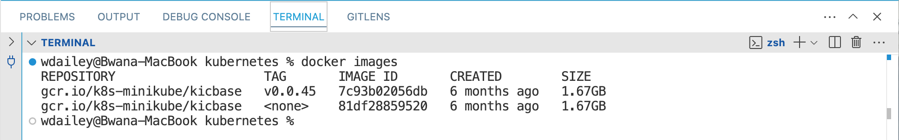


#### 2.2. List Available Images on Docker Hub
This syntax will list the available versions for the nginx software on Docker Hub.

```
docker search nginx

```

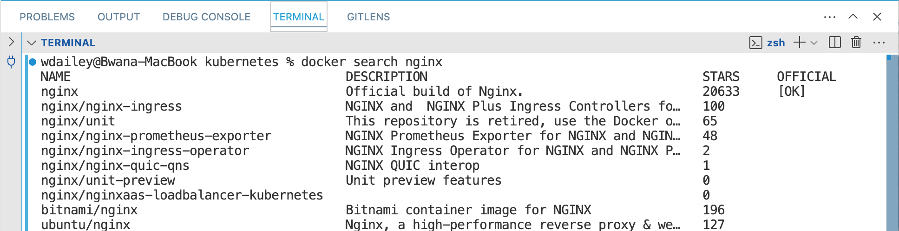


#### 2.3. Pull nginx Image
The **nginx** software is a populate a web server. It can also be used a reverse proxy, load balancer, and HTTP cache. This syntax will pull the latest version.

```
docker pull nginx

```

Notice the download comes in layers, each a separate download.

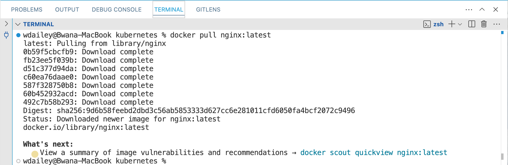


#### 2.4. List images
The Docker image list now shows **nginx**.

```
docker images

```

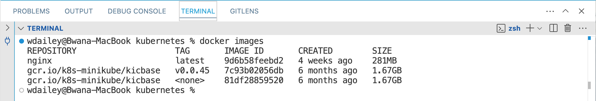


#### 2.5. Pull a Specific Software Version
Select a version from the search list and then pull the version down. Images are pulled into a local cache.

```
docker pull nginx:1.23

```

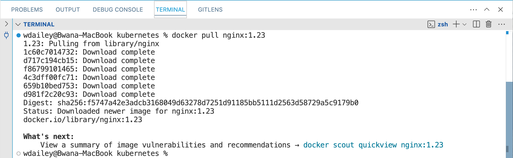


#### 2.6. List the Available Images
Notice the listing of the different versions of the software. Compare the two versions of nginx. This is one of the powers of using docker images.

```
docker images

```

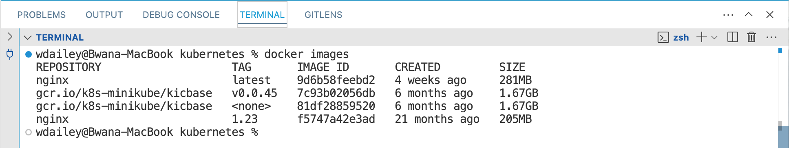


### 3. Manage Images

#### 3.1. Delete an Image
Delete the older version of nginx from the local cache. Copy and paste the IMAGE ID from the terminal.

```
docker images

```

```
docker rmi <image_id>

```

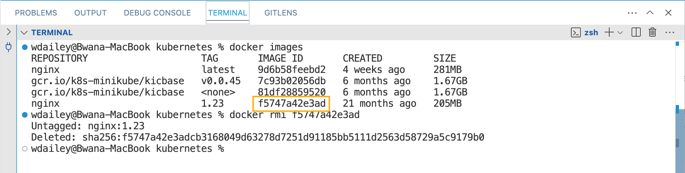


### 4. Run an Image as a Container

#### 4.1. View Running Docker Containers
This syntax lists current running docker containers. There are no containers running at this moment.

```
docker ps

```

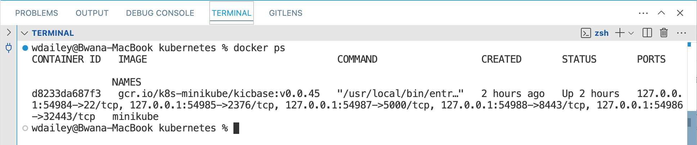


#### 4.2. Start a Docker Container
When running a Docker container it will run in the foreground and capture the terminal. 

```
docker run nginx

```

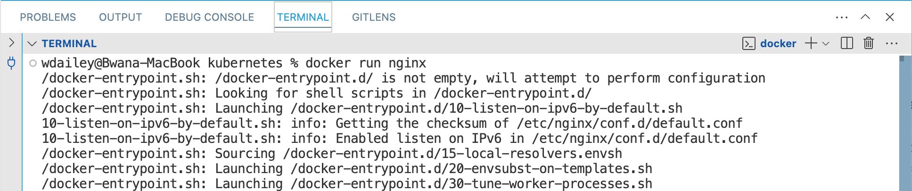


#### 4.3. Exit the Running Container
Review the output from the start up of **nginx**. This can be useful for troubleshooting. Exit with a **Crtl-C**.

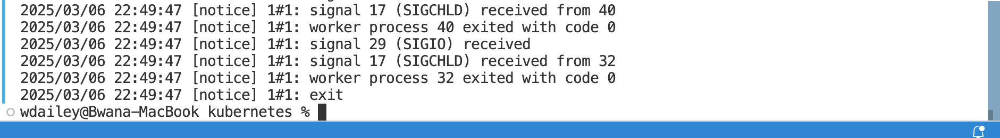


#### 4.4. Run a Docker Container in Detach Mode
The option **-d | --detach** will run the container in the background of the terminal. Notice the image ID is a long HEX number.

*docker run -d | --detach*

```
docker run -d nginx

```

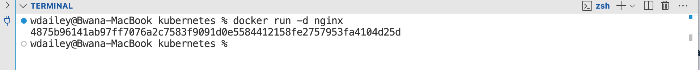


#### 4.5. List the Running Docker Containers
Docker ps shows running containers. 

```
docker ps

```

The table for container has:

- Container ID
- Image used to create the container
- Command to start the application
- Created time
- Status
- Ports
- Useful Name (not displayed in snapshot.

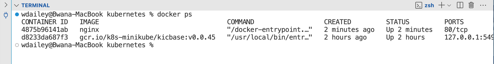


### 5. Start and Stop Containers

#### 5.1. Stop a Running Container
Copy and paste the CONTAINER ID to stop the container.

```
docker stop <container_id>

```

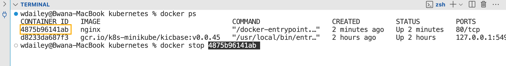


#### 5.2. List All Containers
This lists both the running and the stopped containers. Notice the status of **Exited**. This means the container is stopped.

```
docker ps -a

```

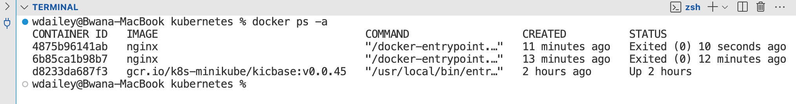


#### 5.3. Start a Container
Copy and paste the CONTAINER ID to start a nginx container. 

```
docker start <container_id>

```

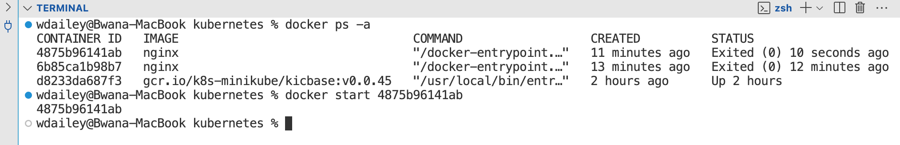


#### 5.4. Start a Second Container
Copy and paste the NAME to start another **nginx** container. You may have to scroll to the end of the line. Docker uses a convention of adverb and name to create random titles for containers.

```
docker start <container_name>

```

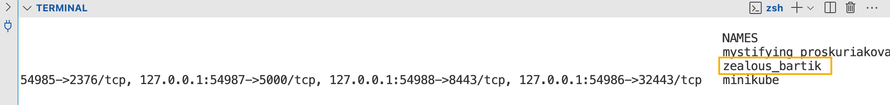


#### 5.5. List Running Containers
Both containers are running.

```
docker ps

```

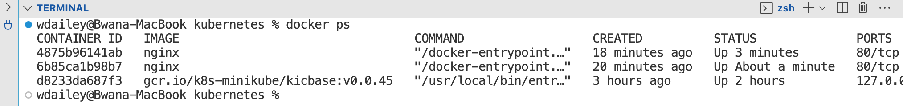


### 6. Delete a Container
Docker containers must be stopped before you can delete the container.

#### 6.1. Stop a Running Container
```
docker stop <container_id>

```

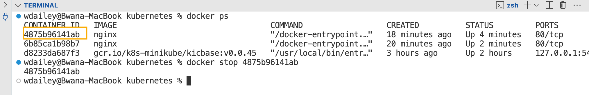


#### 6.2. Delete a Stopped Container
```
docker rm <container_id>

```

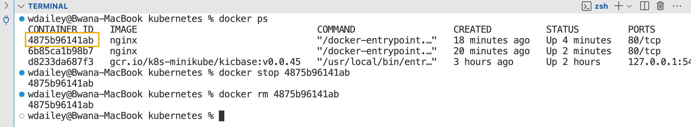


#### 6.3. Verify the Container is Removed
```
docker ps -a

```

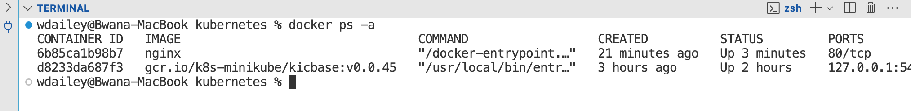


### 7. Add a Name to a Container
Docker adds a random name to every containers. It is generally two part name, one an adverb and the other a noun, such as kickass-mcnulty.

#### 7.1. Start a Container with a Name
The option -n | --name will add a specific name to a container.

```
docker run -d --name app-frontend  nginx

```

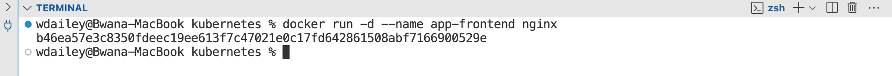


#### 7.2. List Running Containers
Verify the name of the container is app-frontend.  You may have to scroll to the end of the line. Assigning a name will make managing containers significantly easier.

```
docker ps

```

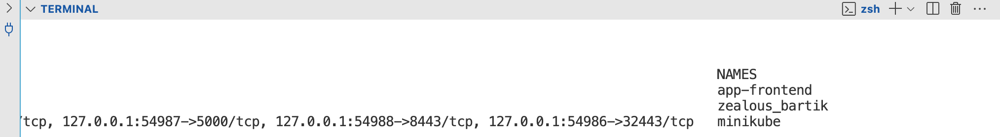


#### 7.3. Stop nginx Containers
Stop all running containers. One will use the assigned name and the other will use the CONTAINER ID.

```
docker stop app-frontend <container_id>

```

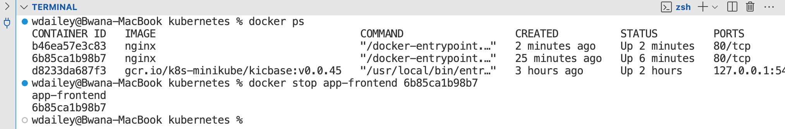


#### 7.4. Remove nginx Containers
Delete all stopped containers.

```
sudo docker rm app-frontend <container_id>

```

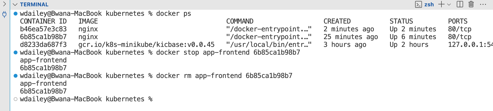


### 8. Map a Port to a Container

#### 8.1. Map a Port to a Container
Container start on an internal Docker network. There is no direct access. The option -p | --publish <local_port>:<container_port> will map a port to a container. This will provide access to the container.

> docker run --name <name> -d | --detach -p | --publish <local port: container port> image:id

```
docker run --detach --name app-frontend --publish 8080:80 nginx

```

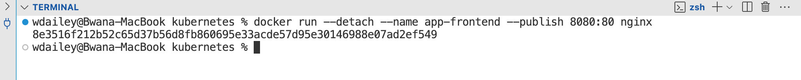


#### 8.2. List Running Containers
Notice the PORTS addressing and the NAMES.

```
docker ps

```

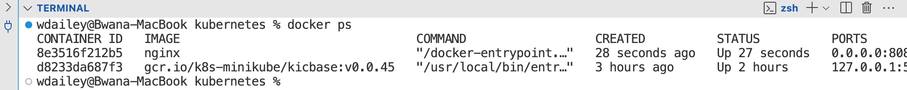


### 9. Open nginx

#### 9.1. Open nginx
Open a broswer tab, click **+**, and enter the URL:

```
http://localhost:8080

```

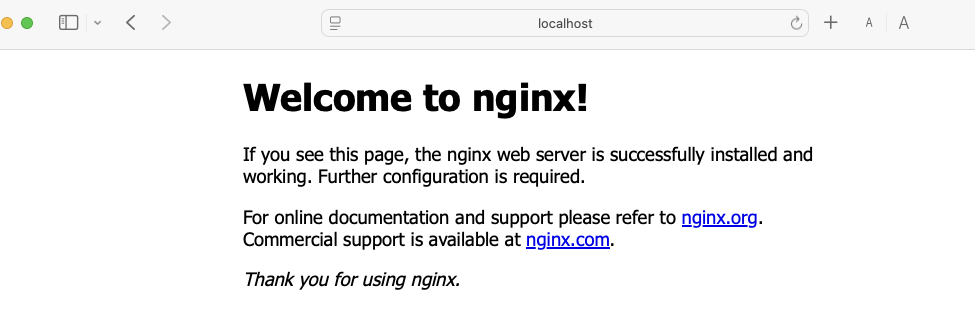


### 10. View Container Logs

#### 10.1. View the Container Logs
View the docker logs for the web container. Notice the comments about the docker enterpoint.

```
docker logs app-frontend

```

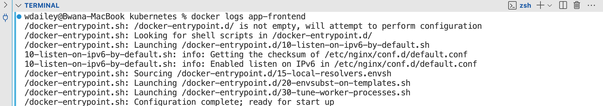


### 11. Open Shell in the Container

#### 11.1. Open Shell in the Container
A useful capability is to log into the container. Run a Docker container with /bin/bash to open a terminal within the container. The** -i** option attaches stdin and stdout. The** -t** option allocates a terminal.

```
docker run --name nginx-shell -i -t nginx /bin/bash

```

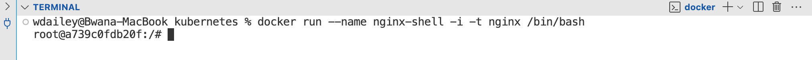


#### 11.2. Run Shell Commands in Container
The CentOS container has started and the bash shell is open.

```
ls /etc

```

```
cat /etc/bash.bashrc

```

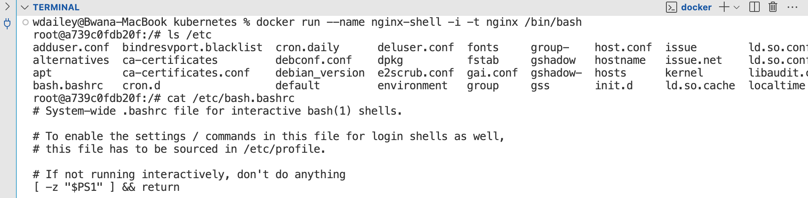


#### 11.3. Exit Container Shell
To disconnect from the container type exit.

```
exit

```

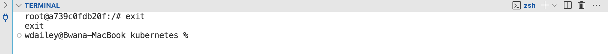


### 12. Clean Up

#### 12.1. Stop containers
List all of the running containers.

```
docker ps 

```

Stop all nginx containers.

```
docker stop <nginx_container_id>

```

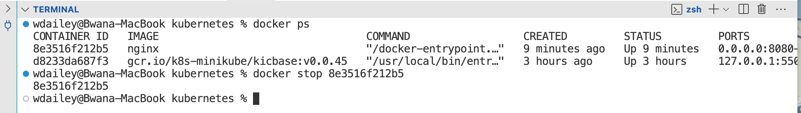


#### 12.2. Delete All nginx Containers
List all containers, running and stop.

```
docker ps -a

```

Delete all stopped containers with the prune option.

```
docker container prune

```

---

**⚠️ Warning**

Do not delete the minikube container

---


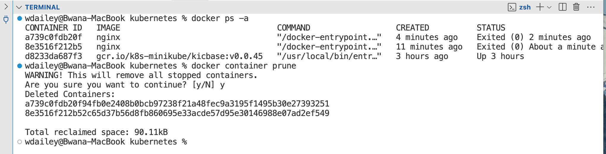


#### 12.3. Verify Clean Up
```
docker ps -a

```

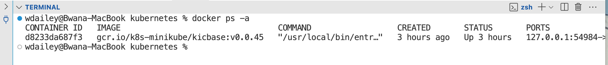


### 13. End of Exercise


