# 05-03 Building a Microservice

The purpose of this exercise is to use a Flask to create a simply containerized web application. A Dockerfile is used to create the directives for building the Docker image. And the image is used to start up a Docker container running a simple python application.

### 1. Review the Python Script

#### 1.1. Change Directories
```
cd app-frontend

```

```
ls

```

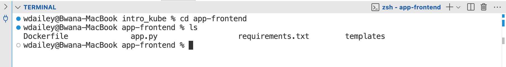


#### 1.2. Review the Python Script
The python script imports **Flask** and a method **render_template**. It will set a route to the directory templates and search for index.html. It sets to the **localhost** at 0.0.0.0.

```
cat app.py

```

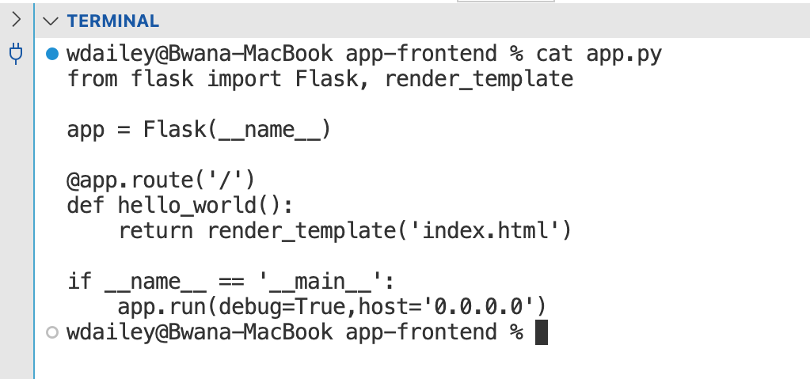


#### 1.3. Review the Requirments
The requirements file sets packages and libraries. This is a standard file for **Python**.

```
cat requirements.txt

```

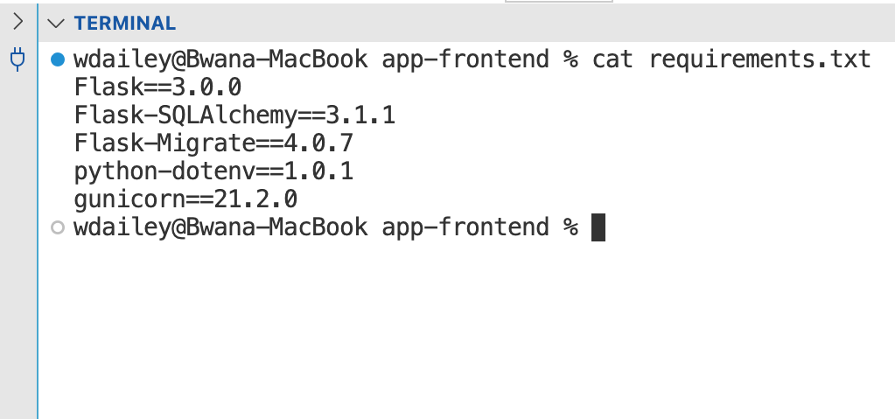


### 2. Review the Dockerfile

#### 2.1. Review the Dockerfile
```
cat Dockerfile

```

- **FROM** pulls in a python image running in Alpine Linux
- **RUN** updates the pip
- **WORKDIR** sets the working directory in the application to /app
- **ADD** copies in all of the files from the local directory to /app
- **RUN** installs the packages and libraries in the requirements.txt file
- **CMD** executes python to run the app.py script

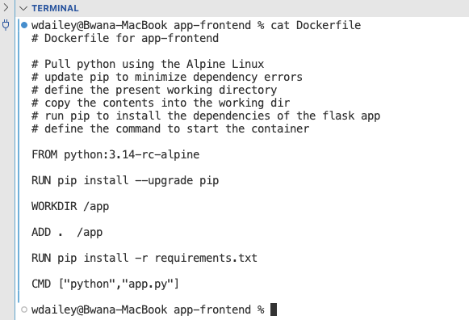


#### 2.2. Description of the Dockerfile
- The standard file name is always Dockerfile
- Dockerfiles builds images in layers
- The first layer is the base image, which is a pre-build docker image. Generally a application support such as java or an OS, such as Ubuntu or CentOS.
- The directive FROM will pull a base image from Docker Hub. In this example the node image with a specific image.
- The directive COPY will copy from a localhost and copy them into the container. In this example both the package.json and the src for the java script are called into a folder called /app.
- The directive WORKDIR sets a path as the default directory inside of the container. In this example this is the location as the java script and the dependency file.
- The directive RUN will run a command in a shell inside the container. In this example the npm install to install dependencies.
- The last directive is always CMD. This is the command to start the application in the container. In this example we are start the node command and passing in the java script.

### 3. Build an Image

#### 3.1. List Images
```
docker images

```

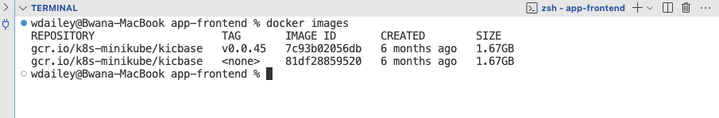


#### 3.2. Build the Image
Follow the directives of the Dockerfile to see the image layers being built. This Dockerfile directorive begins by downloading node:20-alpine. The -t or --tag option tags the image.

> docker build -t | --tag tag_name:version path_to_Dockerfile

```
docker build -t app-frontend .

```

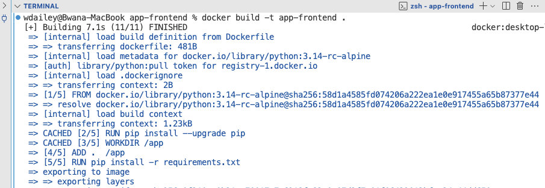


#### 3.3. List images
There are two new images. One for node:20-apline and the other for the Clouddev application.

```
docker images

```

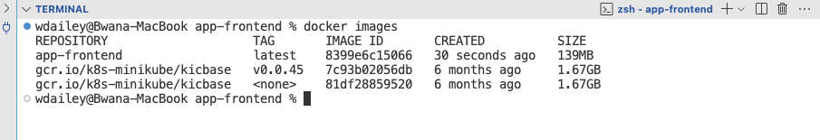


### 4. Run a Container

#### 4.1. Run the Container
This syntax will start a container named app-frontend. The name of the container is app-frontend. It maps host port 8040 to the container port for Flask, which is 5000. The Docker image is also app-frontend.

```
docker run -d --name app-frontend -p 8040:5000 app-frontend

```

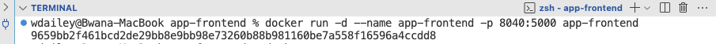


#### 4.2. List Running Containers
```
docker ps

```

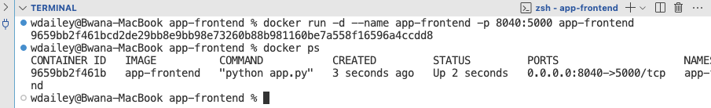


#### 4.3. Review Logs
```
docker logs app-frontend

```

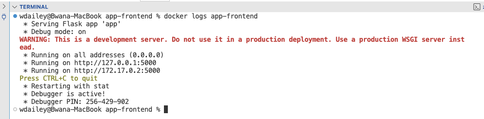


### 5. Verify the Web App

#### 5.1. Check the URL
Open a tab on Firefox and insert this URL.

```
http://localhost:8040

```

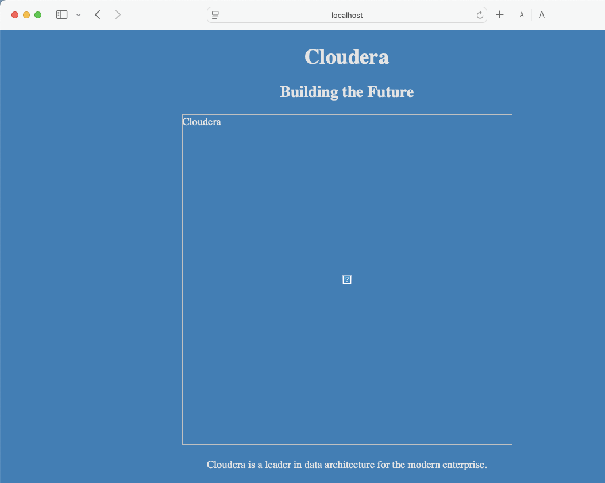


### 6. Clean Up

#### 6.1. Remove Container
```
docker ps

```

```
docker stop app-frontend

```

```
docker rm app-frontend

```

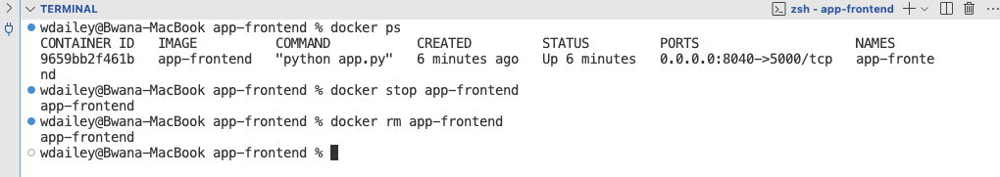


#### 6.2. Remove Image
```
docker images

```

```
docker rmi app-frontend

```

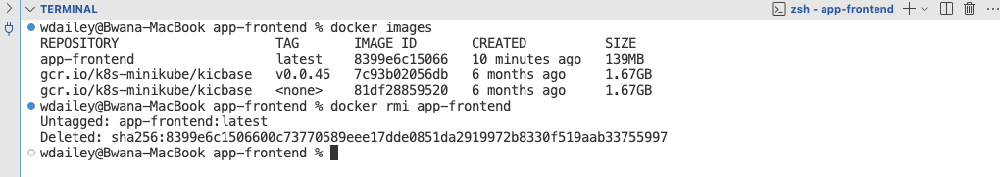


#### 6.3. Change Directories
```
cd ..

```

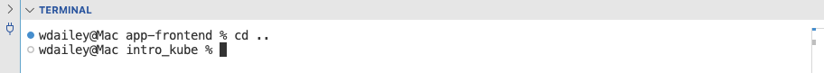


### 7. End of Exercise


