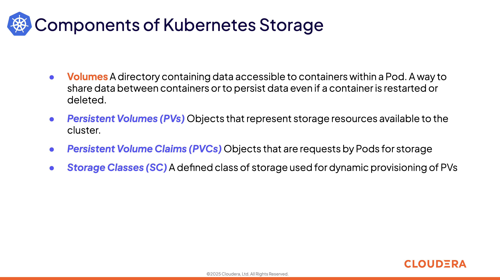

# 06-02 Architecture for Kubernetes Resources

### 1. Introduction

#### 1.1. 

#### 1.2. 

### 2. Kubernetes Resources

#### 2.1. 

### 3. Configurations

#### 3.1. 

#### 3.2. 

#### 3.3. 

#### 3.4. 

#### 3.5. 

### 4. Networking

#### 4.1. 

#### 4.2. 

#### 4.3. 

#### 4.4. 

#### 4.5. 

#### 4.6. 

#### 4.7. 

#### 4.8. 

#### 4.9. 

### 5. Access Control

#### 5.1. 

#### 5.2. 

### 6. Storage

#### 6.1. 

#### 6.2. 

#### 6.3. 

#### 6.4. 

#### 6.5. 

#### 6.6. 

#### 6.7. 

#### 6.8. 

#### 6.9. 

### 7. Summary and Exercise Assignments

#### 7.1. 

#### 7.2. 

