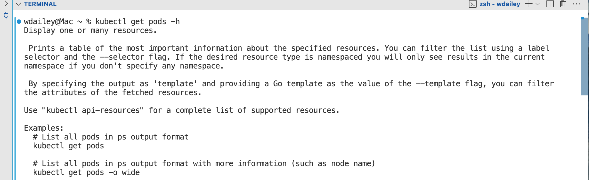
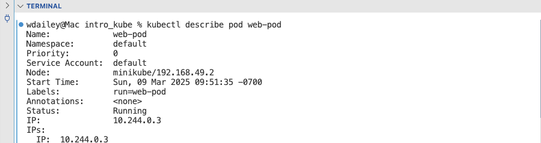
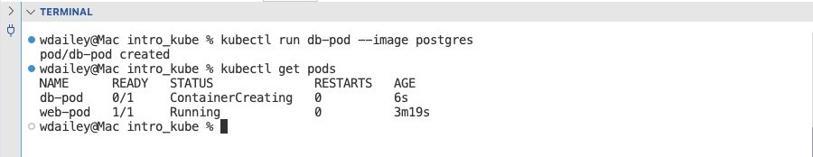
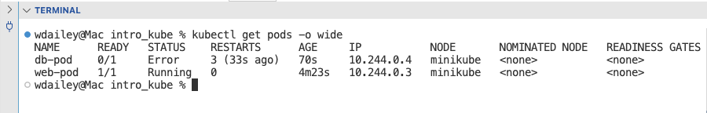
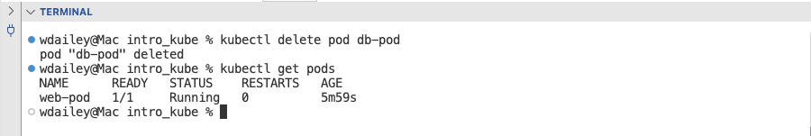
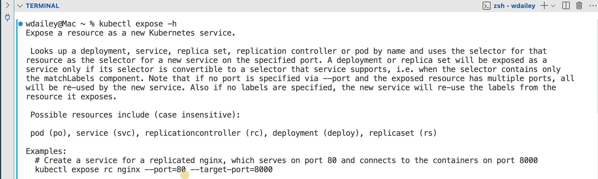
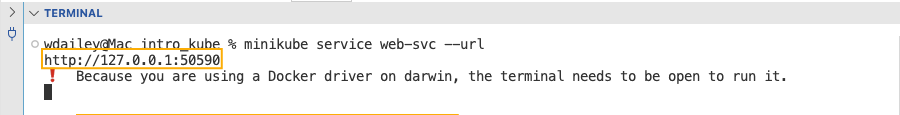
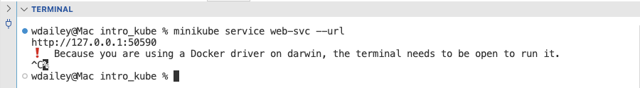
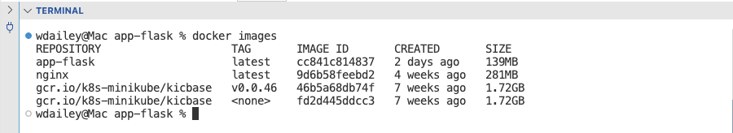
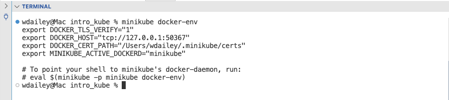

# 06-03 Running Pods and Services

The purpose of this exercise is to run Kubernetes CLI tools, which includes kubectl and K9s.

### 1. Review kubectl Usage

#### 1.1. Review kubectl Usage
Page through the help pages to overview kubectl. Identify the basic commands, such as get, edit, explain and delete. Take your time to review the help page. 

```
kubectl --help 

```


#### 1.2. Review kubectl Usage
The kubectl command has excellent usage statements. Review this usage statement to review the various example commands. Review this page for the syntax. 

```
kubectl get pods -h

```




### 2. Kubernetes Pods

#### 2.1. View All Pods
Get a list of all Pods in the Default namespace. Currently there are no Pods running.

```
kubectl get pods

```


#### 2.2. Start a Pod
Start up a Pod for nginx. The option --image has a default to pull from Docker Hub.

```
kubectl run web-pod --image nginx

```

```
kubectl get pods

```


#### 2.3. Inspect the Pod
Inspect the Pod. Scan through to find the image name. What Port is assigned to the Pod?

```
kubectl describe pod web-pod

```




#### 2.4. Review the Logs
```
kubectl logs web-pod

```


#### 2.5. Start another Pod
Start up a Pod for postgresql

```
kubectl run db-pod --image postgres

```

```
kubectl get pods

```




#### 2.6. List Pods for More Details
Get a list of pods using the -o wide option.

```
kubectl get pods -o wide

```




#### 2.7. View Logs
A CrashLoopBackOff is a failure to start. View the logs for the failing Pod.

```
kubectl logs pgsql-pod

```

This container needs configuration. It needs to have a ConfigMap with input variables.


#### 2.8. Delete a Pod
There is an issue with one of the Pods. Delete the Pod in CrashLoopBackOff.

```
kubectl delete pod db-pod

```

```
kubectl get pods

```




### 3. Kubernetes Services

#### 3.1. Review the Usage for service
Review the usage statement for the service.

```
kubectl expose -h

```




#### 3.2. Expose the ports for nginx
The expose command will assign ports to allow access to nginx. Port 80 is for the nginx Pod and the target port opens a listener on the host.

```
kubectl expose pod web-pod --name web-svc --type NodePort --port 8080

```

```
kubectl get svc

```


#### 3.3. Set up service tunnel
Minikube is running as a Docker container. The service is only exposed from the Pod to the minikube container. A service tunnel must be opened to allow access from the local host to the minikube container. The terminal needs to remain open to access the url. The --url will output the correct URL to access the web page.

```
minikube service web-svc --url

```




#### 3.4. Verify Access to nginx
Open a tab in your browser and verify access to nginx. Copy and paste in the URL.

```
http://localhost:8888

```

When done close the tab.


#### 3.5. Exit the URL
Exit the minikube service tunnel with **Ctrl-C**.




### 4. Load a Microservice in minikube
These steps will build the app-frontend image and then load the image into minikube.

#### 4.1. Change Directory to Dockerfile
```
cd app-flask

```


#### 4.2. Build an Image
```
docker build -t app-flask .

```


#### 4.3. List Images
```
docker images

```




#### 4.4. Change Directory
```
cd ..

```


#### 4.5. Verify Docker Enviroment
```
minikube docker-env

```




#### 4.6. Set Variable
```
eval $(minikube docker-env)

```


#### 4.7. Load Image into Minikube
```
minikube image load app-flask

```

```
minikube image list

```


### 5. Kubernetes Namespaces

#### 5.1. View Namespaces
View all of the current namespaces.

```
kubectl get namespaces

```


#### 5.2. Create a Namespace
```
kubectl create namespace app

```

```
kubectl get namespaces

```


#### 5.3. List the Resources in the Namespace
```
kubectl -n app get all

```


### 6. Run the Microservice in the Namespace

#### 6.1. Create a Pod with the Image
```
kubectl -n app run flask-pod --image app-flask --image-pull-policy=Never --port 5000 

```

- Namespace: app
- Pod name: app-pod
- Image: app-frontend
- Image pull policy: pulls the image from the local cache and not the default Docker Hub
- Port: opens the application port

```
kubectl -n app get pods

```


#### 6.2. Inspect the Pod
```
kubectl -n app describe pod flask-pod

```

Find the Port for the Pod. It should be set to 5000/TCP.


#### 6.3. Create the Service for the Pod
```
kubectl -n app expose pod flask-pod --name flask-svc --type NodePort --port 5000 --target-port 5000

```

- Namespace: app
- Pod: app-pod
- Service Name: app-svc
- Type: NodePort, this will open a listener on the minikube host
- Port: The port for the service
- Target Port: The port for the Pod

```
kubectl -n app get all

```


#### 6.4. Inspect the Service
```
kubectl -n app describe svc flask-svc

```


#### 6.5. List the Endpoint
This is the IP address and Port number to reach the app service. The app service will route forward to the Pod.

```
kubectl -n app get endpoints

```


#### 6.6. Open the minikube Service Tunnel
```
minikube -n app service flask-svc --url

```

Copy the http://IP_address:Port Number to a clipboard.


#### 6.7. Verify Access to the Application
> http://IP_address:Port_Number


### 7. Clean Up

#### 7.1. Clean Up
Close the tab on the browser.

Use **Ctrl-C** to exit the minikube service tunnel. Leave the application running.

---

**ℹ️ Leave the Pods Running**


---


### 8. End of Exercise


