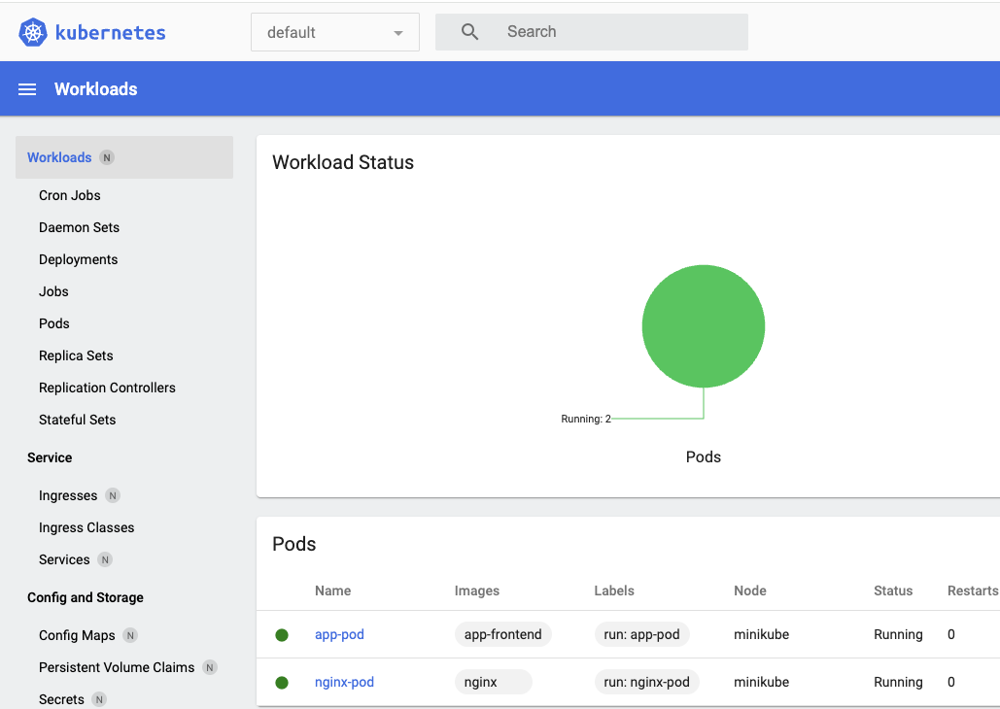

# 06-04 Inspecting the Kubernetes Dashboard

The purpose of this exercise is to tour the Kubernetes web UI and to learn the functions for reviewing logs in pods.

### 1. Open Kubernetes Dashboard

#### 1.1. Open the Kubernetes Dashboard
The minikube dashboard command will automatically open a web page to the Kubernetes Dashboard. You must leave the terminal open.

```
minikube dashboard

```


#### 1.2. Review the Kubernetes Dashboard
The dashboard opens to the default namespace. It shows an overview of the current workloads. Here we observe two Pods are running. You may have different Pods open.




#### 1.3. Review the Menu
The left hand column is a list of filters for the Kubernetes resources. Scroll update down this list. Many were discussed in the class.


### 2. Open a Namespace

#### 2.1. Open a Namespace
Click on **default**. 


#### 2.2. Search for a Namespace
This lists all of the current running namespaces. 

Select the namespace for **app**.


### 3. Inspect the Pod

#### 3.1. Select the Pod
Click on **web-pod.**


#### 3.2. Inspect the Pod Details
Scroll up and down the page to inspect the Pod details.  At the bottom of the page you will find the information about the container.


#### 3.3. Open the Logs
Click on the icon for logs. 


#### 3.4. Review the Logs
Review the logs. When done click on the breadcrum trail to return to **flask-pod**.


#### 3.5. Open the Shell
Click on the icon for shell. If a terminal is available this will execute into the pod.


#### 3.6. Inspect the Container
```
ls

```

```
cat Dockerfile

```

When done click on the breadcrum trail to return to **flask-pod**.


#### 3.7. Open the Configuration
Click on the icon for configuration. This will display the mainifest file for the Pod.


#### 3.8. Review the Manifest File
The mainifest file can be formatted as YAML or as JSON. Review both.

Click **Cancel** when done.


### 4. Inspect the Service

#### 4.1. Open Services
Click on **Services** in the left hand table of contents. Click on the** flask-svc.**


#### 4.2. Review the Service
Scroll up and down the page to review the service. 


#### 4.3. Review the Service Mainifest File 
Click on the edit icon to review the manifest file. Scroll to find the properties for the ports. The host port is set to 32082, the service port is set to 8040, and the Pod port is set to 5000.

Click **Cancel** when done.


### 5. Clean Up

#### 5.1. Close Dashboard
Close the tab for the Kubernetes Dashboard. Use **Ctrl-C** to exit the minikube service tunnel.


#### 5.2. Delete Flask Pods and Services

---

**⚠️ Do Not Delete service/kubernetes**

Do not delete the service kubernetes in the default namespace.

---

```
kubectl -n app delete pod flask-pod

```

```
kubectl -n app delete service flask-svc

```


#### 5.3. Delete Web Pods and Services
```
kubectl delete pod web-pod

```

```
kubectl delete service web-svc

```


### 6. End of Exercise


