# 07-01 Kubernetes Manifest Files

### 1. Introduction

#### 1.1. 

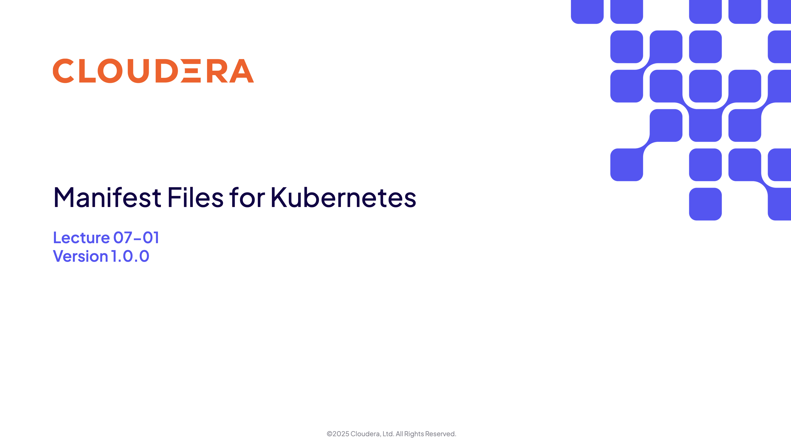

#### 1.2. 

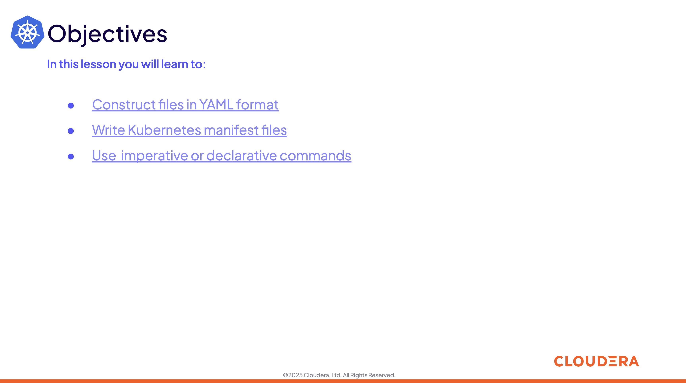

### 2. YAML Files

#### 2.1. 

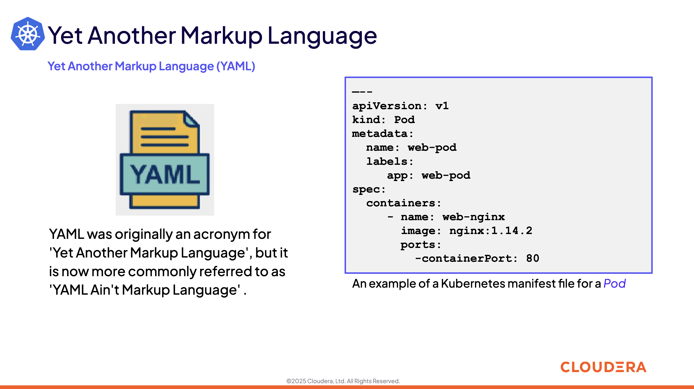

#### 2.2. 

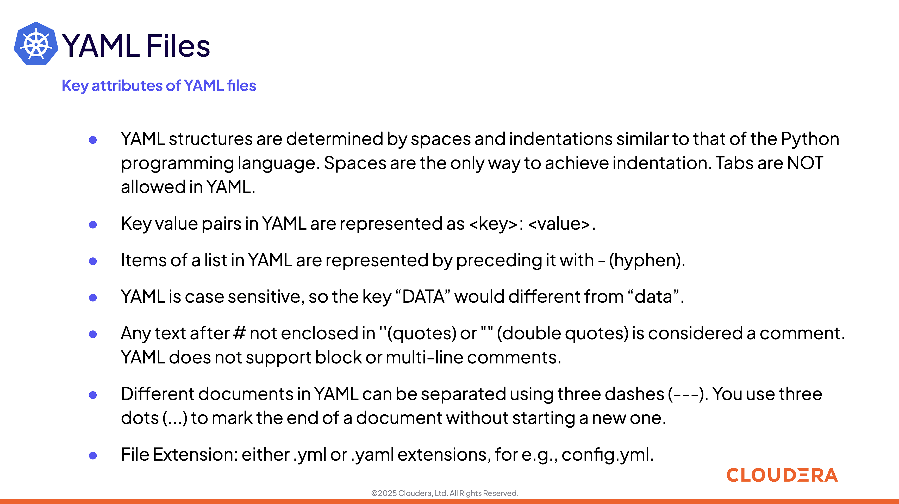

#### 2.3. 

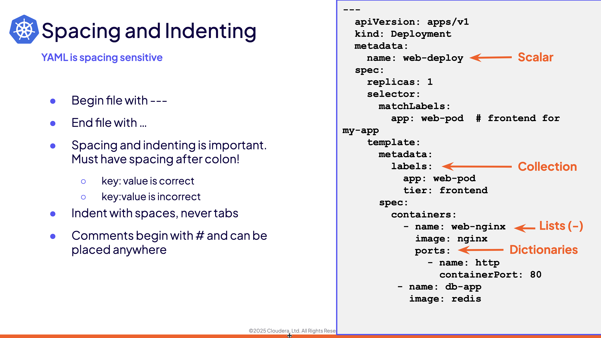

#### 2.4. 

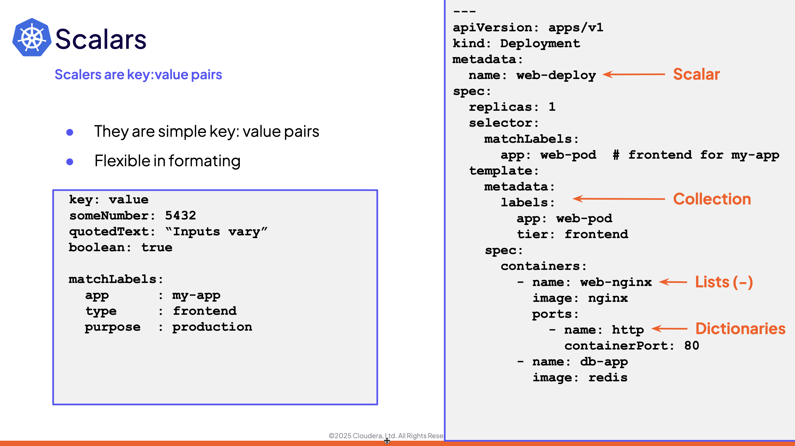

#### 2.5. 

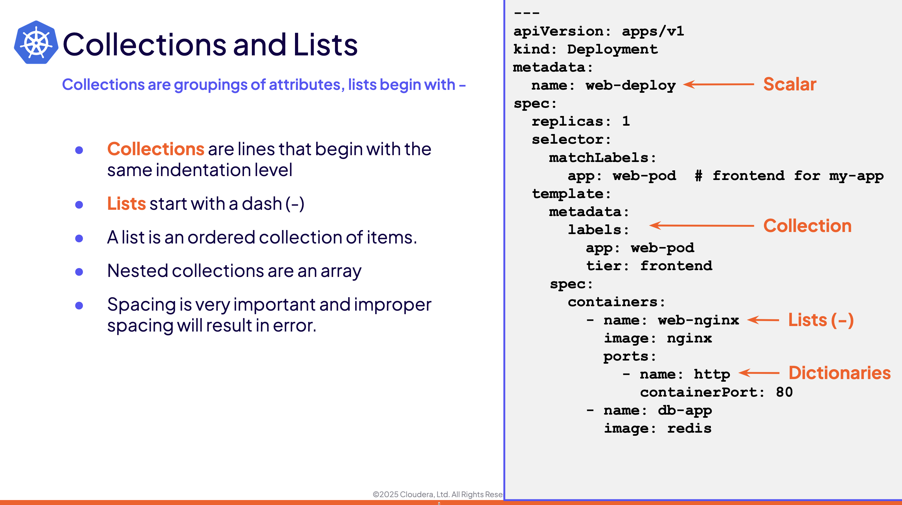

#### 2.6. 

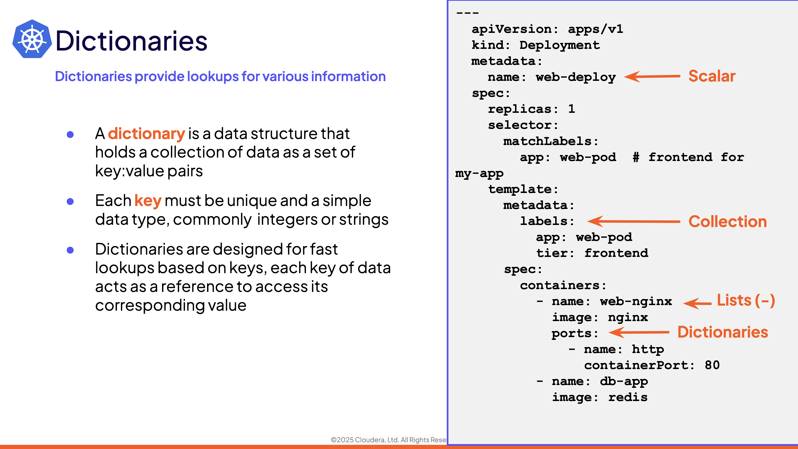

### 3. Manifest Files

#### 3.1. 

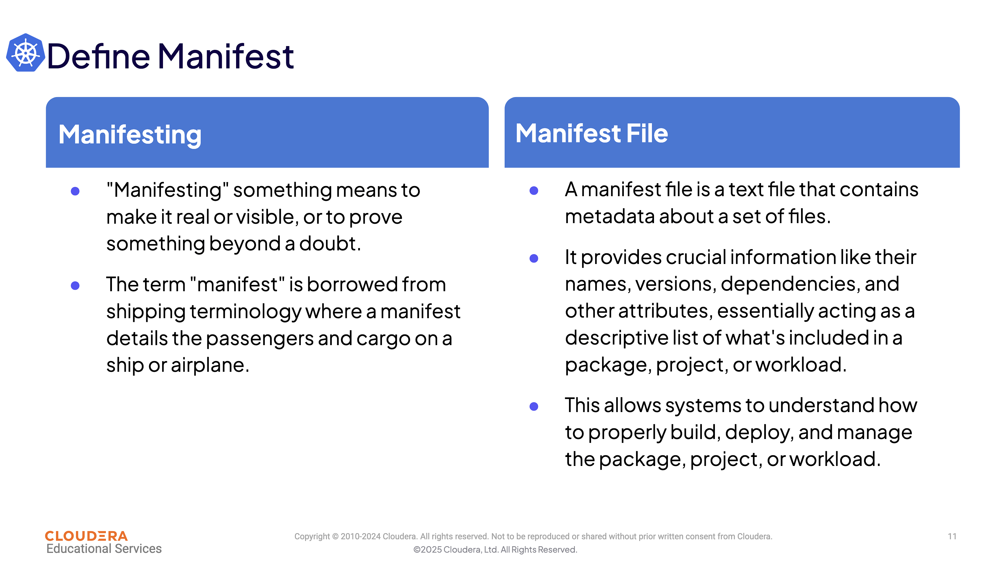

#### 3.2. 

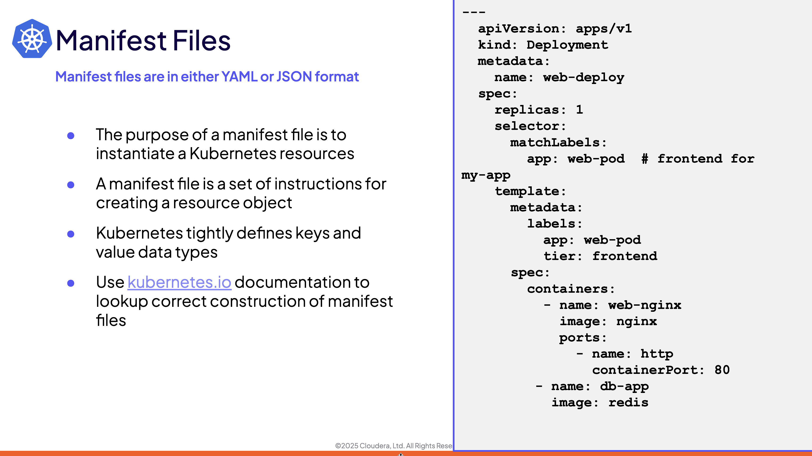

#### 3.3. 

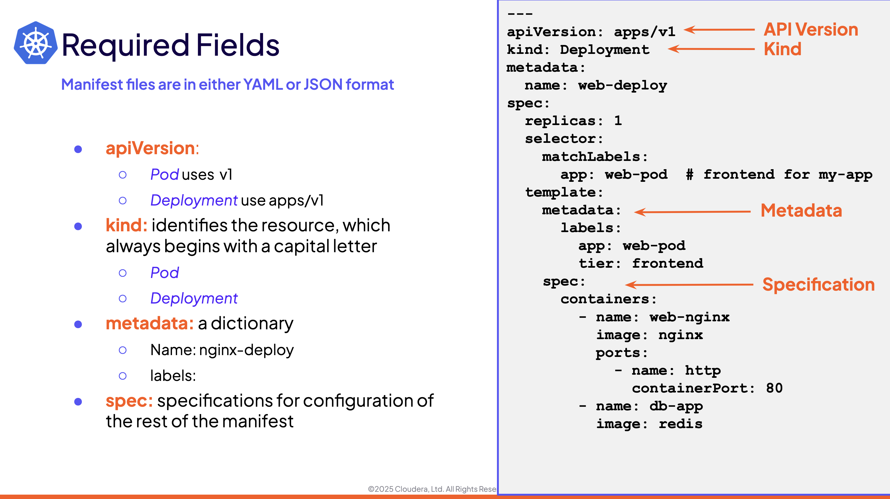

### 4. Imperative vs Declarative

#### 4.1. 

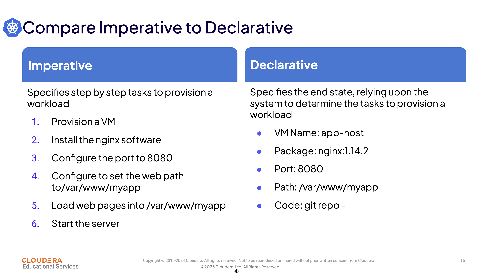

#### 4.2. 

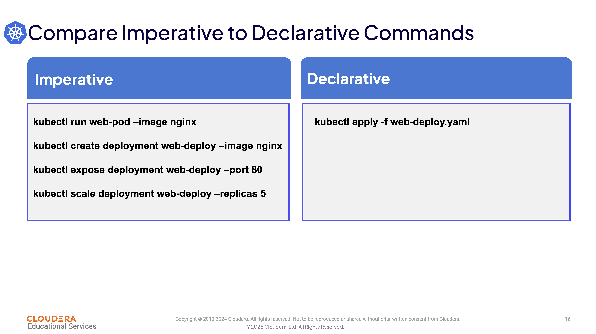

#### 4.3. 

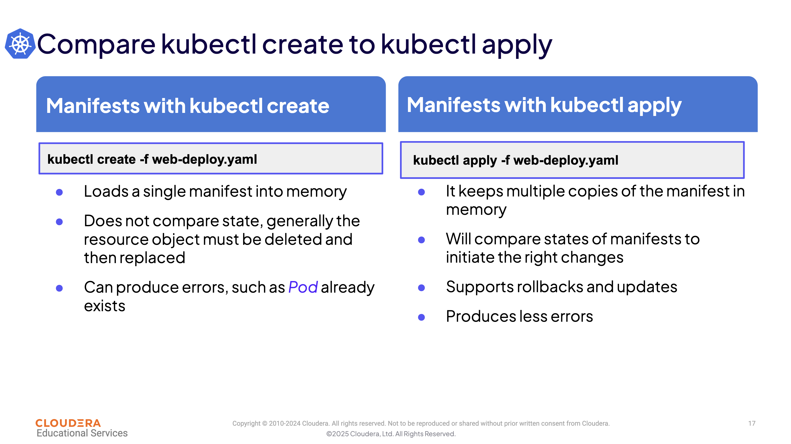

### 5. Summary and Exercise Assignments

#### 5.1. 

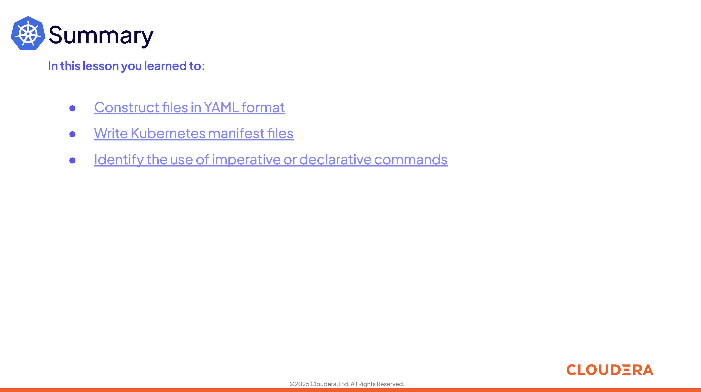

#### 5.2. 

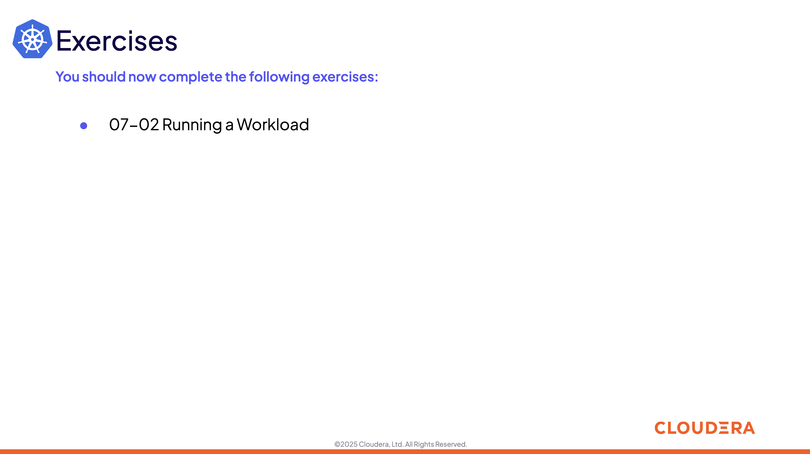

