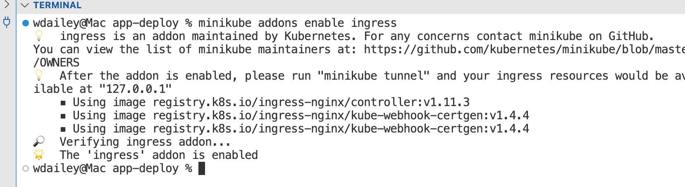

# 07-02 Creating Deployments


### 1. Set Up the Ingress Controller

#### 1.1. Add the Ingress Controller
An Ingress Controller is required to route traffic according to the rules in the Ingress.

```
minikube addons enable ingress

```




### 2. Apply the Deployment

#### 2.1. Change directory
```
cd web-deploy

```

```
ls

```


#### 2.2. Open the Deployment
```
cat web-deploy.yaml

```

If you are using a IDE then open the file in the editor.


#### 2.3. Review the Deployment
The required properties are all present:

- apiVersion: apps/v1
- kind: Deployment
- metadata:
- spec:

Additional properties

- name: web-deploy
- namespace: app
- labels: name and tier

The spec sets a template which includes the spec for the container.

- Pod name: web-pod
- name: web-nginx
- image: nginx
- ports: http:80


#### 2.4. Apply the Deployment
```
kubectl apply -f web-deploy.yaml

```

```
kubectl -n app get all

```


### 3. Apply the Service

#### 3.1. Open the Service
```
cat web-svc.yaml

```

If you are using a IDE then open the file in the editor.


#### 3.2. Review the Service
The required properties are all present:

- apiVersion: v1
- kind: Service
- metadata:
- spec:

Additional properties

- name: app-srv
- namespace: app
- ports: map the container port 80, be default the service port will also be 80


#### 3.3. Apply the Server
```
kubectl apply -f web-svc.yaml

```

```
kubectl -n app get all

```


### 4. Test Service

#### 4.1. Open a minikube Service Tunnel
```
minikube -n app service web-svc --url

```


#### 4.2. Validate Access
Copy and paste the URL into a tab in the browser. You can also use the curl command from another terminal.

```
curl http://127.0.0.1:55017

```


#### 4.3. Close the minikube Service Tunnel
Use **Ctrl-C** to exit the minikube service tunnel.


### 5. Apply the Ingress

#### 5.1. Open the Ingress
```
cat web-ing.yaml

```

If you are using a IDE then open the file in the editor.


#### 5.2. Review the Ingress
The required properties are all present:

- apiVersion: networking.k8s.io/v1
- kind: Ingress
- metadata:
- spec:

Additional properties

- name: app-ing
- namespace: app

Setting rules

- host: identify the hostname
- path: the path within the html
- backend service: identify the service the ingress is mapping for routing


#### 5.3. Apply the Ingress
```
kubectl apply -f web-ing.yaml

```

```
kubectl -n app get ingress web-ing

```


### 6. Test Ingress
Close the browser tab and use Ctrl-C to close the minikube tunnel. Leave the application running.

#### 6.1. Open the minikube tunnel
```
minikube tunnel

```

Notice the line "Starting tunnel for service app-ing".


#### 6.2. Verify with curl
```
curl --resolve "app.example:80:127.0.0.1" -i http://app.example

```

The **--resolve** option is mapping app.example:80 to the localhost IP address of 127.0.0.1 and then passing in http://app/example

The ingress is accepting this host URL and mapping it to the service app-svc.


#### 6.3. Test in Browser (Optional)

---

**⚠️ Remove the Host Entry**

When you are done with this exercise do not forget to remove this entry from your /etc/hosts file.

---


---

**ℹ️ Require sudo Access to root**

This step requires sudo access to root. If you do not have this access you can not perform this step.

---

If you have access to root on your laptop you can make a change to the /etc/hosts file to verify access from the browser.

```
sudo echo 127.0.0.1 app.example  >> /etc/hosts

```


#### 6.4. Validate in the Browser
```
http://app.example

```


## Clean Up

### 7. End of Exercise


