# 08-02 Inspecting a Kubernetes Cluster

The purpose of this exercise is to run Kubernetes CLI tools, which includes kubectl and K9s.

### 1. Start Up a Multi Node Cluster

#### 1.1. Terminate minikube Clusters
Shutdown the 1 node minikube cluster.

```
minikube delete --all

```

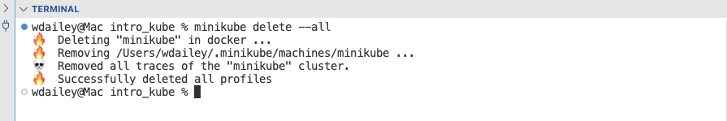


#### 1.2. Start Up a multinode Cluster

---

**⚠️ Caution Regarding Local Memory**

A 4 node minikube cluster use slightly over 10 Gigabyte of RAM. If your laptop will not support this you must reduce the node count to 2.

---

Start a 4 node cluster, the -p | --profile flag creates a profile name for this custom cluster

```
minikube start --nodes 4 -p minikube-app

```

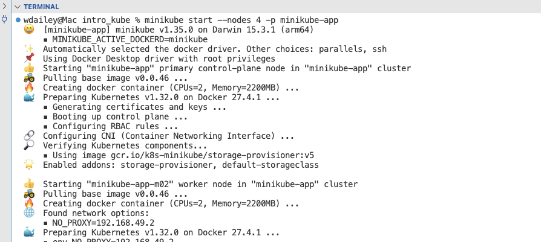


### 2. Inspect Nodes

#### 2.1. List nodes
```
kubectl get nodes

```

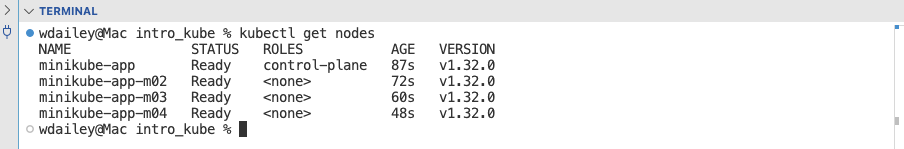


#### 2.2. List Nodes with Details
List the nodes but also show the host IP address and the Operating System.

```
kubectl get nodes -o wide

```

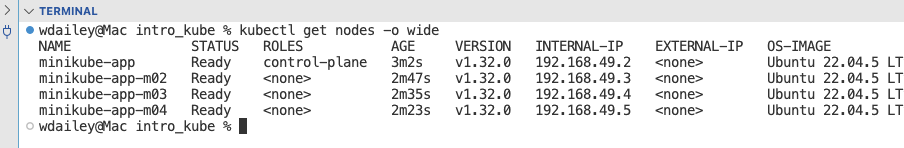


#### 2.3. Inspect a Node
```
kubectl describe node minikube-app

```

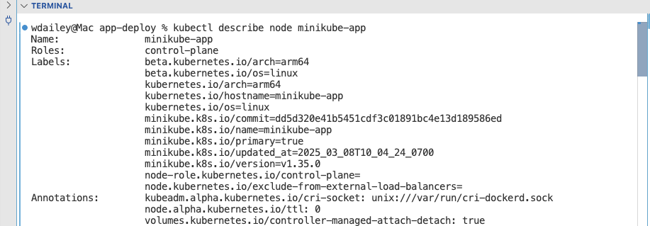


#### 2.4. Check Status with minikube
```
minikube status -p minikube-app

```

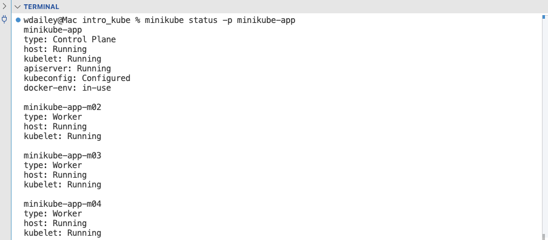


### 3. Review kubelet

#### 3.1. Inspect kubelet
kubelet is a Linux process running on every node. It is not a container. We can list it to find various configuration files.

```
minikube ssh "ps aux | grep -i kubelet" -p minikube-app

```

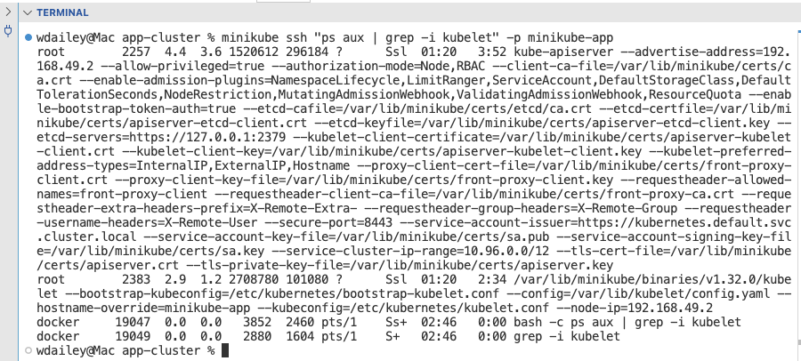


#### 3.2. Inspect IP tables for busy-pod
```
minikube ssh "sudo iptables -L -t nat | grep app-svc" -p minikube-app

```

The output for iptables is a set of rules for routing traffic. nat stands for Network Address Translation. These rules route traffic to 10.244.3.13:80. This is the Pod IP address.

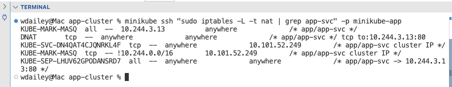


#### 3.3. List Pod IP Address
```
kubectl -n app get pods -o wide

```

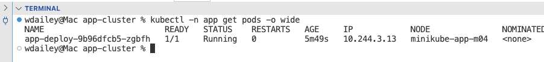


#### 3.4. List the endpoints
```
kubectl -n app get endpoints

```

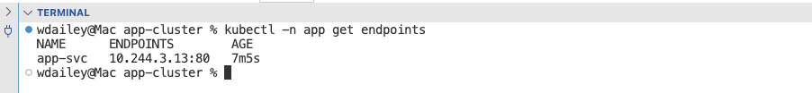


### 4. Add Metrics

#### 4.1. Add the Metrics Server
```
minikube addons enable metrics-server -p minikube-app

```

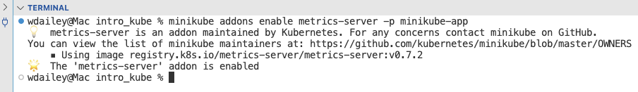


#### 4.2. List Nodes for CPU and Memory
```
kubectl top node

```

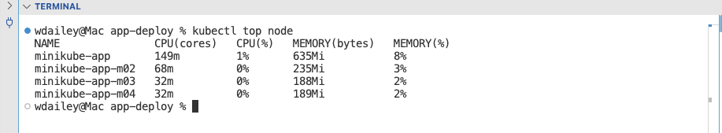


#### 4.3. List Pods for CPU and Memory
```
kubectl -n kube-system top pod

```

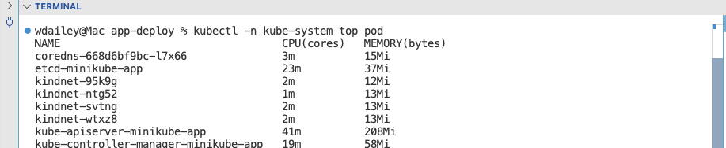


### 5. Start Up Deployment

#### 5.1. Change Directories
```
cd app-busy

```

```
ls

```

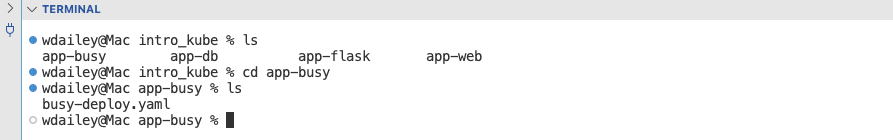


#### 5.2. Display the Manifest File
```
cat busy-deploy.yaml

```

If you are using a IDE then open the file in the editor.


#### 5.3. Review the Manifest File
There is a lot going on in this manifest file. The important properties are:

- replicas is set to 4
- podAntiAffinity is set to ensure pods will be on separate nodes
- image is busybox, a lightweight Linux box used for testing
- command is set to sleep for 60 seconds, the pods will terminate in 1 min after start up

---

**ℹ️ Restarting the Deployment**

If you take longer then 60 seconds to complete the tasks you can delete the deployment and run it again. Or you can edit the deployment and increase the sleep count.

---


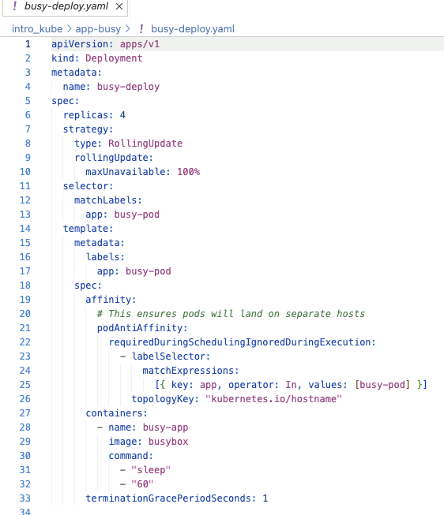


#### 5.4. Start Up the Deployment
```
kubectl apply -f busy-deploy.yaml

```

```
kubectl get all

```

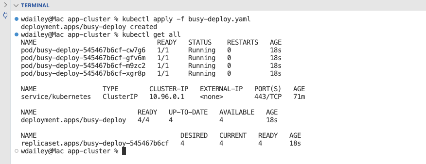


#### 5.5. Inspect Rollout Status
```
kubectl rollout status deployment.apps/busy-deploy

```

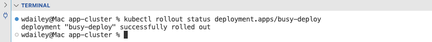


### 6. Test Resilience of Replicas

#### 6.1. Delete Pods
```
kubectl get pods

```

Use copy and paste to copy in two pods to the delete command.

```
kubectl delete pods busy-deploy-545467b6cf-gfv6m busy-deploy-545467b6cf-xgr8p

```

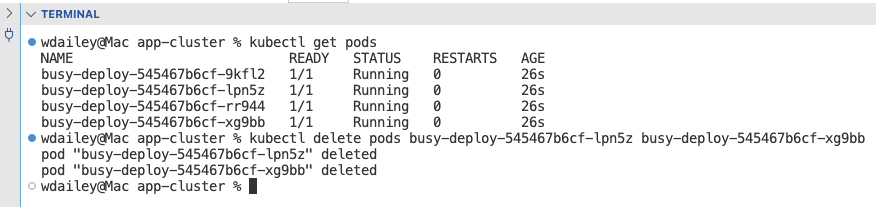


#### 6.2. List the Pods
Notice RESTARTS is now 1 for two of the Pods. The Pod NAME has also changed for two of the Pods. This demonstrates resilience.

```
kubectl get pods

```

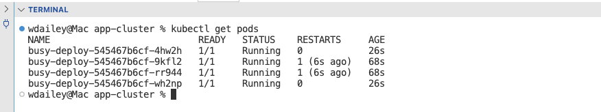


### 7. Change the Replicas

#### 7.1. Change the Replica Count
```
kubectl scale deployment busy-deploy --replicas 2

```

```
kubectl get pods

```

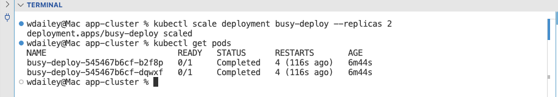


### 8. End of Exercise


