# 09-01 Architecture for Kubernetes Control Plane

### 1. Introduction

#### 1.1. 

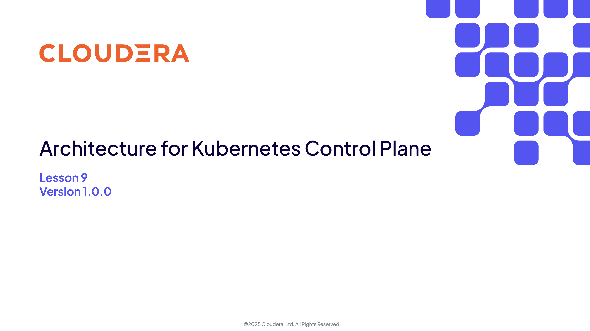

#### 1.2. 

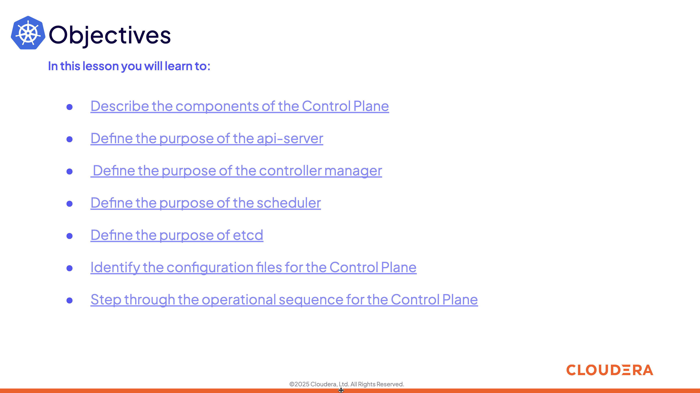

### 2. Control Plane

#### 2.1. 

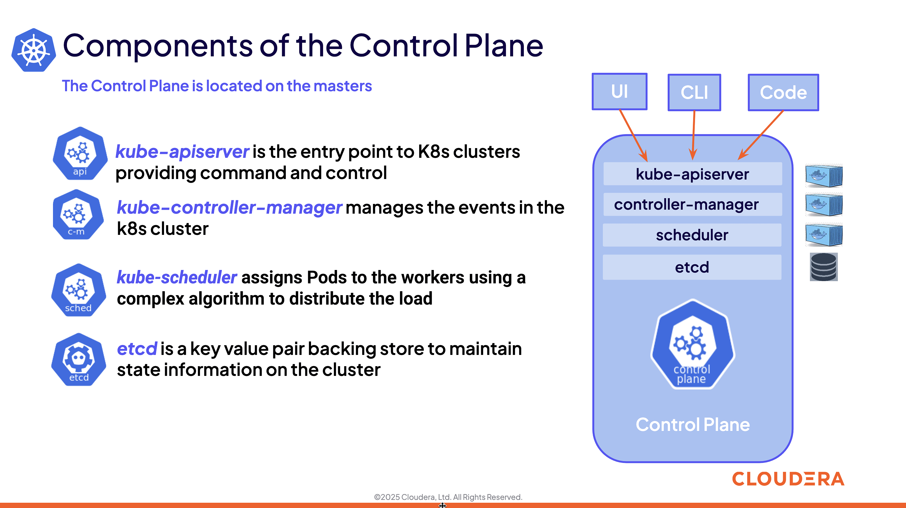

### 3. kube-apiserver

#### 3.1. 

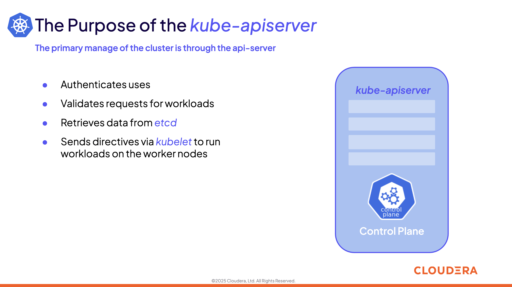

#### 3.2. 

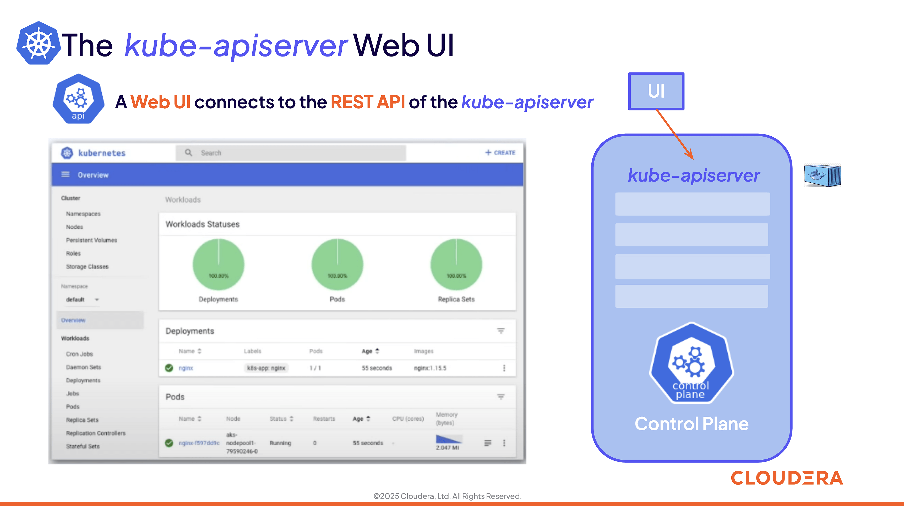

#### 3.3. 

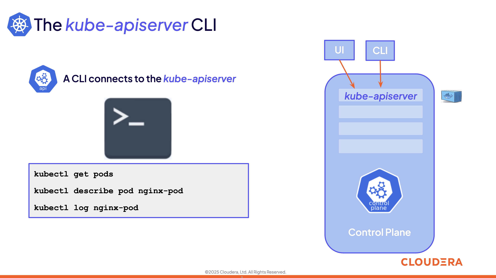

#### 3.4. 

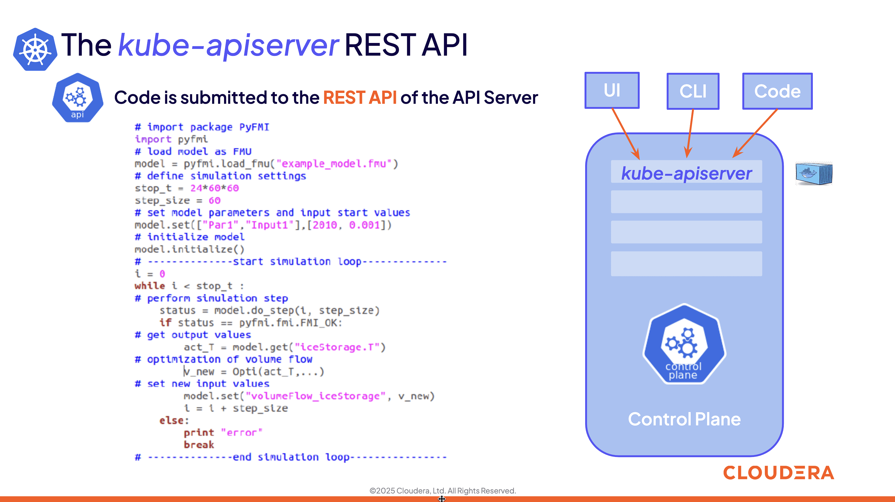

### 4. kube-controller-manager

#### 4.1. 

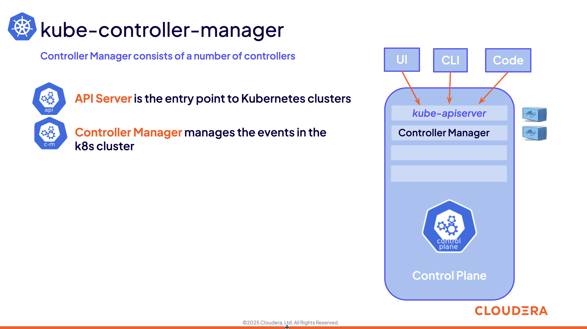

#### 4.2. 

#### 4.3. 

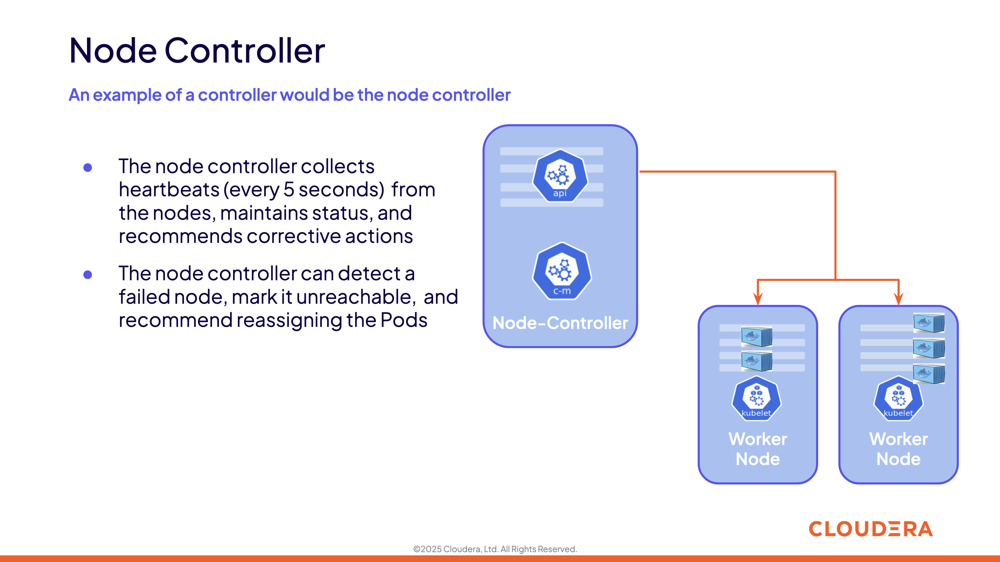

#### 4.4. 

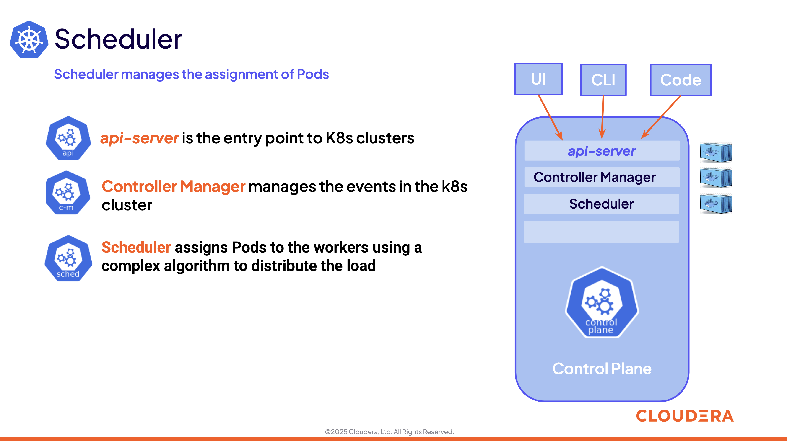

### 5. kube-scheduler

#### 5.1. 

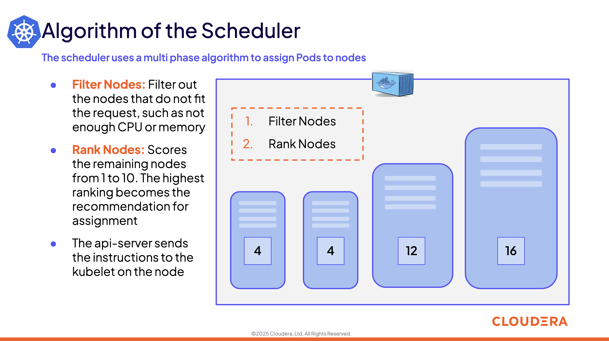

### 6. etcd

#### 6.1. 

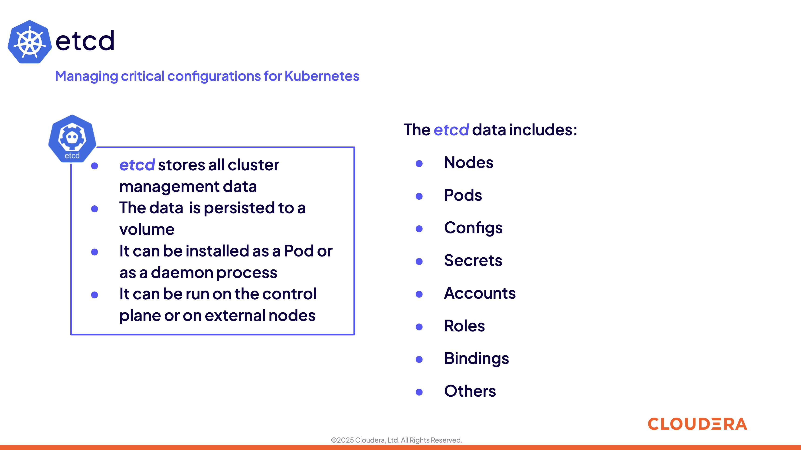

#### 6.2. 

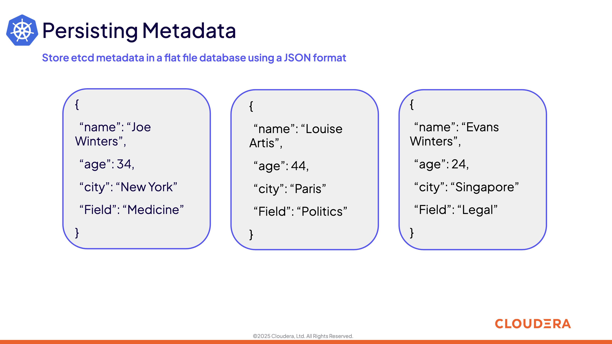

### 7. Control Plane Configuration Files

#### 7.1. 

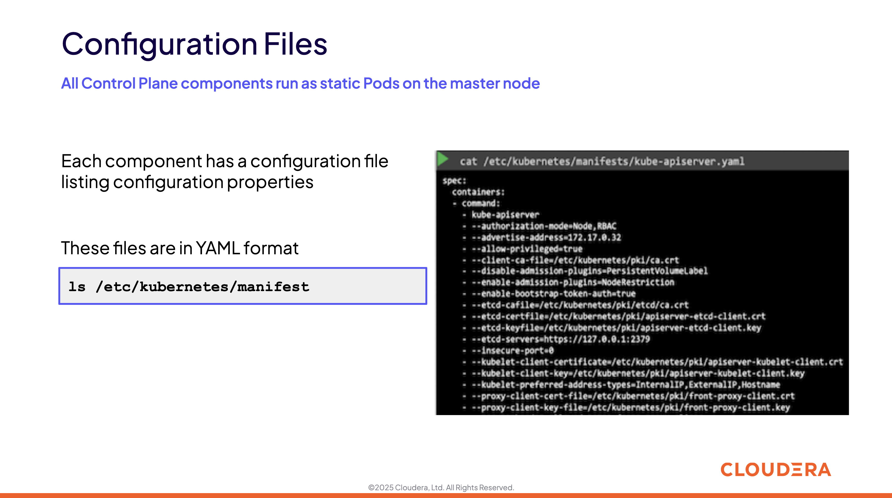

### 8. Control Plane Operations

#### 8.1. 

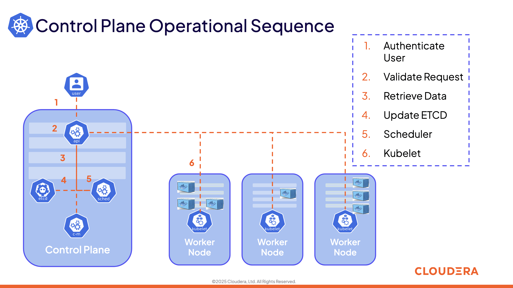

### 9. Summary and Exercise Assignments

#### 9.1. 

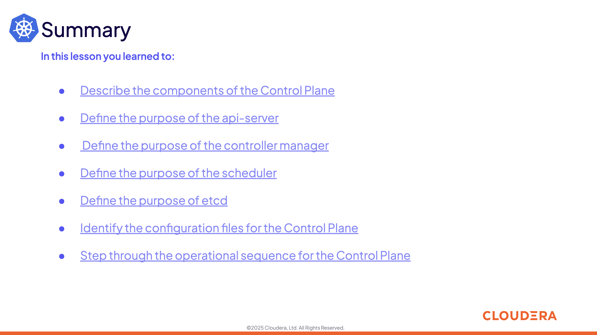

#### 9.2. 

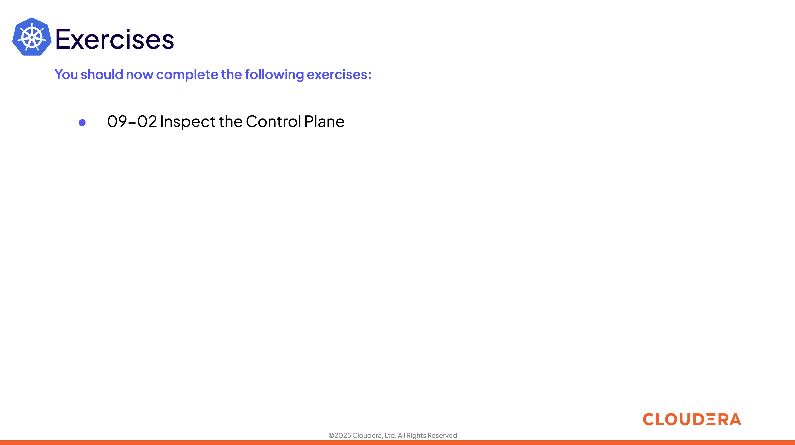

