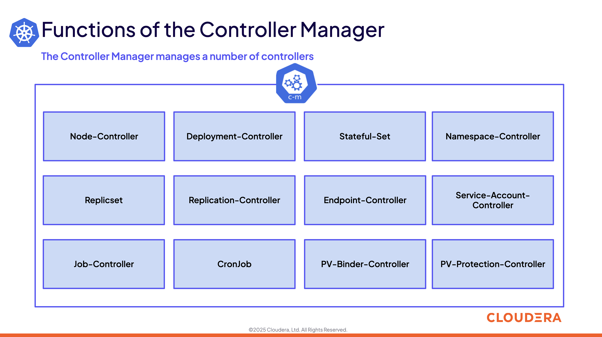

# 09-01 Architecture for Kubernetes Control Plane

### 1. Introduction

### 2. Control Plane

### 3. kube-apiserver

### 4. kube-controller-manager

### 5. kube-scheduler

### 6. etcd

### 7. Control Plane Configuration Files

### 8. Control Plane Operations

### 9. Summary and Exercise Assignments

