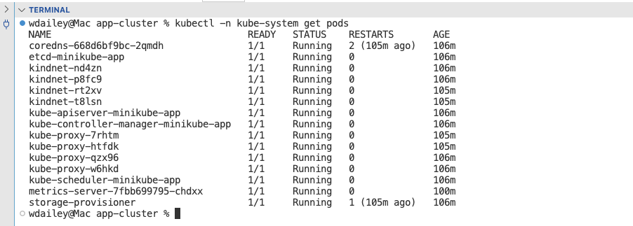
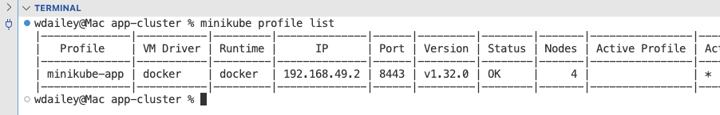
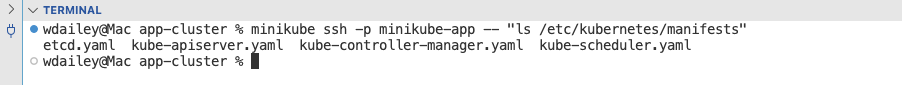
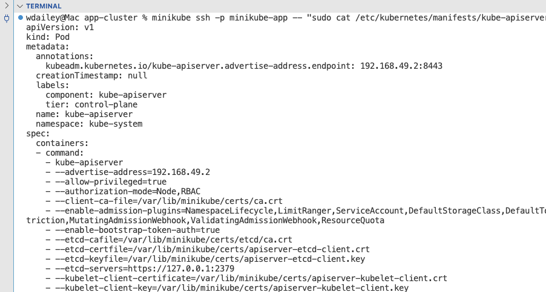

# 09-02 Inspecting the Control Plane


### 1. Inspect the Pods in kube-system
The namespace kube-system contains all of the Pods for the control plane.

```
kubectl -n kube-system get pods

```

Locate:

- api-server
- controller-manager
- scheduler
- etcd




### 2. Display the minikube Profile
```
minikube profile list

```




### 3. List the Manifest Directory
List the manifest directory for the control plane. The control plane pods are unique in that they are static pods. They are started directly by kubelet. 

```
minikube ssh -p minikube-app -- "ls /etc/kubernetes/manifests"

```




### 4. Display the api-server Manifest File
```
minikube ssh -p minikube-app -- "sudo cat /etc/kubernetes/manifests/kube-apiserver.yaml"

```




### 5. End of Exercise


