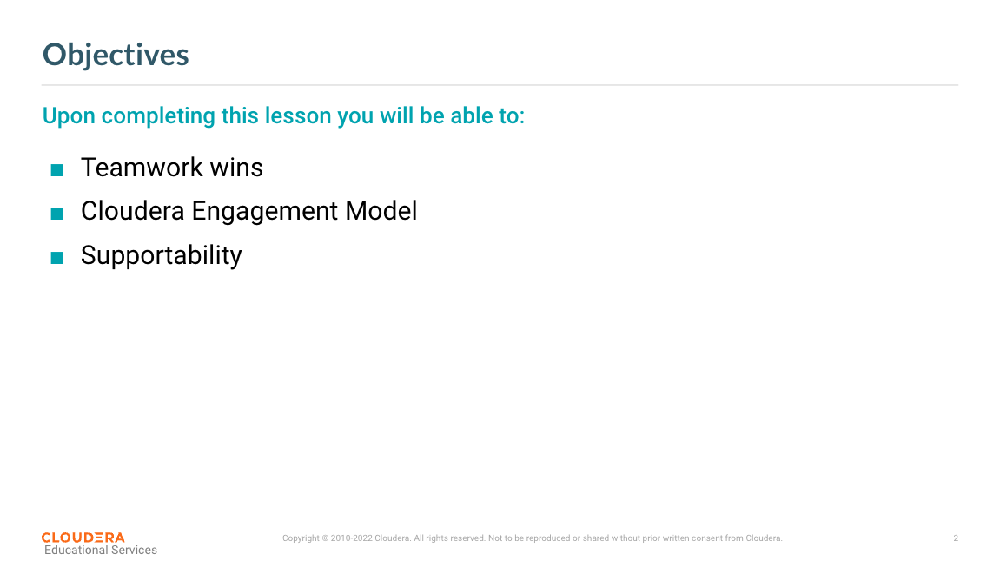
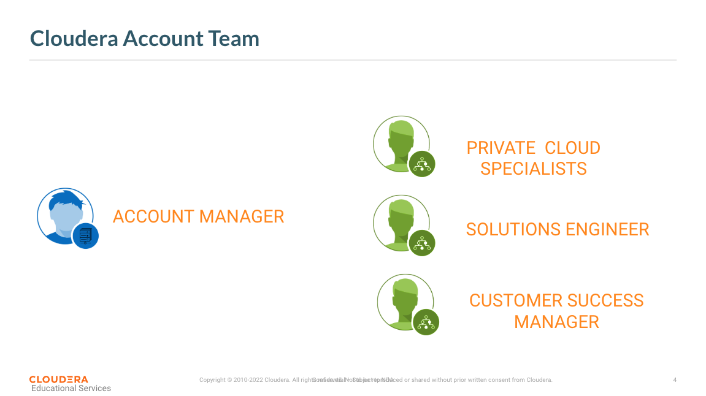
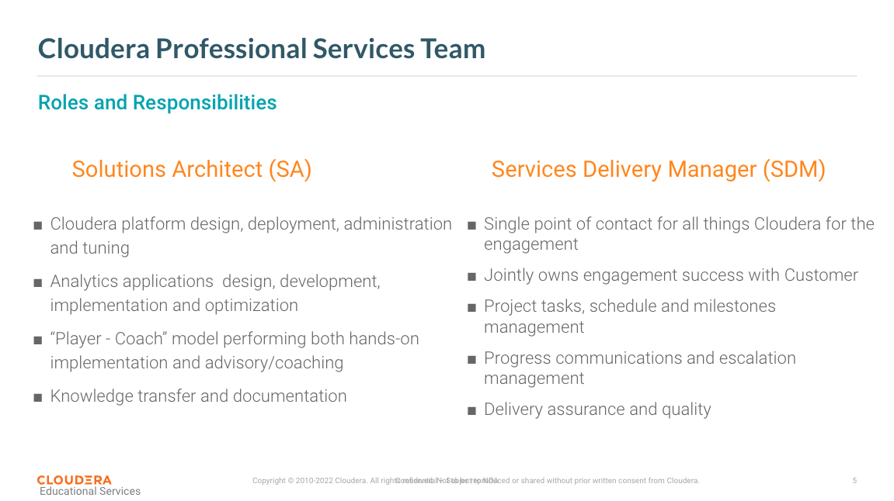
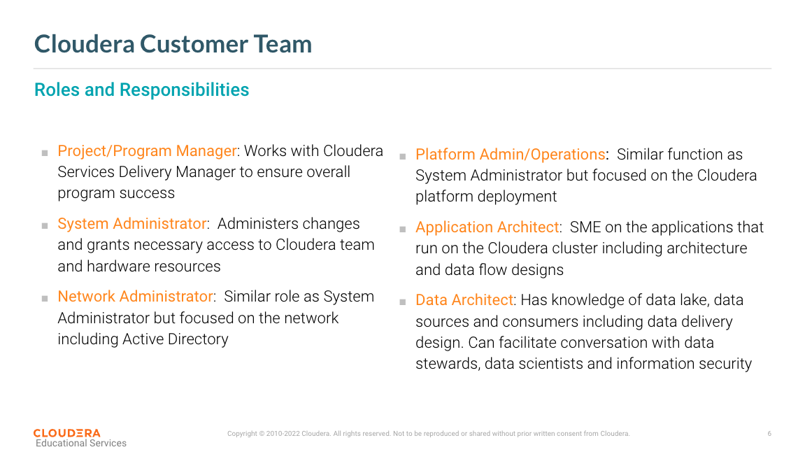
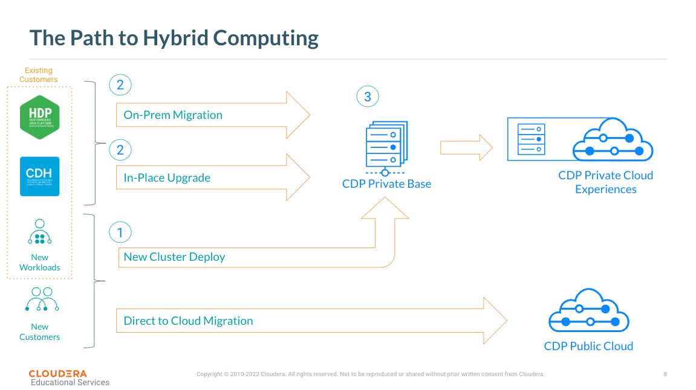
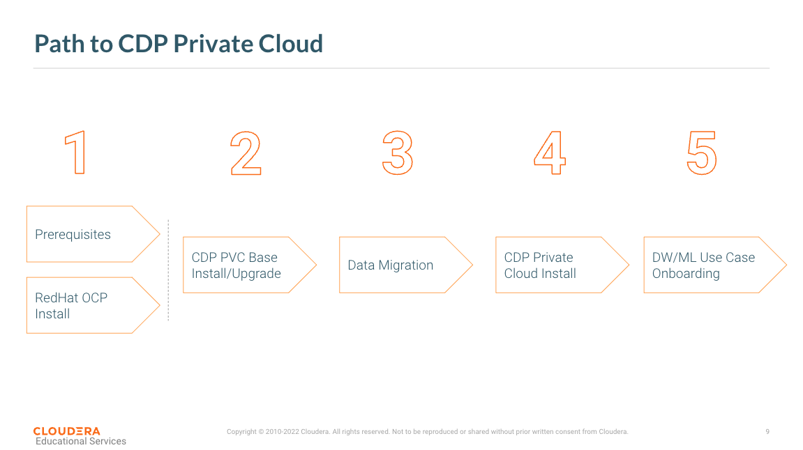
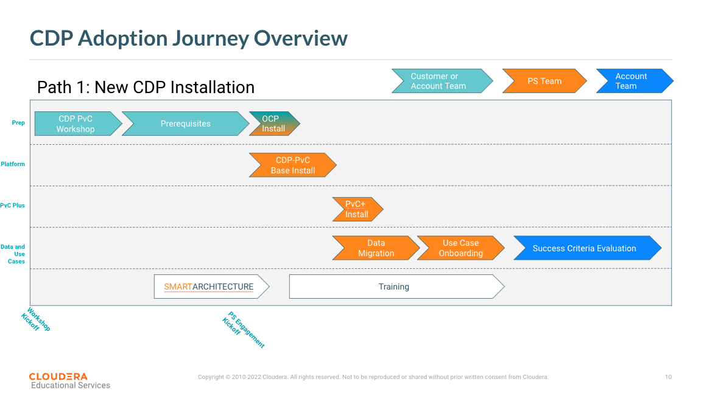
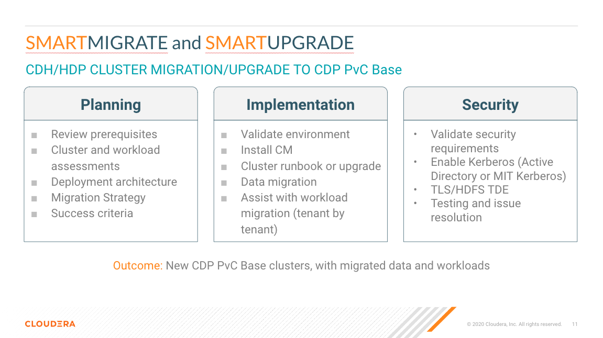
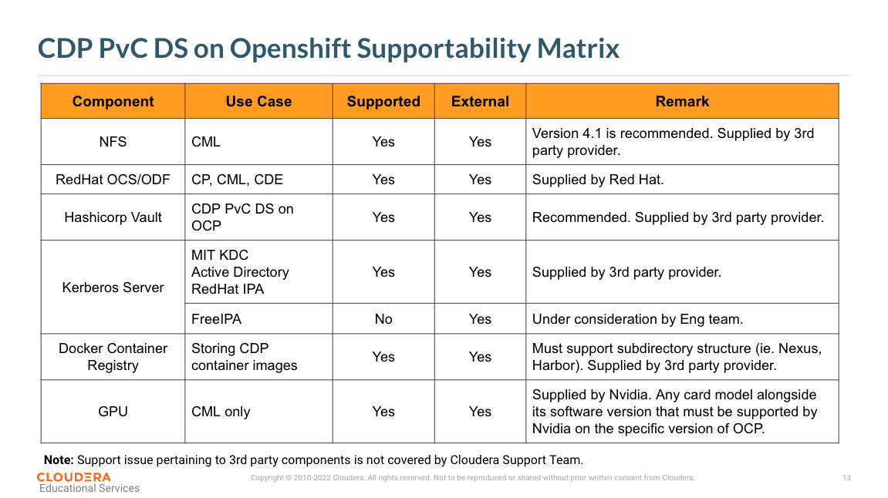
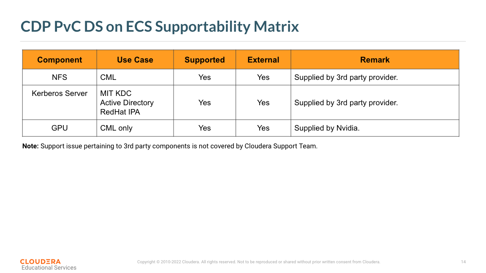

# A-01 Cloudera Support

The purpose of this chapter is to summarize Cloudera Support and Professional Services for Cloudera Data Platform.

### 1. Deploy a Cloud Operating System

#### 1.1. 

#### 1.2. 

### 2. Team Work Wins

#### 2.1. 

#### 2.2. 

#### 2.3. 

### 3. Engagement Model

#### 3.1. 

#### 3.2. 

#### 3.3. 

#### 3.4. 

### 4. Supportability

#### 4.1. 

#### 4.2. 

### 5. Summary

#### 5.1. 

